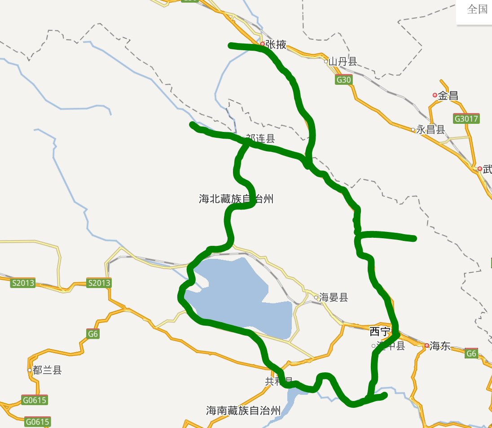
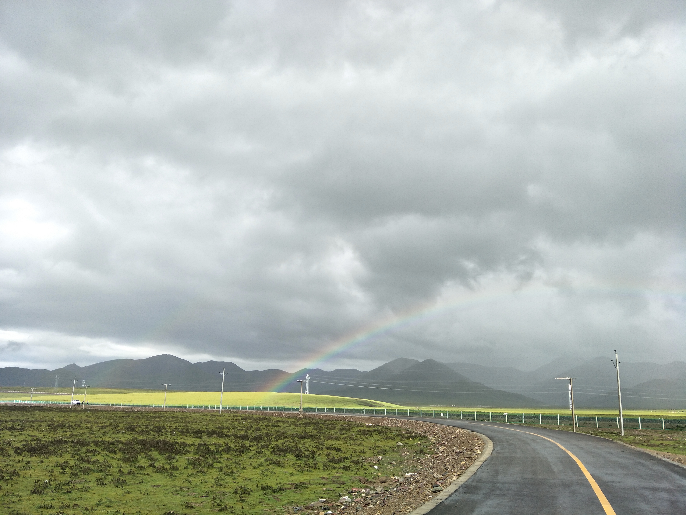
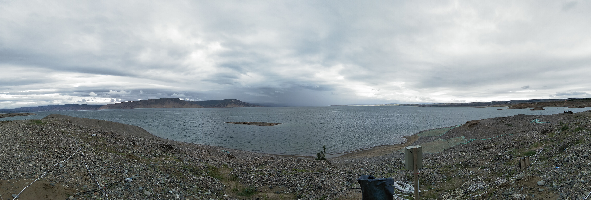
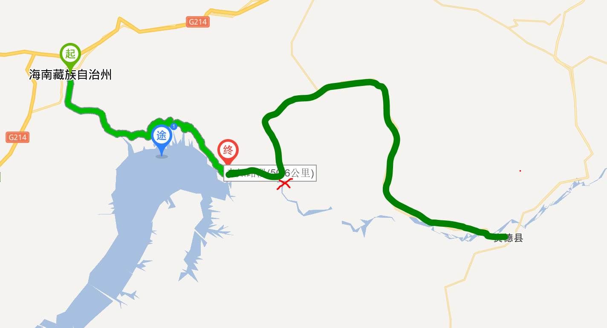
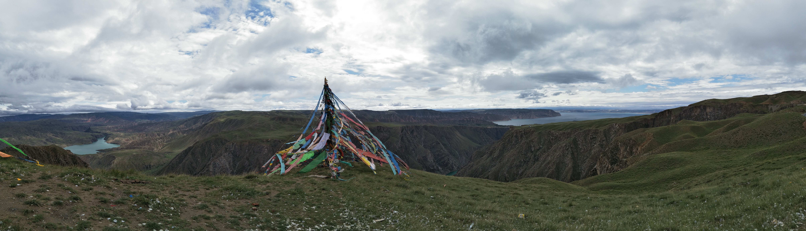
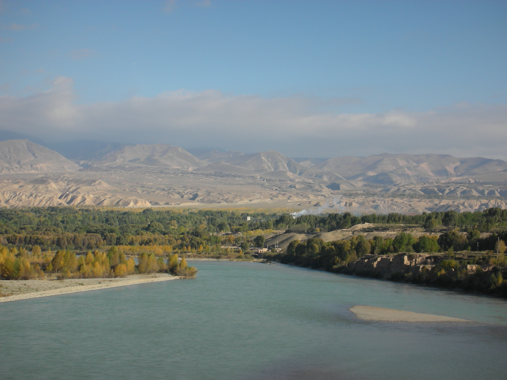

## 出发前的准备

我们拖到了八月下旬才决定出发。此时看天气预报已经进入雨季，我感觉很不好。但是机票租车什么的全都定过了，我们只能硬着头皮上路了。我带上媳妇一家三口，在西宁租了一辆大众朗逸。租车价格约300元一天；作为新手我还买了全险。

所有路线是我综合各类网上信息以及Google卫星地图制定的，有成功之处也有明显的疏漏。

我最终的结论就是雨季不要去，雨季不要去，雨季不要去。连日下雨起码使一路上的景色打了五折。整体感觉最漂亮的路段有两条，一是尕小公路（热水镇至刚查县城），二是共和经龙羊峡镇至贵德的路段。

## Day1

上午约11点，我们降落在西宁机场。乘坐提前在携程预订的接机出租车，我们12点抵达西宁市区。

我们的午餐在益鑫手抓羊肉馆解决。这个店的东西除了酿皮外味道都还可以，只是就餐流程特别傻X。建议人多的时候不要去。

而后，我独自在一点左右去火车站取车，然后接上其他人，出发去门源，走227国道，经黑泉水库，至达坂山口，遇山口浓雾。因为我是新手加上视线不好，媳妇一家三口十分紧张。

至门源县城附近时，又遇大暴雨。我们晚上住在县城。油菜花已经全无，只有黄黄绿绿的麦子。

## Day2

上午，至照壁山观景台，车已无法开上观景台，在修路。下了车我们进去散了散步，步行也不让上山顶，估计是要收费了，真实让人失望。我们下来的时候出现了一点蓝天，景色漂亮不少。

下午，驱车往东去仙米森林公园方向至珠固乡。走了一下午，感觉一路上这个季节看起来没啥意思，可能秋天还不错吧。

傍晚回到门源县城吃饭，继续住在门源县城。

## Day3

根据媳妇的建议，我们出发至张掖丹霞公园，傍晚前入公园。但是天气不给力，没有阳光，我感觉没啥好看的。家里人感觉还可以。晚上我们住公园附近酒店。

这是最累的一天，因为路上没啥景色。227国道甘肃段路还比较烂，累死我这个新手司机了。

## Day4

我们出发去祁连县。走了一上午，到了青海境内后，景色变得好起来。但路边河水都是黄的。万幸的是天晴了一些，虽然还是看不到雪山。

傍晚我们没有去著名的卓尔山，因为感觉性价比不高（Qiong）。祁连县的河边有条很干净的马路，对面是卓尔山下的丹霞景观，蛮不错。我们住在县城附近的农家院里，卫生条件比较糟糕。

## Day5

上午往黑河大峡谷方向，经二尕公路，深入30公里而后遇到大量落石后返回。我感觉这一路意思不大，主要是我们不敢往前走了。

早上天晴的时候恰好看到了雪山。媳妇爸妈第一次见到雪山，比较激动。

中午回到祁连县城吃完饭，出发去刚察县城，由热水河镇经尕小公路至刚察县城。

出热水镇时很幸运地看到了彩虹。

该段路限行小汽车，的确是祁连山南麓草原之精华。百度地图上没有这条路，但是路况非常好，景色优美。

## Day6

上午出发，逆时针环绕青海湖，上午在环湖西路边走边玩。天气非常不给力，而且因为连日下雨，很多靠岸边的湖水都是黄的。

中午至青海湖南面的二郎剑景区附近，开车上到青海南山观青海湖全景（被云遮住了），傍晚至共和县城。从青海湖边上上这段路比较窄，不过景色还是很漂亮的。晚上我们住在共和县城。

## Day7

上午，我们驱车探索了龙羊峡水库边汉族村庄德胜村，该处可至龙羊峡水库视野最开阔的岸边，一扫昨日青海湖边的阴霾。至龙羊峡镇路上有一路土林风光，开车开着非常有感觉。该路段2017年初才刚刚修好，路面条件不错。这段路是我极力推荐的。

中午在非常干净的龙羊峡镇吃鱼。而后出发至贵德县。路遇告示牌【前方塌方请绕行】，我没理会，继续往前开。

至一拐弯处（地图中红X标识），观黄河一河两色。

龙羊峡水库为蓝色，拉西瓦水库为绿色，非常壮观！

一路上的草原也很漂亮，丹霞地貌很有特色，我们还发现了一处“史前城堡”。

## Day8

本来计划一早去尖扎方向，中午和下午游玩坎布拉国家森林公园。结果上网发现李坎公路被封了。而且此时媳妇身体不适，于是上午我们就呆在酒店，下午出门逛了逛，逛到李坎公路果然不通了。不过黄河对岸的丹霞还是很壮观的。

只是到了贵德黄河是黄的是个什么意思？不是说“天下黄河贵德清”么？看来确实是雨季不能来呀。

## Day9

上午我们直接返回西宁，路过塔尔寺，没进去。中午在西宁还车、吃午饭，下午三点乘坐刚开通不久的动车离开西宁，去往咸阳秦都站然后换乘咸阳机场的飞机回家。

## 背景补充

因为十年前十一黄金周去过甘肃、青海，一路最惊艳的就是贵德黄河大桥边的风景，一直想带媳妇一家也来见识见识。彼时没有所谓的贵德国家地质公园，也没有所谓的千姿湖湿地公园。只有辽阔的河谷，黄河中间黄黄绿绿的树，以及安静的傍晚。

即便这次去青海之前，我还是驾龄为零的本本族，仍毅然决然地租了车。因为路我认得，不想为其他人所摆布。

这一路上开的不快，边走边玩，媳妇一家都玩的很开心。岳父母都表示这辈子没看到过这么多漂亮的景色。只有我感到可惜，如果不是天气不好，你们看到的会更壮丽。

青海的公路很好走，而且真正的景色几乎就没有什么需要买门票的，这一点非常值得称赞的。