> 本文原作于2019年10月

## 前言

传统的甘青大环线是一条经典的自驾线路，一般由西宁出发，顺时针或者逆时针经过门源县，祁连县，张掖，嘉峪关，敦煌，大柴旦，青海湖，最后回到西宁。
这条线路包含了青海北部以青海湖为中心的诸多自然景观，以及自然与文化景观都极其丰富的河西走廊。
河西走廊景观有多丰富？文化底蕴有多厚？推荐观看高分纪录片《河西走廊》。

2017年**德马高速**青海段通车，让甘青大环线多了一种可能。
德马高速指的是青海省德令哈到四川省马尔康的高速公路，四川段还在修建中。
因为现在甘南也是一个很火爆的旅游目的地，所以我设计了一条新的甘青大环线。你可以叫它甘青南环线，也可以将传统的大环线与这条新的大环线串联在一起。
线路的大致走向是由兰州出发，经由临夏州，甘南州，由玛曲县进入青海省久治县。或者也可以经过川北的若尔盖县，阿坝县进入青海省久治县。
然后转向西北，沿德马高速直达青海省海西州州府德令哈。
最后再转向东，经青海湖，海南州，最后回到兰州市。
幸运的是我最近就单人单车实践了一下这条线路，现在把游记以及我对各个景点、路段的点评写在这里，供大家参考。

最终成行线路：
(甘肃省)天水市—礼县—岷县—迭部县—(四川省)若尔盖县花湖—(甘肃省)碌曲县尕海—玛曲县—(青海省)久治县—玛沁县—德令哈市—青海湖南岸和东岸—海北州州府西海镇—贵德县—尖扎县—同仁县—(甘肃省)夏河县—临夏市—永靖县—兰州市

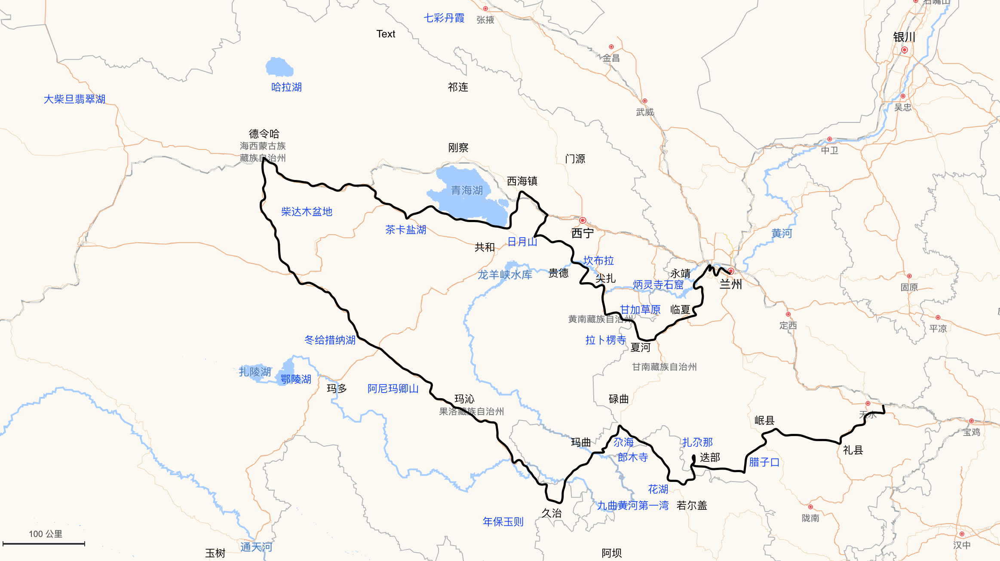

| 评价 | 得分|
| ------ | ----- |
| 必去 | 5分 |
| 值得推荐 | 4分 |
| 去去无妨 | 3分 |
| 不推荐 | 2分 |
| 浪费时间 | 1分 |

**此外推荐观看航拍中国第二季-甘肃**
恰好我这一路许多景点都有提到，我拍的照片毕竟很局限，看看这一集的航拍中国，你就会对这条路线更加心驰神往了。

## 9月24日

我没有选择从兰州出发，而是从天水出发。因为从天水租车价格更便宜，而且可以避免往返临夏到兰州这段路。
我从神州租车租的宝沃BX5。因为车新，车况比较好。而且比别的同档次的合资车便宜一些。

> 天水市是甘肃东端门户，紧挨着关中盆地，无论是饮食习惯还是口音都与陕西关中地区或者说陕西宝鸡很像。

中午11点半动车到达天水高铁站，然后去天水高铁站的神州租车门店提车。

这个神州租车的门店很寒碜，就一个活动厂房搭起来的屋子。

提到车之后我找了一个超市买了些瓶装水之类的补给，吃过午饭，然后直奔岷县而去。
我没有选择走导航给的经过甘谷县的最快路线，而是经过礼县，八盘山山口（似乎又叫分水岭），最后到达岷县。全程大约280公里。
途中第一站礼县属于陇南市，诸葛亮六出祁山的祁山就在这里，只不过已经看不到什么诸葛亮的痕迹了。礼县盛产苹果，路边很多自产自销的农民。
经过礼县之后，就离开了高速公路，进入岷礼公路。一路上秋色初显，跨过分水岭之后的风光颇有些惊艳。

从分水岭下来经过狼渡滩草原，看着还不错，可惜不好停车拍照。
晚上七点多到达岷县。

> 岷县的县名很奇怪，这个县无论和岷山还是岷江似乎都没关系。岷山在四川，也就是孕育了大名鼎鼎的九寨沟黄龙的山脉。岷江的源头也不在岷县，岷县的母亲河是黄河的支流——洮河。

| 景点 | 得分|
| ------ | ----- |
| 岷礼公路 | 3分 |
| 分水岭 | 4分 |
| 狼渡滩草原 | 3分 |

## 9月25日

第一天的目标是迭部县**扎尕那**景区。从岷县往南走S210一段路之后就进入了荒无人烟的山谷，路上特别安静，来往车辆很少。

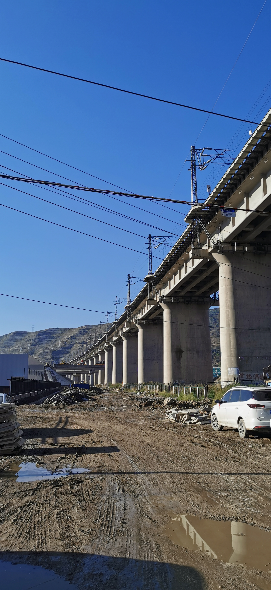

经过一个叫**铁尺梁**的隧道之后就进入了迭部县境内。出隧道之后要经过连续下坡，估摸最终相对高差达到了1500米（从铁尺梁到腊子口）。此时站在路旁可以看到很深的山谷里的公路，相当惊艳。

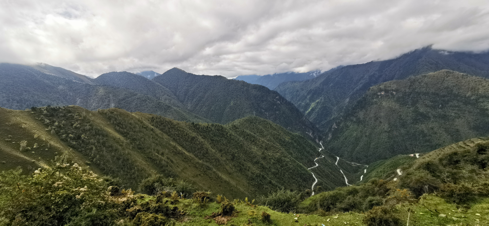

这段路有一部分是非铺装路面，但是轿车通行应该也问题不大，只不过弯多坡急，确实要小心驾驶。
下了坡来之后连续经过几个峡谷，就到了腊子口镇附近。
往宕昌县方向走两公里有一个腊子口战役纪念馆。

我进去随便转了转，乏善可陈。
然后吃过午饭，沿着白龙江一路向西往迭部县城方向去。路上买了几个苹果，自产自销的青苹果还挺好吃的，关键是新鲜。

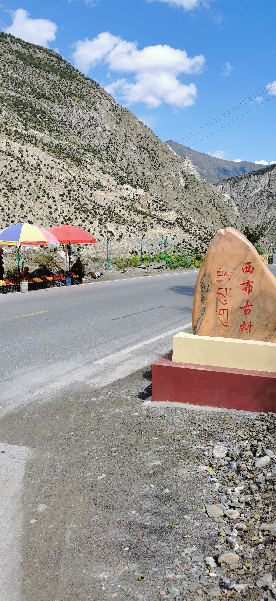

经过迭部县城之后往北大约20公里就到了扎尕那，快扎尕那的时候前方出现了云雾缭绕的石头山，仙气十足，我心想这扎尕那果然名副其实啊。可惜的是我没有停车拍照。到达扎尕那之后就开始下雨，下了只有两分钟又天晴了。看来我运气不错。

从马路边上跨过一条山谷，上到洛克观景台，这里的视角很不错。

> 洛克就是香格里拉一词的发明人，扎尕那被称作甘肃的香格里拉。

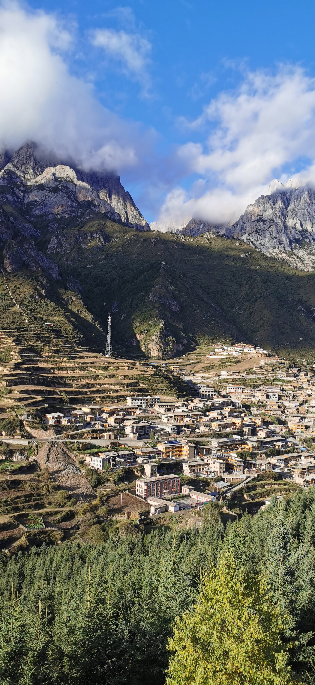

扎尕那绝对值得去！

| 景点 | 得分|
| ------ | ----- |
| 铁尺梁隧道口 | 4.5分 |
| 腊子口峡谷 | 3.5分 |
| 腊子口战役纪念馆 | 3分 |
| 扎尕那 | 5分 |

## 9月26日

早晨起来准备拍扎尕那日出，可惜太阳还没出来大雾就逐渐笼罩了整个山谷。不仅太阳看不到，连石头山都看不到了。

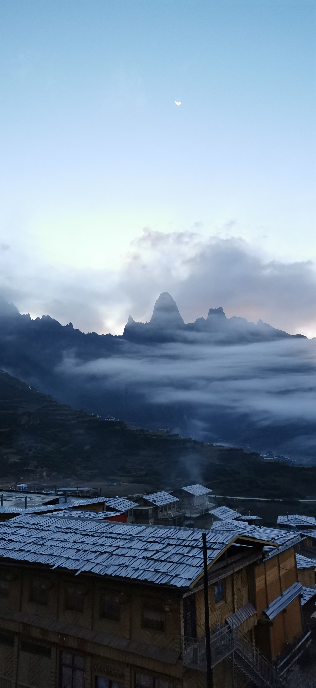

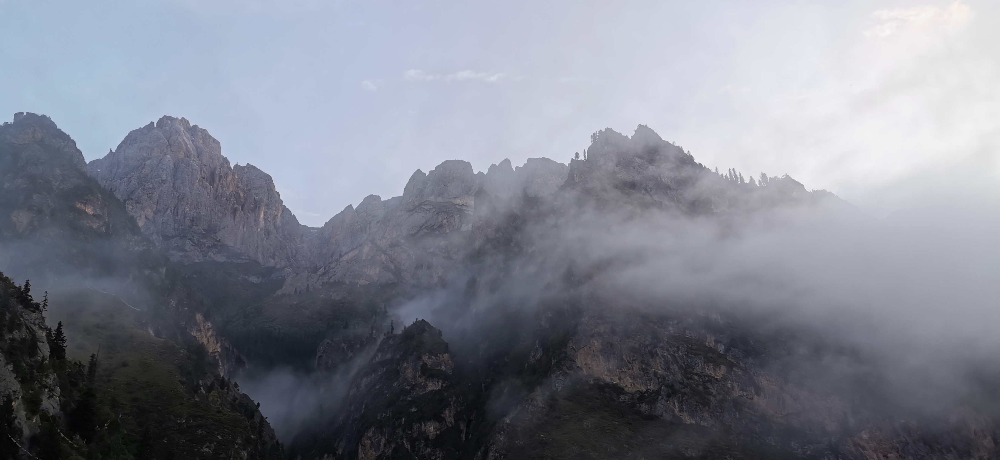

索性我就离开了扎尕那，往若尔盖县花湖方向开去。

> 若尔盖县属于四川省了，红军过草地过的就是若尔盖湿地。这里既高寒缺氧，又遍布沼泽。

今天的目标是甘肃省最西南角的玛曲县。正常的路线应该是迭部县经过红星镇，郎木寺，然后到达玛曲县。可是这样走距离太近了，玩不了一天。经过了解，迭部县到红星镇这段路在修路，路况极差，与此同时经过热尔乡到若尔盖县花湖这段路风景不错。所以我也选择了这条导航不认识的路。

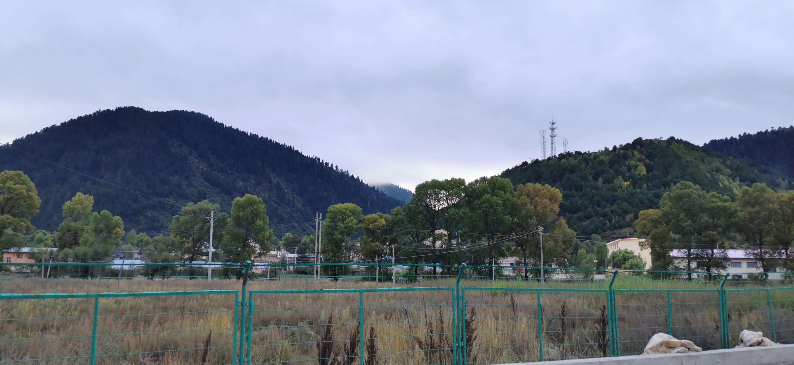

这条路到了**崩巴村**附近就开始进山了，路口设有有关部门的禁止通行标识。

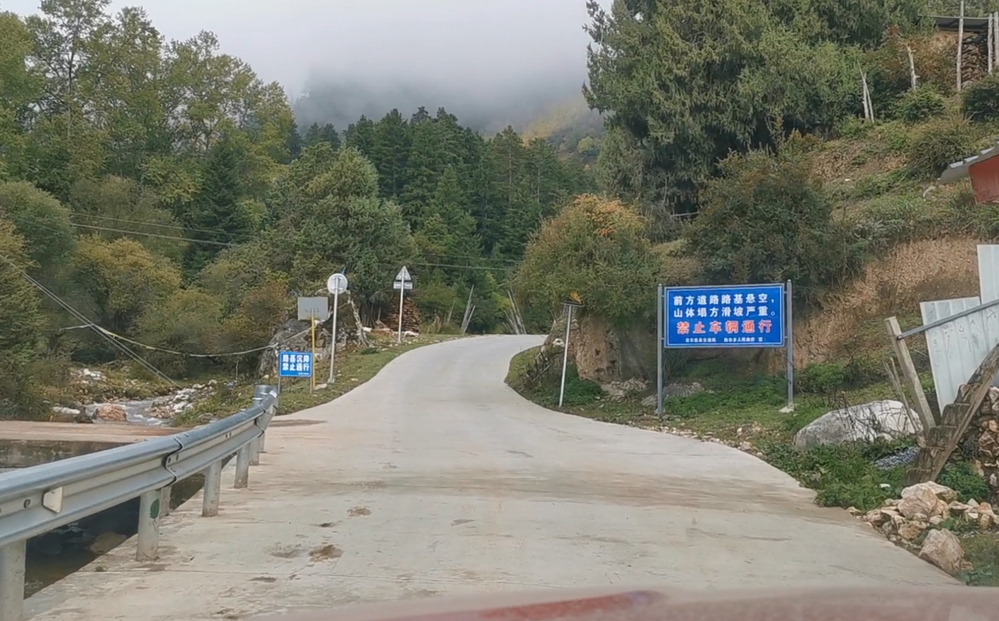

根据我多年的经验这种告示直接不用理他。

进入导航不认的小路，果然天晴了。

经过一段极窄的峡谷。

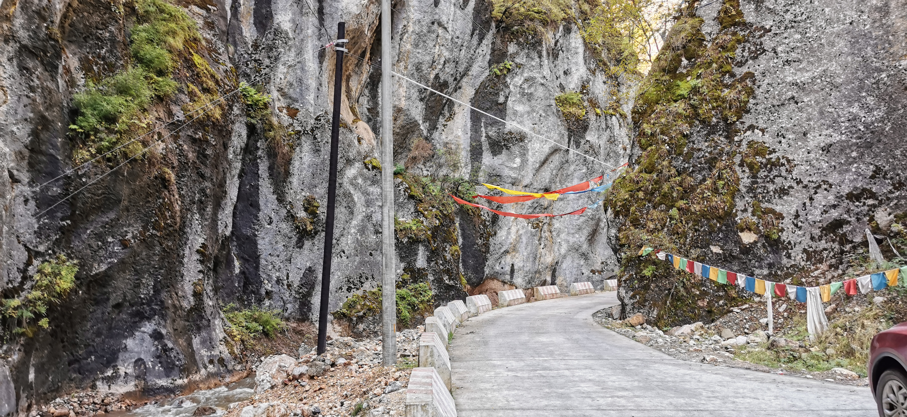

峡谷一侧岩壁上刻着不明所以的藏文。

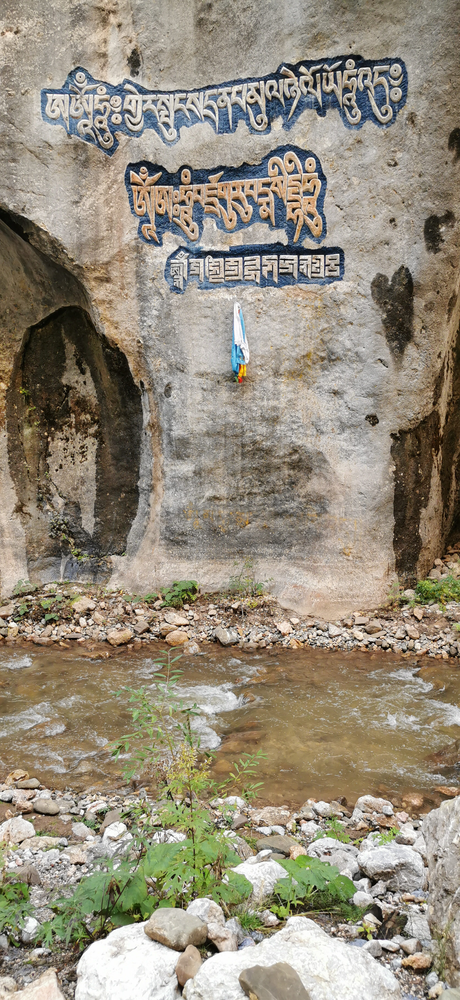

穿过峡谷之后，风光旖旎，草地雪山林海，寂静无比。有我青藏高原，何必瑞士？

一路上偶尔有对向来车。虽然有路基塌陷和水毁路段，我也觉得轿车估计有点困难，但是对向竟然有GL8朝我开来。

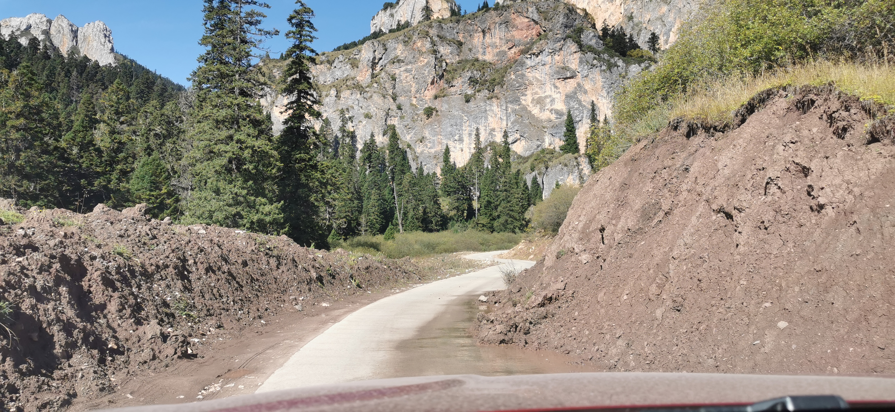

在到达一个像壁画一样的山脚下之后，这段路开始大幅度地爬升。

站在山腰望向刚行车过来的山谷，确实有种瑞士的味道。

最后经过一个开阔的石头峡谷，我开上了一片高寒草原。估计再往前方不远应该就是若尔盖大草原了吧。

依依不舍离开这条不断带来惊喜的小路，翻过一个山口之后，就到达了一望无际的若尔盖大草原。

值得一提的是，也许就是经过这段路，我从中国的第二级阶梯完全爬上了第三级阶梯，同时也是从秦岭深处爬上了青藏高原。

**这段路我强烈推荐给诸位自驾游爱好者**。

> 虽然是甘肃青海之旅，但是这段最让人意外的景观大道却是属于四川省若尔盖县。

在马路旁的小店吃过中午饭（米饭煮不熟啊）之后，我有点犯困，于是躺在车上睡了一个多小时。也许是多多少少有点高原反应。不过还好睡过之后就精神很好了，继续开往下一个景点碌曲县**尕海**。

> 碌曲县属于甘肃省。

去往尕海需要经过一个岔路口，往岔路口向西走可以一直走一小段到尕海的岸边。

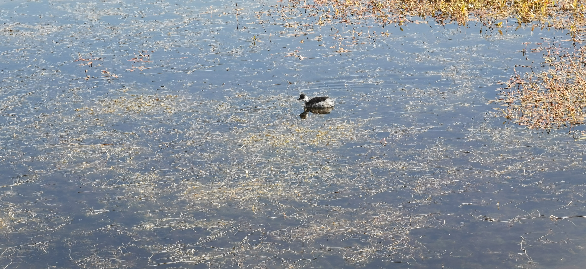

尕海岸边的护栏有开口，开口内有可以深入到湖边的土路。不过我没有进去，离开尕海去往玛曲县了。

> 玛曲县是甘肃省最西南的一个县，也是看上去最不像甘肃的县，反而更像若尔盖，因为一路上全是草原。此县县城海拔接近3800米，易高反。

一路上穿越忠克隧道之后，在隧道口有一个观景台，俯瞰玛曲草原，以及连绵的像包子一样的山，相当惊艳。

第二日晚上入住玛曲县城不知名旅店。

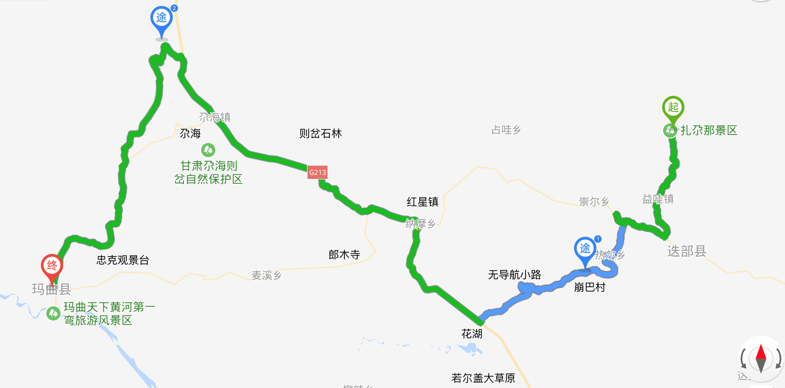

| 景点 | 得分|
| ------ | ----- |
| 热尔乡至花湖小路 | 5分 |
| 花湖 | ? |
| 郎木寺 | ? |
| 则岔石林 | ? |
| 尕海 | 4.5分 |
| 忠克观景台 | 4.5分 |
| 九曲黄河第一湾 | ? |
| 若尔盖大草原 | ? |

## 9月27日

今日的目的地是青海省果洛州州府玛沁县大武镇。先到达**阿万仓镇**的观景台，可以看到黄河的某条支流婉转而下，最终汇入黄河。

> 果洛州州府玛沁县大武镇海拔同样接近3800米，甚至高于西藏拉萨，易高反。

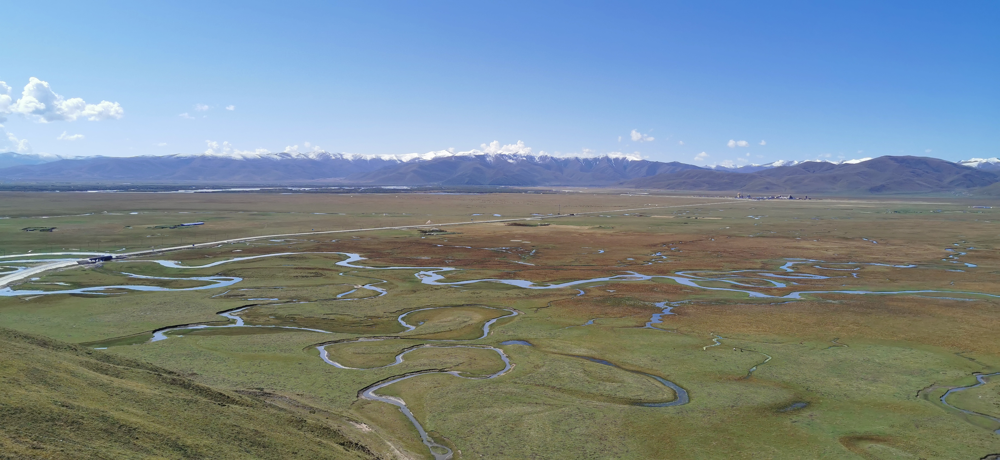

这个地方视野非常开阔，还是值得上来看看的。

本来我想去木西合乡，沿黄河而上，走一条地图上没有标明的路去玛沁县。后来想想还是算了，那条路在网上只见到过摩托车走，我去太冒险了，还是决定走常规路线。

然后经过阿万仓镇的黄河边，跨过黄河就到了青海省久治县境内。

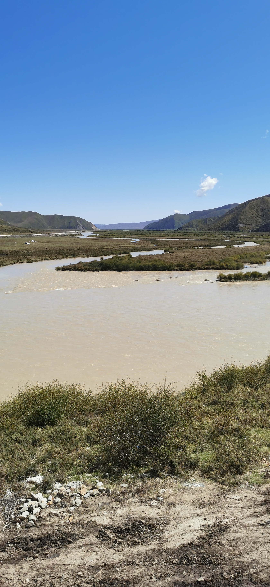

中午在久治县城吃了午饭，就踏上了德马高速之旅。

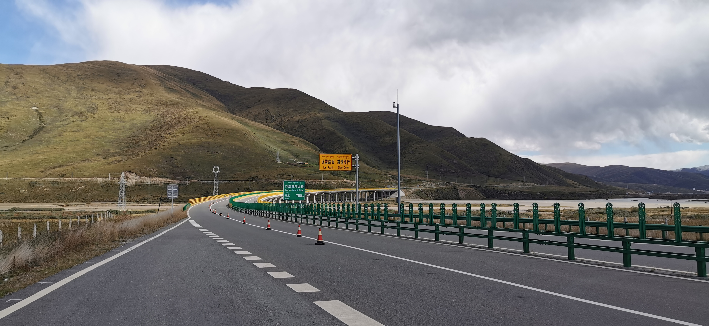

沿德马高速走一段，我又见到了黄河，这里是这次旅途经过黄河的最上游的地方了。

晚上入住果洛州州府大武镇号称最豪华的酒店。其实挺垃圾的。不值四百多块。

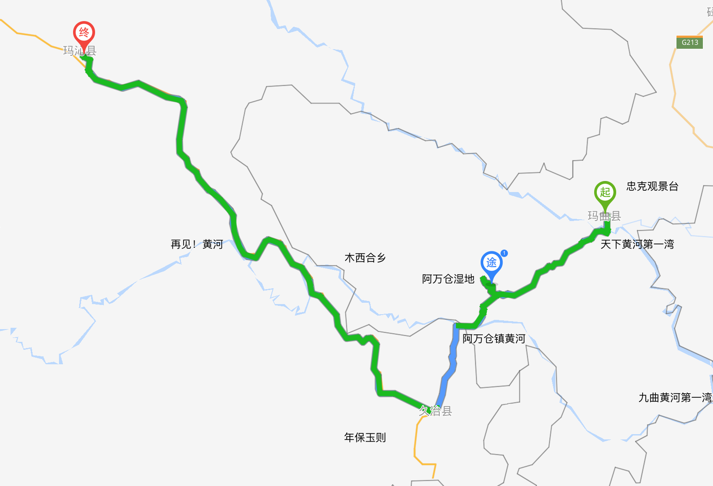

| 景点 | 得分|
| ------ | ----- |
| 天下黄河第一湾 | 2分 |
| 阿万仓湿地公园 | 4分 |
| 阿万仓镇旁边的黄河 | 4分 |
| 玛曲县木西合乡旁的黄河 | ? |
| 德马高速久治县至玛沁县段 | 4分 |
| 年保玉则 | ? |

## 9月28日

今日继续走完德马高速全程。期待见到这次旅途中最重要的一些景点，比如**阿尼玛卿山**主峰。

离开大武镇向西北车行一个小时后，就会不断看到雪山。

直到离雪山一号隧道入口不远的地方，就会看到一片巨大的白色山体，它离高速公路仅仅隔着一条沟。

在雪山一号隧道的入口处，可以近距离观察冰川的末端。甚至看起来走过去也就几百米的距离。

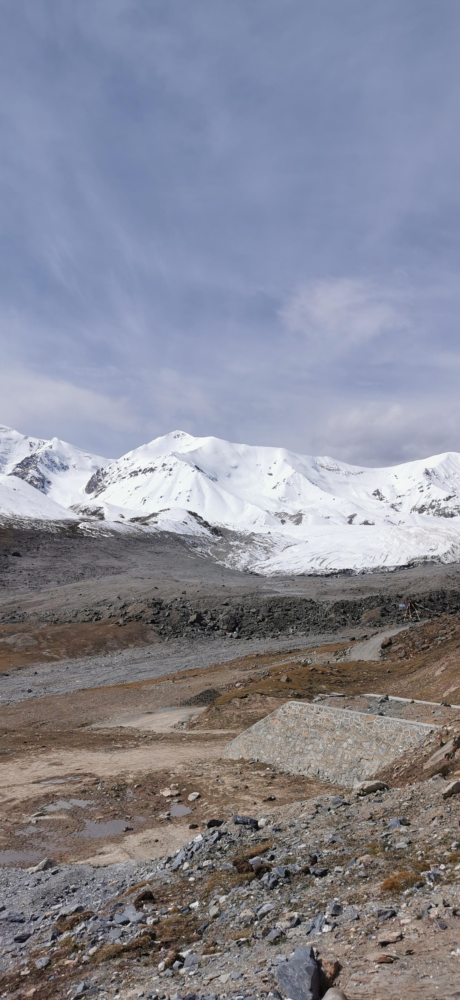

穿过雪山一号隧道之后，天气立即从晴朗变成了阴云密布。仅仅一山之隔，便是两重天了。

继续向西北走，经过了花石峡枢纽，也就是共玉高速和德马高速相交的地方。然后再走一小段就到了**冬给错那湖**的旁边。高速公路旁有个口子，我尝试了一下确实可以下到湖边，目测轿车是没戏的，路比较糟糕。

刚好遇到有几辆温州来的普拉多在湖边陷车了。

因为今天一路上压根没城镇，大多数都是无人区，所以选择在湖边补给一下。

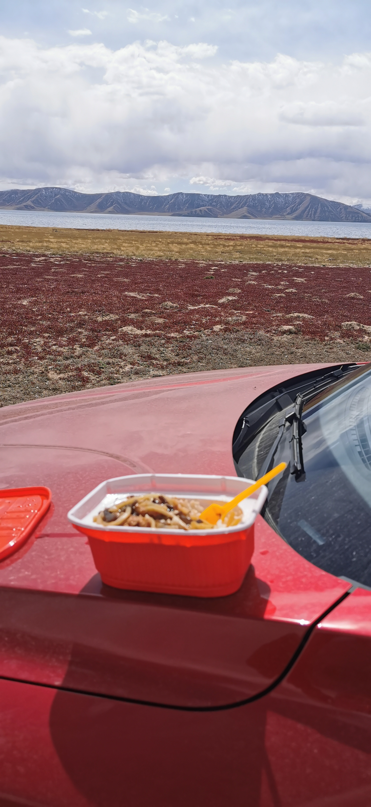

自热米饭真难吃。离开冬给错那湖之后，就进入了真正的无人区，一路上甚至草都很少，地上似乎长的都是苔藓。

不久终于翻过此行最高点，挝卓依垭口。

怀着对中国路桥工程师和工人的崇高敬意，我从海拔4445米一路下坡，直到柴达木盆地的香日德镇附近。途中地貌不断从苔原到草原，从草原又逐渐见到越来越多的树木和人家，竟有从天上回到人间的感觉。

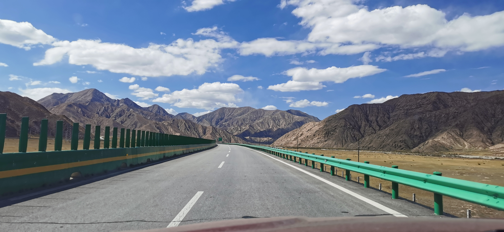

离开香日德镇附近之后就短暂借道京藏高速向西。京藏高速的一旁是连绵的昆仑山脉（准确地说是昆仑余脉），一边是一眼望到边的柴达木盆地。虽然柴达木盆地北边的山脉离我有100多公里，但是因为空气质量好，天气晴朗，我竟然一眼可以望到。大西北的苍凉就此在我眼前展露无遗。

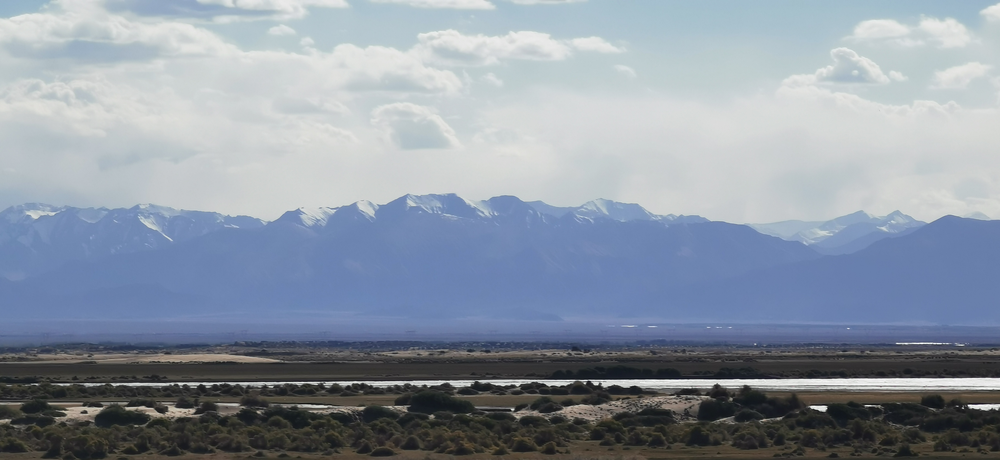

离开借道的京藏高速，德马高速将再次向北，南北纵跨整个柴达木盆地。这段路也同样给我惊喜不断，无数的内流河在公路下流过，要么即将干涸，要么已经干涸。我看到了内流河最后的生命形态。这其中水量最大的一条河叫做素棱郭勒河。

路旁的土地到处覆盖着白白的一层，这个地方应该是古盐湖的湖底。柴达木盆地分布着众多盐湖 ，包括网红景点茶卡盐湖。

翻过一座小山之后，许多个沙丘也呈现在我眼前。

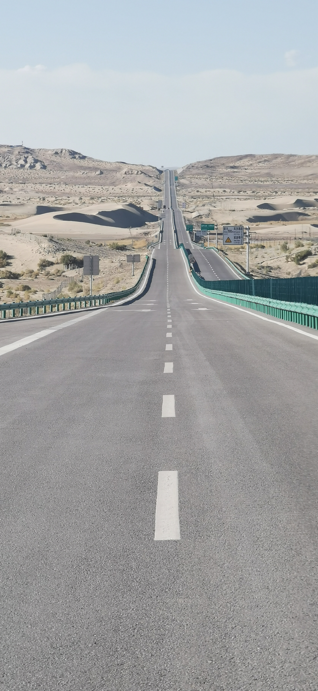

穿越柴达木盆地，真正体会到什么叫望山跑死马。一座一眼能看到的山，居然跑了整整俩小时才到它的脚下。

傍晚到达德令哈市，这座小城竟然有电车轨道，市容整洁，阳光刺眼。

> 德令哈或许是青海第二或者第三大的城市，是海西州州府所在地。对于文艺青年来说，它因海子的诗而闻名。它的四周确实很荒凉，但是本身是一座非常美丽的小城。

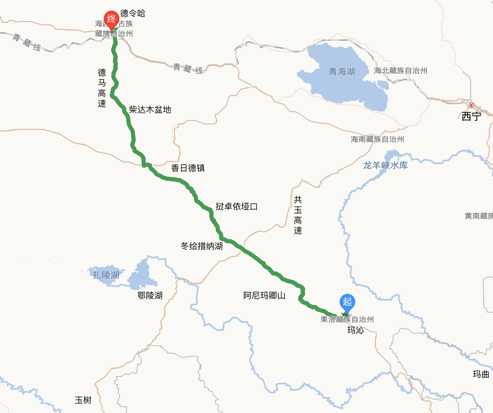

| 景点 | 得分|
| ------ | ----- |
| 德马高速玛沁至德令哈段 | 5分 |
| 扎陵湖鄂陵湖 | ? |
| 花石峡 | ? |
| 阿尼玛卿山 | 5分 |
| 冬给错那湖 | 4分 |

## 9月29日

今日计划去德令哈往北100多公里的**哈拉湖**一日游。可是沿着固始汗大道走到山脚下，路被封了。封路的大叔什么都问不出来，就说路封了不让去。

> 哈拉湖是青海省第二大湖，高原上的明珠，紧挨祁连山主峰岗则吾结的山脚下。从德令哈到哈拉湖边大部分是非铺装路面，单车前往非常冒险。

这完全打乱了我的计划。我的行程多出来了一天。我只能无奈地想，也许去往哈拉湖的路确实不好走，有被困在野外的风险，不去也罢。就算有小路可以绕过去，我也不想承担浪费这个时间的风险，毕竟之前并没有研究过附近的卫星地图。

返回德令哈酒店的途中，我看到**黑石山水库**的颜色非常特别，于是想着能不能去大坝上看看？

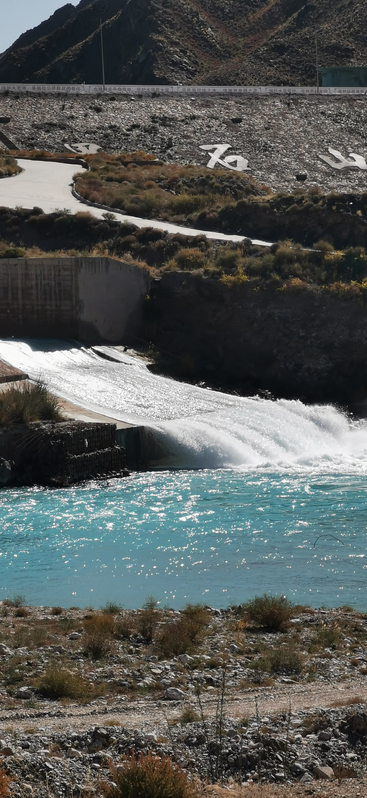

到了黑石山水库大院的门口，右边写着闲人免入，这显然是发电厂，左边却啥也没写，也是敞开着大门。我不管三七二十一，轻踩油门溜了进去，七拐八拐上到了大坝的北侧。心中窃喜，呈现在我眼前的黑石山水库有着夸张的颜色。

大坝旁边的小山头上建有石阶和凉亭。我正往凉亭上走，一个胖女人喝止我道，“这里不让玩，赶紧走”。于是我只好慢悠悠地上了车，准备回到市区的酒店里退房。

到了水库门口，我居然被锁在了里面。只好找人求救，还好有个看门大叔帮我开了锁。（估计也是他把我锁在里面的）

回到市区退掉当晚的酒店之后，我犹豫了好久。因为哈拉湖没去成，多出来了一天行程，为了充分利用这个多出来的一天，我要不要向西北，经大柴旦往河西走廊去？还是继续完成我的甘青南环线？犹豫了一个小时后，我还是选择了后者。因为之前两次来青海都跟坎布拉国家森林公园擦肩而过，事不过三。

沿着茶德高速，我可以去看看茶卡盐湖，然后晚上住在共和县。但是我对茶卡盐湖这个风评一般的景点实在提不起兴趣，于是决定再去一趟青海湖边，去看看能不能拍到日落。

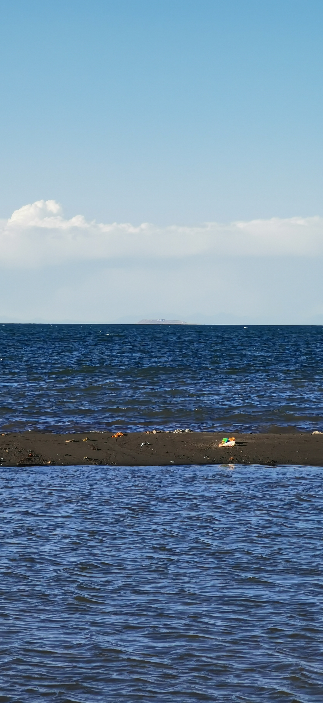

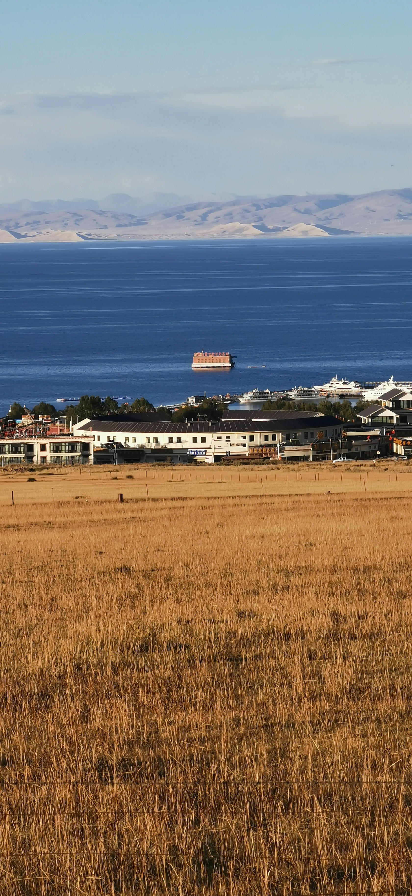

因为在南岸耽误了太多时间，来到东岸的时候太阳已经就快要下山了。我还没有找到好的地方，太阳终于落下去了。

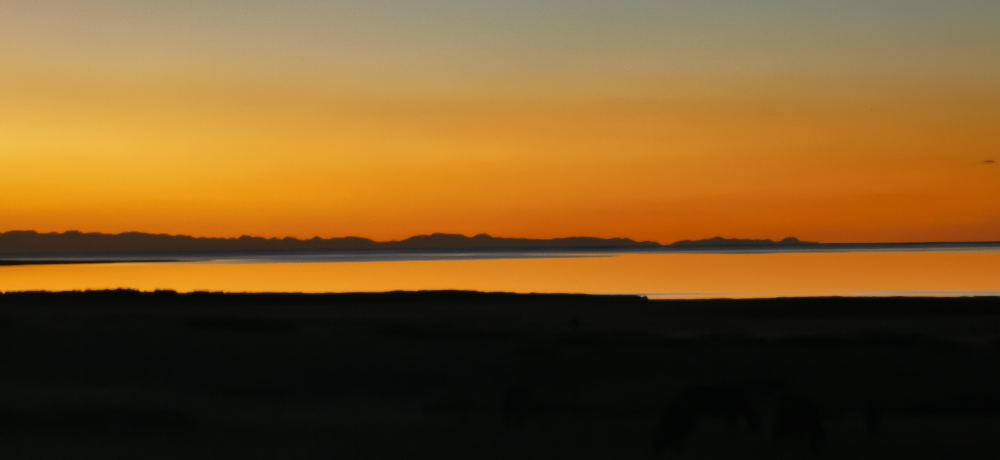

快要到达西海镇时已经完全天黑。一座灯火通明的孤城出现在我前方几公里，我感觉又一次回到了人间。

> 西海镇是青海省海北州的州府所在地，又称原子城。但是西海镇本身又只是一个镇，属于海北州海晏县，海晏县县城离此地20公里。这是非常少见的行政区划现象。

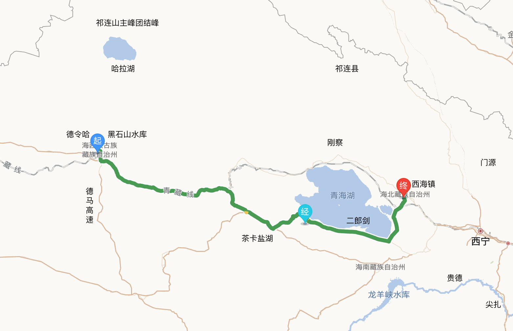

| 景点 | 得分|
| ------ | ----- |
| 哈拉湖 | ? |
| 黑石山水库 | 5分 |
| 茶卡盐湖 | ? |
| 青海湖 | 5分 |

## 9月30日

今天的目标是去离开青海之前最后一个重要的景点——坎布拉森林公园。从西海镇到坎布拉森林公园并不远，走高速的话也许只要两个小时。这也太近了，又玩不了一天。我决定从一条网红公路——扎哈公路走。扎哈公路大致位于日月山与拉脊山之间。日月山是从西宁去青海湖南岸的必经之路。而拉脊山是从西宁去贵德之间的路上的最高点。扎哈公路就是连接这两点的一条车流量不大的小路。

我从西海镇出发后经过海晏县与湟源县，车行一个多小时就上了扎哈公路。然而这条公路在我看来却是平平无奇，除了草原也就是草原了。也许是那些从西宁出发，经过塔尔寺然后去青海湖的游客路过这里，觉得草原很漂亮。也许是我来的季节不对，毕竟秋天草大都黄掉了。

过了拉脊山口之后就离开了扎哈公路，然后我一路向南开，到达贵德县城补给、吃午饭。

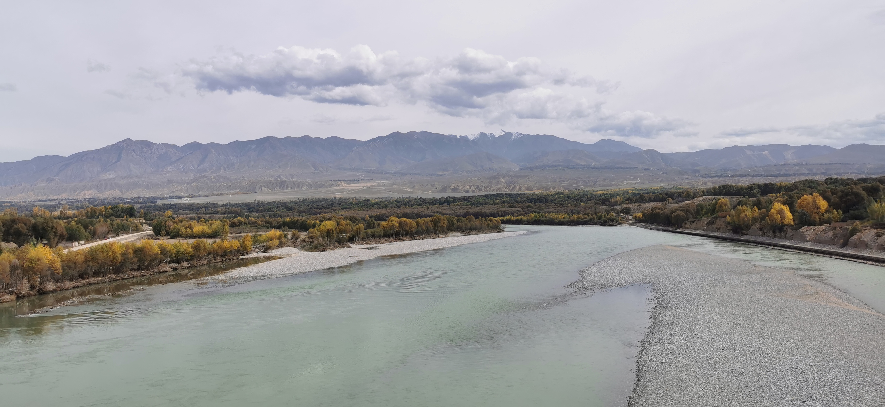

贵德黄河大桥两旁本来是块非常漂亮的风景区，可惜随着黄河两岸人工建筑越来越多，景色已经没有我想象的那么漂亮了。

> 贵德县属于青海省海南州，离西宁市已经非常近，号称天下黄河贵德清。所以许多来青海的游客都会顺便来贵德看看青的黄河水。

坎布拉森林公园的西门要4点半之后才能进去（不用买门票），所以我在贵德歇了好一会。等我到达坎布拉西门的时候，恰好4点半。此时大门卖票的刚收摊。

> 坎布拉森林公园属于青海省黄南州尖扎县。

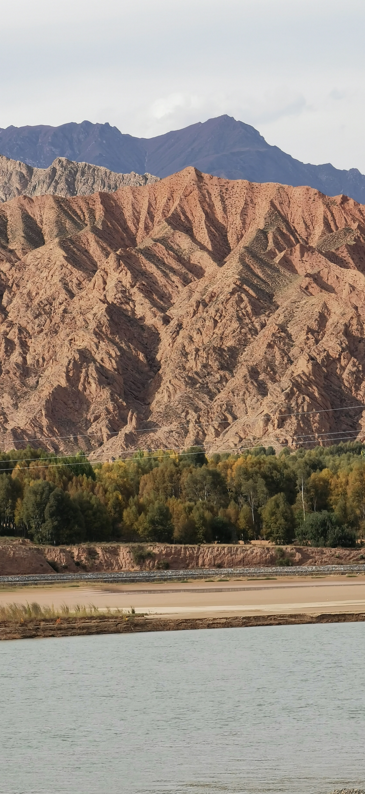

坎布拉森林公园西门进门这段盘山路非常绕，24拐肯定是不止。

翻过山口不久就能看一些丹霞地貌了。坎布拉的丹霞看起来挺像丹霞山的丹霞。

此时天色已晚，我住在了德宏村的某处旅馆。

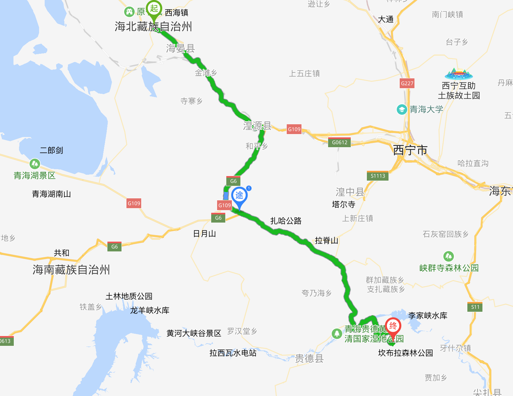

值得一提的是，2017前我曾经自驾从**共和**经**龙羊峡、罗汉堂乡到达贵德**。我觉得这条路更适合自驾游，因为它沿途经过土林、龙羊峡水库与大坝、龙羊峡（黄河大峡谷景区）、拉西瓦水库、草原等等各类风景，比起扎哈公路丰富得多，算得上一条景观公路。拉西瓦电站是黄河上最大的电站，它的大坝也是黄河上最高的大坝，深藏在龙羊峡下游的峡谷里。可惜普通游客无法得见。

> 共和是一个地名，是青海省海南州州府所在地。

| 景点 | 得分|
| ------ | ----- |
| 日月山 | 2分 |
| 塔尔寺 | 2分 |
| 扎哈公路 | 2分 |
| 拉脊山 | 2.5分 |
| 贵德黄河 | 4分 |
| 贵德丹霞 | 3.5分 |
| 龙羊峡土林 | 4.5分 |
| 龙羊峡水库 | 4.5分 |
| 拉西瓦水库 | 4.5分 |

## 10月1日

一大早我就来到坎布拉森林公园的**灵山圣水**栈道，这个地方的视野最好，几乎可以眺望整个李家峡水库。

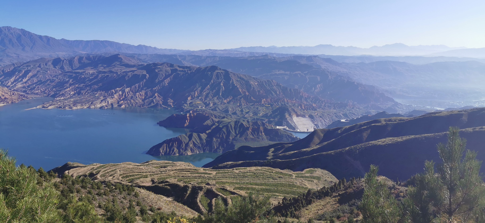

流连了两个小时后，我终于下山往坎布拉森林公园东门开去。今日的目的地是夏河县。我又要回到甘肃省境内了。

中午先在尖扎县城吃个午饭。事实上尖扎县这段的黄河非常漂亮。可惜因为不好停车我没有多拍几张照片。

沿着国道一直走到隆务大桥，我再次跟黄河道别。从这里黄河将继续流向循化县、刘家峡水库、兰州市。而我将经过同仁县，向夏河县方向去。

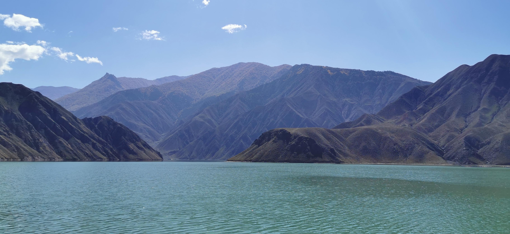

一路上沿着黄河的支流隆务河而上，直到黄南州的州府所在地同仁县。

离开同仁县转而向东行一段路，就告别了青海省，又回到了甘肃省。站在山口可以远眺甘加草原尽头的白石崖。白石崖很像草原边的一堵墙，它的脚下是草原，顶上是另一片草原，初看非常震撼。

八角城观景台是观赏白石崖的最佳位置。登上观景台大约需要十来分钟。至于八角城是个啥遗迹我没搞清楚，不知道是从何时始建，只知道从汉代开始就此设白石县，一直是军事交通要地。

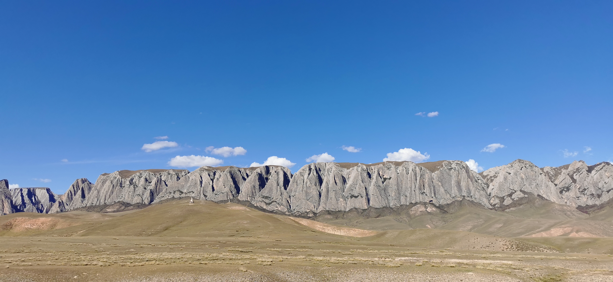

傍晚到达了夏河县城。

> 图中同德县有误，应为同仁县。

| 景点 | 得分|
| ------ | ----- |
| 坎布拉森林公园 | 5分 |
| 尖扎黄河 | 4分 |
| 隆务河峡谷 | 3.5分 |
| 白石崖 | 4分 |
| 甘加草原 | 3.5分 |
| 拉卜楞寺 | ? |

## 10月2日

如果不是因为哈拉湖没去成，今天离开夏河后我将经过临夏、永靖，最后抵达兰州。但是多出来一天也不知道去哪里，就去刘家峡多晃一天吧。

中午来到临夏八坊十三巷(AAAA)景区。其实都是新造的房子，吃了五十块钱的小吃，也就最便宜的包子好吃点。乏善可陈。

> 临夏是甘肃省临夏州州府，此地为回民聚居区。

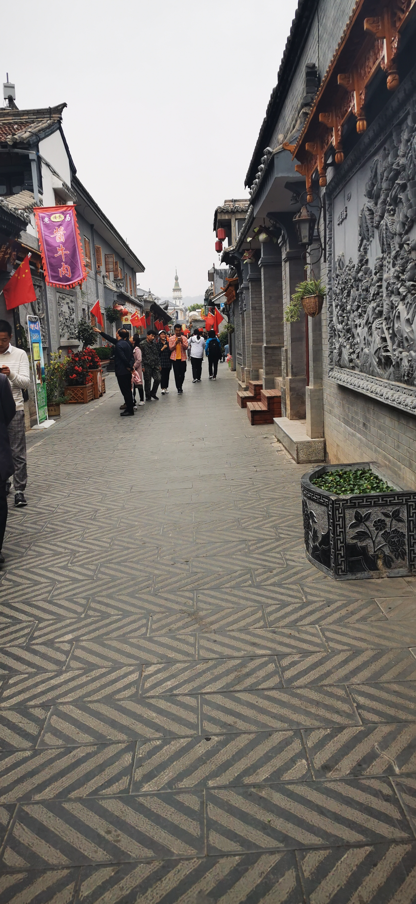

下午沿着折达公路向北，再次见到了黄河。可惜天气不怎么好，雾蒙蒙的，观刘家峡水库的视线比较差。

临近永靖县之后，我来到黄洮(音桃)交汇处，看到非常震撼的景色。黄河水在这里被她的支流洮河染黄。

我这次行程的第一晚住在岷县，就临着洮河。洮河是甘肃南部最大的一条黄河支流。它弯弯绕绕，最终来到这个峡谷，汇入黄河。

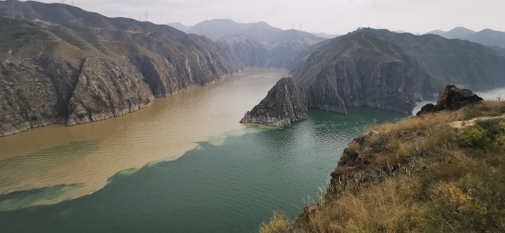

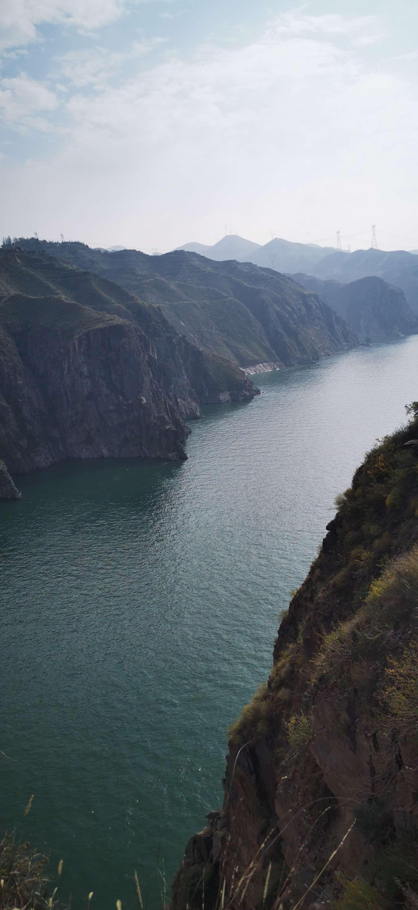

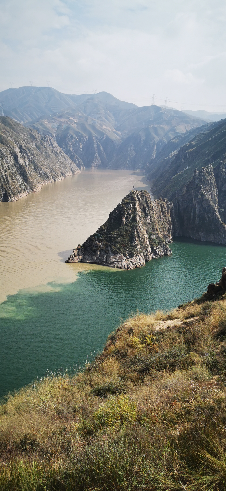

之后我又来到刘家峡景区游客中心，这里有一家博物馆我很感兴趣。我买了这次行程的第一张门票，价值30元。

可惜里头的陈列一般般，格局太小(也就永靖县的格局)。

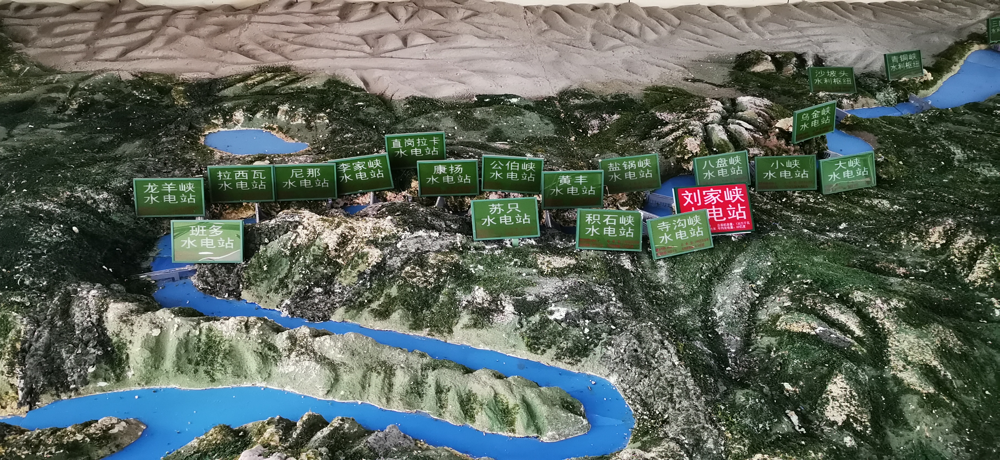

当晚住在游客中心旁边的一家宾馆，价格实惠，房间隔音等于没有。

| 景点 | 得分|
| ------ | ----- |
| 八坊十三巷 | 1分 |
| 黄洮交汇 | 5分 |
| 黄河水电博览馆 | 2.5分 |

## 10月3日

今天实在没地方去，坐船去了炳灵寺石窟。回来后很后悔坐船去，太浪费时间了，**应该开车去**的。

> 甘肃是石窟第一省，因为佛教西来时，来到中国第一站就是甘肃，炳灵寺其实相比于麦积山、莫高窟、马蹄寺而言很不出名。

| 景点 | 得分|
| ------ | ----- |
| 炳灵寺石窟 | 4分 |

## 10月4日

今天一早行车一个小时多一点点回到兰州，参观了甘肃省博物馆。甘肃省博物馆是非常值得参观的，因为甘肃既是**中华民族的发源地之一**，又是**古代东西方文化交流的前沿**。

然后又去还车。中午吃过饭坐动车离开兰州，结束了这次甘青南环线之旅。

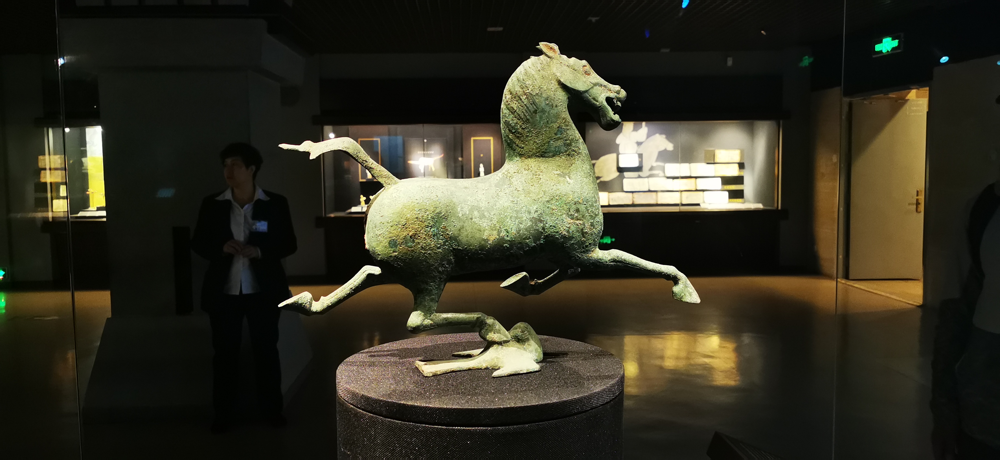

| 景点 | 得分|
| ------ | ----- |
| 甘肃省博物馆 | 4.5分 |
| 兰州黄河 | ? |

## 总结

甘青南环线与传统大环线相比，人文景观略逊，以佛教景观为主。但自然景观则更胜，景观密度更大。

甘青南环线是一条黄河溯源之旅。在这条线路上你可以深刻观察从兰州往上的黄河的各种形态。甚至等到扎陵湖鄂陵湖开放了之后，你可以真正去黄河源头看看，它们也在这条路线的旁边。

它也是一条黄河水电之旅，你从课本上听过的那些著名的水电站，如龙羊峡，李家峡，刘家峡电站，都在这里。甚至还有拉西瓦电站这个事实上黄河最大的电站。

它其实还是一条佛教景观之旅，一路上囊括了拉卜楞寺，郎木寺，塔尔寺，炳灵寺。关于佛教/藏传佛教景观我描述得很少，但其实这只是我个人偏好。这一路上著名的佛教景观是真不少。

天气对景色往往是决定性的。我这趟旅程一共十天，前面九天都是天晴。中国天气网的15天预报还是很给力的。

### 最终推荐线路

- 兰州
- 永靖
- 临夏
- 夏河
- 尖扎
- 贵德
- 龙羊峡
- 共和
- 青海湖二郎剑
- 德令哈
- 德马高速
- 玛多
- 玛沁
- 久治
- 莲宝叶则
- 阿坝
- 红原九曲黄河第一湾
- 若尔盖花湖
- 迭部
- 扎尕那
- 卓尼
- 兰州