> 这是一篇流水账。原作于2021年12月。海南是个热门的旅游目的地，也实在没啥可猎奇的地方。所以我只是把吃的住的玩的记下来，给个评价。希望以此能给他人做个参考。

因为新冠疫情以及家里的琐事，我们已经一年多时间没有一家三口出远门玩了。终于大家都有空时，最适合出游的秋天却已经完全结束了。我算来算去，这个冬天能去的地方只有海南和西藏。在纠结了一个星期后，我预定了四张往返海口的机票。

## 出发前夜

因为上海时不时曝出疫情，所以我选择的是无锡硕放机场出发的机票。此前一个星期浙江省的许多个城市都相继曝出有不少确诊病例，但偏偏紧挨浙江的苏州和无锡一直都是零病例。

万万没想到，出发前一晚，我都准备上床睡觉的时候，手机里推送了一个通知，说宜兴有一个浙江过来的确诊。这个消息震惊了我，因为宜兴是无锡的代管县级市，如果宜兴被标风险地区，那么海南那边的机场出口可能就要对无锡飞过来的乘客要求48小时内两次核酸检测阴性报告了。

我们预订的是第二天下午两点的飞机，此时是晚上十点，行李全都收拾好了，取消行程已经几乎没有可能了。我考虑再三，决定一起去医院24小时核酸检测点做一次核酸检测。

在最差情况下，如果海口机场出口真的要求两次核酸报告，我们也可以就地再多做一次核酸就够了，在机场住一晚并不会耽误第二天的行程。

## 第零日

上午十一点坐约好的专车去无锡机场，用时一个小时。

无锡机场旅客寥寥，但是我们还是全程不敢摘口罩。

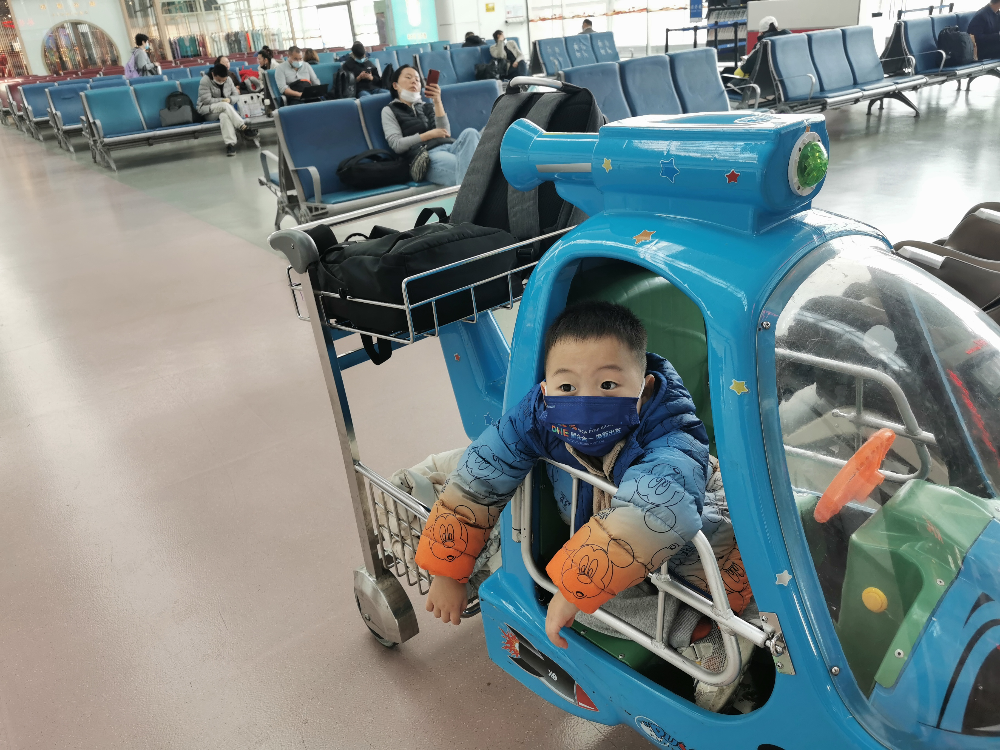

登机时，只要求行程码和海南健康码。不要求核酸报告。

下午两点多起飞，全程飞了不多不少三个小时。飞到半途我太无聊，于是不断地给我丈母娘讲解舷窗外地面上的城市、地标，包括赣州、东莞、深圳宝安机场、港珠澳大桥等。讲着讲着就飞到了海南岛，飞机从海口美兰机场的东面绕到南面，最后又到了机场西面，从西向东降落了。

出机场时，工作人员没有看我的核酸报告，只要求了海南健康码和行程码。但是除了我其他人都被拦下来了，说有核酸报告吗？有的话就直接可以走。于是我们的核酸报告还真派上了用场。不过我仔细想来应该是不用核酸报告也能出场的。

出了机场之后第一步是提车。我从一嗨租车租了一辆日产天籁的车【5分推荐】，7天时间总价1300，价钱还算实惠。本来是1100块租了一辆本田雅阁，但是临出发前打电话过去问才得知雅阁的配置太低了，遂取消重新订了。重新订的时候这个日产天籁还涨价了100，我也只能硬着头皮订了。提到车发现一嗨租车的天籁该有的配置都有：自动大灯，定速巡航，双天窗，还有车载可联网的高德导航——恰好我又忘记带手机夹子了。

我们第一晚的住处是海口市万绿园旁的一家叫黄金海景大酒店【4分好评】，约400一间含早。到达酒店时已经是晚上七点多。酒店的房间窗外正对万绿园以及远处的海岸，属于海口市中心区域。

## 第一日

这天是周六，酒店的早饭还不错。餐厅在酒店的顶楼，还是带旋转的。我老婆和丈母娘一上来就对椰子饭很感兴趣。小孩不好好吃饭很折腾人。其实本地人吃得多的应该是早茶（老爸茶），如果是我一个人出来我肯定就去小巷子里吃早茶了，据说又便宜又好吃。

上午我们步行去马路对面的万绿园【5分推荐】。海口市内有那么多公园，我研究了很久最后才决定去万绿园。因为带小孩去这里最合适。它靠海，面积大，有大草坪，还有各种各样的儿童乐园。

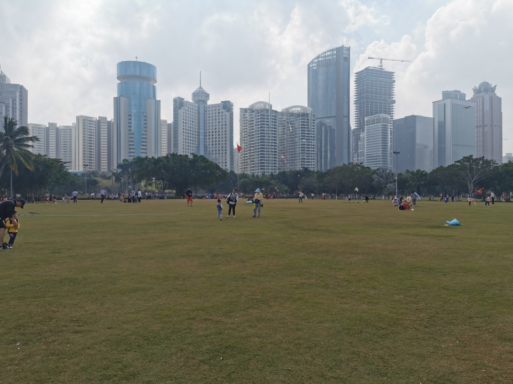

我带小孩玩了一会游乐场，100块钱套票可以玩七个项目。最好玩的是一个碰碰车项目，一张票可以玩二十分钟。准确地说这个游乐项目里的车并不是碰碰车，而是那种常见的小孩玩具电瓶车。小朋友们可以无拘无束地在场地里比拼车技。

因为在热带，万绿园不同于北方的城市公园。万绿园里的热带植物长得异常茂盛，就连地上的草给人的也是原生态的感觉，他们看起来并不是从哪里培养了再移植过来的，而是一年四季就长在这里，长了几年就长成了厚厚的一层草地。

中午在附近一家四季椰林连锁店吃的椰子鸡火锅【3分中评】，四个人吃了近300块。感觉凑合吧，估计这连锁店也是外地人吃得多。

本来这天下午是要去火山口公园逛逛的，但是拖家带口就是会各种磨蹭，各种跟不上计划。只能取消。

下午四点我们就直接开车前往澄迈县某小区，一个小时车程。我的爷爷奶奶正在那里过冬，这次出远门之所以选择海南很大部分原因也是因为想来看望他们。

午饭前我才知道原来我老爸已经一个星期前来这里照看他们了，因为我奶奶最近身体不太好。没想到我和我儿子这次都见到了自己的爷爷。

晚上我们住在小区配套的旅店，贵，230一间，条件较差，没有参考意义，姑且不表。

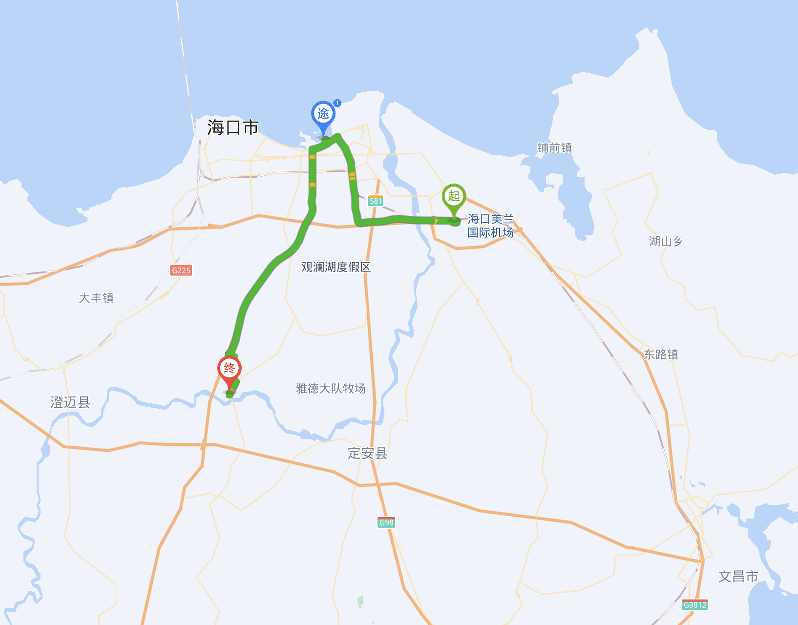

## 第二日

这天起来我们在家里吃过早饭，就跟着我爸逛了一个镇上的菜市场。我们买了本地的番石榴，是有史以来吃过的最好吃的番石榴【5分推荐】。它长得比较白，表皮不怎么绿，不大，主要的特点是比较甜。

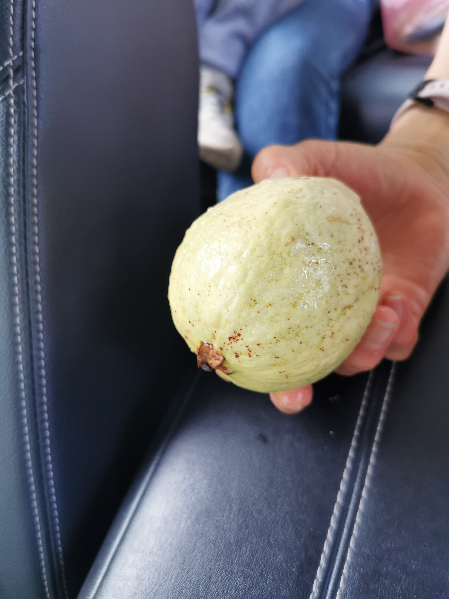

上午我陪老人唠嗑。

中午吃我爸烧的大餐。

下午我们就走人了，因为没什么好玩的小孩也呆不住。

上了高速我们直达海南岛最南部的乐东县龙沐湾，全程近三个小时。海南的高速公路有个特点，就是没有收费站。前一天出海口市的时候我们就遇到一个在中国别的地方一般见不到的情况，那就是车开着开着过了一个红绿灯后突然上了高速公路。

龙沐湾【3分中评】的沙滩比较长，视野很开阔，号称是看日落的最佳地点。但是沙子比较差。估计是最近为了给旁边酒店招揽生意才整出来的一个免费景点。

小孩太喜欢踏浪了。

我们一直玩到完全日落才走。

晚上我们住在乐东县尖峰镇的一家叫福佳园假日酒店的小旅馆【3分中评】，110块一间。热水龙头放了整整十分钟水才热。住在这里是为了第二天能有足够多的时间去尖峰岭里头玩。

尖峰镇比较破，是个小镇。吃晚饭的地方选择少，价格还奇贵。
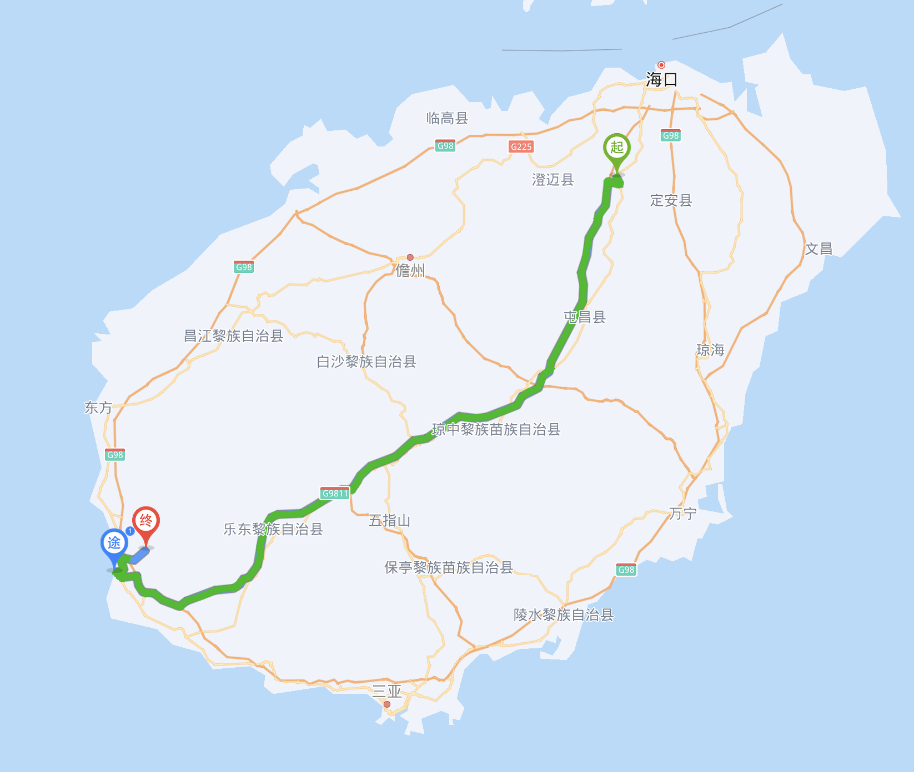

## 第三日

这天起床可以看到旅馆窗外的山。这个小镇就是山脚下的一个普通不发达小镇。其实三点钟的时候我就被附近的公鸡给吵醒了。

早晨我们找到一家很多本地人吃早饭的地方，忘记叫什么店名了——也许就没有店名，从地图上看大约在一家叫做林怡餐馆的西面（图中红圈位置）。

我们吃了44块钱，包括一个大包子，一份12个蒸饺，一份海南粉，一份抱罗粉，一份粉汤（其实也就是汤米粉）。

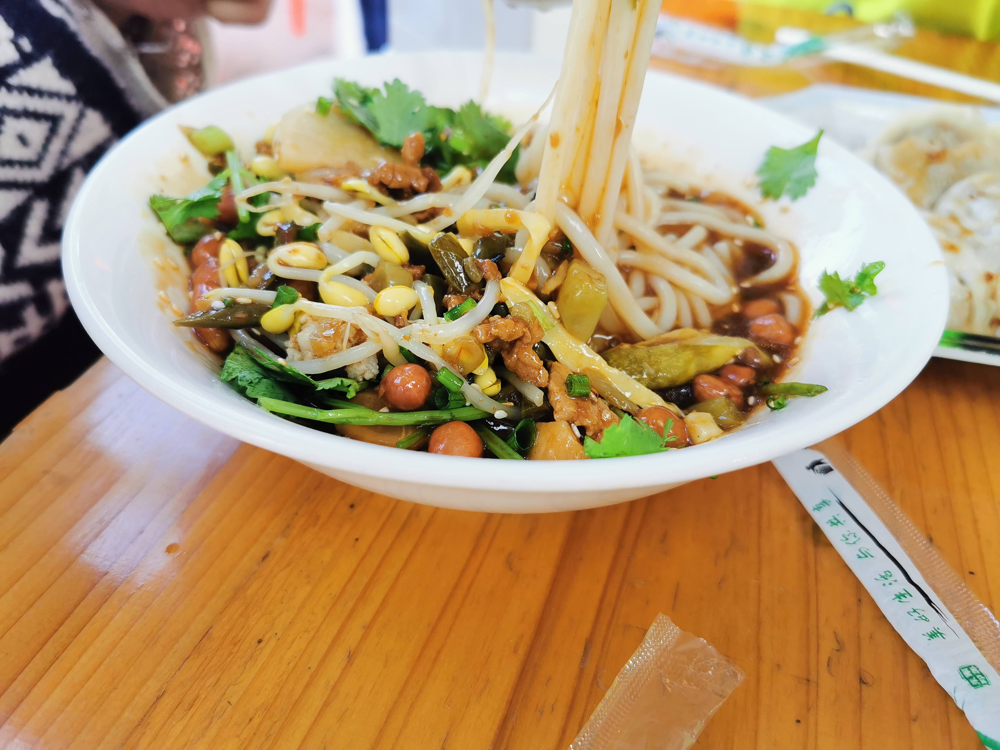

虽然当地的米粉味道有点吃不惯，口味有点重，但是总体很不错。【5分推荐】

尖峰岭是一个森林公园，属于**海南热带雨林国家公园**的一部分。

> **国家公园**的名头可不小，准确来讲是国务院于2021年10月12日首批正式实行中国国家公园体制的五个保护区。目前仅有五个。

> 海南热带雨林国家公园包括五指山、鹦哥岭、尖峰岭、霸王岭、吊罗山等5个国家级自然保护区，佳西等3个省级自然保护区，黎母山等4个国家森林公园、阿陀岭等6个省级森林公园与相关国有林场。该国家公园旨在更加有效保护热带雨林生态系统的原真性和完整性。其中五指山也是旅游胜地，2014年年初我曾带父母去过一次，因为交通不便，时间紧张我们没有玩尽兴。

尖峰岭以尖峰为名，从尖峰镇上往山上的方向可以很容易看到一个非常尖的山头，那就是尖峰岭的主峰，海拔约1400米。

尖峰岭的门票55元一张，我们尝试从网上买买不到，是到了尖峰镇尽头的景区大门口才买到。整个森林公园处于轻度开发状态，**没有景区区间车，只能自驾或者包车进山**。这个状态我很喜欢，最好是永远都不要搞什么景区区间车，那玩意没有不坑人的——所以我管它叫轻度开发，不叫半开发或者没有开发完。

进入尖峰岭公园大门后，马上见到一个岔路口。岔路口往左是天池和鸣凤谷方向，往右则是鹿树和尖峰岭主峰方向。这两边的沟通只能回到大门口这个岔路。我们计划上午游鸣凤谷方向，下午游主峰方向。中午我从鸣凤谷开车到主峰，其他人恰好可以在车上睡觉。

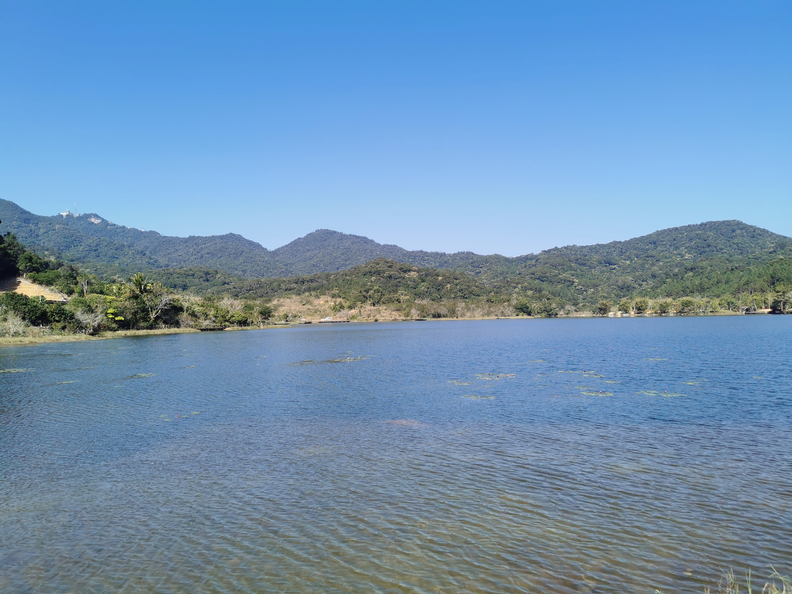

去鸣凤谷的半途我走错路了，开到了一个军事基地的大门口，耽误了半个小时。中午11点才到达天池。天池【2分差评】就是普普通通的一个山谷里的湖泊，据说清晨来到这里雾气弥漫的时候比较漂亮。

进入鸣凤谷的栈道时已经12点整了——我本来计划的是10点左右到这里。

> 鸣凤谷是尖峰岭最有代表性、最原始的热带雨林沟谷，全长2.5公里，顺着栈道走一圈大概一两个小时，并不会太累。这里因众多鸟类祥集此地而得名，有“千年古树”、“空中花园”、“大板根”、“绞杀”等热带雨林独特景观，让人大开眼界。进入景区，顺着修葺好的木栅道穿行，一开始还能看到蓝天，越往里走、树木越多也越茂密，天空被完全遮挡，几乎看不见阳光，只有随意生长的树枝与树枝交缠在一起，展现了自然生态的粗犷豪放。
> 在鸣凤谷可以欣赏到热带雨林植物的多样性，呼吸到高负离子的清新空气，听到谷中娓娓动听的鸟鸣，还有看到各种花、藤类、蕨类纷纷安家在参天的古树上、形成的“空中花园”，亦或者凌空而下的一排软藤组成宽阔的“门帘”，还可以爬到“大板根树”中空的树心中抬首望天等等，鸣凤谷一行绝对能让你与雨林来一个亲密接触。

鸣凤谷【5分推荐】大抵就是山谷里的一段栈道环线。一开始是上坡，到达最远端的鸣凤石之后开始下坡。刚进入栈道，我们就被高耸的通天树震惊到了。

因为天气不错，阳光透射到雨林里面，略显魔幻。

小孩刚走了十几个台阶就一屁股坐在地上说“好累呀”。接下来的路程居然被我连哄带骗基本上自己走完了，用时两个小时。

中午我们吃了点水果，然后就开车去公园的另一头——鹿树和主峰方向。

鹿树【4分好评】附近在施工，我们坐在车上看了一眼就走了。但是不得不说鹿树长得确实像鹿，很惊艳。

到达主峰旁边的停车场时已经是下午四点。我看了一眼主峰，心里估摸着今天是爬不上去了。主峰看起来需要一个半小时才能爬上去，大致相当于从华山北峰爬到东峰的高度。主峰之上可以远眺大海，水平距离不过20多公里，相对高度达到1400米。据说有许多年轻人早上三点从尖峰镇出发上山来看云海日出。

跟8年前去爬五指山主峰一样，这次我又无缘登顶了。

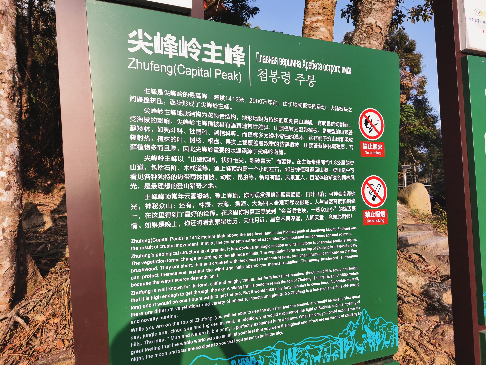

小孩和他妈妈早已在爬栈道的时候耗光了体力。最终我和小孩他姥姥爬了三分之一的路程即放弃。沿途啥都没看到，因为两旁的风景都被茂盛的树木给挡住了。

回到尖峰镇找吃晚饭的地方又是一无所获。最终我们到达国道旁边的佛罗镇吃饭。住在一家叫做铂金酒店【三分中评】的新开业的旅馆，约160元一间房，性价比一般。

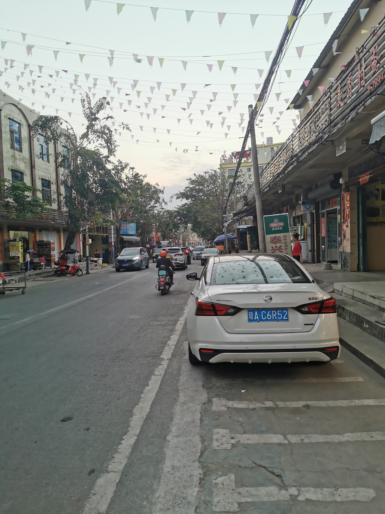

## 第四日

这天起来我们又找到一家佛罗镇上很多当地人吃的早茶店【5分推荐】。它没有店名在地图上也没有标注。这家一个显著的特点就是店门口很多大老爷们坐在那里，也没几个人在吃早餐，都在那喝茶聊天。我们跑过去的时候全都坐满了，最后是有一桌大老爷们主动让出来一张桌子给我们坐。我们点了大包子，土面包，炒米粉，汤米粉（即粉汤），还有冬瓜糖馅的麻球。恰好又花了44块钱。

大致的位置在下面的地图的红圈里。
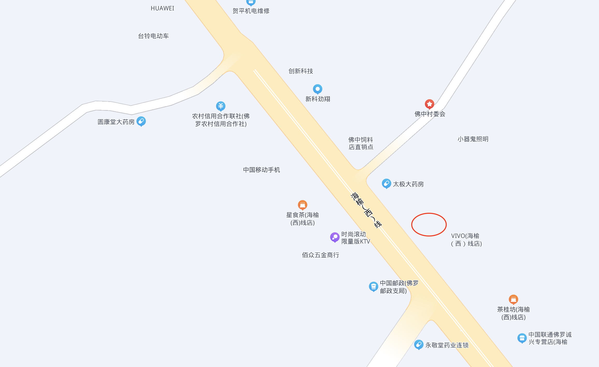

吃完早饭我们开车出发去三亚亚龙湾的天域酒店。全程高速大约用时1个半小时。

我们在携程上定了一间天域酒店二区非海景家庭套房，1350一晚。最坑的是因为房间全住满了要等到下午三点才给我们入住。

这种亲子酒店有很多小朋友的娱乐项目，很容易打发时间。酒店的餐厅也很实惠。所以这家酒店仍然是【5分推荐】的。

酒店有免费的游泳池和水上游乐设施，小孩玩得不想上岸。

我们并不打算去三亚别的地方。因为来之前我通过一段时间研究后就得出了结论：

1. 整个海南省最好的沙滩就在亚龙湾。
2. 三亚所有的景点都是坑人的。

所以我们只要在酒店和沙滩上玩就够了。很大一部分游客来这里甚至只是泡在酒店连续好几天。后来也证明小孩确实很喜欢这里不想走，只不过我还是更喜欢边走边玩去体验一下当地风土人情，让我一直呆在这里我憋不住。

## 第五日

天域酒店最大的缺点就是自助早餐极其垃圾，我选了那么多样居然没一个好吃的。但是据我媳妇说咖喱鸡饭还不错。

上午艳阳高照。小孩去玩陶艺了，我躺在海边晒太阳。

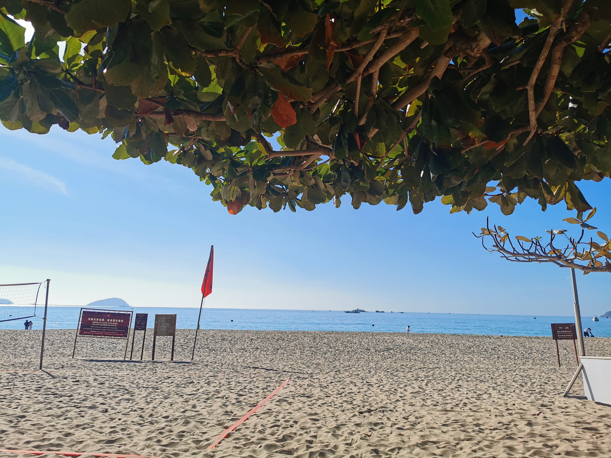

中午退了房我们就去吃午饭。午饭质量还是很高的。下午我带着小孩去海里游泳——来都来了那我必须带他体验一下海浪的厉害。

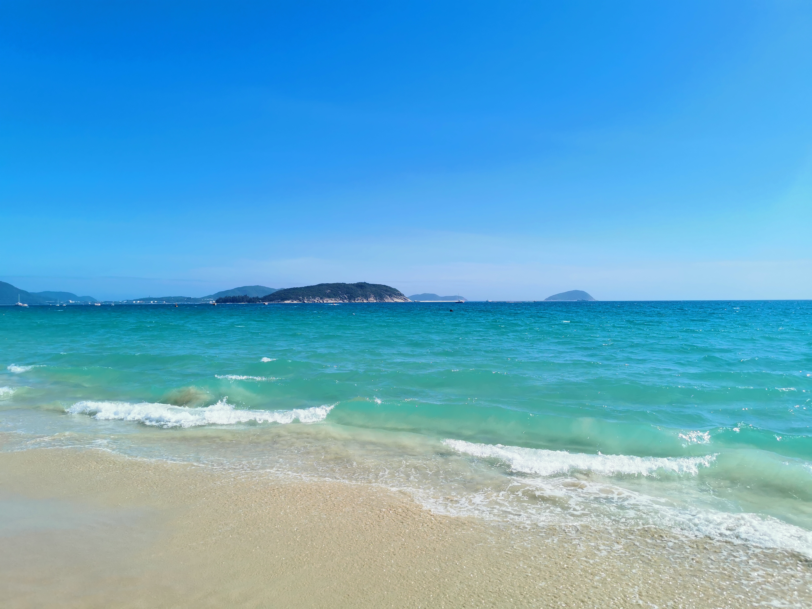

四点多我们离开了亚龙湾，开车一小时去陵水县县城，入住冠军之家伯明顿酒店。它临河，房间很大，设施也不错，一晚只要280，值得【5分推荐】。伯明顿其实是Badminton的音译，它的旁边就是国家队羽毛球训练基地，估计是兼作国家队运动员的宿舍了。

晚上我们走路去了酒店旁一家叫做**一锅糟粕醋火锅**的店吃火锅，值得【5分推荐】。糟粕醋火锅也是海南当地的一种特色美食。这家店性价比不错，三大一小只吃了118块。

但我推荐的最主要原因其实是他们家的橙子随便吃，这种橙子叫做**琼中绿橙**，产自海南岛琼中。这是我两年来吃到过的最好吃的橙子。从海南回来之后我又从京东自营上网购了两箱，大约7块钱一斤，可以肯定是正品。不得不说我们在海南吃到的几种当地水果都是顶级的，还很便宜。

## 第六日

伯明顿酒店的早餐还不错，比前一天吃的好太多了。但是如果去晚了就没啥可吃的了。这天我们计划出发去分界洲岛玩一天，网上订票约117块一张门票。出发前居然在车轮边捡到一个芒果。

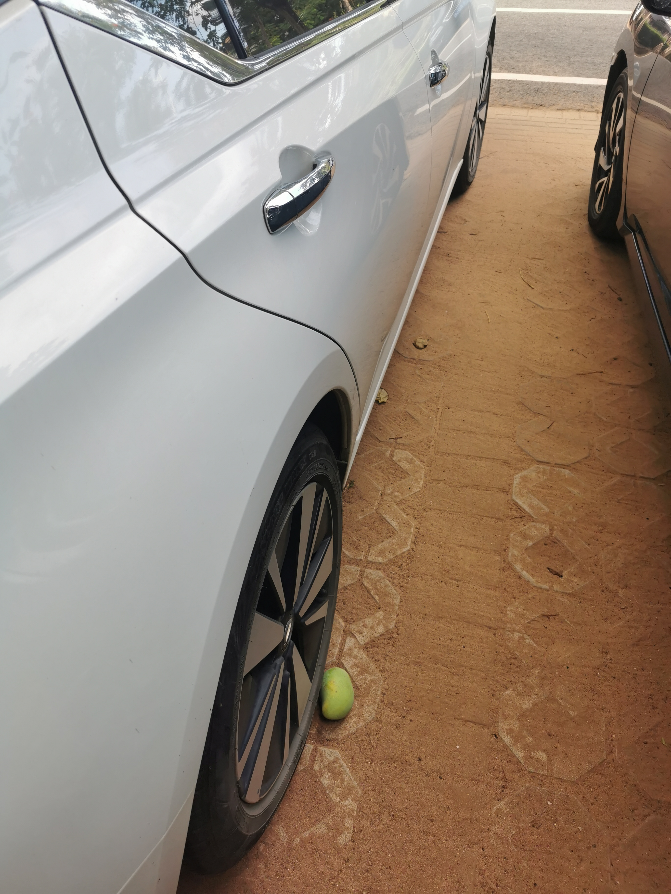

从陵水县城出发去分界洲岛码头只需要20分钟。分界洲岛值得【4分好评】，这应该是海南最早开发的一个离岛。登上岛中最高处遥望南海感觉很不错。这次小孩居然又把大部分台阶走下来了。

中午在岛上吃的炒粉炒饭，一般般，全是味精。但是小朋友饿急了很愿意吃。

下午我们开车去万宁市附近的所谓醉美沿海公路。这条路路况很好，但是基本上看不到海，因为公路和海之间有宽约五十米的防护林，【2分差评】。我们在太阳河河口处看了一下河是怎么流进大海之后就折返去了琼海市。

晚上入住琼海市希尔顿欢朋酒店，【4分好评】，380一间，性价比一般。晚上吃的外卖。

## 第七日

这是我们在海南岛的最后一天了。上午加了一箱油500块，然后去潭门镇的南海博物馆看看。一般般，低于预期，只能【3分中评】。志愿讲解员给我讲了一个多小时，还不错。对小孩来说比较不友好，没啥可玩的。

中午在潭门镇的一家海鲜大排档吃饭，还可以，【4分好评】。188块点了一大堆东西，味道不错。潭门镇是南海渔场的门户，镇上所有的男人都会去南海深处打鱼。所以这个镇上的海鲜应该是最新鲜的，不会坑。大排档的门口就是渔港。

吃完午饭开车一个半小时到了海口美兰机场，女士们买了点化妆品，然后起飞回到无锡机场。

## 后记

文昌市有火箭发射基地，大致位于琼海和海口之间。文昌还有很多美食，以及铜鼓岭等风景区，这次因为多种原因没有去成。

我们回来后不到一周的12月23日晚间就有一发长征7号火箭从文昌发射基地发射升空。这次因为没有提前打探到火箭的发射时间，就没有兑现要带小孩来看火箭发射的承诺了。

总的来说海南不大，适合休闲度假。当然作为冬季旅游热门目的地，坑也是很多很多的。尤其是在三亚，要很小心。我们这次大致走了一个半圆形，每天车程两小时左右，不累人，油费总计520块。这几天的天气很给力。三大一小吃住行总计消费约13000块，其中机票约5000块，性价比还可以。

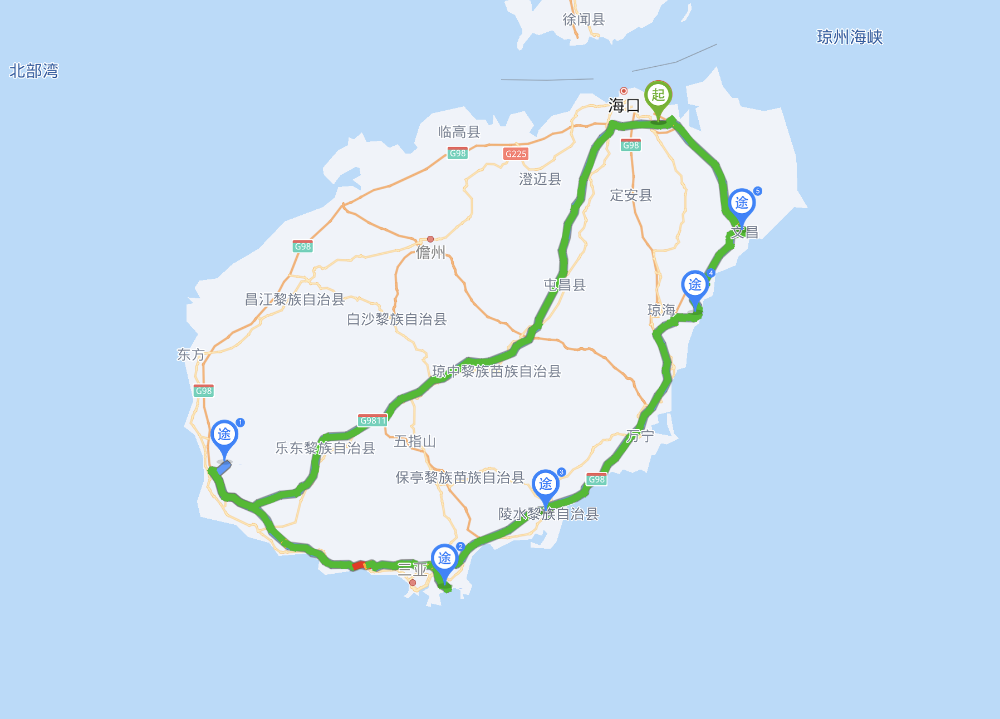

下次来海南一定要去文昌看看火箭发射了。