2023年8月初，我带着父母和儿子去了一趟长江三峡。

暑假的时候，想要去一些比较远的热门的旅游目的地很困难，火车票难买，飞机票昂贵。所以，我把目光锁定在长江三峡这个著名的或者说是老气横秋的内地景点上。一方面，我妈在数月前提起过长江三峡，当时她想和同学一起去那里玩，但是因为一些原因没有成行；另一方面，我妻子此时没有假期，而她在几年前已经去过长江三峡了，我不如趁她不在的时候自己去一次。

一般来说，很多人去长江三峡玩都是乘坐重庆到宜昌的旅游客船。然而，我定然不能接受长时间坐在船上——在我想来那就是坐牢。我仔细研究了宜昌（西陵峡）到巫山（巫峡）再到奉节（瞿塘峡）这一线的景点，设计了一个“一日游”+六天“自驾游”的方案。

## 第一日

我们乘坐动车到达宜昌汇合。不得不说，现在的动车又慢又贵。尤其是我父母**从湖南过来，直线距离不过430多公里，却得耗费5个小时时间以及花360多元买一张车票**。

## 第二日

一大清早，我们就爬起来去码头参加**两坝一峡**旅游团。两坝一峡是宜昌的招牌旅游项目，“两坝”是指葛洲坝和三峡大坝，“一峡”是指宜昌旁边的西陵峡。

上午，我们乘坐客轮从宜昌港出发，穿越葛洲坝船闸，最后到达三峡大坝下游不远处的三斗坪码头。因为早晨起得太早了，而且天气炎热，所以我儿子精神很差。这一上午我的精力都用来安抚他了，没有怎么看风景。下船的时候，我父母说这一路风景还可以。

中午，我们在三斗坪码头吃旅游团的团餐。餐厅里有鲜榨橙汁卖，我们连买了两杯，味道不错——橙汁是我家小朋友的最爱。

下午的行程则是这“一日游”的重头戏——穿越三峡大坝。普通的“两坝一峡”行程会安排游客们在乘船结束之后去逛三峡大坝旁边的公园（185园区等）。我觉得这地面的公园太无聊了，于是提前选择了价钱更高的替代项目“升船机”。

> 三峡升船机承载船型的设计定位主要适应3000吨级大型客轮、旅游船，及部分运送鲜活快速物资货船。据三峡集团人士介绍，三峡升船机一旦投用，这类船舶过坝时间将由通过永久船闸的3.5小时缩短为约40分钟，届时，游客有望不再转车换船，预计每年将为三峡大坝增加600万吨的过坝能力，使长江黄金水道通航效益及社会经济效益得以充分发挥。三峡升船机承船厢可载3000吨级船舶，最大爬升吨位达1.55万吨，最大爬升高度113米。提升重量和高度，均为世界之最。

我们先是乘坐大巴车翻过三峡大坝到达上游的太平溪码头，然后乘船穿越三峡大坝，最后回到下游的三斗坪码头。

当船走到三峡大坝的最里头的时候，我们体会到了什么是“船临深渊”：倘若我们的船再往前走十来米，就会翻过围栏直接掉到一百多米高的大坝下面去了。

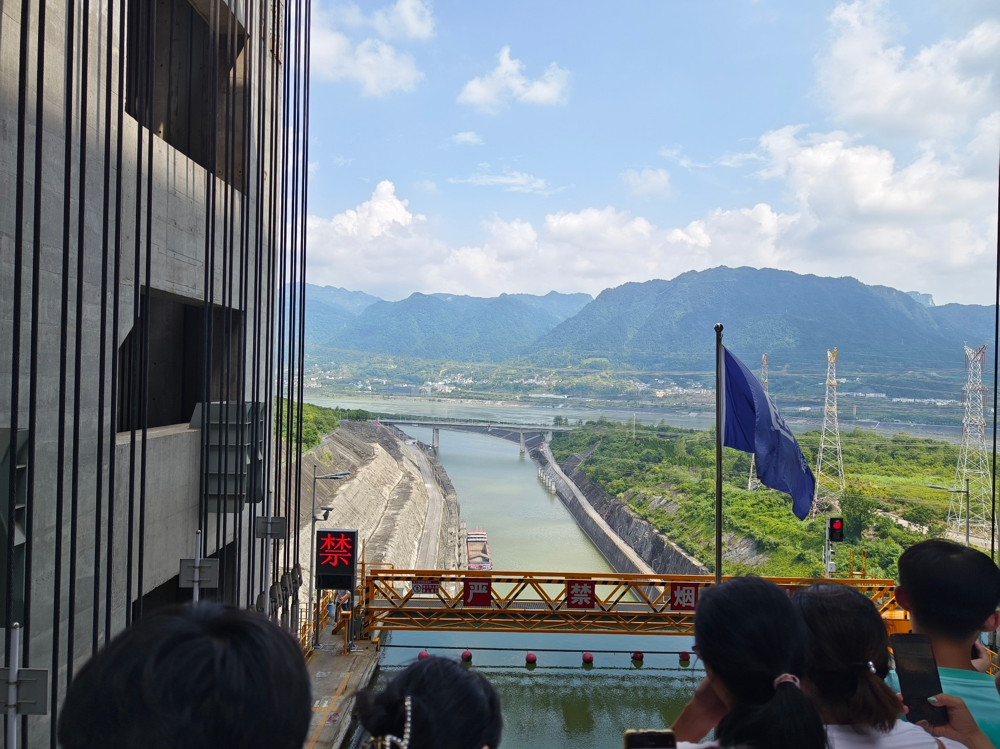

船停下后，慢慢跟着升船机下降到了和下游水位齐平的位置，整个过程耗费了大约半小时。此时，站在甲板上仰望天空，我们就能深切感受到这个建筑奇观的宏伟了。

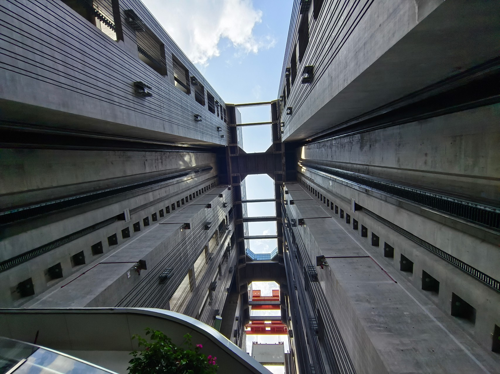

最后，我们从三斗坪码头下了船，乘坐大巴车回到了宜昌市区，结束了“一日游”。

这是我十几年之后再一次“跟团游”，给我的感受就是人太多、时间完全不自由、体验很糟糕。这还只是一天时间。所以，我这辈子都不想再“跟团游”了。

## 第三日

我们租了一辆沃尔沃S90，开启了六天时间的“三峡-恩施小环线”自驾。

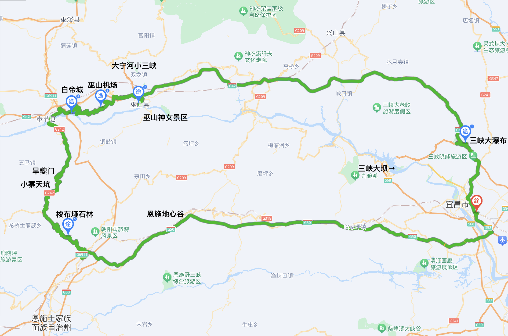

离开宜昌的第一站是**三峡大瀑布**，它位于宜昌市区北面车程一个小时的地方。

由于暑假人很多，景区的管理比较混乱。我们到达景区之后一个多小时才成功坐上景区交通车往峡谷里头走。这个峡谷的最深处就是大瀑布所在的地方。下了景区交通车，还需要走大约一个多小时，才能最终看到大瀑布。还好一路上有不少玩水的地方，我儿子不至于太无聊而不愿意走。

<video src="./photos/三峡大瀑布.mp4" width="auto" controls></video>

大瀑布很震撼，我从来没见过这么高的瀑布。

我掏出提前准备好的全封闭式雨衣分发给大家。有了雨衣，我们就不怕被瀑布打湿了。

从瀑布的下面穿过去之后，我儿子说太刺激了，他还想再走一次。可是因为穿越瀑布的路线非常狭窄而且是单行道，我们没法紧接着再穿越一次。

从瀑布底下出来之后，很快下起了大雨，我们拖着疲惫的双腿走出了公园。

在酷暑时节来到这里真是太合适了，丝毫不用担心小朋友玩水着凉，但一定要记得提前带好拖鞋和雨衣。景区的管理值得改进；景区大门口附近停车也很不方便。当我们开车从景区大门口往大路上走的时候，进景区的方向上堵了有好几公里长的车。

之后，我们走了两个多小时高速公路到达了巫山县城，入住巫山两江红叶假日酒店。这家酒店坐落在巫山县城最低处，背靠大宁河流入长江的河口。站在酒店房间的阳台上，能看到很不错的风景。比如，大宁河绿色的河水和长江黄色的江水相交的地方泾渭分明；又比如天黑之后江面上的风云变幻。

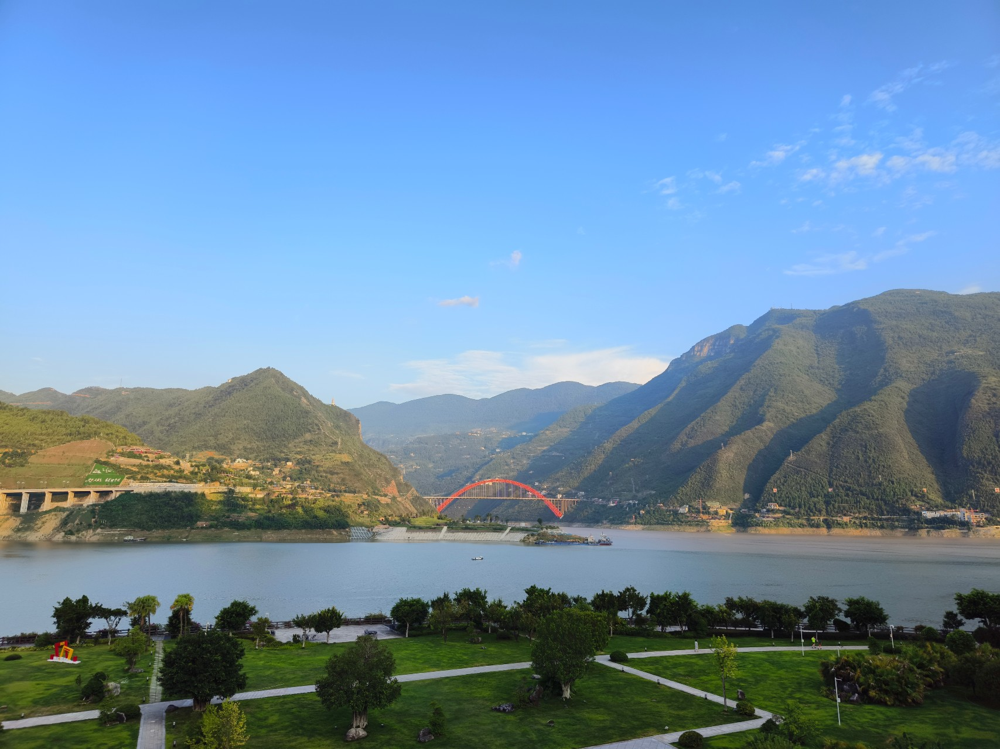

## 第四日

这是在巫山县游玩的第一天，我安排的是去**巫山神女景区**一日游，然后回来继续住在巫山一晚。

这个景区在神女峰附近的山上，由于交通不便，来的人很少。它的门票本身并不贵，但是景区搭售了各种索道、电梯等等交通设施，一套下来也要每人一百多块了。

一开始是坐景区交通车走一段临峡谷路段——这段路其实很适合自驾游，可惜被这个景区给圈起来了。这段路上风景还可以，能俯看幽深的峡谷，也能远眺巫峡。这脚下的峡谷则是一条长江的小支流，并不是长江本身。

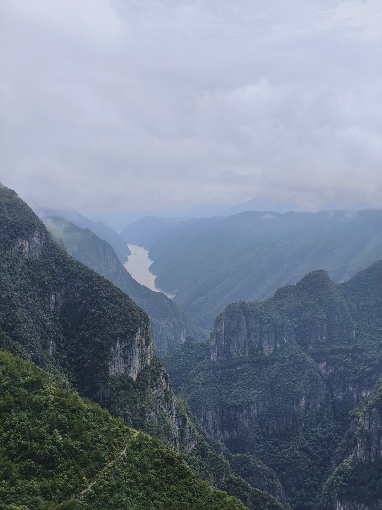

然后就是坐索道，再坐电梯，最后再坐一段索道下到谷底。

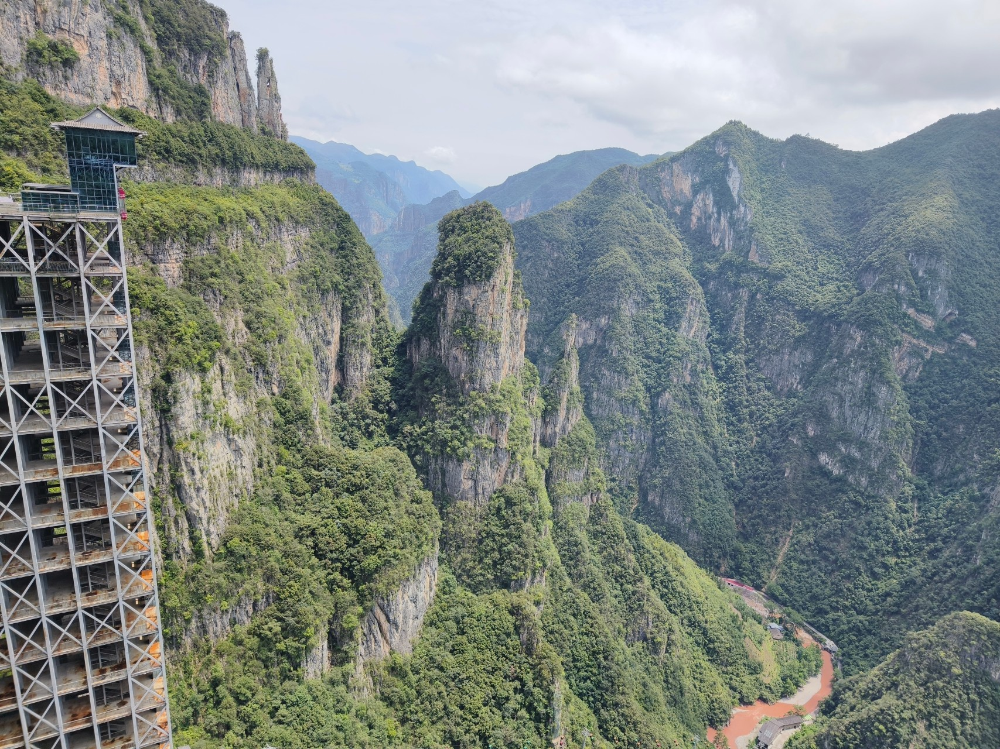

可是谷底啥都没有，就是一条小河而已。然后我们又坐索道，再坐电梯，最后再坐一段索道上到山上，全程都是走回头路。

总之，这个景区内的交通有点莫名其妙。可能最早这个景区的编排是让游客下到谷底之后坐船漂流，走水路回到巫山县吧。那样会更有意思一点。

## 第五日

上午，我们去了著名的**大宁河小三峡**。和宜昌的两坝一峡游船一样，一路上我并没有感觉到惊艳之处。

下午，我们从巫山县去往奉节县。如果走高速公路，只需要一个小时。我们选择了走国道，经过**巫山机场**和奉节的**三峡之巅**景区。巫山机场在两县之间的一座高山上，是削平了山顶而建成的。我们一路上山，视野越来越开阔，渐渐可以看到巫峡和瞿塘峡之间的这段宽敞的谷地。到了巫山机场，我打开航旅纵横APP，发现马上有一驾飞机要降落，于是叫醒正在午睡的儿子，打算去看飞机降落在山顶上的奇观。可惜的是我判断错了飞机降落的方向，看到飞机时他已经落地滑行了。我拍摄的照片记录下了这一刻，照片的最左边是山顶机场，照片的右边是长江谷地。

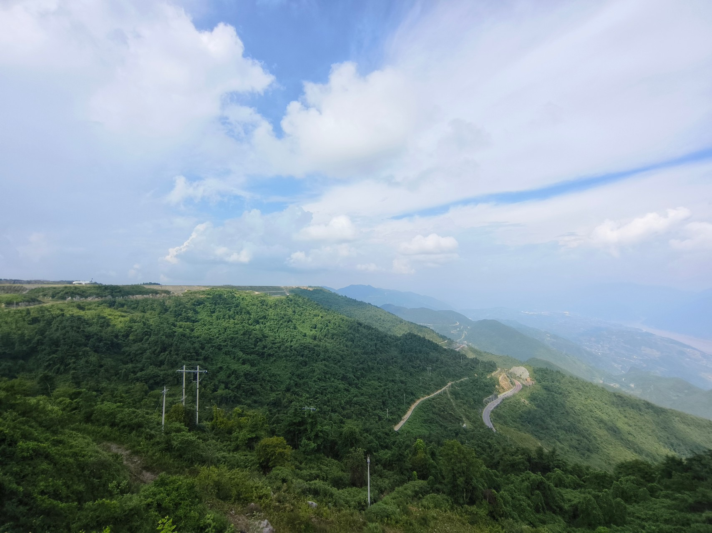

到了三峡之巅景区门口，我儿子因为睡觉被我吵醒发了脾气，不肯进景区了。我很无奈地放弃了这个可以登高望远的景点，继续开车沿着公路往山下走。在一个岔路上，我发现了一个叫做**坳口景观点**的免费观景台。

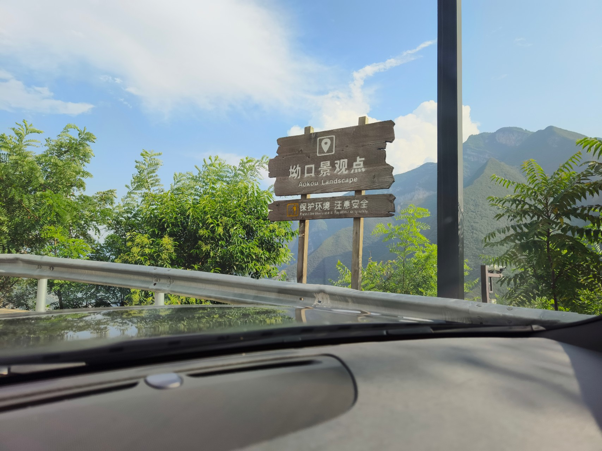

在这里可以俯看瞿塘峡和夔门，颇为壮观。

站在观景台往奉节县城方向看，是白帝城；往下看，是夔门；往瞿塘峡的方向看，左侧的山峰就是三峡之巅景区所在的**赤甲山**，右侧的山峰则是**白盐山**，瞿塘峡就是被这两座高山所挟持。

<video src="./photos/坳口景观点风景.mp4" width="auto" controls></video>

三峡之巅景区门票价格大约为40元，并不算贵。但是三峡之巅景区对面的白盐山同样也有观景台，而且是免费的。如果是丝毫不想被圈钱景区恶心的自驾游爱好者，可以开车导航到**三峡日出**这个点，就能看到同样壮丽的景色了。

总之，从巫山到奉节的这段国道，是非常棒的自驾游公路，值得每一个自驾游长江三峡的游客体验。

晚上，我们住在夔门大酒店。酒店在网上的评价一般，但我觉得还行；站在酒店房间的阳台上可以直接看到夔门。

## 第六日

来到奉节，肯定要去打卡这里最著名的景点**白帝城**。白帝城本来是一个小山头，但是三峡水库蓄水之后变成了一个小岛。

上午，我们过了大门之后走了很长一段廊桥才真正进到了景区。暑假时分，这种景区最大的特色就是人多。我们跟着人流爬了一段上山的路，路边有很多摆玩具摊的。我儿子就此发挥他逛街的特长——只玩不买。

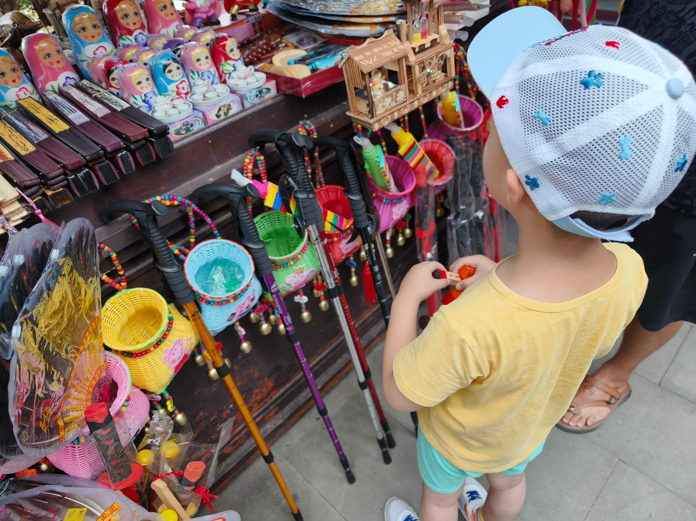

走到山顶，大概是白帝庙里面，我们看到景区摆了一些人偶再现白帝城托孤的场景——我的评价是粗制滥造。

我儿子不懂三国里的故事——三国里他只听说过曹操，不认识刘备或者诸葛亮——所以我也没法讲解给他听。

下了山，就走到了另一头望向夔门的位置，许多人在这里打卡人民币十元上的景观。

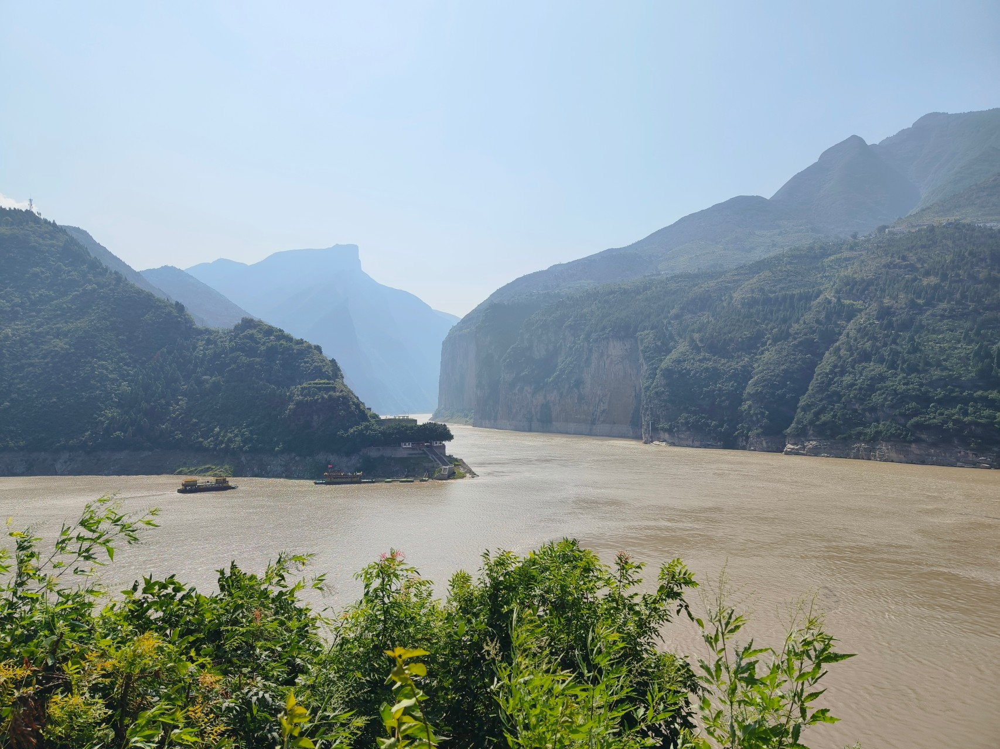

然后就是坐船到夔门旁边，也就是我们昨天去过的坳口景观点的正下方。这里展示有夔门古象，还有一堆杂七杂八的民俗相关的亦或是军事相关的东西。

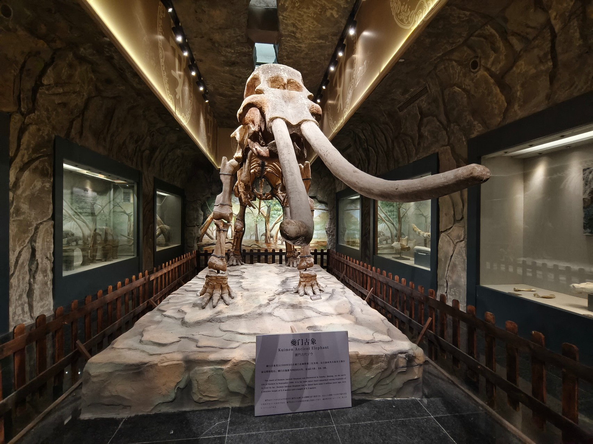

据说沿着长江边一直往前走能看到猿猴，不知道是野生的还是景区为了应和“两岸猿声啼不住”而饲养的。因为此时已近正午，天气十分炎热，我们选择了就此返程。

下午，我们驱车去往恩施。我们从湖北到了重庆，然后又将回到湖北。

路上，我们经过了如世外桃源一般的**旱夔门**。可惜由于要赶路，我没有选择去这两片奇特的山跟前看看，只是在公路上远眺了一下。

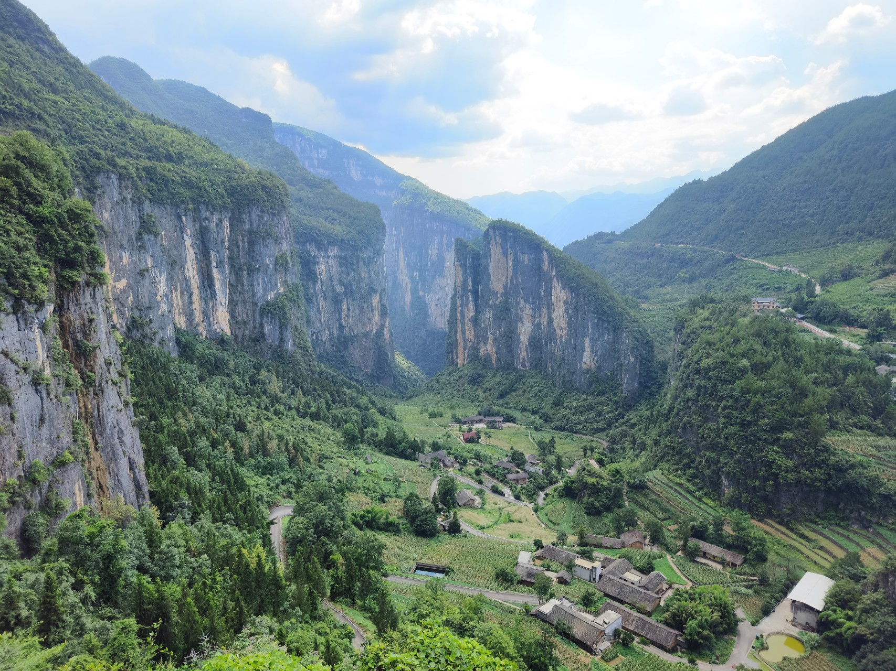

值得一提的是，在这公路旁的观景台上买到的李子既便宜又好吃。

过了旱夔门不远就是世界上最深的天坑——小寨天坑。这里本来已经建成了景区，可现在不知为何关闭了。我没有提前做功课，再加上我儿子睡着了，就没有考虑去天坑旁边一探究竟了。

事后，我研究了一下卫星地图，发现很有可能有一条没被封闭的道路通往天坑旁边。具体路线我标记在下面这张地图里面，供感兴趣的自驾游爱好者参考。由此，没有去看看小寨天坑也成了我此行最大的遗憾。

晚上，我们到达**梭布垭石林**景区附近的民宿，沿途在重庆和湖北交界的地方看到了一座名字非常奇怪的山，叫做十三姓人大山。正值盛夏，山口上的小村庄里有非常多的人来避暑。

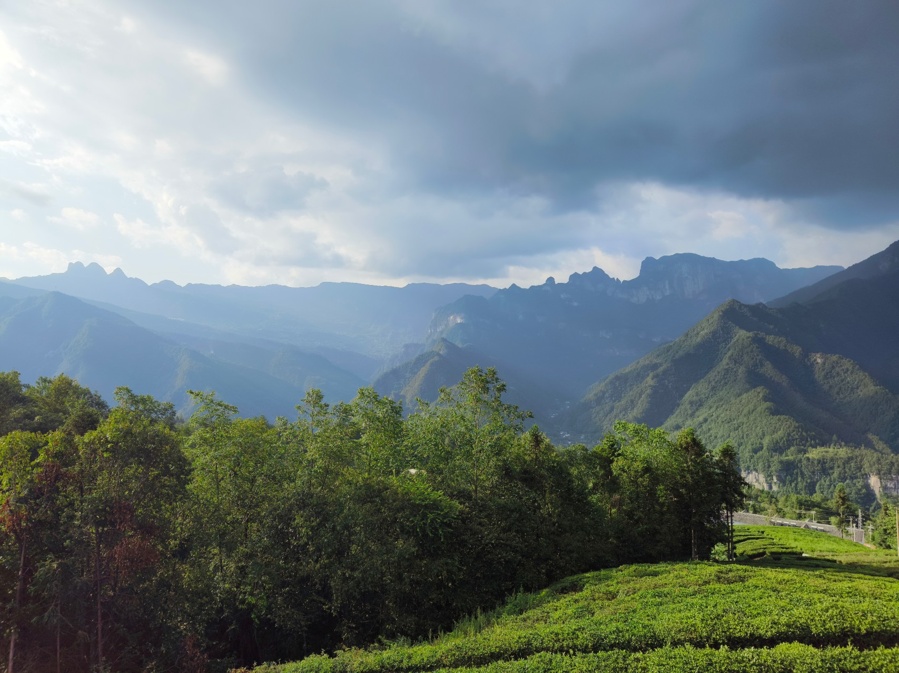

## 第七日

上午，我们打卡恩施的梭布垭石林。这里景色还可以，就是玩起来比较费腿。

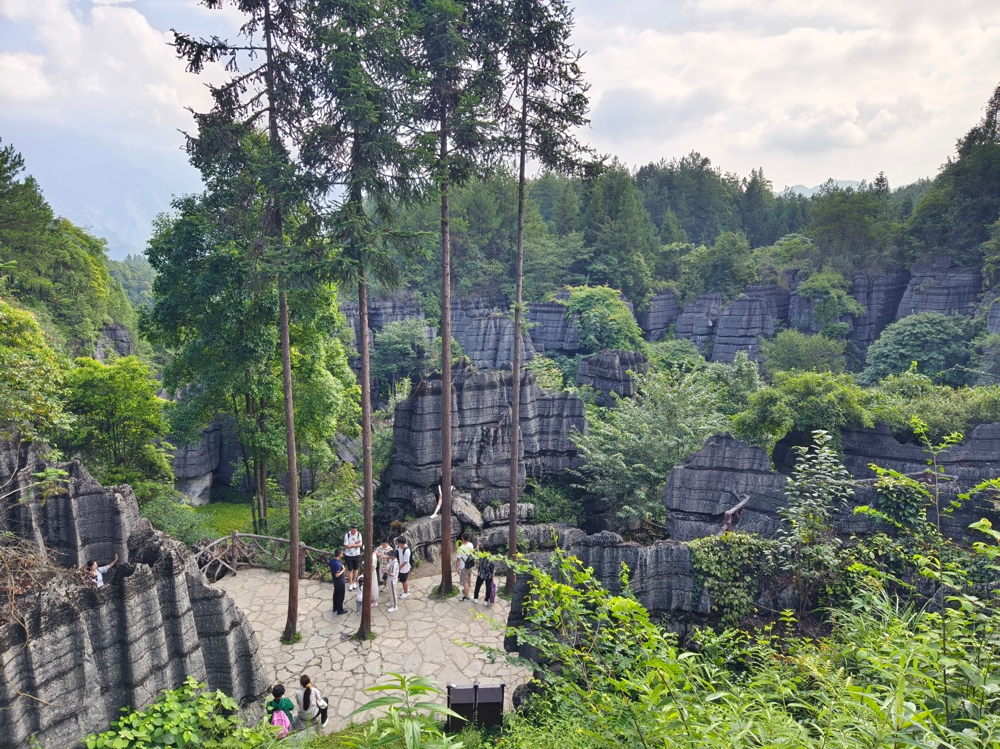

我们穿梭在各种狭窄的石林缝隙中，可以看到各种别有洞天。

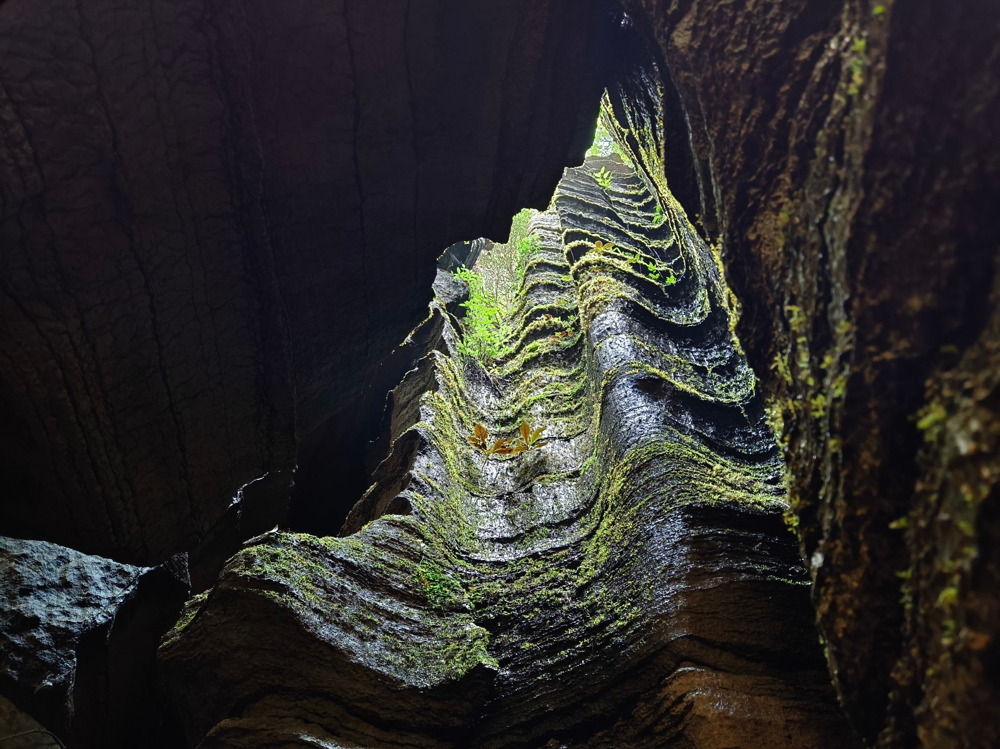

这里是恩施打造的318国道沿途景点之一。

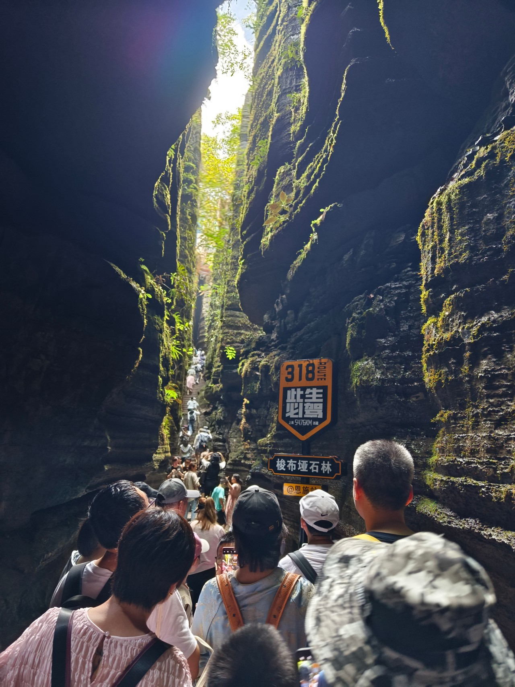

走了两个小时我们就走不动了，决定出景区，然后下午开车前往**恩施地心谷**所在的高坪镇。

## 第八日

上午，我们打卡恩施地心谷——没想到这个景点比梭布垭石林更费腿。这个景点的地貌和梭布垭石林有点像，只不过谷底下有条河。据说以前这里叫做“石门河”，因为没什么人来才改叫恩施地心谷。

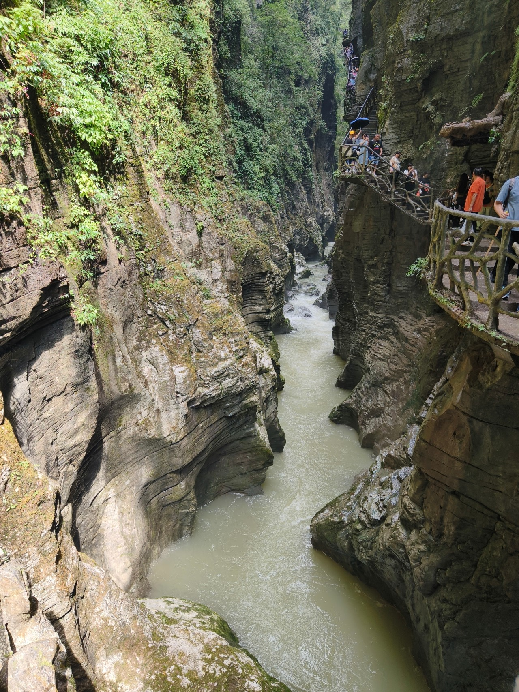

可惜的是，我们看到的河水是浑黄的，因而这个峡谷丧失了许多美感。如果是秋天来，应该可以看到翡翠色的河水。

下午，我们驱车返回了宜昌，然后乘坐动车前往武汉。

## 第九日

出门旅游的最后一日，我带着儿子去湖北省博物馆看了他一直念念不忘的**越王勾践剑**。

总结下来，我设计的这条小环线景色还不错。但是暑假去其实并不合适。如果是秋天去，你可以看到碧水蓝天、巫山红叶，还不用看人山人海，体验会好很多。

那么暑假去宜昌附近应该去哪些地方呢？我觉得可以先经过三峡大瀑布，然后去神农架避暑。