今年国庆假期连放8天，从9月29日开始，到10月6日结束。由于是不管疫情之后第一个国庆长假，出远门旅游成为大热。

9月份我在知乎上写了一篇[《如何低成本地在公共假期进行一次自驾游》](https://zhuanlan.zhihu.com/p/657710042)，想着在国庆长假再次实践一下自己的总结的方法。

没想到现实光速打了我的脸：我所候补的四程火车票无一兑现——也许是因为我只买软卧的需求太苛刻了。

好在我及时发现了从长三角去新疆的低价直飞机票，于是开启了我们的第一次新疆自驾之旅。

去程机票是长假第二日，票面价700元。而回程机票只有长假倒数第二日或者长假过后一日才有。所以我们计划10月7日休一天假，用来乘坐回程的航班。回程航班票面价900元。总共还是8天旅程，4人往返机票总价接近8000元。在国庆假期，这已经是非常非常低的价格了。

9月中旬北疆阿勒泰就已经是大热，从抖音上已经屡屡见到去喀纳斯的游客吐槽糟糕的景区体验。虽然我也向往秋天的喀纳斯，但是自由价更高，我不愿意把自己的假期交给一个不靠谱的景区。所以，我们最终决定去伊犁逛一圈。

虽然很多人说伊犁秋天草黄了，没那么好看了，可是我不信邪。我这次就不打算去看草原。作为一个自驾游爱好者，我相信任何一个风景优美的地方，秋天永远都是它最美的季节。为此，我规划了一条尽可能景观丰富的路线。我对家人说，我们不要有过高的期待，就当是假期散散心。由于我们的机票价格很低，航班时刻很好，所以这次出远门肯定不亏。

## 成行路线预览

|日期|上午|下午|住宿|
|-|-|-|-|
|9月30日|无锡机场起飞|石河子机场落地|石河子市爱派国际酒店|
|10月1日|玛纳斯河、肯斯瓦特水库|S101、安集海大峡谷|独山子西戈玛国际酒店|
|10月2日|等待独库公路开通|独库公路、唐布拉百里画廊|新源县海川大酒店|
|10月3日|赶路|库尔德宁自然保护区、恰甫其海|特克斯县亨通国际酒店|
|10月4日|赶路|昭苏玉湖、向日葵田|昭苏县江苏国际大酒店|
|10月5日|伊昭公路|喀赞其民俗街|伊宁市伊犁宾馆|
|10月6日|果子沟、赛里木湖|赶路|石河子市恒和华星大酒店|
|10月7日|石河子市内农贸市场|石河子机场起飞|家|

# 9月30日

我们7点多赶赴无锡机场，一路上很堵，一度我都担心来不及值机。还好及时赶到，并且无锡机场给了我们经济舱第一排的黄金位置。原计划上午10点的飞机延误到了11点起飞，但这并不影响我们出门的心情。

飞机路过青海时，我们从窗户里看到了**祁连山**和祁连山主峰团结峰背后的**哈拉湖**。

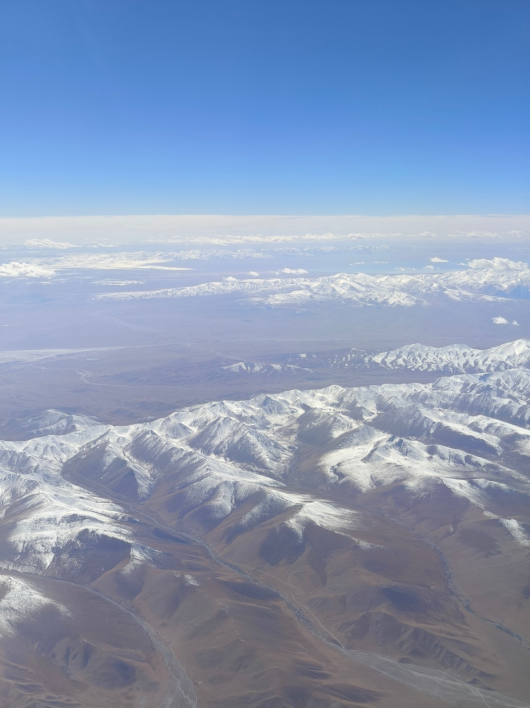

虽然没有看到壮阔的青海湖，但是我看到了曾经想去而没去成的哈拉湖，也算是小小地弥补了遗憾。

飞机快要落地时，我们也看到了连绵的**天山**。

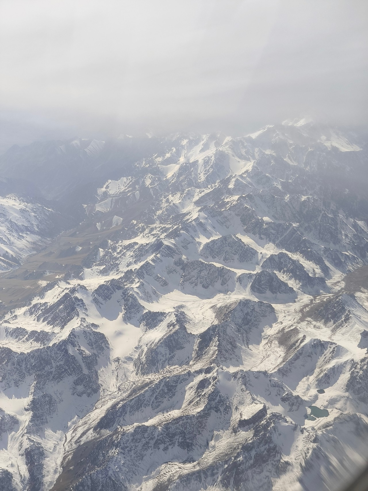

大约16点我们才下飞机。我们从石河子市一家小公司租了一辆大众朗逸，租车公司要求上门取车，不提供机场送车。由于我们是临时等到机票降价才租的车，所以完全没得选。等我取到车之后，并且开着车去吃饭、购物之后，才感觉车内有一股气味散不去，遂决定和租车公司商量换车。最后，在我以退租相要挟的情况下，店家答应给我换一辆起亚K2。最终看来这是一个无比正确的决定：这辆起亚K2是高配，有倒车影像和自动大灯，在廉价小车里算是体验还不错的。按照租车公司的说法，这辆起亚K2本来已经租给别人了。事后想来，估计是因为我是从携程上下的单，并且提出以卫生原因而要求退租——这个理由属于携程的交车承诺之一——所以租车公司才退而求其次给我换一辆车。

这趟行程中，租车方面的最终花费大概是：租车费1600元 + 油费700元 + 100元划痕赔偿 = 2400元。租车租了那么多次，这是我第一次在不知情的情况下被人蹭了一道。还好租车公司很好商量，只要求一百元赔偿。

# 10月1日

省道S101已经是著名的网红公路，它大致从乌鲁木齐到独库公路北入口处。S101太长了，我家这帮老弱妇孺自驾一天肯定玩不过来。

但我们恰好可以从石河子出发，先南下肯斯瓦特水库，再沿着S101向西到达安集海大峡谷南面，穿越安集海大峡谷底部，最后从安集海大峡谷上面抵达独山子。相当于一天之内玩S101的西边一半。至于东边那一半，这次不顺路，下次再来玩吧。

中午，我们刚到**肯斯瓦特水库**时，天气有点阴，水的颜色很漂亮，但周围不明艳。过了一阵，太阳完全从云层后冒出来时，水库的景色还是惊艳到了我。水库周围的山体在阳光的照射下棱角分明，极具肌肉感。

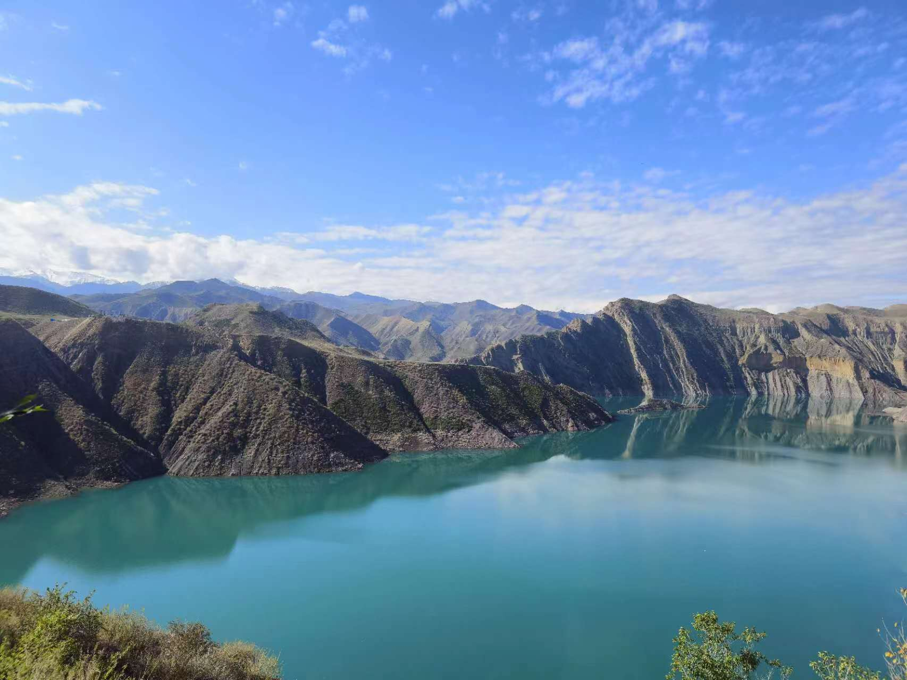

肯斯瓦特水库已经有景区正在建设，有一条索道正在连接到水库对岸高地上。估计最快明年就要正式成为景区，向公众收费了。

从肯斯瓦特水库下来，我们又在**玛纳斯河**旁边玩了好一阵水。

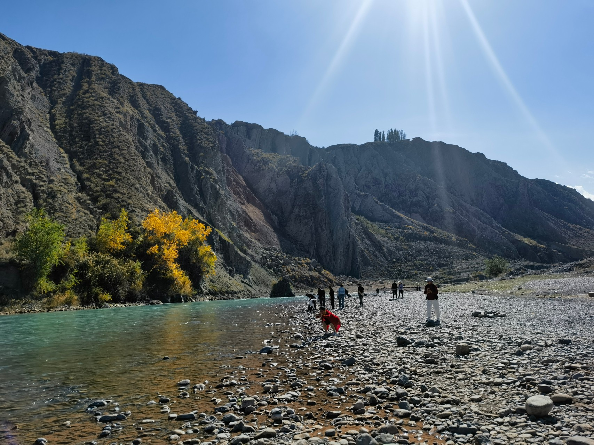

这时，已经有不少走全线S101的游客从乌鲁木齐出发到达了我们所在的位置。河边的游人不断，但又远没有达到拥挤的程度。这个体验真的是远好于在假期去中东部地区任何一个知名景区。

然后我们就沿着S101赶路去**安集海大峡谷**的南面。

我们刚离开S101，就遇到大约20公里的非铺装路——小轿车走这种路总是要提心吊胆。经过一个煤矿之后，路况就变好了一些。

走到安集海大峡谷谷底的时候，两侧的悬崖相当震撼。我们甚至在谷底发现了一头摔死的牛和一头也许是被猛兽咬死的羊的尸体。

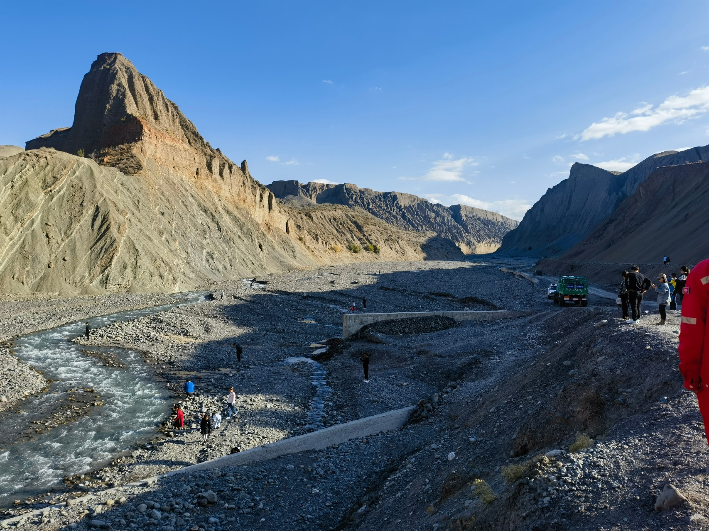

在谷底逗留了不短时间之后，我们又来到了峡谷上方的“库尔喀喇乌苏大峡谷”打卡点俯瞰大峡谷、远眺天山。傍晚的景色相当震撼！

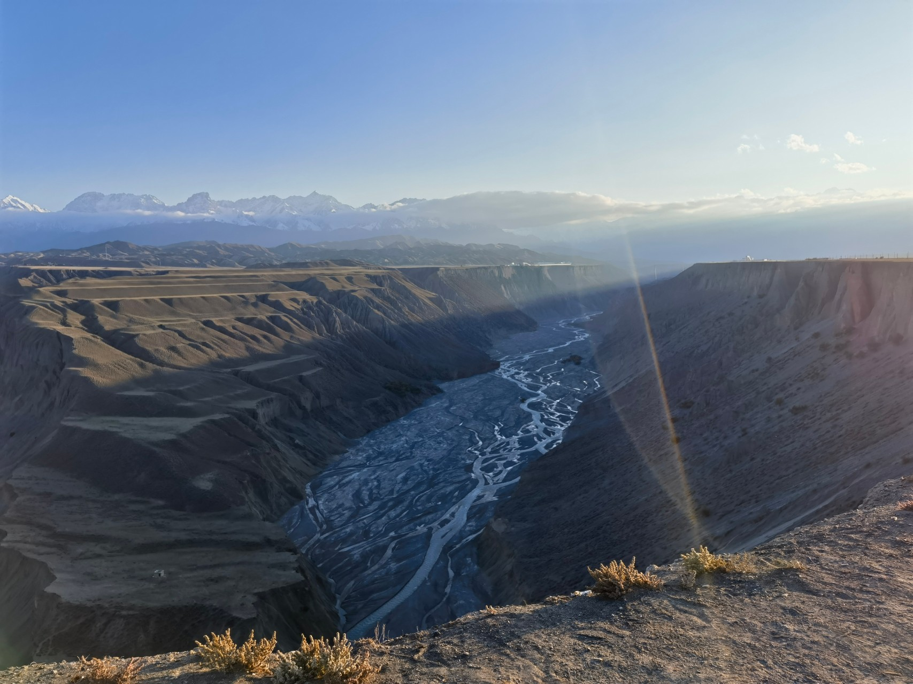

这个打卡点有很多游客，同肯斯瓦特水库一样，景区建设也已经初具规模，估计最快明年就要正式变成收费景区了。我们也真是没想到一天之内就玩了两个马上要收费的景点，大家都感觉这个国庆长假来这里来得及时。

此时已近日落，我们又开了一个小时的车才到达位于独山子的酒店。我的家人说，今天一日所览，就已值得乘坐五小时的飞机了。

# 10月2日

一早起来，天气很好；清晨的小城独山子宁静而安逸。

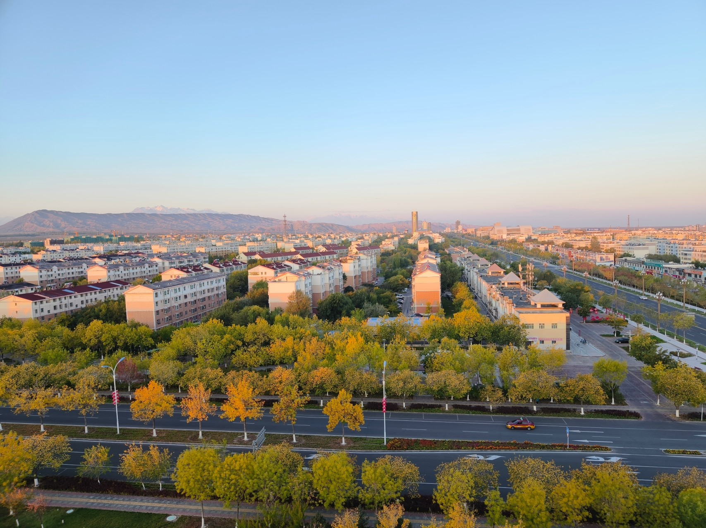

作为一个自驾游爱好者，我计划今日朝圣**独库公路**。

通过关注“平安独山子”公众号，我得知昨日独库公路上午封闭到11点；且在18点之后，由于塌方风险继续封路。因为主管部门承诺保通独库公路到10月10号，我认为一天之内它肯定会解封，所以打算一早先去山脚下排队。

离山脚下还有好几公里的地方，车辆就排了两公里的队伍，全都是等着进独库公路的。我和儿子在路边玩“击剑”——谁先用矿泉水瓶碰到对方的肚皮就算赢。他的演技不错，一旦被我碰到肚皮，就立马躺在马路上。

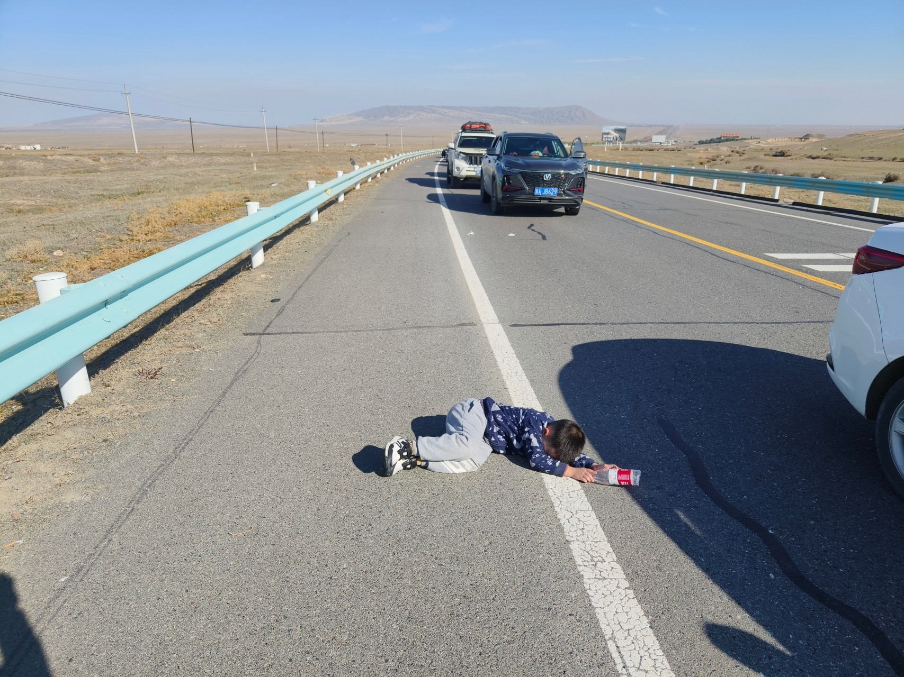

直到中午12点，仍然没有解封。我们打算先回到独山子吃午饭，如果吃完饭独库公路解封了，我们就按原计划走独库公路到新源县。如果没有解封，我们就反转行程——先走高速公路，经过赛里木湖到达伊宁或者可克达拉住宿。

吃完饭，“平安独山子”公众号上仍然没有消息。但是通过“伊犁交警”这个微博号，我得到了发布于13点16分的独库公路解封的消息，振奋不已。

一路向南，独库公路逐渐解开了她的面纱，露出了她震撼人心的一面。站在山脚下，恍惚之间我似乎来到了稻城亚丁。开阔的山谷又让我们感觉来到了指环王的世界。

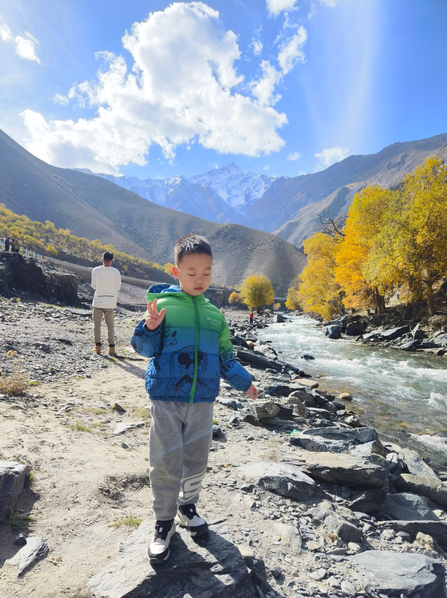

一路上到**天瀑**旁边，又是惊鸿一瞥。最后，我儿子拉着我们在*哈希勒根隧道*附近玩雪玩得久久不肯离去。

但是上午封路耽误了我们太多时间，我们不得继续赶路。

从乔尔玛下来之后，我们向西赶往新源县。秋天傍晚的**唐布拉百里画廊**美得让我们说不出话来。

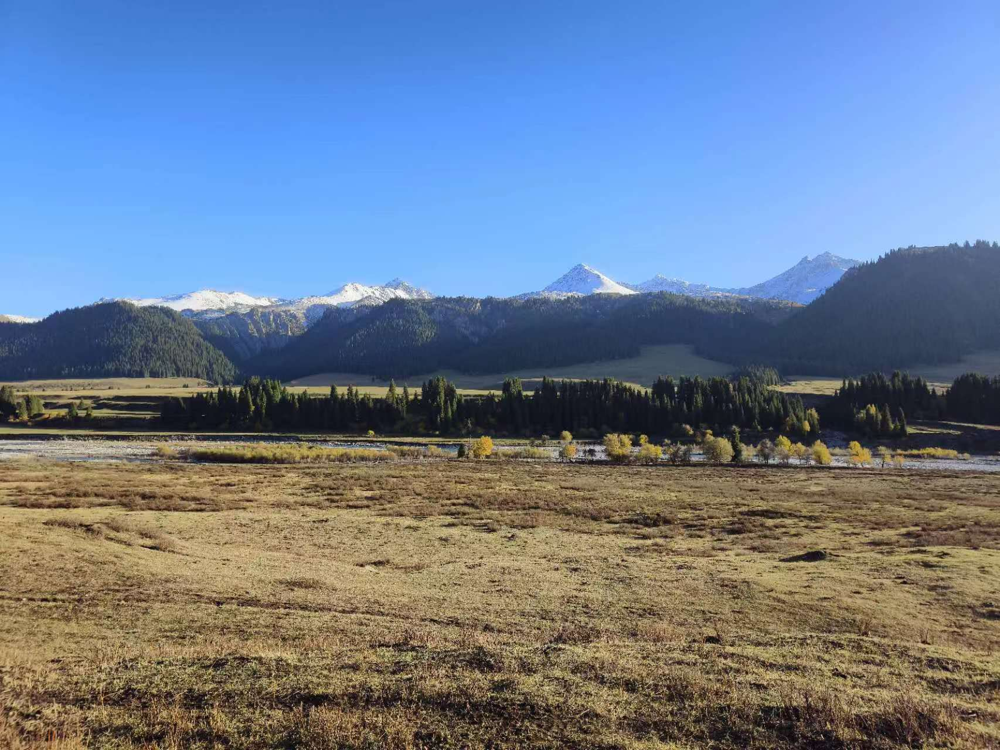

可惜由于需要赶路加上一路上停车点极少，我们没有留下什么好的照片。

天黑之后走了好一段夜路，我们才达到新源县的酒店——新源县已经是独库北段出来之后最近的县城了。

# 10月3日

今日计划去**库尔德宁**景区。从新源县到达库尔德宁景区按照常规走法需要绕行一大圈。

但是当我们来到*肖尔布拉克村*这个位置时，发现有一条新修的公路向南可以快速到达库尔德宁景区附近。这条公路提示“此路没有验收，走此路者后果自负”——一般这就意味着沿路不会有摄像头抓拍违章什么的，我们可以放心大胆地走。

经过此路翻过一座小山之后，就恰好到达了库尔德宁景区的自驾出口位置。我们老老实实地去了公园入口，买了票，验了票进到了景区。从景区大门进去不远有所谓的*十里画廊*，乏善可陈。

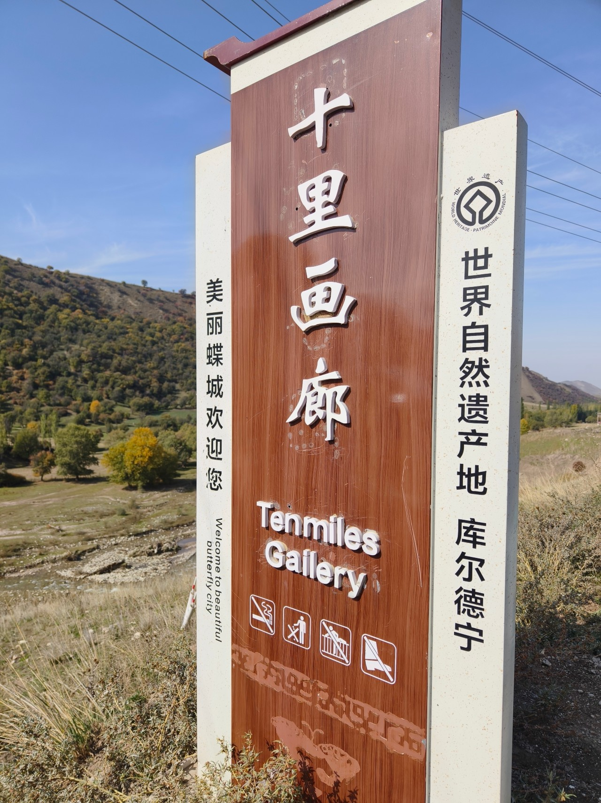

但在十里画廊的标牌上，景区也清晰地表明了自己的高贵身份——**世界自然遗产地**。我总是跟别人说，你们要出门旅游，不要相信什么5A景区，真正最值得去的就是世界自然遗产。世界自然遗产绝对不会坑你，全中国只有不到20家。

> 2013年6月21日，新疆天山的托木尔峰（阿克苏地区）、喀拉峻—库尔德宁（伊犁哈萨克自治州）、巴音布鲁克（巴音郭楞蒙古自治州）、博格达（昌吉回族自治州）4个片区以“新疆天山”名称成功申请成为世界自然遗产，成为中国第44处世界遗产，申报面积5759平方千米。

在十里画廊耽误了一点时间之后，我打算直奔*齐梦德观景台*去玩玩骑马。但是此时我儿子坐车睡着了，等了他一个小时之后我们才骑马上山。

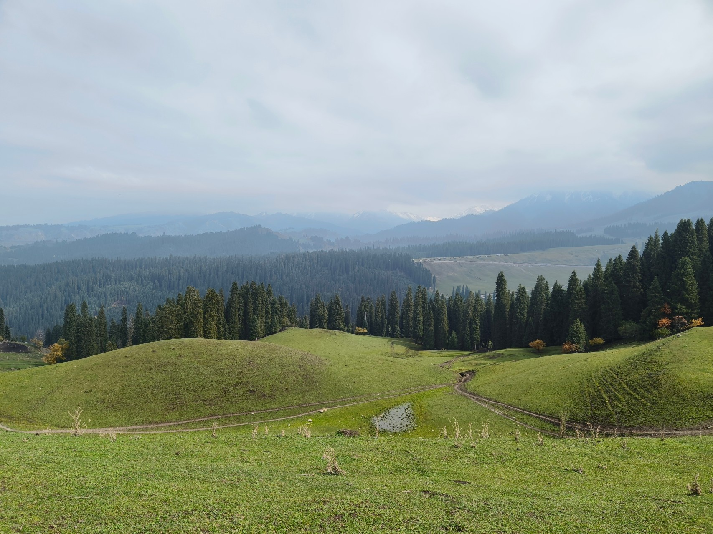

马行大约40分钟到达观景台。站在齐梦德观景台上远眺，发现这里的草原大体还是绿的。可惜今天天气有点阴，光线和视野都不够好。

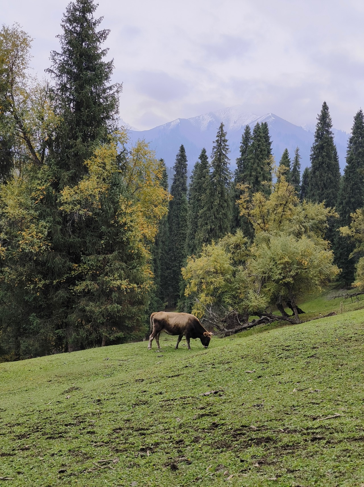

下山时，我们没有走栈道，而是直接穿越云杉林。一路上看到了不少蘑菇和动物，颇为有趣。

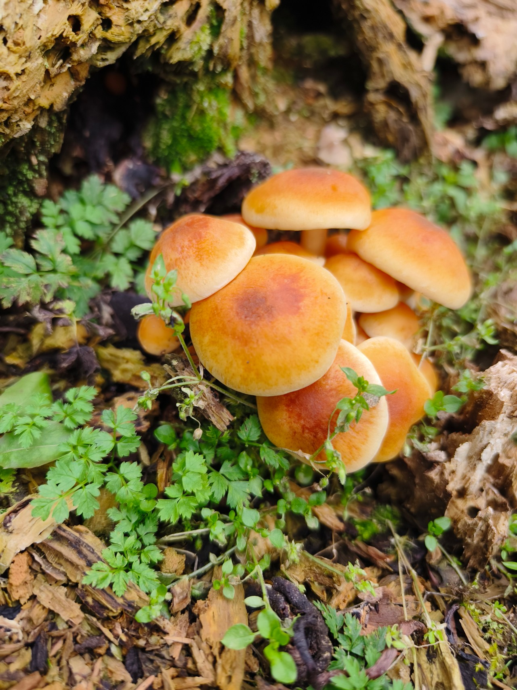

最后，我们按照景区的要求走单行线，沿着东沟出来。东沟是一条绝美的河谷，也只有在秋天才能看到这种彩林河谷。可惜由于今天一直阴阴的，光线不好，我们没有留下一张好的东沟的照片。

但因此我也确信那些由于秋天草原不绿就放弃来伊犁的人，是捡了芝麻丢了西瓜。

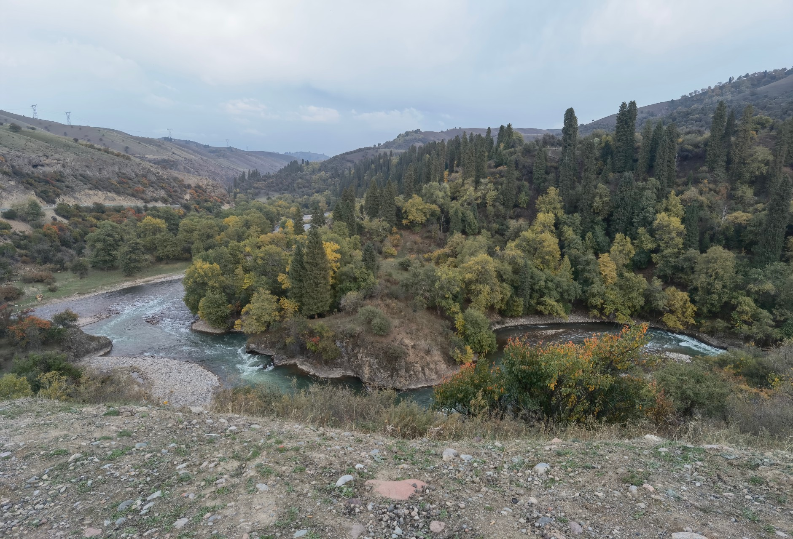

晚上七点多，我们在库尔德宁镇吃过晚饭，才继续赶路去特克斯县。沿途经过恰甫其海时天色已黑，遗憾地错过了沿途的风景。如果不是因为所预定的酒店不能退定，我会选择就近住下，第二天再经过恰甫其海。

> 恰甫其海位于巩留县城东南38公里，是一个集控灌、防洪、发电、渔业、观光为一体的新疆重点水利枢纽工程，党和国家元首、政要都曾来此地考察。恰甫其海水库是一个集灌溉、发电、旅游、水产养殖为一体的综合大型水利建设工程，该工程开始蓄水后，形成58平方公里的库区水面,，它一河贯峡谷、一坝连两湖的壮美景观在伊犁河谷生态旅游资源中独显魅力，宏伟的建筑，高耸的堤坝，险峻的峡谷，宽阔的水域，构成了“高峡出平湖”的大景观，堪称“西域小三峡、新疆第一库”。
恰甫其海景区位于八卦城以东48公里处，临近特克斯“乌孙——夏都”旅游景区，它以雄伟的乌孙山山脉为背景，东倚西天山国家级自然保护区，南临一级冬夏草场喀拉峻大草原。

# 10月4日

今日我总算把计划的行程放松下来。我们上午先去**昭苏玉湖**，然后下午再回到昭苏县。不做其他安排，路上开车时间大约三小时。

昭苏玉湖又称斯木塔斯湖，也是一个水库。

> 斯木塔斯水电站，葛洲坝集团在疆投资的第一座水电站。2009年开工建设，2014年投产发电。斯木塔斯水库形成的变色湖，被当地政府打造为网红景点。

两年前我在做伊犁环线夏塔景区相关计划的时候就在卫星地图上注意到了这个地方，并且认为这个点可以作为去夏塔景区路上的一个顺路景点。

我没想到短短两年内这个野景点就变成了景区。我们到达的时候发现路的尽头就是一个停车场，所有的车都只能停在停车场，游客只能走栈道去一个半山腰的观景台。还好目前这个景区仍然是免费开放的。

爬了大约二十分钟木栈道之后我们到达观景台。

我们看到的玉湖的颜色是那种亮蓝色。我跟家里人说，你们把前两天看到的河谷彩林和这个湖结合在一起想象，那就是喀纳斯的样子了。

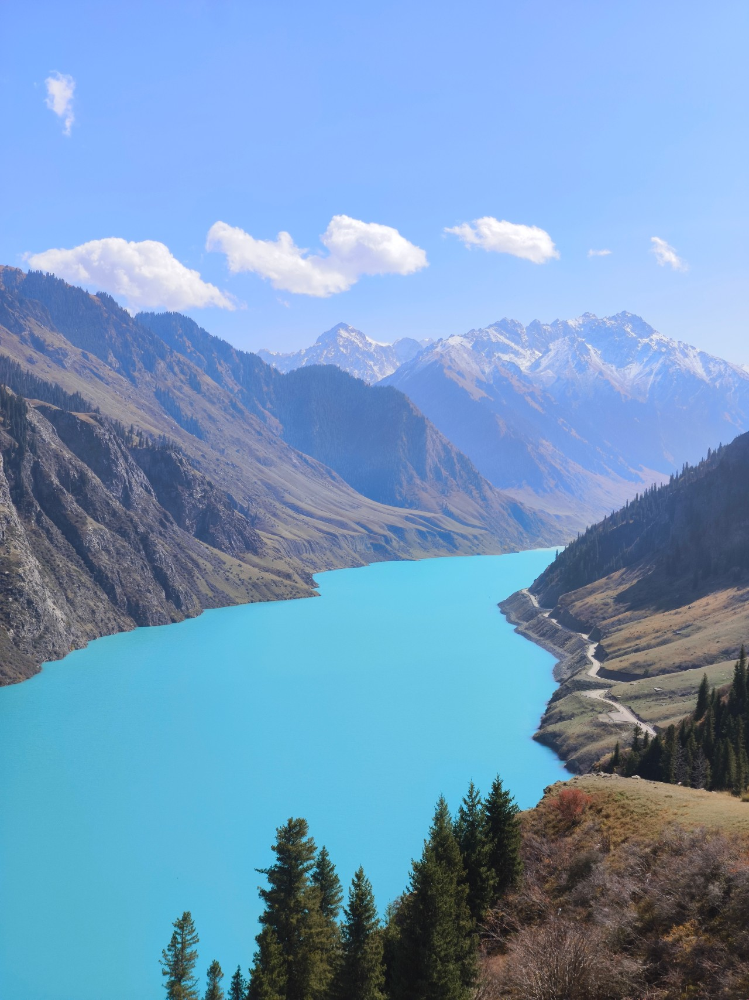

我发现湖边还有一条公路，可以继续深入到这条山沟里。这正是我计划中将要继续深入探索的路。据我估计，沿着这条路可以往峡谷里再行车半小时以上，能深入浏览阿克牙孜沟，看看里面有什么不一样的风景。理论上，这条沟将有类似于夏塔景区一般的风景。

可惜的是，当我们来到这条路的路口，才发现有专人拦着。看来我还是来晚了，美景已经被人围了起来。

回程的路上，接近昭苏机场的地方，我们发现一片向日葵的海洋，又边吃边玩了好一阵，才回到昭苏的酒店。

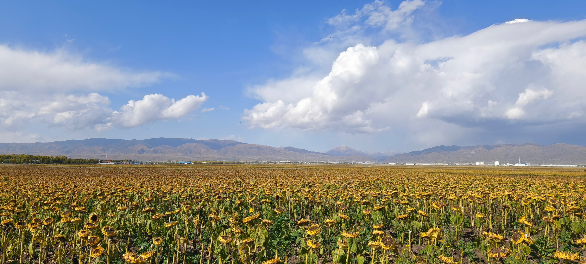

据说暑假时候我们住的这家酒店一个标间一晚需要800元以上，而现在我们只需要花300元就够了。国庆来新疆伊犁，真是人少景美！

# 10月5日

今日我们将走**伊昭公路**。主要项目是带我儿子继续去玩雪，这次要让他玩个够。

当我们刚出发的时候，发现靠近昭苏县城的这一段伊昭公路封路，但是可以绕行。伊昭公路全线依然是通车的。

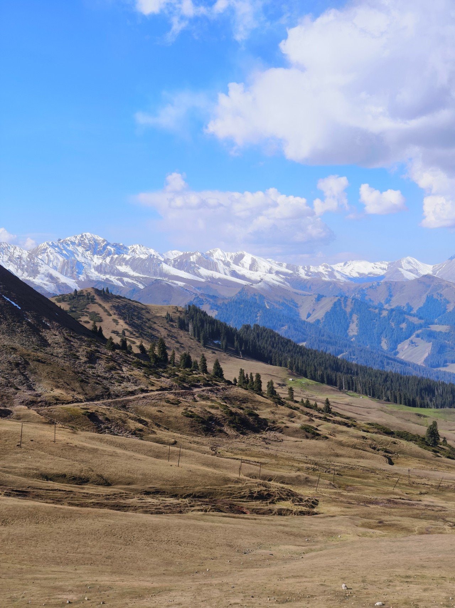

来到伊昭公路最高处附近，这里的积雪很足。我带着儿子又玩了很久的雪。他还认识了一位伊犁本地的小姐姐。

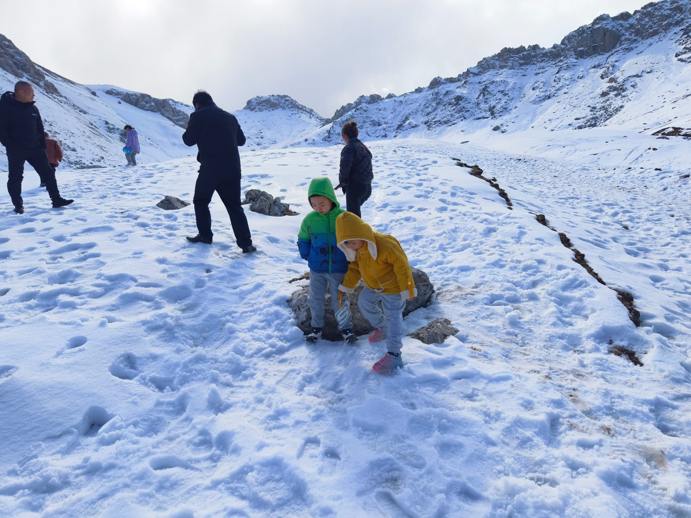

下午，我们到达了伊宁城。办理酒店入住之后，我们去了**喀赞其民俗街**逛逛。第一次来新疆我们没有去乌鲁木齐，那么伊宁城肯定还是要好好逛逛的。来到遥远的新疆，总是要感受一下当地的风土人情。

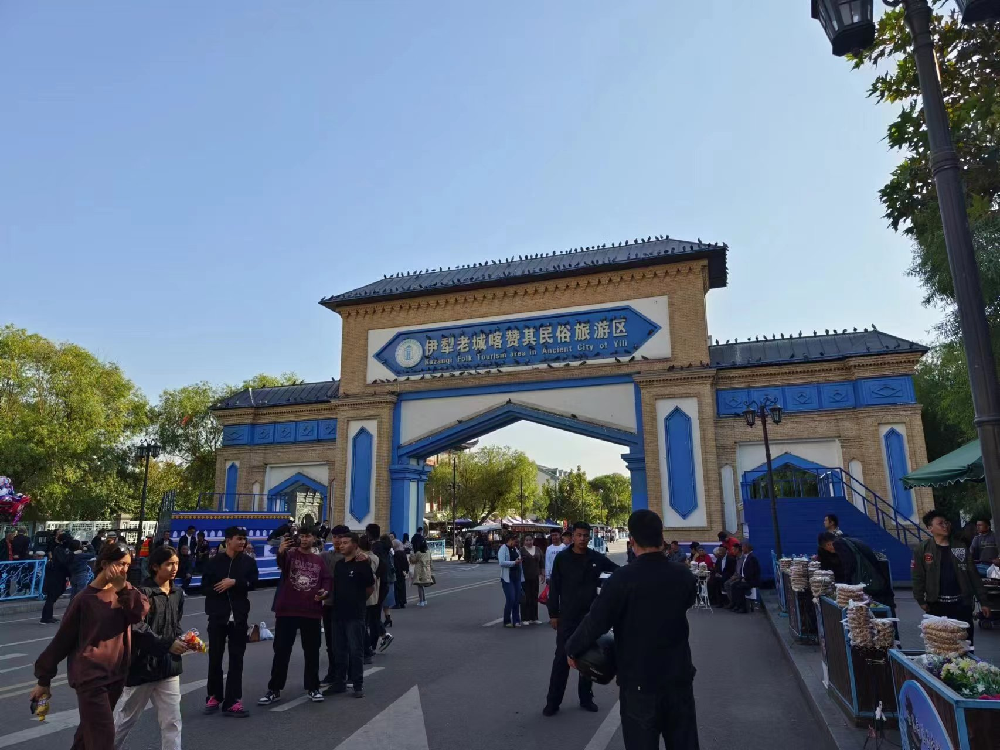

总体而言，伊宁大街上的行人以少数民族为绝大多数。但是，大家似乎对汉族游客或者行人也早就习以为常，并不会对你投来那种好奇的目光。所以我们在伊宁逛街还是逛得蛮自在的。

傍晚，我们去了一家当地人开的大盘鸡饭馆，饭店生意很好；店里坐的全都是本地的少数民族群众，只有我们一家是游客。可惜这家店的菜口味偏咸，我们不习惯，把菜都浪费掉了。但是来到这家店仍然是值得的，因为这家饭馆里有一幅喀赞其民俗街十年前样子的画，很漂亮。

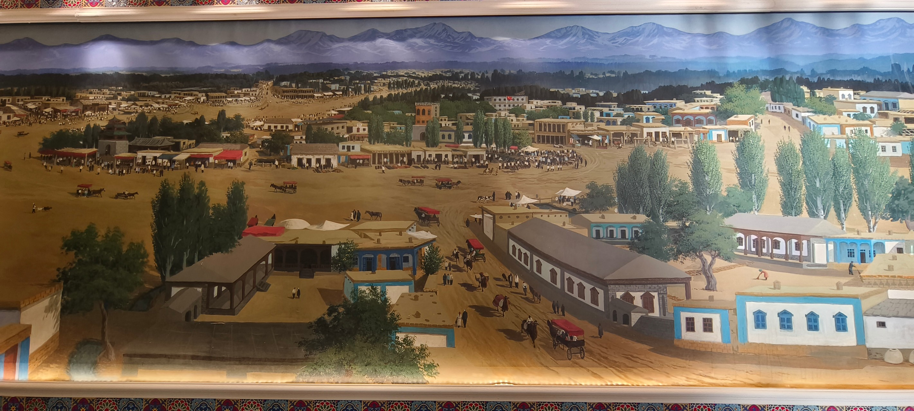

伊宁城的面貌仍然是典型的中国城市，只是因为少数民族群众太多了，才多多少少会让你有一点身处异域的感觉。

晚上我们住在伊犁宾馆。这家宾馆更像是一个政府大院，风景优美，若干栋坐落其中的大楼充作宾馆的客房。据说，这个院子曾经是苏联驻伊犁领事馆。

# 10月6日

今日我们将路过**果子沟**，返回石河子。高德地图显示的导航路程就有7小时以上。我老婆不敢开车上高速，7小时的路程全靠我一人，我压力山大。

上午行车一个半小时我们来到了果子沟，在打卡点拍了拍照片。

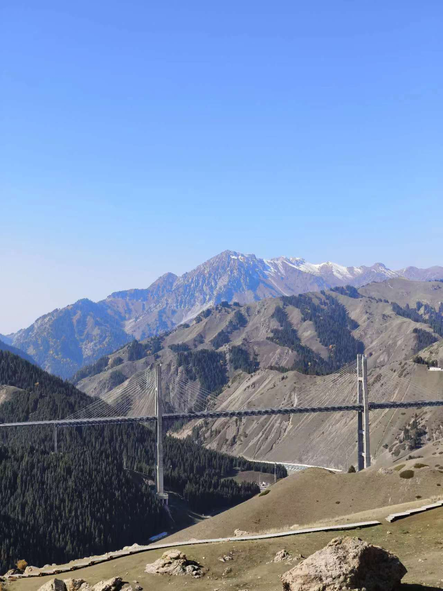

值得一提的是，秋天的连霍高速果子沟段是绝美的自驾公路。尤其是从东向西开，给人的感觉就像是要把车开到了画里。

然后我们就去了*果子沟金顶*。我已提前从卫星地图上发现，这个小院后面的栈道通往能俯瞰**赛里木湖**的山顶。

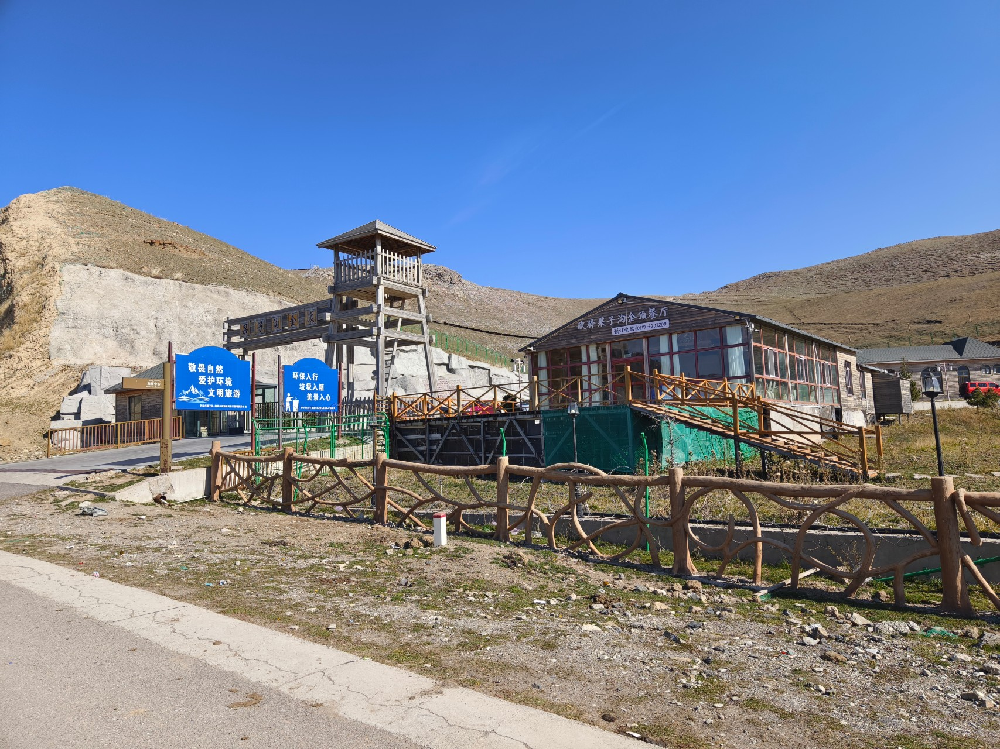

通过与这个院子门口的人沟通，我得知这个栈道是免费的，不需要给钱就能上。于是我告诉家里人这个山顶有好看的风景（但没说有大湖），怂恿他们都来爬这个栈道。

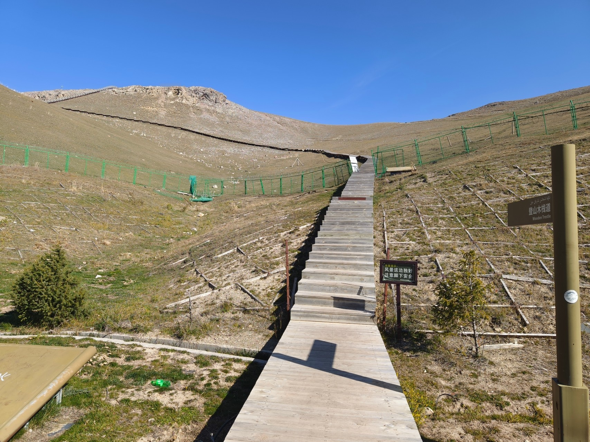

最后一段栈道最难爬，称作*天梯*。

爬上去之后，我们终于看到了赛里木湖的蓝色。这个蓝色和青海湖几乎一样。

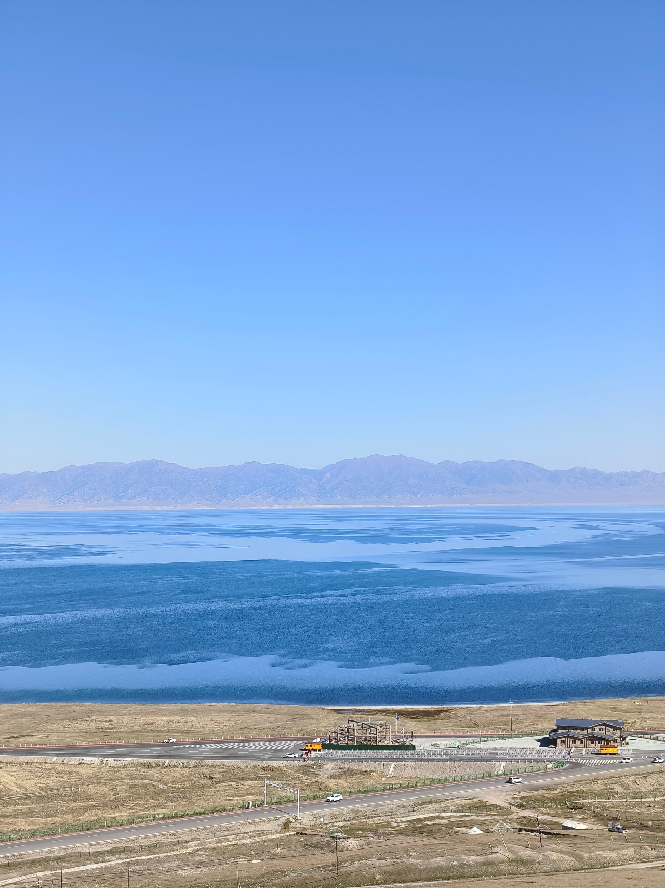

我们在山顶吹了好久的冷风才下山。

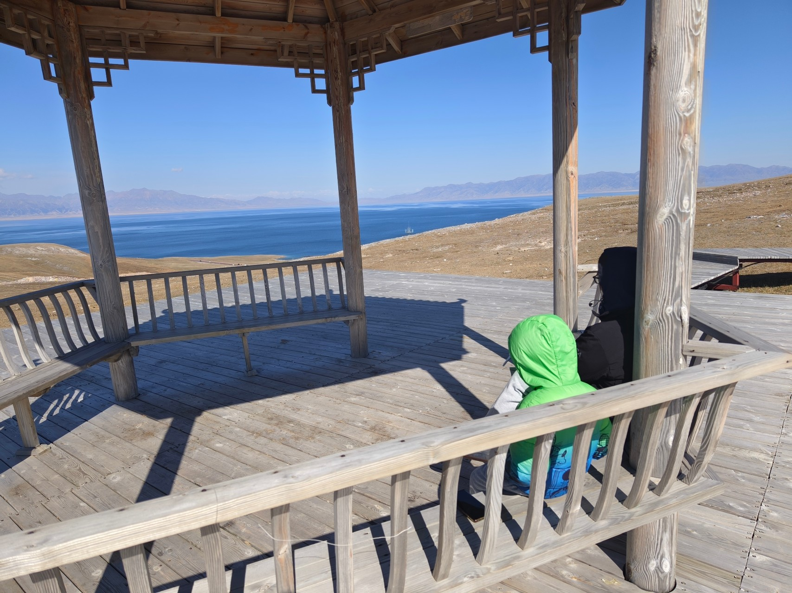

其实赛里木湖在国庆期间是半价，70多一个人，可以自驾进景区，并不算贵。但是我们还是没有进景区，一来是今天路程太长，时间上太赶了。二来是因为**景区的南门只让出不让进**，所以从伊宁往乌鲁木齐方向走的游客如果要进景区就会走非常多的冤枉路。在赛里木湖景区南门附近和连霍高速上都能看到赛里木湖。如果不是有专门的时间，我不太建议进这个景区。毕竟，也许这个湖的风景让你看半个小时就腻了。

最终，我们在晚上将近9点才到达石河子的酒店。

# 10月7日

我们去石河子的农贸市场买了牛羊肉、水果、果干等。然后下午登上了飞机，顺利返程。

# 总结

这次国庆长假的行程，有许多优点：
1. **直飞**，而且是黄金时段。虽然路途遥远，但往返体验很好，不累。
2. **秋天YYDS**，既不冷，又不用担心天天看下雨，全程只有一天是阴天。
3. **景观色彩丰富**：树叶黄了；天是蓝色的；水是蓝色或者绿色的，不是黄色的；山上积雪厚，雪山景观随处可见。**需要特别指出的是，天山地区由于纬度高且远离青藏高原这座热岛，雪线很低，是中国最适合观赏雪山的地区，没有之一。**
4. **价格极其低廉**，人均4500元。也许我们在中东部随便报一个国庆节旅游团的开销都远不止这个数。酒店几乎不涨价；我也一般不进收费景区。
5. **人少**，一点都不挤。这时候来新疆的人都去了喀纳斯，我们在伊犁可以独享美景。

当然也有缺点：
1. 草原没那么绿油油。

因为种种原因，我舍弃了传统伊犁环线上的**那拉提**、**巴音布鲁克**、**喀拉峻**、**恰西**、**夏塔**、**独库公路中段和南段**等等著名景点。即便如此，我们的行程仍然有些车行时间过长。下次来新疆，我会把行程安排得更加宽松一些。