自驾游越来越流行，本文的主题就是介绍怎么样在自驾游的时候省钱。当然，我们要在不牺牲体验的前提下省钱。

我将从以下几个方面来节省成本，除餐饮之外，包括了4个方面的主要开销：

1. 大交通
2. 租车
3. 酒店
4. 景点门票

# 最能节省出游花费的两个办法

## 开自己的车出游

开自己的车出游可以节省大交通和租车两大开销，适合近距离或者超长假期自驾游。如此你将至少节省1/3的费用。

## 尽可能避免在五一和国庆这类长假出游

五一和国庆节这种公共假期的时候大家都要出门，所以火车票和机票很难买。如果你休年假，**选择非公共假期出行**，将很容易成行并且节省较多的费用。

另外一个折中的办法是**在长假前后挨着的时间段休年假**，这样一则可以延长假期，二则避免了在最高峰出行，减少大交通的费用。

虽然我们要避免在五一和国庆这类较长时间的公共假期出行，但是下面的建议在长假时仍然都适用。

# 一、大交通

大交通：从居住地往返目的地的交通。这是个旅游行业的术语。一般我们只能选择火车或者飞机。

## 火车优先

同样一段路程，乘坐火车一般成本更低。最重要的是，火车票在公共假期一般不涨价。所以要节省费用，我们应该**尽可能选择火车出行**。

而对于1000公里以上的长途出行，我们应该尽可能选择普通火车卧铺，而非动车或者高铁。因为长距离、5个小时以上的高铁动车乘坐会比较的累人。（现在的动卧越来越少了，只有个别区段能有动卧可以乘坐。）

**夕发朝至的火车是长途出行的利器**，在时间节省方面可以达到甚至超过乘坐飞机的效果。（遗憾的是，而且越来越多的夕发朝至火车被同样速度的动集所替代，而动集的一等卧/二等卧在节假日一定会涨价。）

如果你计划假期第一天从苏州出发到乌鲁木齐去旅游，乘坐火车会消耗两夜一日，但实际消耗的假期为一天。

如果你选择飞机，从上海虹桥机场飞往乌鲁木齐的航班的飞行时间通常在5小时左右，加上从苏州到达虹桥机场至少需要1小时，以及至少提前1.5小时到达机场，乘坐飞机出行所消耗的白天时间已经达到至少7.5小时。如果再考虑有可能从离苏州较远的浦东机场出发，或者考虑飞机较高的延误率，下飞机之后较长的提取行李时间等等，这个旅行时间只会更长。综合考虑下来，我们也可以认为乘坐飞机将消耗你一天的假期。

|从苏州出发到达乌鲁木齐之大交通比较|火车|飞机|
|----------------------------|----|---|
|2023年9月18日价格及时间||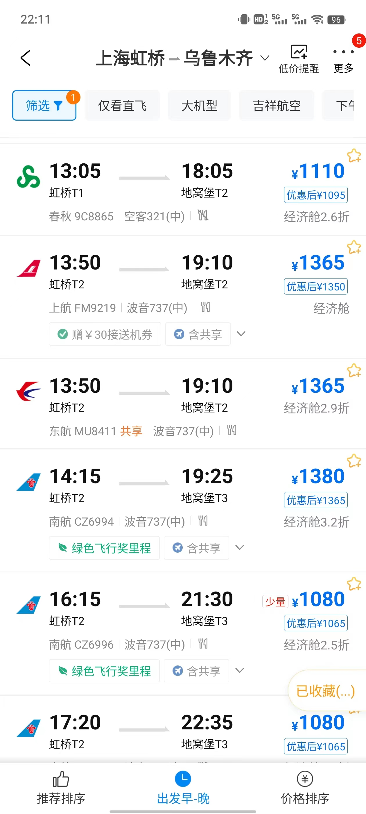|
|净旅行时间| 39小时 | 8小时 |
|实际消耗假期| 1日 | 1日 |
|票价/人|627(硬卧上铺)/1050(软卧下铺)| 1110(机票费) + 110(机建燃油费) = 1220 |
|附加交通费|(2(公交)/5(地铁)/30(打车)) x 2 = 4/10/60| 50(机场大巴或者动车) x 2 = 100 |
|隐形额外支出|0|200(航班当晚的酒店房费)|
|总费用|631/1110|1520|

在公共假期的第一日前后，火车票价是不会上涨的，而飞往乌鲁木齐的机票价格将上涨至3000元左右！因此，大交通费用上如果能选择火车，单程便能节省2500元左右！

所以，如果你能适应乘坐卧铺，并且买到合适的夕发朝至的列车车票，你将会节省大笔费用。就这个例子来说，如果你白天能有在火车上消磨时间的办法，那就更合适不过了。

我们举一个更极端的例子。有的公司（某些外企）允许员工在家办公，而你恰好在苏州这样一家公司工作，正打算去乌鲁木齐以及新疆旅游。我们假设长假第一天是10月1号，那么你可以购买9月29日晚出发的火车票——这会比9月30日的车票更好买，更远离公共假期。你将在9月29日下了班之后登上火车，9月30日安心地在火车上工作一天，最后于10月1日早晨，在离苏州4000公里外的乌鲁木齐的大街上，你将开始你假期的第一天。节省假期时间的效果拉满！

最后，如果你是特种兵，能适应超长时间的硬座，你将会节省更多费用。理论上，你只需要500元，就能达到中国每一个通了火车的角落。中国铁路三十年不涨价，服务着无论贫富的每一个人。

下面这张地图显示了从苏州乘坐硬座到达全国最偏远的火车站的总花费。

如果选择火车出行，那么真正的问题是如何买到节假日的火车票。答案很简单：**使用抢票软件，第一时间购票或候补，坚持抢票和等待候补兑现，不到开车前绝不放弃**。

## 火车票区间限售和候补

我们一般会去12306（APP或者网站）购买火车票，这是官方渠道。

高峰时段，我们很难在第一时间直接购买到需要的火车票。想要买到心怡的车票，我们一般应该做到第一时间候补，并且最好是选择同车次始发站为起点的车票。

候补是一个黑盒的排队机制。候补什么时候能兑现？我认为最大的影响因素并不是有多少人排队，又有多少人退票，而是区间限售的解锁时间。

什么是区间限售？假设一趟火车的路线是A -> B -> C -> D -> E -> F -> G，始发站是A站，终点站是G站。那么一种典型的区间限售规则就是：

1. 开车15天前，统一开票，但是仅A站出发，到达E、F、G站的车票有售，其他区间仅能候补。（限售始发站+限售E站以远）
2. 开车7天前，开放其他所有区间车票的购买。（解锁区间限售）

区间限售的复杂在于，各个铁路局、各个车次的限售区间和解锁时间都不一样，没有统一规则。就以上例子而言，有可能出现这些不同的区间限售情况：

1. 区间限售的解锁时间并不一定是开车前7天，也有可能是开车前3天、开车前24小时，或者开车前当天早上。
2. 一些热门席位（尤其软卧）有可能出现全区段限售，即没有任何人能在开车15天前买到A站出发到G站的该席位车票。我就遇到过我想要购买的哈尔滨出发的始发终到软卧车票直到开车前24小时才候补兑现。因为我是一次性候补了四张软卧车票，所以可以肯定不是因为有人退票，而是因为限售解锁了我才候补兑现成功的。
3. 区间限售并不一定是限售某站以远。例如，有可能在某一时刻，你可以买到B站到E站的车票，但是B站到F站的车票却被锁住了。
4. 即便A站和B站距离极近，甚至在同一城市，也很有可能出现始发站限售，即A站出发可买，而B站出发不可买。

真实的区间限售远远不止上面列出的这些情况，极为复杂，甚至可以说是有些随意。如果你想要分析出来你想买的那趟车的区间限售规则，可以多多地在12306上观察非假期时段各个区间的放票时间。因为你可以假设非假期时段火车票直到开车的时候都是充足供应的——热门的T/Z字头列车除外。

其实，火车票的区间限售机制几十年来一直都有。此外，还有预留车厢机制等。之所以之前没人讨论这一现象，是因为买票需要到人工窗口，尝试成本极高。在12306上线之后，人们才可以很容易地观察到这种现象了，这个问题才最终浮出水面。

**总而言之**，想要候补成功，首先要在**第一时间（提前15天）下候补订单**，确保你尽可能排在最前面。

其次，要尽可能**延展你的购票区间**（代价是多掏钱），至少也要做到购买始发站的车票。

最后，就是一定要**头铁**，不坚持到开车前绝不撤单。（当然前提是你做好买不到票的预案。）

根据我的经验，第一时间就成功候补始发站的火车票，并且坚持到最后仍不取消的，失败率很低。如果你有过第一时间候补却没有兑现成功，那么很可能是因为你因为担心不能成行，去寻求别的交通方式而提前取消了候补订单；如果你有过候补到开车前两小时自动退单的情况，那么很可能你的候补订单不是在第一时间下的。

此外，全家多人出行一定要下**一单多票**，而不要下多单多票。

多单多票就是你在多人出行时，下很多个候补订单，但是每个订单只有一张车票。这个做法理论上会增加一些抢到票的概率，因为一人比多人更容易候补兑现。抢票软件一般也会提示你一单多票会严重影响抢到票的概率。

然而，多单多票这种做法往往得不偿失。因为多人出行只要其中有一个人没有买到票，仍然是不能成行的。比如你4人出行兑现了3张，那么你不但不能成行，还需要把买到的其他3的票退掉，损失20%的退票费。当然，这个问题真实的成行概率需要数据支撑去做一个精确的计算，这里不做深究。但是还是有另外三个现实的原因使得一单多票是更好的选择：

1. 我们每个人只能注册一个12306账号，而一个12306账号又只能下两个候补订单，配额十分珍贵：如果你去程下一个候补订单，回程下一个候补订单，你就用完了你的候补订单配额。而多单多票这种做法很可能需要操作2个甚至更多的12306账号，会非常麻烦。
2. 多单多票将使得多车次抢票丧失可行性。在高峰时刻，多车次抢票是确实能大大提升买到票的概率的。那么假如你要抢的区间有2趟车符合你的需求，而你又有2个人需要同时出行，最后你抢到的是A车次的车票，你的同伴抢到的是B车次的车票，那么你们是走还是不走呢？一般来说，我们长途出行不能坐同一列车是无法接受的。
3. 等待多单兑现不如等待一单兑现让人更安心。等待一单兑现，就一句话：行或者不行——反正我们先做好不行的预案。而等待多单兑现，可能就像盯着你买的股票的心情了。

## 抢票软件

我们仅仅使用12306 APP或者网站来候补火车票还不够，**应当使用抢票软件**。

首先，计算机程序肯定比你手动操作要快，能帮助你尽早下单候补，尽可能排在队伍的前面。

其次，抢票软件可以帮你抢到候补之外的票。例如，开车前几天你要购买的那趟车可能临时加挂了一节车厢，这个车厢的车票有可能不会分配给候补队列，而是先直接开放购买，然后就被抢票软件扫描并抢到。还有，就是一些意料之外的区间解锁车票也可能被抢到，因为抢票软件通常有自动多买几站或者少买几站的功能。

抢票软件的开发者对于区间限售的问题有着较深的研究。所以，在使用抢票软件时可以根据软件的提示做出选择（比如多买、少买一站、多选车次、多选席位等等），这样肯定能提升买到票的概率。

有时候，用户会发现抢票软件似乎出现bug，比如明明12306上看到实时有票，抢票软件却还在那里不停地抢就是没抢到，也候补不上。这其实是常见的情况：在高峰时刻，12306会祭出它的排队机制来解决订单拥堵。所以此时你**一定要耐心等待，不要取消排队**。也许过了少则几分钟，多则大半天之后，或者等到夜深人静时，你就候补成功了。

至于抢票软件兜售的那些加速包、VIP等是否应该购买，我暂时没有结论。理论上，如果按照抢票软件所宣传的给加速包或者VIP用户增加带宽和计算资源，那么确实有可能会增加买到票的概率。但是这个东西只有抢票软件自己才有完整的统计数据，才知道这个增值服务到底有没有用、到底能增加多少买到票的概率。作为消费者，我们是没有这些信息的。所以，这个问题需要你自行判断了。这些产品肯定有安慰剂的功能。

## 在价格最低时购买机票

火车不是万能的。飞机相比火车还是有很多优势：旅行时间更短；可以提前很长时间买票，因而不用担心无法成行；等等。

乘坐飞机最大的劣势在于价格，所以，要想省钱，就要购买更便宜的机票。

飞机票的价格是浮动的，这意味着有可能你买到一张机票之后，它的价格马上又降了几百块。这种情况会让人很不爽。所以，想要在价格最便宜的时段购买机票，这本质上是你和航空公司的一个价格博弈的过程。

不同的航空公司采用不同的价格调整策略，这些策略都是相对稳定和程序化的。调价策略的最重要的两个变量是时间和剩余票数。航空公司会根据这两个变量来决定价格的上下浮动。一般来说，如果距离航班起飞时间较长，而剩余机票较少，那么航空公司会提高价格。相反，如果距离航班起飞时间较近，而剩余机票较多，那么航空公司会降低价格。

对于乘客而言，机票价格博弈是一个信息不对称博弈：

1. 一般来说，机票代理商只会告诉你某个价格的机票已经所剩无几，给你一个抓紧时间下单的心理暗示。据说，曾经在航旅纵横APP上可以查看整架飞机的剩余机票数，但是这个功能很快就被取消了。
2. 乘客无法知道航空公司的机票调价策略和具体公式。而且，航空公司还可能随时变换调价策略，不同的航空公司也有不同的策略。这就使得这一问题非常复杂。

所以，想要做到精确地在最便宜时段下单买你心怡的机票，是很难办到的（或者说这个问题没有解析解）。我们只能去观察一段时间内的同班次飞机的价格变化，来估计目标航班的价格是否已经处在最低位置（即这个问题只有近似解）。

例如，你要买周六某一航班的机票，那么当你通过连续几天的观察，发现周一到周五的同班次航班的最低价格大致是500元左右，那么当你看到周六的航班某一天也下调到500元左右，你就可以下手了。这种办法在非高峰时段还是很有效的。我个人感觉，一般的机票价格会在航班前2周到1周左右达到最低。

然而，在真正的高峰时段，这种办法是肯定会失效的。因为高峰时段的供需关系和非高峰时段的供需关系完全没有可比性。很可能，你从一个月之前开始观察目标机票的价格，最终只是发现它一路上涨，直到起飞前几天，全价票也最终卖光。

那么是不是我们想要买高峰时段的机票的时候就只能束手无策呢？也不尽然，就我所知还有两种可操作性比较强的办法。一种是空铁联运，一种是中转弃程。

## 空铁联运

由于中国有比较发达的铁路网，所以空铁联运其实是一个很常见的旅行方式。空铁联运规划得当，可以在尽量保证体验的情况下节省较多的出行费用。

举一个简单的例子。假设我们要去海南岛，去三亚最好的沙滩**亚龙湾**度假。从苏州出发，我们考虑选择从上海虹桥机场出发的航班。

下面的表格列举了9月16日直飞三亚凤凰机场和先飞海口美兰机场然后再乘坐动车抵达三亚两种方案的用时和费用。

|从上海虹桥机场出发到达三亚亚龙湾之两种方案比较|直飞三亚然后去亚龙湾|先飞海口再去亚龙湾|
|----------------------------|----|---|
|2023年9月16日价格|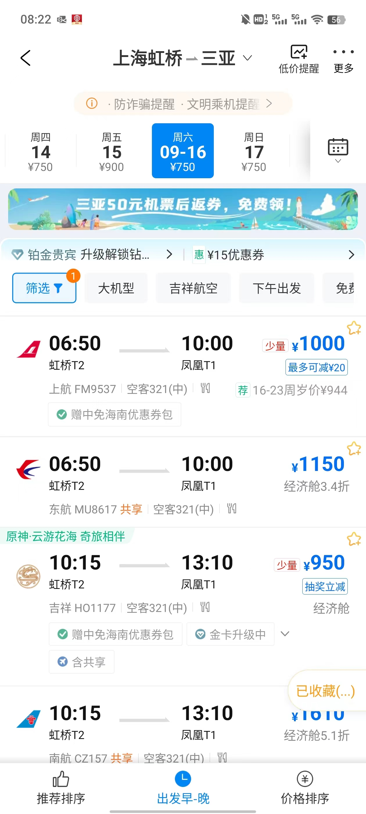|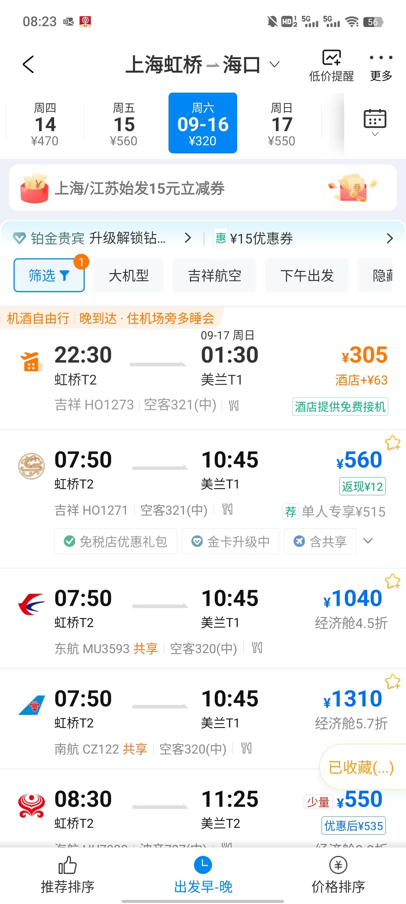|
|选择航班|吉祥航空10:15 - 13:10|海南航空8:30 - 11:25|
|净飞行时间| 2小时55分 | 2小时55 |
|价格|950元|550元|
|额外交通费| N/A | 美兰站-亚龙湾站动车 108元|
|额外交通时间| N/A | 美兰站-亚龙湾站动车 约1小时30分钟|
|出租车交通费用|约95元| 约28元 |
|出租车耗费时间|约35分钟| 约15分钟 |
|总支出|1045元|686元|
|总净旅行时间|3小时30分钟|4小时40分钟|

由此可见，只需多花费约1小时10分钟，空铁联运可以为我们节省359元（约35%）的费用。而且，在节假日前后，这个节省的费用只会更多。

在高铁网络越来越发达的今天，通过空铁联运来省钱是具备普遍可操作性的。一般来说，热门旅游目的地的直飞价格会比较高。而先飞往热门旅游目的地附近的大城市，然后再乘坐高铁或者火车达到该目的地，往往能为我们节省较多的费用。

## 中转弃程

简单来说，中转弃程就是购买中转机票，只乘坐前一段航班，不乘坐后一段航班，因为中转地才是我们真正的目的地。

举一个简单的例子。假设我们国庆节从西北游玩结束，要从兰州中川机场回到北京。那么10月7日回北京可以选择的最佳航班可能是国航的兰州-台州/盐城的中转航班。

|从兰州中川机场出发到达北京的两种方案比较|直飞|中转弃程|
|----------------------------|----|---|
|2023年10月7日价格|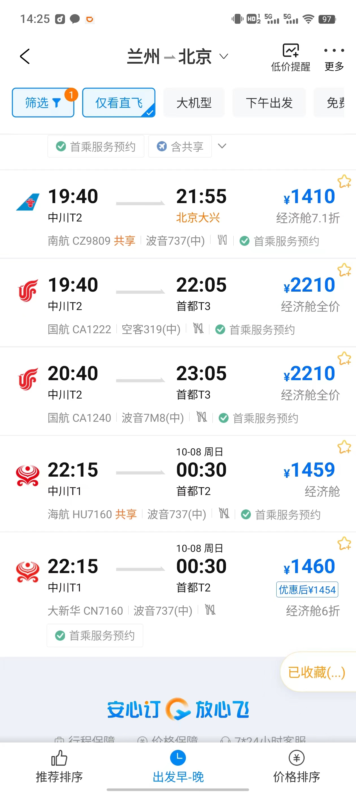|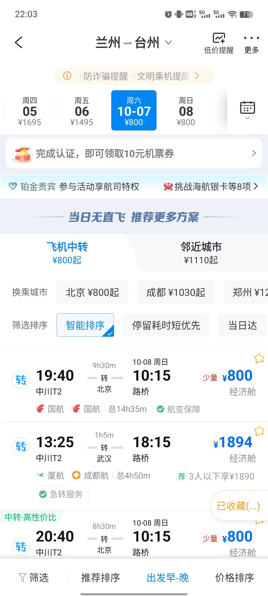|
|价格|同班次CA1222 2210元+110元=2320元；最低直飞价格约为1400元|800元+110元x2（燃油机建费）= 1020元|

如果乘坐国航CA1222回北京，在完全一样的体验下，中转弃程方案将立刻帮你节省高达1300元。此外，后一段（北京飞台州这一段）机票的燃油附加费和机场建设费是可以100%退掉的，这样还能再节省110元。你可以在出行时仅乘坐前一段航班，不要办理后一段的值机，等到前段落地了之后再退掉后一段机票。

甚至还有一个更骚的操作，就是前一段航班落地后，不要着急退票，而是先等等看，如果后一段航程出现计划变更或者起飞延误半小时以上（这两个事情发生的概率并不小），你甚至可以将后一段机票全退！例如，这个例子中兰州飞到台州有两段，这两段的票面价格分别是450元和350元，加起来就是800元。那么，在后一段航班出现“非正常航班”的情况下，你可以再退掉350元的后一段机票，从而实现了只用450元+110元=560元就得到了与购买全价票的直飞乘客完全一样的出行体验。

有新建机场的地方更容易薅到这种中转低价的羊毛。因为新建的机场往往客流尚未饱和，需要通过一些低价手段吸引客流，包括北京大兴、青岛胶东、成都天府、郑州新郑机场等等。

最后，需要注意的是中途有经停的航班不能这么操作。你不能在经停地放弃后一段行程。因为在乘坐中途有经停的航班时，本质上你只买了一张机票，而这张机票是不能拆分的。中转机票则是两张机票，所以你放弃后一段行程是完全合理合法的。

## 发现低价机票

无论是采用空铁联运还是中转弃程的手段，前提都是要知道哪些航线上有低价机票。

我个人常用的手段是利用携程APP里的“搜全国低价”。在携程APP的首页可以找到这个功能的入口。

进入到这个入口之后，你可以设置时间和出发地点，然后就可以看到该出发地点在指定时间段内到全国各地的最低价格。它把所有的价格信息压缩在一张地图上，从而让你能比较容易地判断在你目标航线附近是否有低价航线。

例如，我们打算国庆节从苏州出发去西部旅游。国庆节假期的第一天是9月29日。于是，我们把这个搜索界面中的时间设置成仅9月29日这一天，而出发地则把附近的城市全部遍历一遍。

如果你打算去新疆旅游，那么就会发现从合肥出发到喀什有低价机票，只需要1210元。而苏州到合肥乘坐动车需约2小时，花费100多元，班次也很多，到达合肥新桥机场大约总耗时在3小时左右。所以，你就有可能通过这种空铁联运的方式，在国庆长假的最高峰时段，以较低的花费抵达新疆。

如果你打算去西北旅游，那么就会发现从盐城出发到西宁有低价机票，只需要530元。在*通苏嘉甬高铁*通车之前，从苏州到达盐城机场较为不便，需要先乘坐汽车耗费约1小时到达常熟火车站，然后从常熟火车站乘坐约1小时的动车到达盐城站，最后再打车去盐城机场。这个附加的交通总耗时也大约需要3小时。然而无论是从无锡硕放机场出发还是从上海虹桥机场出发，在假期第一日飞往西宁的机票价格都在1500以上。实现空铁联运，你至少能节省八百多的出行费用。

空铁联运并不难操作，而中转弃程则要难操作一些，这主要是因为中转低价票并不是一个特别常见的现象，**需要你经常去观察机票价格地图**。互联网上已经逐渐有越来越多的人在讨论这种低价买机票的手段，我也在B站上看过一些up主介绍所谓的购买中转弃程机票的操作方法。但是我感觉他们介绍的方法都不太靠谱。我个人总结下来，认为要发现中转低价票可以如下操作：

1. 设定出发地A地，打开某一日的机票价格地图。
2. 假设你的真实目的地是B地，那么你要在地图上搜索一个C地，这个C地要尽可能满足两个条件：一是A地往C地的价格较低，二是A、B、C三地构成一个三角形。这个三角形越接近等边三角形，那么A地到C地的航线中就越有可能有你要找的低价中转航班。
3. 点开A地到C地的航线，验证是否有经B地中转的低价机票。一般而言，中转低价航班的两段为同一航空公司承运。

总而言之，中转弃程方案的成功率虽然不高，但是仍然有可操作性。它需要你对地图信息比较敏感，也需要一点点运气。事实上，所有的低价机票信息都是公开的。所以，设计一个软件来实现对中转低价票的监控是完全可以做到的。

互联网上可能已经有一种功能强大的软件，它可以通过不断爬取公开的低价信息，及时地给你低价提醒，方便你设计出更省钱的出行方案。

# 二、租车

一般来说，租车平台有两类：直营和第三方平台。直营主要是神州和一嗨这两家；第三方平台则包括携程、飞猪、滴滴等等，这些平台上有许多各地的本地租车公司提供租赁服务。

这两种租车平台各有特点。神州和一嗨因为是大公司直营，所以不太会跟你扯皮，取还车比较方便，价格比较透明，不太会随意波动。而携程等第三方平台由于是各地的小租车公司提供服务，所以良莠不齐，你需要一点运气。一般来说，自驾游特别火爆的地方，例如新疆、内蒙古的一些地方，往往本地租车公司会比较多，相互竞争十分激烈，从而导致直营的神州和一嗨在价格和可选择车辆上会比较劣势。而在自驾游不太火爆的地方，神州或者一嗨则往往占据了价格优势。需要注意的是，自驾游不太火爆的地方并不一定意味着旅游就不火爆。

总体来说，这两种平台都是可以考虑的。

如果是自驾游生手，我最推荐的还是选择神州租车。因为神州租车还车很容易：我在神州租车每次还车时，验车员都不怎么认真看。而且在神州租车万一出现事故或者违章处理起来也比较方便。

如果你发现神州和一嗨这两家没什么车可选，报价也比较贵，那么就去看看携程这种第三方平台的报价，往往会有惊喜。

## 避开热门自驾游起点城市

租车省钱的逻辑和买机票很相似，都是要想方设法避开最热门的城市，选择附近的低价城市。

假设我们国庆假期要去西北自驾游，选择神州租车，从以下这些各自相距大约200公里的城市的神州租车门店租同一款车，在同一时间段的租车总价，就会发现差距挺大的。

|城市|天水|兰州|西宁|武威|张掖|
|---|---|---|---|---|---|
|神州租车订单 |  | 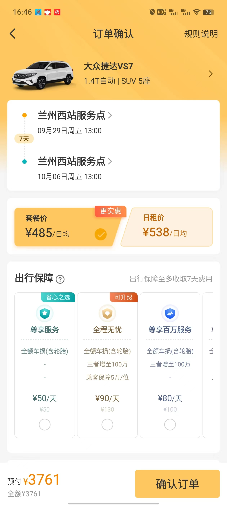 | 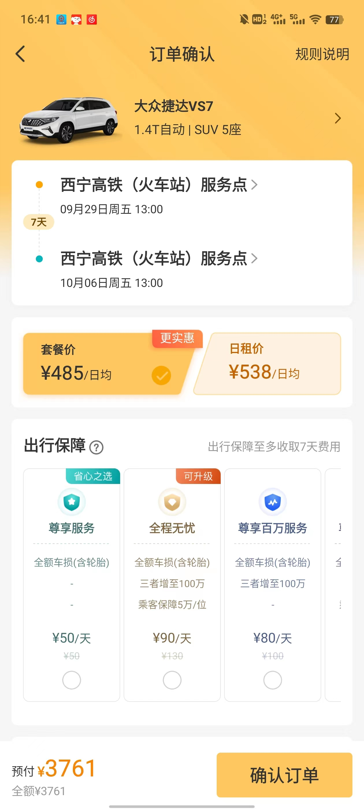 |  |  |
|总价|2312元|3761元|3761元|1808元|4517元|

从上面这个表格我们可以看到，由于西宁和兰州是热门的青甘大环线自驾起点，所以国庆期间神州租车的价格上涨较多。而张掖由于最近几年旅游业发展得比较好，又是兰新客运专线的重要节点，所以报价上涨得甚至比兰州和西宁更猛。仅隔200公里外同样处于河西走廊的武威，报价只要1808元，比张掖低出2700元（低出60%）！

所以，如果你要走传统的青甘大环线，从武威出发相比于从兰州或者西宁出发就能立省2000元左右。当然，因此你也需要结合你想去的景点的分布，重新设计一条从武威出发的自驾路线。例如下图就画出了两条简略的青甘大环线：蓝色线路是以西宁为起止点，红色线路是以武威为起止点。可以说，这两条线路大部分是重合的，体验上也没有什么大区别。

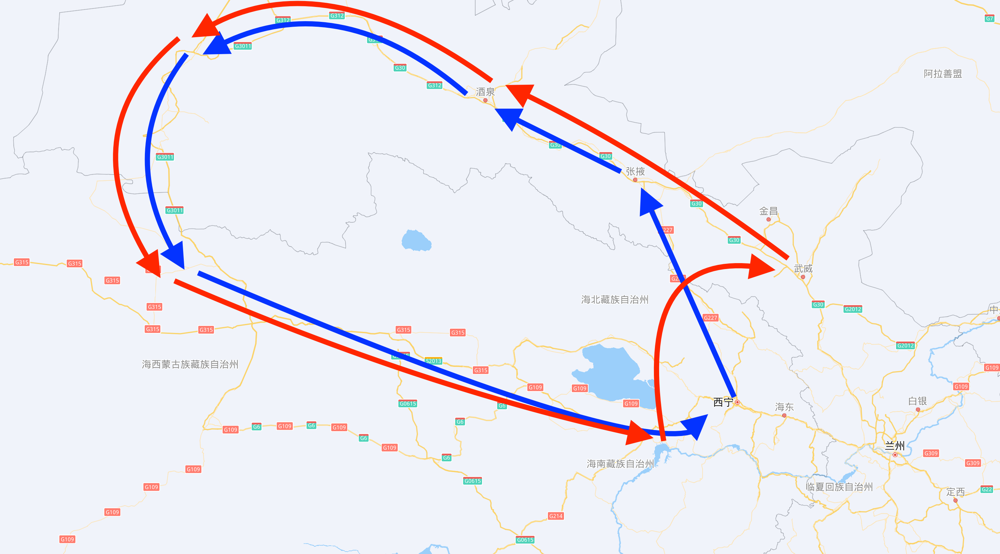

再比如，如果你想去甘南自驾游，那么你也可以选择从天水出发，而不是从兰州出发。在节省一笔租车费用的同时，也可以按时到达目的地。

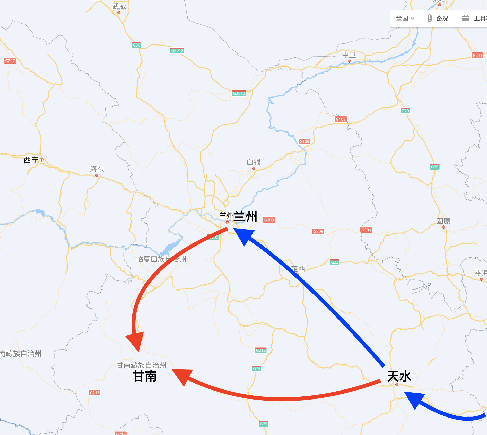

在上面这张地图中，蓝色代表乘坐火车或动车路线，红色代表自驾路线。我们可以看到，如果从陕西方向坐火车过来，从天水开始自驾相比于从兰州开始自驾，不仅更节省租车费用，也更节省火车票费用。总的时间消耗上则是差不多的，从天水到甘南的驾驶时间稍微长一些。

此外，即便是同一城市的不同租车点，神州租车的报价也是有差异的。机场、火车站的租车价格一般会贵一点，周租的差价会在100元左右。

## 异地还车

一般来说，我们租车自驾都会选择一个环线行程。一来方便规划行程，二来节省租车费用。神州和一嗨作为直营的大公司，都是提供异地还车服务的。只不过异地还车或多或少会增加一些费用。而本地的小租车公司则一般不提供（非同城的）异地还车服务

如果我们选择了租车报价比较低的城市作为自驾游起点，那么可以重新规划路线，而不必拘泥于环线。起点城市租车价格低，而终点城市一般选择交通便利的大城市，方便乘坐飞机或者火车回家。

异地租车的费用决定了我们如何设计非环线自驾游线路。如果异地还车费用过高，那么非环线的成本就太高了。

**神州租车的异地还车费用**比较透明，大约等于**起点和终点两地公路距离乘以2元每公里**。所以选用神州租车，如果要异地还车，那么起点和终点的距离就不能太远，否则异地还车费用会非常高，难以承受。

**一嗨租车声称免异地租车费**，然而它的**这个宣传是失实的**。在一嗨租车的订单结算页面，它确实会显示扣除了异地还车费。但是它把异地租车的租车费用给调高了。

举个例子，如果你在苏州租车且在苏州还车，那么它可能给你报价100元一天；如果你在苏州租车但在南京还车（省内异地），那么它可能给你报120元一天；如果你在苏州租车而在青岛还车（跨省异地），那么它可能给你报200元一天。简单地说，一嗨租车的优势是**同城异地还车免费**，**省内异地还车费用较低**；但**跨省异地还车费用仍然比较高**，与神州租车不相上下。当然，具体异地租车的费用会高出多少在不同的地方不一样，需要你自己查询。

所以，如果你要走一条不是环线的自驾游线路，你还是需要查询这两家的总报价，声称“免异地还车费”的一嗨租车并不一定就更便宜。

**总而言之**，以租车价格较低的城市为起点，综合考虑异地还车的费用，设计出一条既省钱，又不耽误时间，还能保证出游体验的自驾游线路是具备普遍可操作性的。

## 租车附加保险

神州和一嗨都提供附加的保险（尊享服务、全程无忧）供你购买。除非你是特别新手的司机，否则**不推荐购买附加的保险**。主要理由如下：

1. 租车费当中已经包含了一定的保险费用。例如，神州租车就在基础服务费当中包含了“车损1500元以上部分（不含轮胎）+三者保障20万+交强险等”。所以，其兜售的附加保险服务一般只是增加保险的覆盖范围。而这个保险覆盖范围的增量是绝不值50元一天的——尤其是当你的租车费用可能也就100来块一天的时候。我们自己有车的朋友都知道，一台10万元左右的车其一年的全额商业保险也就两三千块钱，如果仔细计算，就会发现这个附加的保险服务相当于把一个成本10块钱的东西以50块的价格卖给了你，完全划不来。
2. 假设你出远门自驾游，每次租车一个星期，所以每次购买附加保险需要额外增加支出50元/天x7天=350元。又假设你遇到一次意外（爆胎等）需要赔付给租车公司1500元。那么，如果你每4次租车出1次意外，你购买的附加保险的费用，就和你没有购买附加保险从而需要赔付给租车公司的费用大致相当。从风险角度考虑，一般的司机出意外的概率应该会比每4次租车出现1次意外要更低一些。所以即便你某次租车出游出了点意外，赔了租车公司一千多块钱，你也不用后悔没买附加保险。只要你坚持不买附加保险，这个费用就能省回来。

# 三、酒店

## 提前预定

想要在长假期间住酒店省钱，最有效的办法就是提前预定。如果能提前一个月预定那就提前一个月，总之尽可能早。旅游APP上大多数的酒店都可以在入住当天12点或18点之前免费取消，所以提前预定酒店的代价几乎为零。

大多数的酒店在五一、国庆这种长假期间都会涨价。但是，如果你提前一个月去一些旅游APP上查询长假期间的房价，会发现有的酒店已经把房价上调了，而有的还没有。——我们可以通过“低价日历”功能来查看长假期间是否涨价。

此时，我们就可以选择那些尚未涨价的酒店，或者选择相比于平日涨价比例低的酒店。大多数酒店都是私营的，而这些私营酒店老板很可能还没来得及调价，或者调错了时间区间。那么，很有可能等你订完某一家酒店没过多久，房价就上调了。

## 旅游APP上的报价并非最低价

一般来说，携程、飞猪、去哪儿、同程旅游等等常见的旅游APP上的酒店价格并不是最低价。我们有以下几种办法来尝试拿到比旅游APP上更低的价格——往往便宜几十块钱。

1. 直接打电话过去预定，跟老板谈价，没有中间商赚差价；如果价格难以松动，还可以试试让酒店送早餐。
2. 还可以尝试现场订房。在一些冷门的地方（即便是热门时间），某些私营酒店可能网上报价200元，结果你现场去问却只报价100元。如果你担心现场订房的时候满房，那么你还可以先在网上定那种当日18点前可以免费取消的酒店，然后到了酒店当场询价，此时如果前台给你的报价比网上低，你就可以退了网上的订单然后现场下单入住。
3. 如果你在当地租了车或者报了一日游的旅行团，还可以尝试让租车公司或者旅行社帮你预定。他们很有可能有本地的渠道可以帮你取得更优惠的价格。

此外，一些大品牌的连锁酒店可能不太好谈价。这些酒店一般直接让利给自己的品牌会员。

## 选择酒店

我们要尽可能避开一些紧挨着热门旅游景点的酒店，这些酒店非常依赖旅游旅游旺季，一旦遇到长假就会大幅涨价。

相应地，我们可以选择旅游景点不太远的城市、县城、或较大的镇上的酒店。如果你是自驾游，且路线安排合理，不住在景点门口其实不会耽误很多时间。而且在这些城镇里的生活会更方便，无论是吃饭还是看病都会容易得多。

民宿类酒店的质量良莠不齐，一般性价比不高，要慎重选择。

最后，我们**可以考虑住在景区里面**。虽然景区里面的酒店比景区门口的酒店价格更高，但是它却能让你独享傍晚和清晨的美景，给你带来远超其他游客的体验。

# 四、景区门票

即便是自驾游，我们在一趟旅程中肯定还是要去一些围起来收费的景区。这些景区的门票也是旅游开销的大头之一。

## 尽量不要进景区

中国的景区有很多令人不满的地方：

1. 进出景区麻烦：需要停车、买票/换票、排队等等。高峰时期，我们用来等车、排队的时间往往超级加倍，让人绝望。
2. 中国特色：交通车/摆渡车，价格昂贵，体验远不如坐自己的车。许多景区交通车纯粹就是为了多收钱，没有带来任何方便。
3. 在景区里，走很长的路也不可避免，耗费体力。

在节假日期间，我们有可能一天下来大多数时间都在排队、等车、还有无谓的步行当中度过，而真正游览核心景点的时间却只有一两个小时。我们虽然花了钱，却没有得到更高的价值。

为了省钱，同时也是为了挽救出游体验，我们应该**尽可能不进景区**。那么什么样的景区可以进呢？我觉得像世界自然遗产(联合国认证，中国有18个)、世界地质公园(联合国认证，中国有41个)、区域内最具代表性的景点、以及具有全国范围内独一无二的特色的景点，即便花钱也是应该是去的。这些景点可以作为我们自驾游路线上的**核心景点**。把核心景点串起来，就能规划出一条自驾游线路了。

## 旅游APP上的报价并非最低价

如果要买景区门票，怎么样能省钱呢？互联网渠道上的各种优惠自不用说，还有一种更简单也更省钱的办法：让当地人帮你订门票。

例如你前一天晚上到达景区附近的酒店住宿，你就可以问酒店老板能不能帮你代订门票。你还可以问你刚刚认识的当地人，问问他们是否有渠道买到低价门票，比如你租车的那家租车公司的员工、你打车的出租车司机、你吃晚饭那家饭店的老板等等。一般来说，如果网络渠道能给你省5到10块钱一张票，那么当地的渠道可能就能为你省20到30块钱一张票。

当然，一些特别硬核的景区可能很难搞到门票优惠，因为这种景区不管是不是节假日都是人满为患的。

## 自驾游的核心价值

如果你经常自驾游，并且一般不买门票、不进景区，那么你就能体会到自驾游的两个核心价值：

其一，**风景在路上**。很多时候你会发现路上的风景并不见得比景区里的风景差。所以，不进景区并不会降低你的观光的体验，反而会让你有更充足的时间去感受风景。例如，我在游览长江三峡的瞿塘峡时，就发现一个免费的观景台看到的瞿塘峡比在白帝城景区里看到的瞿塘峡更震撼。而这个免费的观景台就在马路边上，它远比白帝城景区里面离景区大门很远的那个观景台更容易到达。

|从免费的坳口景观点看瞿塘峡|从白帝城景区内看瞿塘峡|
|-|-|
|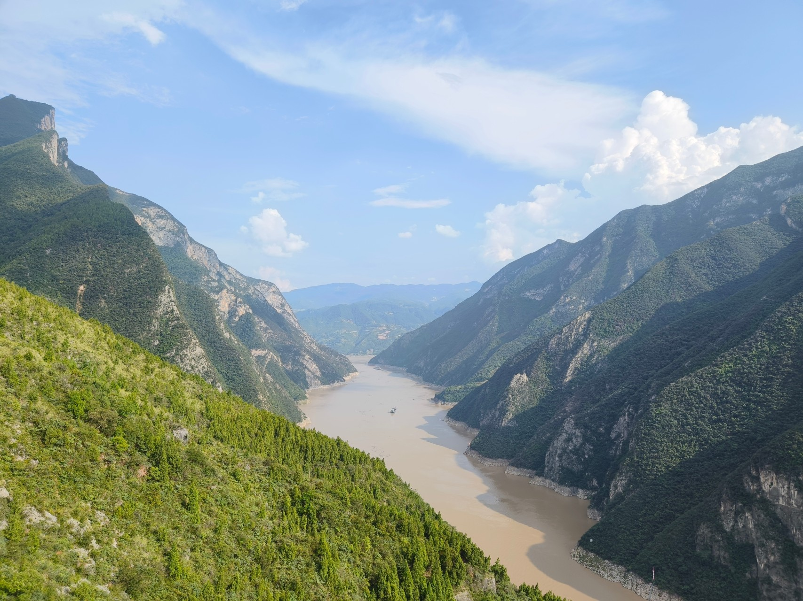||

其二，**探索的乐趣**。一旦你开始去寻找路上的风景，你就会体会到探索的乐趣是无穷的——中国这个国家被围起来的美景仍然只占极小部分，大多数美景仍然只有很少人到达。当一个景区不够硬核，却又让你有点犹豫要不要进去时，你可以首先找一找是否附近有可以替代的景观；如果找到，你将不花钱**独享美景**。此外，你一念之间决定的路线，也可能会给你带来意外的惊喜。

这里分享一下我的三个自驾游中的例子。

第一个例子是在四川省若尔盖县。在一个计划中的行程当中，我遇到告示说前方的路塌方，禁止车辆通行。

当时，我看没有下雨，觉得不会有什么危险，又没有人拦着，我就大胆往前走。结果前方有一段很窄的十几公里的路，却能独享一段从森林爬升到草原的独特体验。这段若尔盖县铁布镇到花湖的路，穿越了梅花鹿自然保护区，人称“小独库”。

第二个例子是在青海省德令哈市。我一念之间闯入了一个单位的院子。当时看到院子的铁门是敞开的，我就一脚油门溜了进去。没想到等我出来的时候院子的铁门锁上了，我被关在了院子里面。

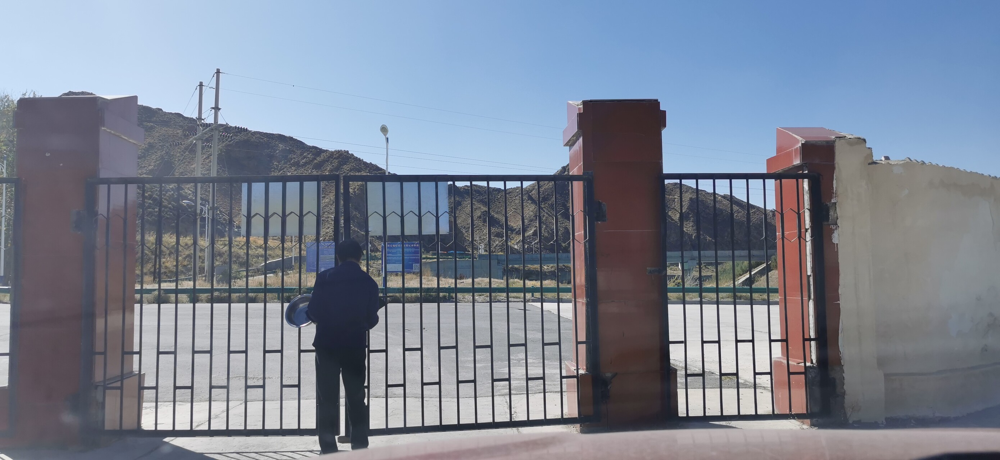

不过发现被锁在院子里面的时候，我丝毫不慌张，因为我已经独享了一处宝石蓝色的湖泊。这个湖泊叫做黑石山水库，而院子是水电站的大院。因为水电站的大坝是危坝，所以不让人进来参观。

第三个例子是在内蒙古额尔古纳市。当时我在犹豫要不要去额尔古纳湿地公园。这个公园的门票需要65元一张，并且游客进到景区后还需要爬台阶才能到达最主要的观景台，所以我就想找找替代的景点。研究地图之后，我找到一个紧挨着景区的观景点。

在我开着车走到快要到达这个预设的观景点时，发现再往前走是一个湿地研究站的院子，门口写着“闲人免进”，但是并没有人拦着。我一路开到小路的尽头，终于找到了独享额尔古纳湿地的打开方式。

# 简单谈谈目的地选择和路线规划

自驾游路线规划不是这篇文章的主题，但是我还是总结一下我的几条经验。

## 合适的时间去合适的目的地

每个地方都有它最美的季节。反过来说，我们也应该根据现在的季节选择去玩最应季的景点。

春天：南方。

夏天：海拔稍微高一些的地区，或者东北。可避暑。

秋天：YYDS。不同的地方秋天到来的时间不一样。新疆、内蒙、东北: 9月；华北：10月；华南：11月。

冬天：选择云南、海南、两广等等。可避寒。西藏冬天去最佳，免门票，不下雨。

此外，如果天气不好，连日阴雨，景色一定会大打折扣。所以，我们在出发前一定要看看天气预报。如果到了目的地之后遇上连日阴雨，那么宁愿一开始就不去。

最后，许多景点都是清晨或者傍晚最美丽，而且人少。作为自驾游游客，你可以随意分配自己的时间，因此可以充分考虑在清晨或者傍晚的时候待在景区里。考虑了这一点，你就需要结合实际情况来修改你的路线和时间表。

## 路线规划tips：

规划一条路线，最简单的办法就是把一个个相距不远的景点串起来，每天去一到两个，每天都行驶一段路程。在此基础上，我们还要考虑以下几点：

1. 尝试异地还车，不要拘泥于环线。
2. 避免连续游览同质化景点、走同质化路线。比如一些草原路线，草原面积大，景色单调。如果天天看草原，看个两天你也就腻了。
3. 利用地图，尤其是卫星地图来规划，来规划景观类型丰富的路线。
4. 避免单日行车时间过长，最好不要超过4小时。也要适当下车活动，不要总是坐在车上。否则，你会觉得假期很累。
5. 如果你带小孩，那么尽可能上午玩、下午行车。小孩上午精力充沛，下午要睡觉。

当然，路线规划并不能决定一切，有时候可能只是因为你的一个临时起意，你就遇到了最美的风景。

# 结束语

我们做任何事情都要考虑效益，所以省钱并不丢人。如果按照以上介绍的这一套组合拳来操作，一趟原计划一万元的旅程也许你能省下来一两千元。

一顿操作猛如虎，一看也就省了一千五。而且全家出行，我们也要充分照顾家人感受，避免旅途劳顿。出门旅游是为了放松，不要因为省钱搞得过于疲劳。考虑到你为了省钱还需要耗费一些多余的时间去做各种盘算，我们需要在省钱和消耗的额外精力之间找一个平衡点。

没有完美的旅游路线，踩坑不可避免。如果出门在外遇到坑了，我们也不必太纠结，出门玩好心情最重要。

最后，免费的景色毕竟越来越少了，围墙也建得越来越多，所以出门自驾游也要趁早。