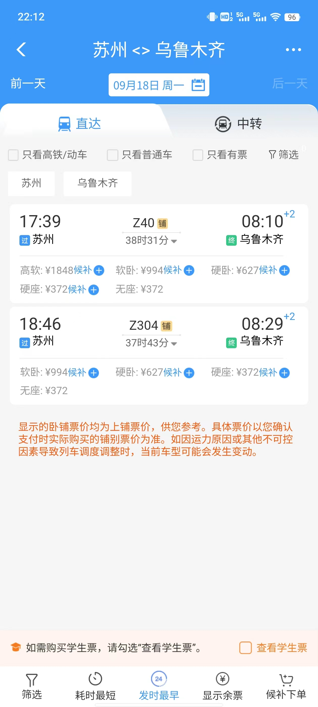
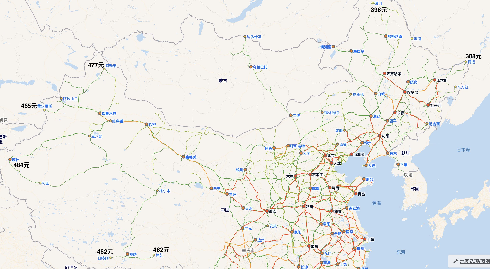
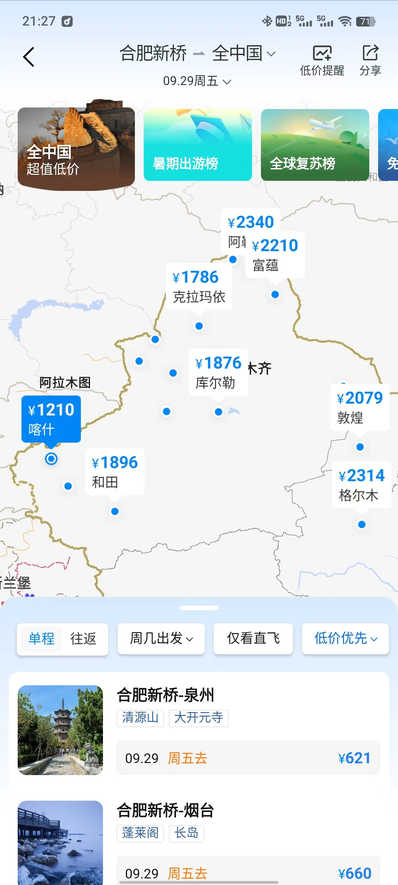
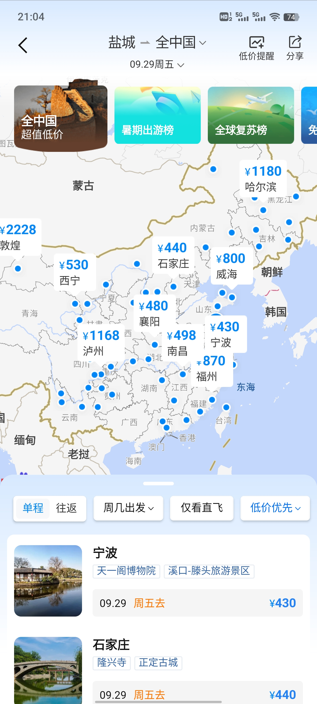
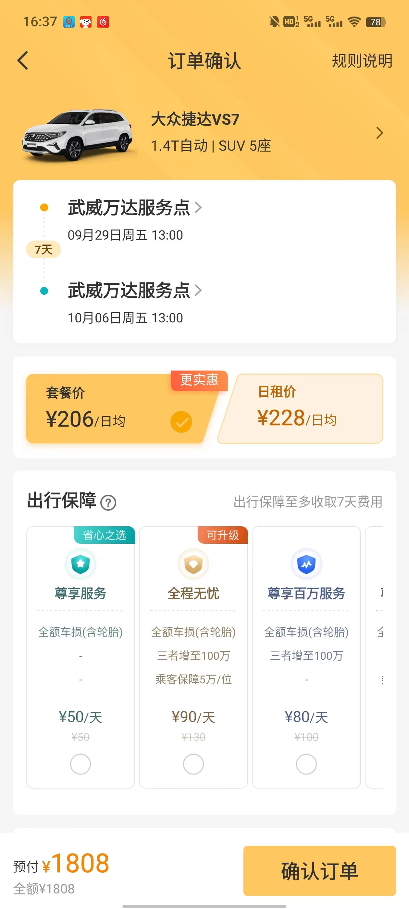

本文主题：省钱。

但我们要在好玩、不牺牲体验的前提下省钱。

DO MORE WITH LESS!

我们将从以下几个方面来节省成本，涵盖除餐饮之外的四方面主要出游开销。

1. 大交通
2. 租车
3. 酒店
4. 景点门票

# 最能节省出游花费的两个办法

## 开自己的车出游

开自己的车出游可以节省大交通和租车两大开销，适合近距离或者长假期自驾游。如此你将至少节省1/3的费用。

## 尽可能避免在五一和国庆这类长假出游

五一和国庆节假期大家都要出门，所以火车票和机票很难买。如果你休年假，**选择非公共假期出行**，将很容易成行并且节省较多的费用。

另外一个折中的办法是**在长假前后挨着的时间段休年假**，这样一来可以延长假期，二来避免了在最高峰出行，减少大交通费用。

虽然我们要避免在五一和国庆这类较长时间的公共假期出行，但是下面的建议在长假时仍然都适用。

# 一、大交通

大交通：从居住地往返目的地的交通。这是个旅游行业的术语。一般我们只能选择火车或者飞机。

## 火车优先

同样一段路程，火车一般成本更低。最重要的是，绝大多数火车票在公共假期是不涨价的。所以要节省费用，我们应该**尽可能选择火车出行**。

而对于1000公里以上的长途出行，我们应该尽可能选择普通火车的卧铺，而非动车或者高铁。因为长距离、5个小时以上的高铁/动车乘坐会比较地累人。（现在的动卧越来越少了，只有个别区段能有动卧可以乘坐。）

**夕发朝至的火车是长途出行的神器**，在时间节省方面可以达到甚至超过乘坐飞机的效果。

如果你计划假期第一天从苏州出发到乌鲁木齐去旅游，乘坐火车会消耗两夜一日，但实际消耗的假期为一天。

如果你选择飞机，从上海虹桥机场飞往乌鲁木齐的航班的飞行时间通常在5小时左右，加上从苏州到达虹桥机场至少需要1小时，以及至少提前1.5小时到达机场，乘坐飞机出行所消耗的白天时间已经达到至少7.5小时。如果再考虑有可能从离苏州较远的浦东机场出发，或者考虑飞机较高的延误率，下飞机之后较长的提取行李时间等等，这个旅行时间只会更长。综合考虑下来，我们也可以认为乘坐飞机将消耗你一天的假期。

|从苏州出发到达乌鲁木齐之大交通比较|火车|飞机|
|----------------------------|----|---|
|2023年9月18日价格及时间|||
|净旅行时间| 39小时 | 8小时 |
|实际消耗假期| 1日 | 1日 |
|票价/人|627(硬卧上铺)/1050(软卧下铺)| 1110(机票费) + 110(机建燃油费) = 1220 |
|附加交通费|(2(公交)/5(地铁)/30(打车)) x 2 = 4/10/60| 50(机场大巴或者动车) x 2 = 100 |
|隐形额外支出|0|200(航班当晚的酒店房费)|
|总费用|631/1110|1520|

在公共假期的第一日前后，火车票价是不会上涨的，而飞往乌鲁木齐的机票价格将上涨至3000元左右！因此，大交通费用上如果能选择火车，单程便能节省2500元左右！

所以，如果你能适应乘坐卧铺，并且买到合适的夕发朝至的列车车票，你将会节省大笔费用。就这个例子来说，如果你白天能有在火车上消磨时间的办法，那就更合适不过了。

我们举一个更极端的例子。有的公司（某些外企）允许员工在家办公，而你恰好在苏州这样一家公司工作，正打算去乌鲁木齐以及新疆旅游。我们假设长假第一天是10月1号，那么你可以购买9月29日晚出发的火车票——这会比9月30日的车票更好买，更远离公共假期。你将在9月29日下了班之后登上火车，9月30日安心地在火车上工作一天，最后于10月1日早晨，在离苏州4000公里外的乌鲁木齐的大街上，你将开始你假期的第一天。节省假期时间的效果拉满！

最后，如果你是特种兵，能适应超长时间的硬座，你将会节省更多费用。理论上，你只需要500元，就能达到中国每一个通了火车的角落。中国铁路三十年不涨价，服务于无论贫富的每一个人。

下面这张地图显示了从苏州乘坐硬座到达全国最偏远的火车站的总花费。

## 火车票区间限售和候补

如果选择火车出行，那么真正的问题是如何在节假日买到火车票。

我们一般会去12306（APP或者网站）购买火车票，这是官方渠道。但是，在买火车票之前，我们应该首先了解火车票区间限售的现象，以及候补怎样兑现的问题。

高峰时段，我们很难在第一时间直接购买到需要的火车票的。想要买到心怡的车票，我们一般应该做到第一时间候补，并且最好是选择同车次始发站为起点。

候补是一个黑盒的排队机制。候补什么时候能兑现？我认为最大的影响因素并不是有多少人排队，又有多少人退票，而是区间限售的解锁时间。

什么是区间限售？假设一趟火车的路线是A -> B -> C -> D -> E -> F -> G，始发站是A站，终点站是B站。那么一个典型的区间限售规则就是：

1. 开车15天前，统一开票，但是仅A站出发，到达E、F、G站的车票有售。（限售始发站+限售E站以远）
2. 开车7天前，开放其他所有区间车票的购买。（解锁区间限售）

区间限售的复杂在于，各个铁路局、各个车次的限售区间和解锁时间都不一样，极为复杂。就以上例子而言，有可能出现这些不同的区间限售情况：

1. 解锁区间限售的时间并不一定是开车前7天，也有可能是开车前3天，或者开车前24小时，亦或者开车前当天早上。某些极为诡异的解锁时间为熟悉规则的人提供了暗箱操作的可能。
2. 一些热门席位（尤其软卧）有可能出现全区段限售，即没有任何人能在开车15天前买到A站出发到G站的该席位车票。我就遇到过我想要购买的哈尔滨出发的始发终到软卧车票直到开车前24小时才候补兑现。因为我是一次性候补四张软卧车票，所以可以肯定不是因为有人退票，而是因为限售解锁了我才候补兑现成功的。
3. 区间限售并不一定是限售某站以远。例如，有可能在某一时刻，你可以买到B站到E站的车票，但是B站到F站的车票却是锁住的。
4. 即便A站和B站距离极近，甚至在同一城市，也很有可能出现始发站限售，即A站出发可买，而B站出发不可买。

真实的区间限售远远不止上面列出的这些情况，极为复杂，甚至可以说是有些随意。如果你想要分析出来你想买的那趟车的区间限售规则，可以多多地在12306上观察非假期时段各个区间的放票时间。因为你可以假设非假期时段是没人买票的——许多热门的T/Z字头列车除外。

其实，火车票的区间限售机制几十年来一直都有。此外，还有预留车厢机制，即之前没人讨论这一现象，是因为买票需要到人工窗口，尝试成本极高。在12306上线之后，人们才可以很容易地观察到这种现象了，这个问题才最终浮出水面。

总而言之，想要候补成功，首先要在**第一时间（提前15天）挂上候补**，确保你尽可能排在最前面。

其次，要尽可能**延展你的购票区间**（代价是多掏钱），至少也要做到购买始发站的车票。

最后，就是一定要**头铁**，不坚持到开车前两小时绝不撤单。（当然前提是你做好买不到票的预案。）根据我的经验，第一时间就挂了始发站候补，并且坚持到最后仍不取消的，失败率几乎为0。如果你有过第一时间候补却没有兑现成功，那么很可能是因为你因为担心不能成行，去寻求别的交通方式而提前取消了候补订单；如果你有过候补到开车前两小时自动退单的情况，那么很可能你的候补订单不是在第一时间下的。

此外，全家多人出行一定要下**一单多票**，而不要下多单多票。

多单多票即下很多个候补订单，但是每个订单只候补一张车票。这个做法理论上会增加一些抢到票的概率，因为一张票比多张票更容易候补兑现。抢票软件一般也会提示你说一单多票会严重影响抢到票的概率。

然而，多单多票这种做法往往得不偿失。因为多人出行只要其中有一个人没有买到票，仍然是不能成行的。比如你4人出行兑现了3张，那么你不但不能成行，还需要把买到的其他3的票退掉，损失20%的退票费。当然，这个问题真实的成行概率需要数据支撑去做一个精确的计算，这里不做深究。但是还是有另外两个现实的原因使得一单多票是更好的选择：

1. 我们每个人只能注册一个12306账号，而一个12306账号又只能下两单候补，配额十分珍贵：如果你去程下一单候补，回程下一单候补，你就用完了你的候补配额。而多单候补则需要操作2个甚至更多的12306账号，会非常麻烦。
2. 等待多单兑现不如等待一单兑现让人更安心。等待一单兑现，就一句话：行或者不行——反正我们先做好不行的预案。而等待多单兑现，可能就像盯着你买的股票的心情了。

## 抢票软件

我们仅仅使用12306 APP或者网站来候补火车票还不够，**应当使用抢票软件**。

首先，计算机程序肯定比你手动操作要快，能帮助你尽早下单候补，尽可能排在队伍的前面。

其次，抢票软件可以帮你抢到候补之外的票。例如，开车前几天你要购买的那趟车它可能临时加挂了一节车厢，这个车厢的车票有可能被抢票软件扫描到，然后就被抢到。还有，就是一些意料之外的区间解锁车票也可能被抢到，因为抢票软件通常有自动多买几站或者少买几站的功能。

抢票软件的开发者对于区间限售的问题是有较深研究的。所以，在使用抢票软件时可以根据软件的提示做出选择（比如多买、少买一站、多选车次、多选席位等等），这是肯定能提升买到票的概率的。

偶尔，我们会发现抢票软件有bug，比如明明12306上看到实时有票，它却还在那里抢呀抢没抢到。这也许是程序bug，不是普遍现象。总体而言，我认为主流的抢票软件还是值得信赖的。

至于抢票软件兜售的那些加速包、VIP等是否应该购买，我暂时没有结论。理论上，如果按照抢票软件所宣传的给加速包或者VIP用户增加带宽和计算资源，那么确实有可能会增加买到票的概率。但是这个东西只有抢票软件自己才有完整的统计数据，才知道这个增值服务到底有没有用、到底能增加多少买到票的概率。所以，这个问题需要你自行判断了。

## 在价格最低时购买机票

火车不是万能的。飞机相比火车还是有很多优势：旅行时间更短、可以提前很长时间买票因而不用担心无法成行，等等。

乘坐飞机最大的劣势在于价格，所以，购买更便宜的机票才能省钱。

飞机票的价格是浮动的，这意味着有可能你买到一张机票之后，其价格马上又降了几百块。这种情况会让人很不爽。所以，想要在价格最便宜的时段购买机票，这本质上是你和航空公司的一个价格博弈的过程。

不同的航空公司有不同的价格调整策略；这个策略必然是相对稳定的、程序化的。这个调价策略中最重要的两个变量肯定是时间和剩余票数。如果时间上离航班起飞时间还比较长，剩余机票又不多，那么航空公司肯定就会上调价格。反之，如果时间上离航班起飞时间比较近了，而剩余机票数量还比较多，那么航空公司就会下调价格。

对于乘客而言，机票价格博弈是一个信息不对称博弈：

1. 乘客无法知道目标航班的剩余票数。一般而言，机票代理商只会告诉你某个价格的机票只剩个位数了，给你赶紧买再不买就买不到了的心理暗示。据说，曾经在航旅纵横APP上可以查到整架飞机的剩余机票数，但是这个功能很快就被下架了。
2. 乘客无法知道机票调价策略的具体公式。航空公司还可以不断变换调价策略；不同的航空公司又有不同的策略。因而这一问题极其复杂。

所以，想要做到精确地在最便宜时段下单你心怡的机票，是很难办到的（或者说这个问题没有解析解）。我们只能去观察一段时间内的同班次飞机的价格变化，来估计目标航班的价格是否已经处在最低位置（即这个问题只有近似解）。

例如，你要买周六某一航班的机票，那么当你通过连续几天的观察，发现周一到周五的同班次航班的最低价格大致是500元左右，那么当你看到周六的航班某一天也下调到500元左右，你就可以下手了。这种办法在非高峰时段还是很有效的。我个人感觉，一般的机票价格会在航班前2周到1周左右达到最低。

然而，在真正的高峰时段，这种办法是肯定会失效的。因为高峰时段的供需关系和非高峰时段的供需关系完全不能比。很可能，你从一个月之前开始观察目标机票的价格，最终只是发现它一路上涨，直到起飞前几天，全价票也最终卖光。

那么是不是我们想要买高峰时段的机票的时候就只能束手无策呢？也不尽然，就我所知还有两种可操作性比较强的办法。一个是空铁联运，一个是中转弃程。

## 空铁联运

由于中国有比较发达的铁路网，所以空铁联运其实是一个很常见的旅行方式。空铁联运规划得当，可以在不怎么牺牲体验的情况下节省较多的出行费用。

举一个简单的例子。假设我们要去海南岛，去三亚最好的沙滩**亚龙湾**度假。从苏州出发，我们考虑选择上海虹桥机场的航班。

下面的表格比较了9月16日直飞三亚凤凰机场和先飞海口美兰机场然后再乘坐动车抵达三亚两种方案的用时和费用。

|从上海虹桥机场出发到达三亚亚龙湾之两种方案比较|直飞三亚然后去亚龙湾|先飞海口再去亚龙湾|
|----------------------------|----|---|
|2023年9月16日价格|||
|选择航班|吉祥航空10:15 - 13:10|海南航空8:30 - 11:25|
|净飞行时间| 2小时55分 | 2小时55 |
|价格|950元|550元|
|额外交通费| N/A | 美兰站-亚龙湾站动车 108元|
|额外交通时间| N/A | 美兰站-亚龙湾站动车 约1小时30分钟|
|出租车交通费用|约95元| 约28元 |
|出租车耗费时间|约35分钟| 约15分钟 |
|总支出|1045元|686元|
|总净旅行时间|3小时30分钟|4小时40分钟|

由此可见，在多花费约1小时10分钟的情况下，空铁联运可以为我们节省359元（约35%）的费用。

在高铁网络越来越发达的情况下，通过空铁联运来省钱是具备普遍可操作性的。一般来说，热门旅游目的地的直飞价格会比较高。而先飞往热门旅游目的地附近的大城市，然后再乘坐高铁或者火车达到该目的地，往往能为我们节省较多的费用。

## 中转弃程

简单来说，中转弃程就是购买中转机票，只乘坐前一段航班，不乘坐后一段航班，因为中转地才是我们真正的目的地。

举一个简单的例子。假设我们国庆节从西北游玩结束要从兰州中川机场回到北京。那么10月7日回北京可以选择的最佳航班可能是国航的兰州-台州/盐城的中转航班。

|从兰州中川机场出发到达北京的两种方案比较|直飞|中转弃程|
|----------------------------|----|---|
|2023年10月7日价格|||
|价格|同班次CA1222 2210元+110元=2320元；最低直飞价格约为1400元|800元+110元x2（燃油机建费）= 1020元|

如果乘坐国航CA1222回北京，在完完全全一样的体验下，中转弃程方案将立刻帮你节省高达1300元。此外，后一段（北京飞台州这一段）机票的燃油机建费是可以100%退掉的，这样还能再节省110元。你可以在出行时仅乘坐前一段航班，不要值机后一段，等到前段落地了之后再退掉后一段机票。

甚至还有一个更骚的操作，就是前一段航程落地后，不要着急退票，而是先等等看，如果后一段航程出现计划变更或者起飞延误半小时以上（这两个事情发生的概率并不小），你甚至可以将后一段机票全退！例如，这个例子中兰州飞到台州有两段，这两段的票面价格分别是450元和350元，加起来就是800元。那么，在后一段航班出现“非正常航班”的情况下，你可以再退掉350元的后一段机票，从而实现了只用450元+110元=560元就得到了与购买全价票的直飞乘客完全一样的出行体验。

有新建机场的地方更容易薅到这种中转低价羊毛。因为新建的机场往往客流尚未饱和，需要通过一些低价手段吸引客流，包括北京大兴、青岛胶东、成都天府、郑州新郑机场等等。

最后，需要注意的是中途有经停的航班不能这么操作的，你不能在经停地放弃后一段行程。因为乘坐中途有经停的航班时你本质上只买了一张机票，而这张机票是不能拆分的。而中转机票则本质上则是两张机票，所以你放弃后一段行程是完全合理合法的。

## 发现低价机票

无论是采用空铁联运还是中转弃程的手段，前提都是要知道哪些航线上有低价机票。

我个人常用的手段是利用携程APP里的“搜全国低价”。在携程APP的首页可以找到这个功能的入口。

进入到这个入口之后，你可以设置时间和出发地点，然后就可以看到该出发地点在指定时间段内到全国各地的最低价格。它把所有的价格信息压缩在一张地图上，从而让你能比较容易的判断在你目标航线附近是否有低价航线。

例如，我们打算国庆节从苏州出发去西部旅游。国庆节假期的第一天是9月29日。于是，我们把这个搜索界面中的时间设置成仅9月29日这一天，而出发地则把附近的城市全部遍历一遍。

如果你打算去新疆旅游，那么就会发现从合肥出发到喀什有低价机票，只需要1210元。而苏州到合肥乘坐动车约2小时，花费100多元，班次也很多，到达合肥新桥机场大约总耗时在3小时左右。所以，你有可能就会通过这种空铁联运的方式，在国庆长假的最高峰时段，以较低的花费抵达新疆。

如果你打算去西北旅游，那么就会发现从盐城出发到西宁有低价机票，只需要530元。在通苏嘉甬高铁通车之前，从苏州到达盐城机场较为不便，需要先乘坐汽车耗费约1小时到达常熟火车站，然后从常熟火车站乘坐约1小时的动车到达盐城站，最后再打车去盐城机场。这个附加的交通总耗时也大约需要3小时。然而无论是从无锡硕放机场出发还是从上海虹桥机场出发，在假期第一日飞往西宁的机票价格都在1500以上。实现空铁联运，你至少能节省八百多的出行费用。

空铁联运并不难操作，而中转弃程则要更难操作一点，这主要是因为中转低价票并不是一个特别常见的现象，**需要你经常去观察机票价格地图**。互联网上已经逐渐有越来越多的人在讨论这种低价买机票的手段，我也去B站上看过一些up去介绍所谓的购买中转弃程机票的操作方法，但是感觉他们介绍的方法都不太靠谱。我个人总结下来，认为要发现中转低价票可以如下操作：

1. 设定出发地A地，打开某一日的机票价格地图。
2. 假设你的真实目的地是B地，那么你要在地图上搜索一个C地，这个C地要尽可能满足两个条件：一是A地往C地价格较低，二是A、B、C三地构成一个三角形，这个三角形越接近等边三角形，那么A地到C地的航线就越有可能是你要找的低价中转航线。
3. 点开A地到C地的航线，验证是否有经B地中转的低价机票。

总而言之，中转弃程方案的成功率虽然不高，但是仍然有可操作性。它需要你对地图信息的敏感，也需要一点点运气。事实上，所有的低价机票信息都是公开的。所以，设计一个软件来实现对中转低价票的监控是完全可以做到的。

互联网上**可能已经存在**一种功能强大的软件，它可以通过不断爬取公开的低价信息来及时地给你低价提醒，方便你设计出更省钱的出行方案。

# 二、租车

一般来说，租车平台有两类：直营和第三方平台。直营主要是神州和一嗨这两家；第三方平台则包括携程、飞猪、滴滴等等，这些平台上面由许多各地的本地租车公司提供租赁服务。

这两种租车平台各有特点。神州和一嗨因为是大公司直营，所以不太会跟你扯皮，取还车比较方便，价格比较透明，不太会随意波动。而携程等第三方平台由于是各地的小租车公司提供服务，所以良莠不齐，你需要一点运气。一般来说，自驾游特别火爆的地方，例如新疆、内蒙的一些地方，往往本地租车公司会比较多，相互竞争十分激烈，从而导致直营的神州和一嗨在价格和可选择车辆上会比较劣势。而在自驾游不是特别火爆的地方，神州或者一嗨则往往占据了价格优势。需要注意的是，一个地方自驾游不火爆并不一定意味着旅游就不火爆。

总体来说，这两种平台都是可以考虑的。

如果是自驾游生手，我最推荐的还是选择神州租车。因为神州租车还车很容易：我在神州租车几乎每次还车的时候验车员都不怎么认真看的。而且在神州租车万一出现事故或者违章处理起来也比较方便。

如果你发现神州和一嗨这两家没什么车可选，报价也比较贵，那么就去看看携程这种第三方平台的报价，往往会有惊喜。

## 避开人流密集的热门自驾游起点城市

租车省钱的逻辑和买机票很相似，都是要想方设法去避开最热门的城市，选择附近的低价城市。

假设我们国庆假期要去西北自驾游，选择神州租车，从以下这些各自相距大约200公里的城市的神州租车门店租同一款车，在同一时间段的租车总价，就会发现差距挺大的。

|城市|天水|兰州|西宁|武威|张掖|
|---|---|---|---|---|---|
|神州租车订单 |  |  |  |  |  |
|总价|2312元|3761元|3761元|1808元|4517元|

从上面这个表格我们可以看到，由于西宁和兰州是热门的青甘大环线自驾起点，所以国庆期间神州租车的价格上涨较多。而张掖由于最近几年旅游业发展得比较好，又是兰新客运专线的重要节点，所以报价上涨得甚至比兰州和西宁更猛。仅仅200公里外同样处于河西走廊的武威，报价只要1808元，比张掖低出2700元（低出60%）！

所以，如果你要走传统的青甘大环线，从武威出发相比于从兰州或者西宁出发将立省2000元左右。当然，因此你也需要结合你想去的景点的分布，从新设计一条从武威出发的自驾路线。

又比如，如果你想去甘南自驾游，那么你也可以选择从天水出发，而不是从兰州出发。在节省一笔租车费用的同时，也可以按时到达目的地。

在上面这张地图中，蓝色代表乘坐火车或动车路线，红色代表自驾路线。我们可以看到，如果从陕西方向坐火车过来，从天水开始自驾相比于从兰州开始自驾，不仅更节省租车费用，还要更节省火车票费用。总的时间消耗上则是差不多的，从天水到甘南的驾驶时间稍微长一些。

此外，即便是同一城市的不同租车点，神州租车的报价也是有差异的。机场、火车站的租车价格一般会贵一点，周租的差价会在100元左右。

## 异地还车

一般来说，我们租车自驾都会选择一个环线行程。一来方便规划行程，二来节省租车费用。神州和一嗨作为直营大公司，都是提供异地还车服务的。只不过异地还车或多或少会增加一些费用。而本地的小租车公司则一般不提供（非同城的）异地还车服务

如果我们选择了租车报价比较低的城市作为自驾游起点，那么可以重新规划路线，而不必拘泥于环线。起点城市租车价格低，而终点城市一般选择大城市，方便乘坐飞机或者火车回家。

异地租车的费用决定了我们如何设计非环线自驾游线路。如果异地还车费用过高，那么非环线的成本就太高了。

**神州租车的异地还车费用**比较透明，大约等于**起始地公路距离乘以2元每公里**。所以选用神州租车，如果要异地还车，那么起始地距离就不能太远，否则异地还车费用会非常高，难以承受。

**一嗨租车声称免异地租车费**，然而它的这个宣传是失实的。在一嗨租车的订单结算页面，它确实会显示扣除了异地还车费。但是它把异地租车的租车费用给调高了。举个例子，你如果要在苏州租车且在苏州还车，那么它可能给你报价100元一天；如果你要在苏州租车在南京还车（省内异地），那么它可能给你报120元一天；如果你要在苏州租车在青岛还车（跨省异地），那么它可能给你报200一天。总结而言，一嗨租车的优势是**同城异地还车免费**，**省内异地还车费用较低**；而跨省异地还车费用仍然比较高，和神州租车不相上下。当然，具体异地租车的费用会高出多少在不同的地方不一样，需要你自己查询。

所以如果你要走一条不是环线的自驾游线路，你还是需要查询这两家的总报价，声称“免异地还车费”的一嗨租车并不一定就更便宜。

## 是否需要买附加的租车保险

神州和一嗨都提供附加的保险（尊享服务、全程无忧）供你购买。除非你是特别新手的司机，否则**不推荐购买附加的保险**。主要理由如下：

1. 租车费当中已经包含了一定的保险费用。例如，神州租车就在基础服务费当中包含了：“车损1500元以上部分（不含轮胎）+三者保障20万+交强险等”。所以，其兜售的附加保险服务一般只是增加的保险的覆盖范围。而这个增加的保险覆盖范围是绝不值50元一天的——尤其是你的租车费用可能也就100来块一天。我们自己有车的朋友都知道，一台10万元左右的车其一年的全额商业保险也就两三千块钱，如果仔细计算，就会发现这个附加的保险服务相当于把一个成本10块钱的东西以50块的价格卖给了你，完全划不来。
2. 假设你出远门自驾游，每次租车一个星期，所以每次购买附加保险需要额外增加支出 50元/天 x 7天 = 350元。又假设你出一次意外（爆胎等）需要赔付给租车公司1500元。那么，如果你每4次租车出1次意外，你购买附加保险的费用就和你没有购买附加保险因而需要赔付给租车公司的费用大致相当了。然而从风险角度考虑，一般的司机出意外的概率应该会比每4次租车出1次意外要更低一些。所以即便你某次租车出游出了点意外，赔了租车公司一千多块钱，你也不用后悔没买附加保险。只要你坚持不买附加保险，这个费用就能省回来。

# 三、酒店

假期提前预定。选择相比于平日涨价比例低的酒店。许多私营酒店忘记提前调整长假期间的价格，或者调错了时间。

直接打电话过去预定，非假期还可以尝试现场预定，抽出你的大刀砍价。还可以尝试让租车公司/旅行社帮你预定：相当于团购。

尽可能避开热门旅游景点附近的酒店，而是选择附近的城市、县城、或较大的镇上的酒店。原因：1. 生活方便；2. 你有车，行动自由。

# 四、景区门票

假期时间宝贵，要避免选择非核心景点。选好核心景点之后，每天去一个，串起来。

进景区的缺点：进出景区麻烦：停车、验票、等景交车、走路不可避免，景交车乘坐体验远不如自己开的车。花了钱却没有得到更高的价值。

非必要不进景区，但核心景点不可替代。自驾游的核心价值：1. 风景在路上。

尽可能不买门票，而是选择相似的免费景观。自驾游的核心价值：2. 探索的乐趣。

可以尝试让租车公司、酒店甚至出租车司机帮你预定。

# 简单谈谈目的地选择和路线规划

## 目的地选择：正确的季节去正确的目的地

春天：选择正在开花的地方。

夏天：选择高原地区、东北，可避暑。

秋天YYDS：不同的地方秋天的时间不一样。新疆内蒙东北: 9月；华北：10月；华南：11月。

冬天：西藏冬天去最佳。选择云南、海南，可避寒。

中国天气网15天天气预报：如果连日阴雨宁愿不去。

## 路线规划tips：

善用异地还车，不要拘泥于环线。

避免连续玩同质化景点、走同质化路线。

善用地图：非一日之功。胸中有丘壑，脑中有中国。高阶玩家路线探索利器：谷歌地球。

避免超长单日行程。

避免每天都坐在车上，从不下车走走的送快递式自驾游。

带小孩自驾游路线规划：尽可能上午玩、下午行车。

清晨和傍晚往往是景色最为漂亮的时候。

路线规划不能决定一切，最美的风景可能只因为你的一个临时起意。

# 结束语

省钱不丢人，不要脸皮薄，但是要考虑为了省钱耗费的多余时间。

一顿操作猛如虎，一看也就省了几千块。不差钱就别搞那么麻烦了。

照顾家人感受，避免旅途劳顿。出门旅游是放松，不要因为省钱搞得过于疲劳。

没有完美的旅游路线，踩坑不可避免，不必纠结。

免费的景色越来越少，围墙越来越多，出门要趁早。