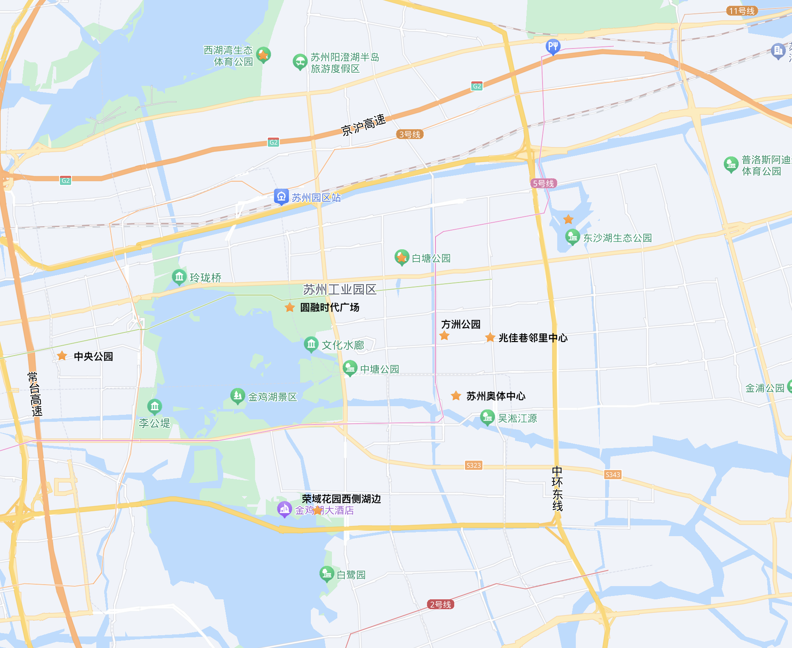
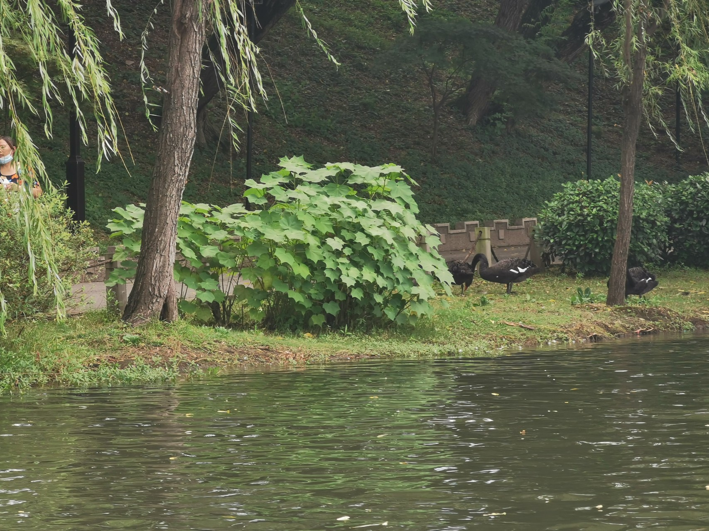
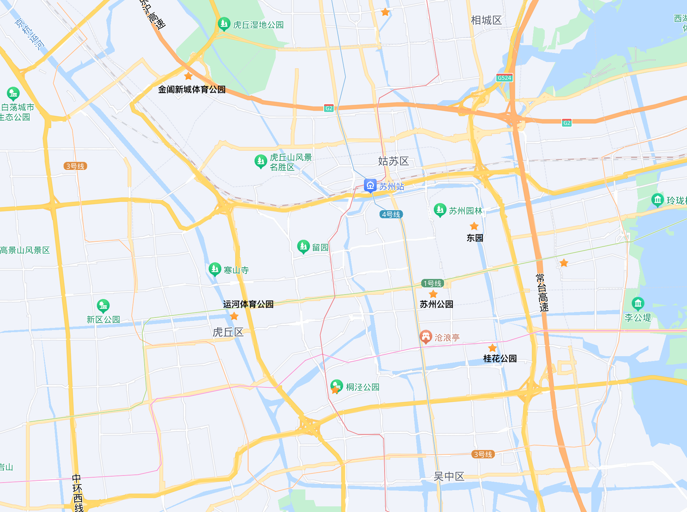

本文中，我将推荐40个以苏州工业园区为起点，自驾出发2小时以内到达，适合3岁以上小朋友的户外活动目的地。

现在的小朋友学习任务重，又有电视平板等各种诱惑，容易长时间处于用眼疲劳的状态。所以在我看来，周末的最佳亲子活动应该就是带着小朋友去公园里玩。其一，小朋友可以充分地活动身体；其二，能增加户外用眼时长，预防和改善近视眼；其三，能增加小朋友的社交渠道，让他们有机会认识新的朋友。

要在周末的一天或者两天内能够成行，路上花的时间就不能太长。所以我推荐的40个目的地在地图app上标明的车程都在两小时以内。而南京这种很适合遛娃的城市也被就此排除了。

我选取这40个活动场所还有以下3条标准：

1. 只推荐室外场所。
2. 无动力的游乐场优于动力型游乐场，因为它更容易让小朋友活动起来，也往往更耐玩。但是我仍然推荐了一些适合小朋友的动力型游乐场，因为小朋友和大人一样也喜欢刺激。
3. 性价比，最好是免费。

另外，我还会从4个方面给这40个目的地打分（最高⭐️⭐️⭐️⭐️⭐️）：

1. 乐趣；
2. 风景； 
3. 人气；
4. 性价比；

最后，这里推荐的地点都是我儿子去过的，都是来自我们家的第一手信息。

# 苏州工业园区

我家住苏州工业园区，所以我们从这里开始。

## 1. 苏州奥体中心

- 乐趣⭐️⭐️⭐️⭐️
- 风景⭐️⭐️⭐️⭐️
- 人气⭐️⭐️⭐️⭐️⭐️
- 性价比⭐️⭐️⭐️⭐️⭐️

苏州奥体中心由四栋主体建筑构成，这四栋建筑的中间有两片儿童游乐场地，其中常见的攀爬设施都有。因为周边小区众多，所以人气很旺。

有时候圆盘形的秋千上甚至人满为患。

这里比较耐玩，小朋友如果第一次来估计能玩2小时，值得推荐。而且更重要的是这里有各种其他的室内外运动场所，商场、电影院也有，停车也方便。它甚至南临斜塘河，河边景色也不错。

## 2. 兆佳巷邻里中心

- 乐趣⭐️⭐️⭐️⭐️
- 风景⭐️
- 人气⭐️⭐️⭐️⭐️⭐️
- 性价比⭐️⭐️⭐️⭐️⭐️

兆佳巷邻里中心离苏州奥体中心不远，是一片室内外兼有的商场。在两排商场的中间，有一片项目众多的儿童活动场地。同样是因为周边小区众多，所以人气也很旺。小朋友如果第一次来估计能玩1.5小时，同样值得推荐。

## 3. 方洲公园

- 乐趣⭐️⭐️⭐️
- 风景⭐️⭐️
- 人气⭐️⭐️⭐️⭐️⭐️
- 性价比⭐️⭐️⭐️⭐️⭐️

方舟公园是位于苏州奥体中心北面两公里左右的一个标准的市民公园，里面儿童游乐场所较多，人气很旺，值得推荐。

方洲公园里有两个儿童游乐设备比较高，家长们要注意关注小朋友的安全。如果第一次来估计能玩1个小时。

## 其他

苏州工业园区其实很大，但是这里仅仅只推荐了三个位于湖东的场地。还有一些其他的地方也是有免费的儿童攀爬设施的，如果顺路的话可以带小朋友去转转：

- 西湖湾生态体育公园
- 白塘公园
- 东沙湖生态公园
- 圆融时代广场
- 中央公园
- 荣域花园西侧湖边公园

其实总体而言苏州工业园区的公共儿童活动场地还是偏少的。

这里公园并不少，而且其中有许多公园风景很美，可是带小朋友过去却往往发现没什么东西可玩。比如独墅湖边的白鹭园就是这样一个典型。还好根据一些苏州本地公众号的消息，许多路边公园正在改造，将增加一些儿童游乐设施。

此外，就动力型游乐场方面而言，位于阳澄湖边的华谊兄弟电影乐园票价较贵，而且并不适合小朋友。位于金鸡湖边的摩天轮乐园其实还可以，但是它已经关门大吉6年了。

# 姑苏区

姑苏区其实是旅游热门地。在周末路上会比较堵，所以我建议大家乘坐公共交通前往。

## 4. 运河体育公园

- 乐趣⭐️⭐️⭐️⭐️
- 风景⭐️⭐️
- 人气⭐️⭐️⭐️⭐️⭐️
- 性价比⭐️⭐️⭐️⭐️⭐️

运河体育公园位于姑苏区和高新区交界的地方，在大运河的东面，寒山寺的南面，苏州体育中心的北面。

我们去玩的那次大运河边还在施工，工地围挡把公园和大运河隔开了，所以公园里的景色也打了折扣。

这里人气非常旺，很多大朋友在公园里运动或散步，小朋友就都集中在公园里的一块游乐场地里。

如果小朋友第一次来，估计能玩1.5小时，值得推荐。而且相信随着周围施工结束，环境会更加友好，景色会更加漂亮。

## 5. 苏州公园

- 乐趣⭐️⭐️⭐️⭐️
- 风景⭐️⭐️
- 人气⭐️⭐️⭐️⭐️⭐️
- 性价比⭐️⭐️

苏州公园是一个老派的市民公园，位于内城中心位置。通常有很多老年人在里头晨练、散步、下棋。但是苏州公园里面还有一个儿童游乐场，里面有自控飞机、mini漂流、mini海盗船等将近10种单独收费的电动游乐设施，比较适合低龄小朋友。这些游乐设施平均单次价格大约15元。在我看来，这个游乐场性价比不算高，很容易就花出去100多元。然而，在苏州市区里已经算是最适合小朋友的动力型游乐场了。

周末这里人气很旺。公园不大，中间有个池塘，可以租钓竿钓鱼玩一玩，也还是值得推荐的。

需要注意的是，大约两年前这里的儿童游乐场施工停业，不知道现在（2023年9月）重新开放了没有。所以大家去之前最好是打公园的电话问一下。

## 6. 东园-相门城楼

- 乐趣⭐️⭐️⭐️⭐️
- 风景⭐️⭐️⭐️⭐️⭐️
- 人气⭐️⭐️⭐️⭐️⭐️
- 性价比⭐️⭐️⭐️⭐️

东园位于姑苏区东面娄门的附近。这里离苏州博物馆、拙政园等旅游景点很近，所以附近很难停车。

东园里有小游船、小火车等收费项目。

小火车性价比很低，不建议乘坐。但是小游船还不错，因为这里不仅风景漂亮，湖面上还有很多动物。我每次带小朋友去这里坐船都感觉很惬意。

东园也有攀爬设施，但是不多也不大。此外，这里还有喷泉等容易吸引小朋友的景观。

最后，必须说明的是，东园和南面的护城河步道、相门城楼是连在一起的。这连片的公园景观非常丰富，人气也很旺，非常适合带小朋友去逛+玩，半天下来全家都会活动得比较充实。

## 其他

姑苏区有大量的园林，是旅游胜地。苏州园林名声在外，带小朋友去当然也是可以的。我们家没怎么去过，一个是门票比较贵，另外一个是怕节假日人太多体验太差，还有就是怕小朋友觉得无聊。可能等小朋友大一点之后，会办一张园林卡然后再带他去。

此外，姑苏区类似苏州公园的动力型儿童游乐场还有两家，分别是桐泾公园和桂花公园。我觉得这两家公园性价比都一般，所以不做单独推荐了。当然，如果你实在是想去近一点的地方，又没有别的选择的话，那还是可以去的。

最后还有姑苏区西北角的金阊新城体育公园，据说也值得小朋友去玩一玩。我还没有去过，无法评论。

# 苏州高新区

## 7. 白马涧

## 8. 大阳山植物园

## 9. 苏州博物馆西馆

## 其他

# 吴中区

## 10. 西山岛开心农场

## 其他

# 吴江区

## 11. 东太湖生态园

## 12. 芦荡湖湿地公园

## 13. 胜地生态公园

## 其他

# 昆山

## 14. 昆山城市森林公园

## 15. 古木河亲子运动公园

## 其他

# 常熟

## 16. 尚湖-尚湖飞熊乐园

## 17. 虞山

## 其他

# 张家港

## 18. 暨阳湖-暨阳湖欢乐世界

## 19. 梁丰生态园

# 上海

## 20. 上海动物园

## 21. 东方绿舟

## 22. 上海欢乐谷

## 其他

# 无锡

## 23. 金匮公园

## 24. 鼋头渚

## 其他

# 江阴

## 25. 要塞旅游风景区

附带：芙蓉湖/黄山湖风景区

## 26. 鹅鼻嘴公园-船厂公园

# 宜兴

## 27. 宜兴竹海景区

## 28. 陶祖圣境-竹尖长廊

## 29. 张公洞

## 30. 龙背山森林公园

## 31. 青龙山公园

## 其他

# 常州

## 32. 淹城野生动物世界

## 其他

# 南通

## 33. 南通森林野生动物园

## 34. 狼山

## 35. 滨江公园

## 其他

# 嘉兴

## 36. 少儿公园

# 嘉善

## 37. 嘉善越里

## 38. 柳洲公园

## 其他

# 海盐

## 39. 杭州湾融创水世界

## 40. 梦湖公园

# 桐乡

# 湖州

# 杭州

# 结束语

这40个遛娃目的地，你带着小朋友每周末去一到两个，可以半年不重样。

而我的小朋友还没有长大，我也还在广泛搜集周边适合小朋友的室外活动场所，也许以后还会写一个续集。