本文中，我将推荐40个适合3岁以上10岁以下小朋友的户外活动场所。

现在的小朋友学习任务重，又有电视、平板电脑等各种诱惑，容易长时间处于用眼疲劳的状态。所以，周末的最佳亲子活动，应该就是带着小朋友去公园里玩。这么做好处有很多：其一，小朋友可以充分地活动身体；其二，能增加户外用眼时长，预防和改善近视眼；其三，能增加小朋友的社交渠道，让他们有机会认识新的朋友。

要在周末的一天或者两天内能够成行，路上花的时间就不能太长。所以这40个目的地在地图APP上查询到的车程都在2小时以内。而南京这种很适合遛娃的城市也被就此排除在推荐名单之外了。

我选取这40个公共活动场所有以下3条原则：

1. 必须是室外场所。
2. 优先推荐无动力的游乐场。因为无动力的游乐场更容易让小朋友活动起来，也往往更耐玩。但是我仍然推荐了一些适合小朋友的动力型游乐场，因为小朋友和大人一样也喜欢刺激感。
3. 有一定性价比。如果是免费最佳；太贵的场所——例如上海迪士尼——则不推荐。

另外，我还会从4个方面给这40个目的地打分（最高5分⭐️⭐️⭐️⭐️⭐️）：

1. 乐趣。包含耐玩程度、寓教于乐程度、独特性等方面的考量。
2. 风景。优美的风景能让家长也得到充分的放松。
3. 人气。大家一起玩才更好玩。
4. 性价比。免费公园打5分；收费公园按性价比打1-4分不等。

最后，这里推荐的地点都是我和我儿子去过的，都是来自我们家的第一手信息。

# 太长不看

我先把这40个遛娃地总结在下面的表格里。其中，推荐值范围为0到5分，但达不到及格线3分的公园已经被我排除在推荐列表之外了。

| 市/县/区 | 遛娃地 | 推荐值（5分制） | 车程 |
| ------- | --- | --- | --- |
| [苏州工业园区](#苏州工业园区) | [苏州奥体中心](#1-苏州奥体中心)   [兆佳巷邻里中心](#2-兆佳巷邻里中心)   [方洲公园](#3-方洲公园) | 4.5   3.8   3.8 | <30分钟   <30分钟   <30分钟 |
| [姑苏区](#姑苏区) | [运河体育公园](#4-运河体育公园)   [苏州公园](#5-苏州公园)   [东园-相门城楼](#6-东园-相门城楼) | 4.0   3.3   4.5 | <30分钟   <30分钟   <30分钟 |
| [苏州高新区](#苏州高新区) | [白马涧](#7-白马涧)   [大阳山植物园](#8-大阳山植物园)   [苏州博物馆西馆](#9-苏州博物馆西馆) | 3.5   4.0   3.5 | 40分钟   40分钟   30分钟 |
| [吴中区](#吴中区) | [西山岛开心农场](#10-西山岛开心农场)   [宝带桥澹台湖景区](#11-宝带桥澹台湖景区) | 3.5   4.5 | 1小时30分钟   30分钟 |
| [吴江区](#吴江区) | [东太湖生态园](#12-东太湖生态园)   [芦荡湖湿地公园](#13-芦荡湖湿地公园)   [胜地生态公园](#14-胜地生态公园)   [潜龙渠公园](#15-潜龙渠公园)   [同里国家湿地公园](#16-同里国家湿地公园) | 3.5   4.3   3.5   3.5   4.5 | 40分钟   50分钟   50分钟   1小时   40分钟 |
| [昆山](#昆山) | [昆山城市森林公园](#17-昆山城市森林公园) | 4.0 | 50分钟 |
| [常熟](#常熟) | [尚湖-尚湖飞熊乐园](#18-尚湖-尚湖飞熊乐园)   [虞山](#19-虞山) | 4.3   4.3 | 1小时   1小时10分钟 |
| [张家港](#张家港) | [暨阳湖-暨阳湖欢乐世界](#20-暨阳湖-暨阳湖欢乐世界)   [梁丰生态园](#21-梁丰生态园) | 4.8   4.5 | 1小时20分钟   1小时20分钟 |
| [太仓](#太仓) | [市民公园](#22-市民公园) | 4.0 | 1小时10分钟 |
| [上海](#上海) | [上海动物园](#23-上海动物园)   [东方绿舟](#24-东方绿舟)   [上海欢乐谷](#25-上海欢乐谷)   [顾村公园](#26-顾村公园) | 4.8   4.8   4.3   3.8 | 1小时20分钟   1小时5分钟   1小时10分钟   1小时10分钟 |
| [无锡](#无锡) |  |
| [江阴](#江阴) |  |
| [宜兴](#宜兴) |  |
| [常州](#常州) |  |
| [南通](#南通) |  |

# 苏州工业园区

我家住苏州工业园区，所以我们从这里开始每周末的遛娃之旅。

## 1. 苏州奥体中心

- 车程 <30分钟
- 乐趣⭐️⭐️⭐️⭐️
- 风景⭐️⭐️⭐️⭐️
- 人气⭐️⭐️⭐️⭐️⭐️
- 性价比⭐️⭐️⭐️⭐️⭐️

苏州奥体中心由四栋主体建筑构成，这四栋建筑的中间有两片儿童游乐场地，其中常见的攀爬设施都有。因为周边小区众多，所以人气很旺。

有时候圆盘形的秋千上甚至人满为患。

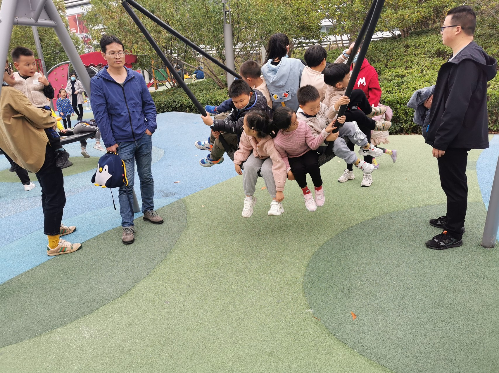

这里比较耐玩，小朋友如果第一次来估计能玩2小时，值得推荐。

而且更重要的是这里有各种其他的室内外运动场所，商场、电影院也有，停车也方便。

最后，它南临斜塘河，河边景色也不错，可以顺便去河边散散步。

## 2. 兆佳巷邻里中心

- 车程 <30分钟
- 乐趣⭐️⭐️⭐️⭐️
- 风景⭐️
- 人气⭐️⭐️⭐️⭐️⭐️
- 性价比⭐️⭐️⭐️⭐️⭐️

兆佳巷邻里中心离苏州奥体中心不远，是一片室内外兼有的商场。在两排商场的中间，有一片项目众多的儿童活动场地。同样是因为周边小区众多，所以人气也很旺。小朋友如果第一次来估计能玩1.5小时，同样值得推荐。

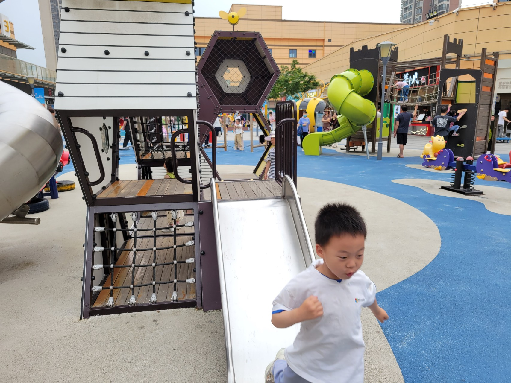

## 3. 方洲公园

- 车程 <30分钟
- 乐趣⭐️⭐️⭐️
- 风景⭐️⭐️
- 人气⭐️⭐️⭐️⭐️⭐️
- 性价比⭐️⭐️⭐️⭐️⭐️

方洲公园是位于苏州奥体中心北面两公里左右的一个标准的市民公园，里面儿童游乐场所较多，人气很旺，值得推荐。

方洲公园里有两个儿童游乐设备比较高，家长们要注意关注小朋友的安全。如果第一次来估计能玩1个小时。

## 其他

苏州工业园区其实很大，但是这里仅仅只推荐了三个位于湖东的场地。还有一些其他的地方也有免费的儿童攀爬设施：

- 西湖湾生态体育公园
- 白塘公园
- 东沙湖生态公园
- 圆融时代广场
- 中央公园
- 荣域花园西侧湖边公园

但因为这些地方耐玩度不够高，所以未被加入推荐列表。如果顺路的话可以带小朋友去转转。

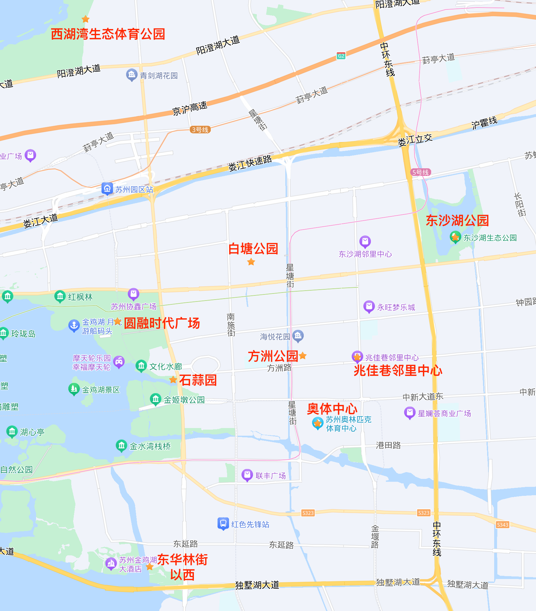

其实总体而言苏州工业园区的公共儿童活动场地还是偏少的。

这里公园并不少，而且其中有许多公园风景很美，可是带小朋友过去却往往发现没什么东西可玩。比如独墅湖边的白鹭园。幸好，根据一些苏州本地公众号的消息，许多路边公园正在改造，将会增加一些儿童游乐设施。

此外，就动力型游乐场方面而言，位于阳澄湖边的**华谊兄弟电影乐园**票价较贵，而且并不是很适合小朋友。位于金鸡湖边的**摩天轮乐园**本来还不错，但是它已经关门大吉6年了，不知道何时才能重开，重开之后又不知道还适不适合小朋友。

# 姑苏区

姑苏区园林众多，是外地游客来旅游的热门目的地。这里无论周末与否路上都很堵，所以我建议大家乘坐公共交通前往。

## 4. 运河体育公园

- 车程 <30分钟
- 乐趣⭐️⭐️⭐️⭐️
- 风景⭐️⭐️
- 人气⭐️⭐️⭐️⭐️⭐️
- 性价比⭐️⭐️⭐️⭐️⭐️

运河体育公园位于姑苏区和高新区交界的地方，在大运河的东面，寒山寺的南面，苏州体育中心的北面。

我们去玩的那次大运河边还在施工，工地围挡把公园和大运河隔开了，所以公园里的景色也打了折扣。

这里人气非常旺，很多大朋友在公园里运动或散步，小朋友就都集中在公园里的一块游乐场地里。

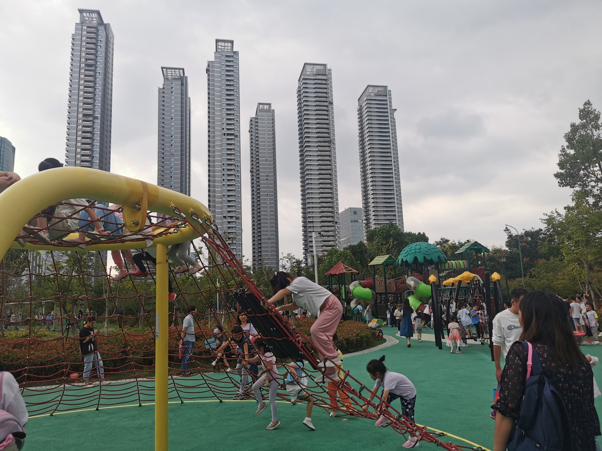

如果小朋友第一次来，估计能玩1.5小时，值得推荐。而且相信随着周围施工结束，环境会更加友好，景色会更加漂亮。

## 5. 苏州公园

- 车程 <30分钟
- 乐趣⭐️⭐️⭐️⭐️
- 风景⭐️⭐️
- 人气⭐️⭐️⭐️⭐️⭐️
- 性价比⭐️⭐️

苏州公园是一个老派的市民公园，位于内城中心位置。通常有很多老年人在里头晨练、散步、下棋。但是苏州公园里面还有一个儿童游乐场，里面有自控飞机、mini漂流、mini海盗船等将近10种单独收费的电动游乐设施，比较适合低龄小朋友。这些游乐设施平均单次价格大约15元。在我看来，这个游乐场性价比不算高，很容易就花出去100多元。然而，在苏州市区范围内，这已经算是最适合小朋友的动力型游乐场了。

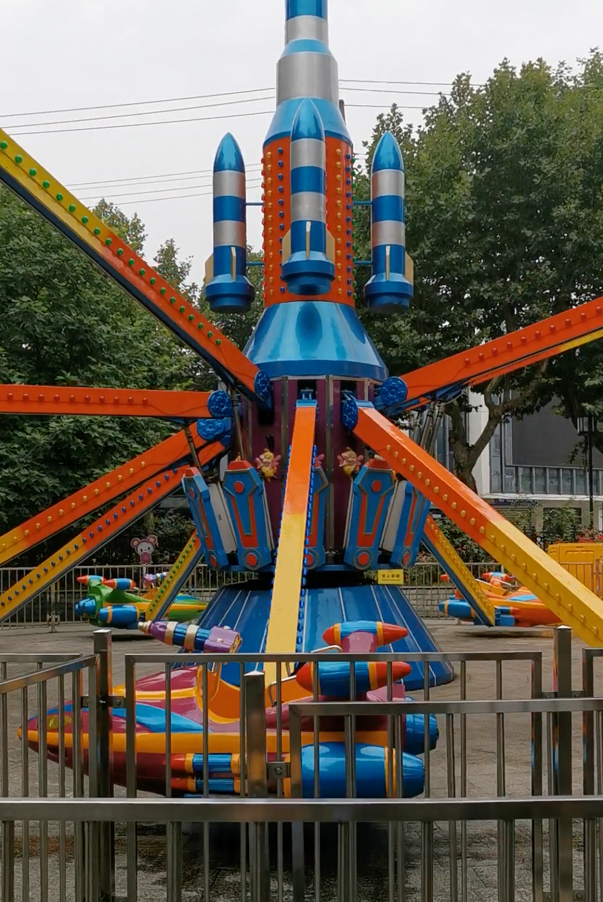

周末这里人气很旺。公园不大，中间有个池塘，可以租钓竿钓鱼玩一玩，也还是值得推荐的。

需要注意的是，大约两年前这里的儿童游乐场施工停业，不知道现在（2024年5月）重新开放了没有。所以大家去之前最好是打公园的电话问一下。

## 6. 东园-相门城楼

- 乐趣⭐️⭐️⭐️⭐️
- 风景⭐️⭐️⭐️⭐️⭐️
- 人气⭐️⭐️⭐️⭐️⭐️
- 性价比⭐️⭐️⭐️⭐️

东园位于姑苏区东面娄门的附近。这里离苏州博物馆、拙政园等旅游景点很近，所以附近很难停车。

东园里有小游船、小火车等收费项目。

小火车性价比很低，不建议乘坐。但是小游船还不错，因为这里不仅风景漂亮，湖面上还有很多动物。我每次带小朋友去这里坐船都感觉很惬意。

东园也有攀爬设施，但是不多也不大。此外，这里还有喷泉等容易吸引小朋友的景观。

最后，必须说明的是，东园和南面的护城河步道、相门城楼是连在一起的。这连片的公园景观非常丰富，人气也很旺，非常适合带小朋友去逛+玩，半天下来全家都会活动得比较充实。

## 其他

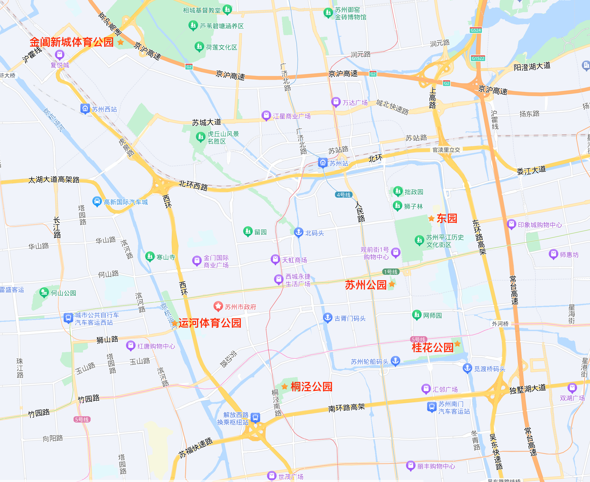

姑苏区有大量的园林，是旅游胜地。苏州园林名声在外，带小朋友去当然也是可以的。我们家没怎么去过，一个是门票比较贵，另外一个是怕节假日人太多体验太差，还有就是怕小朋友觉得无聊。可能等小朋友大一点之后，会办一张园林卡然后再带他去。

此外，姑苏区类似苏州公园的电动儿童游乐场还有两家，分别是**桐泾公园**和**桂花公园**。我觉得这两家公园性价比都一般，所以不做推荐了。当然，如果你实在是想去个近一点的地方，又没有别的选择的话，那还是可以去的。值得一提的是，这两家公园里的儿童游乐场是同一家公司在运营，他们的储值卡也是通用的。

最后还有姑苏区西北角的**金阊新城体育公园**，据说也值得小朋友去玩一玩。我还没有去过，暂不评论。

# 苏州高新区

苏州本是河湖密布的地方，很少有山。苏州高新区和吴中区是苏州市区仅有的两个有山的市辖区。恰好，高新区内我推荐的遛娃地都在山脚下。

## 7. 白马涧

- 车程 40分钟
- 乐趣⭐️⭐️⭐️⭐️
- 风景⭐️⭐️⭐️⭐️
- 人气⭐️⭐️⭐️
- 性价比⭐️⭐️⭐️

白马涧生态园位于天平山-天池山这一脉的北面山脚下，是著名山野徒步穿越路线“灵白线”的终点。白马涧由一系列小的河流湖泊串联而成。

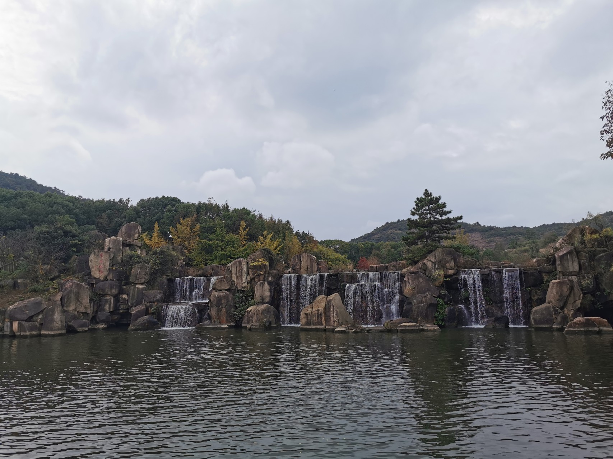

这个公园有一大特色，就是沿着公园的主干道两侧设置了大量的儿童游乐设施。有形态各异的滑梯，也有一些常见的收费游乐项目。各类不收费的设施足够小朋友们玩很久了。

白马涧公园的门票不贵，但是还是建议持**苏州市民休闲年卡**前往。

此外，如果没有体验过**苏州有轨电车**的，可以带着小朋友去白马涧公园北面的华山路上，乘坐一下有轨电车1号线。这可比坐一些公园里的小火车有意思多了，也便宜多了。

## 8. 大阳山植物园

- 车程 40分钟
- 乐趣⭐️⭐️⭐️⭐️
- 风景⭐️⭐️⭐️⭐️
- 人气⭐️⭐️⭐️⭐️⭐️
- 性价比⭐️⭐️⭐️

大阳山植物园位于大阳山南面。植物园的中心有若干个电动儿童游乐设施，价钱还算公道，人气很旺。

植物园的特色当然是看植物，尤其是里头有热带植物馆，很值得带小朋友一看。但是这个热带植物馆我最近一次去的时候（不知为何）关闭了，门票却照收，让人有点不爽。

植物园比较大，有各种吸引小朋友的东西，比如一些圈养的常见的动物、小松鼠隧道、大蝗虫的雕塑等等。这里大得足够带着小朋友逛一下午。

仍建议大家持苏州市民休闲年卡前往。

## 9. 苏州博物馆西馆

- 车程 30分钟
- 乐趣⭐️⭐️⭐️
- 风景⭐️
- 人气⭐️⭐️⭐️⭐️⭐️
- 性价比⭐️⭐️⭐️⭐️⭐️

苏州博物馆西馆本身不收费，需要预约，也比较难预约。

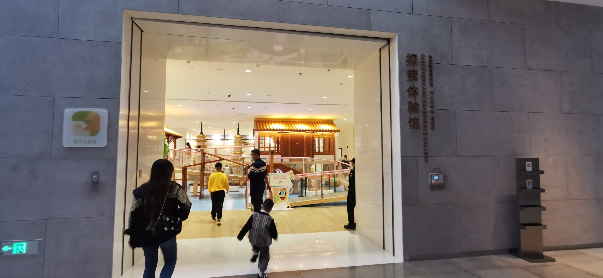

但是你以为我推荐的是这座博物馆吗？当然不是！我说了我只推荐室外遛娃地。在西馆的外头有两处室外儿童游乐场所，比较有特色。这两处场地中间由许多个隧道联通，小朋友们特别喜欢在这几个隧道间来回穿梭。

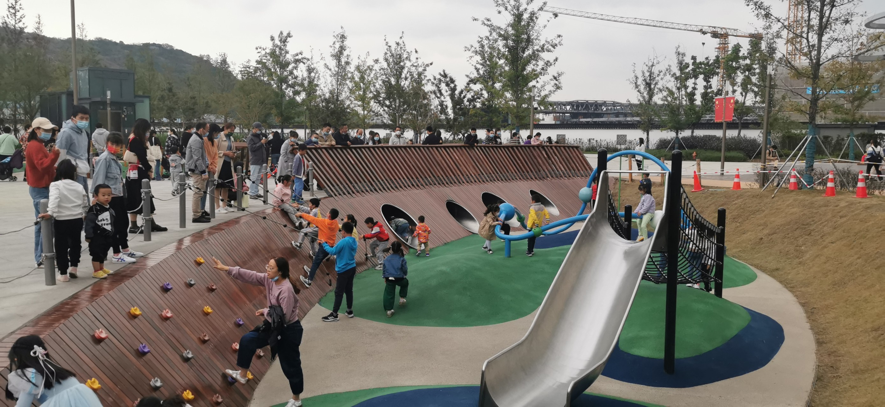

如果你能预约上西馆的门票更好了，可以室内室外一套玩个半天。

说到这座博物馆，让我想起来已经拆掉的老苏州乐园。老苏州乐园拆掉之后的这块地，就是盖起了苏州博物馆西馆的这块地。

我很怀念**老苏州乐园**，它在我眼里很耐玩，风景也比新苏州乐园更漂亮。我在刚来苏州的时候，有一天不是周末，我一个人来到老苏州乐园坐“火箭发射”连续坐了四次。后来又过了一年，我父亲来苏州探望我，即将离开的时候我就带着他去老苏州乐园玩，他坐过山车坐得很开心。

## 其他

苏州高新区有许多市民公园我都还没有去过，尤其是离我家比较远的科技城那一块。而在狮山街道内，我只发现苏州博物馆西馆这一块场地值得推荐。其他的场地例如**新区公园**，人气很旺但设施的可玩度太弱，故不作推荐。

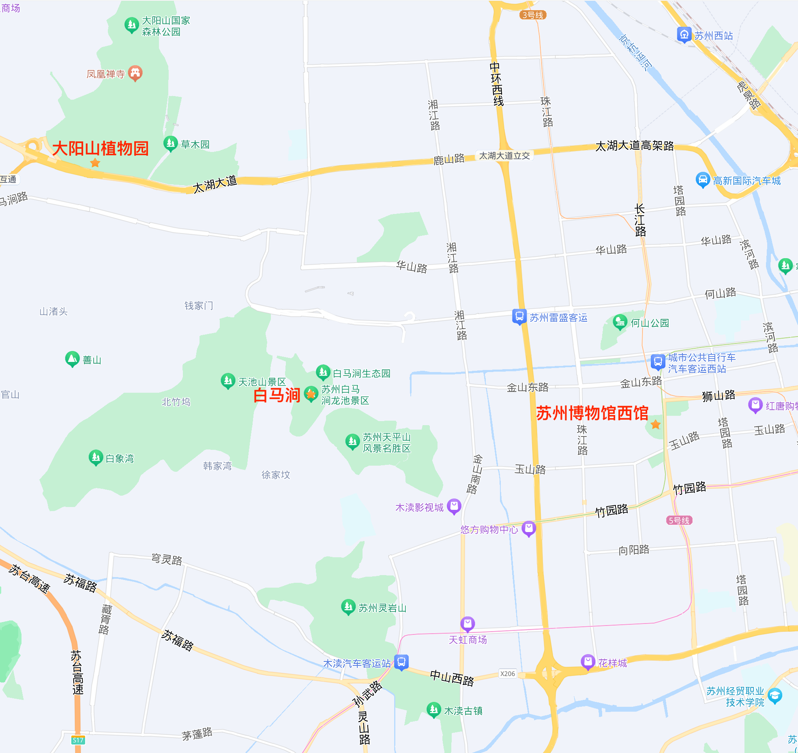

此外，高新区还有两大公园集中区域：大阳山和上方山。

大阳山区域有**苏州乐园森林世界**（也就是前面提到的新苏州乐园）、**苏州乐园森林水世界**，这俩都是比较大的游乐园，门票比较贵，可供低龄小朋友玩的项目少，游乐设施劣质，**性价比极低**——不管是大人小孩有想去的千万要避坑。

上方山区域则有**上方山动物园**。这个动物园去个一次还可以，属于能凑合着逛逛的那种。苏州这么大一个城市，只有这么一个连“苏州动物园”的牌子都不敢挂的动物园，性价比也不高，着实令人失望。上方山动物园中间区域有一块动力型儿童游乐场，收费比较高，建议避开。

# 吴中区

吴中区也有许多山，并且坐拥最长的太湖水岸，应该说是苏州市区旅游资源最丰富的区了。然而，真正值得推荐的儿童游乐场地却不多。

## 10. 西山岛开心农场

- 车程 1小时30分钟
- 乐趣⭐️⭐️⭐️⭐️
- 风景⭐️⭐️⭐️
- 人气⭐️⭐️⭐️⭐️
- 性价比⭐️⭐️⭐️

西山岛开心农场离西山岛入口处很近，从市区过来下了西山大桥不远就到了。门票收费大约40几块。它包括瓜果长廊、四季温室、百鸟园、粉色沙滩、无动力游乐区、萌宠动物园等。虽然收费，但是因为能吸引小朋友注意力的各种各样的东西多，所也比较耐玩。

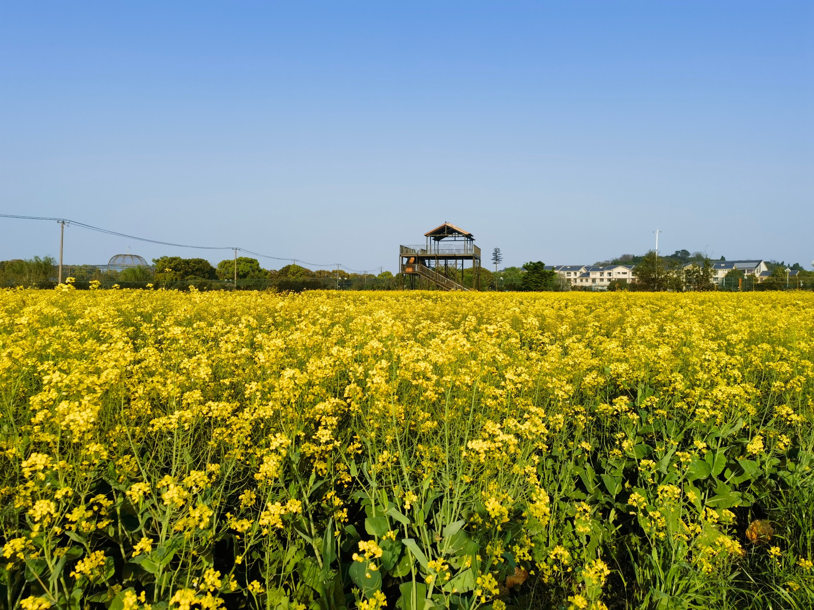

如果是从苏州工业园区开车过来，车程大约需要1个半小时。虽然这个地方还在苏州市区，但是路途竟然已经接近我们推荐的2小时以内的上限了！

## 11. 宝带桥澹台湖景区

- 车程 30分钟
- 乐趣⭐️⭐️⭐️⭐️
- 风景⭐️⭐️⭐️⭐️
- 人气⭐️⭐️⭐️⭐️⭐️
- 性价比⭐️⭐️⭐️⭐️⭐️

关于宝带桥，以下摘自百度百科：

> 宝带桥（Baodai Bridge），别名长桥，是中国江苏省苏州市境内的一座桥梁，南北横卧于大运河和澹台湖之间的玳玳河口，与古运河平行，是中国古代十大名桥之一，也是中国现存的古代桥梁中，最长的一座多孔石桥，是中国现存最长、保存最完整的一座大型古代连拱石桥。
> 宝带桥始建唐元和十一年（816年）；唐元和十四年（819年），宝带桥竣工投入使用；明正统十一年（1446年），宝带桥重新建设，形制与规模多基本沿袭至今；清同治二年（公元1863年），英军戈登驾舰攻打苏州，宝带桥连续倒塌；1956年，宝带桥修葺恢复旧观。

澹（tán）台湖中的澹字本来读dàn（水何澹澹山岛竦峙），但澹台是一个复姓，澹台湖和这个姓的先祖有关，故澹字读作tán。

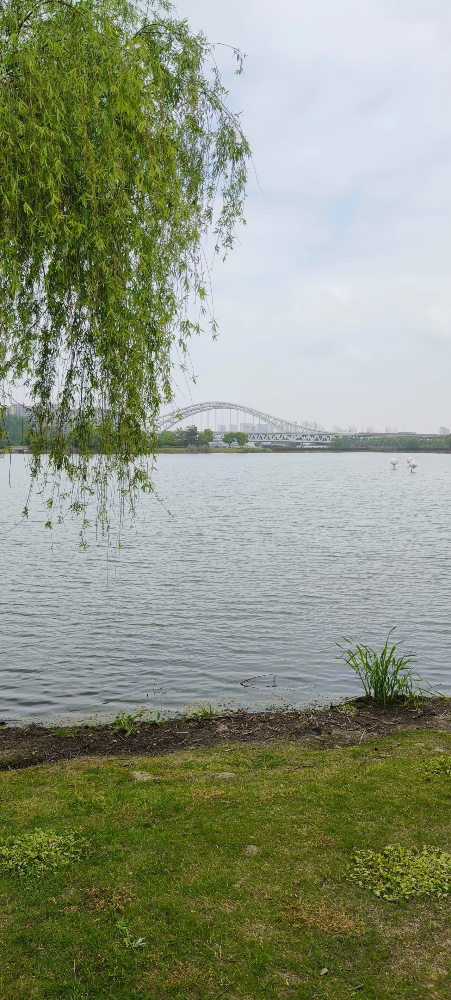

宝带桥澹台湖景区是吴中城区大运河边的一块湿地公园，也是直到2023年才刚刚修整好的市民公园。它有大面积的湿地湖泊景观，有千年古桥，还有丰富的儿童游乐设施。周末这里小朋友很多，可以足足玩两个小时。另外这里靠近水边风很大，适合放风筝。

唯一的缺点是这里离快速高架路比较近，噪音有点大。

## 其他

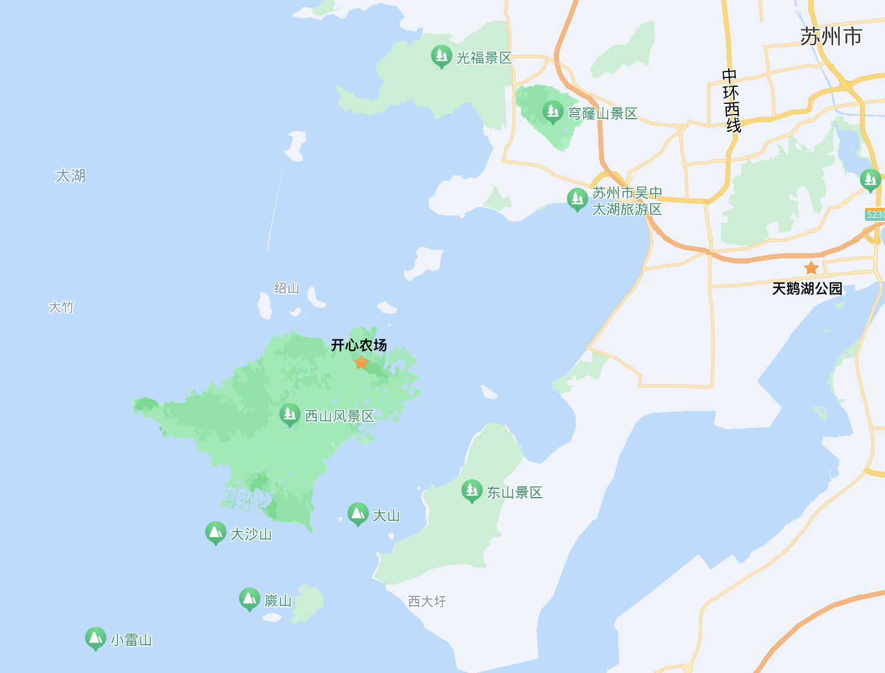

吴中区有许多山可以爬，包括穹窿山、东山（莫厘峰）、渔洋山、西山（缥缈峰）、灵岩山等等。家里的小朋友如果不讨厌爬山就都可以带过去爬。穹窿山下还有个万鸟园，进去能玩个把小时。总之，你如果手持休闲年卡，那么能去的最多的地方可能就是吴中区的这些公园。

此外，还有太湖新城的天鹅湖公园是有免费的无动力游乐场的。此处周末的时候人气很旺。然而我觉得里头的游乐设施太简陋了，我儿子去过一次没玩个啥就走了，故不推荐。

最后，还有太湖园博园本来也很不错。可是前几年有一段时间这个公园被切成了两半其中一半承包给了一个电动游乐场，原来挺不错的园子慢慢变得破败了，故也不再推荐。

# 吴江区

## 12. 东太湖生态园

- 车程 40分钟
- 乐趣⭐️⭐️⭐️
- 风景⭐️⭐️⭐️⭐️
- 人气⭐️⭐️⭐️⭐️
- 性价比⭐️⭐️⭐️

东太湖生态园有一个小型的电动游乐场，叫做“虫虫乐园”。它的无动力儿童游乐设施不多，但是人气很旺。这个公园在太湖东岸，周围居民小区比较多，湖边有很多骑车、跑步的人群。这里适合搭帐篷、野餐、遛娃一套活动一整天。

公园很大，我只去过一次，没有逛完。而且这个公园和整个太湖东岸的湖岸线是连在一起的，值得再去探索探索。

## 13. 芦荡湖湿地公园

- 车程 50分钟
- 乐趣⭐️⭐️⭐️
- 风景⭐️⭐️⭐️⭐️
- 人气⭐️⭐️⭐️⭐️⭐️
- 性价比⭐️⭐️⭐️⭐️⭐️

芦荡湖湿地公园是一个中等大小的公园。芦荡湖中和湖岸边有天鹅栖息，天鹅不怕人可以接近。公园南门附近有一块无动力儿童游乐设施，周末时候人气非常旺。公园东面有一块大的轮滑场地，人气极旺，估计整个吴江区滑轮滑的小朋友都来过这里。

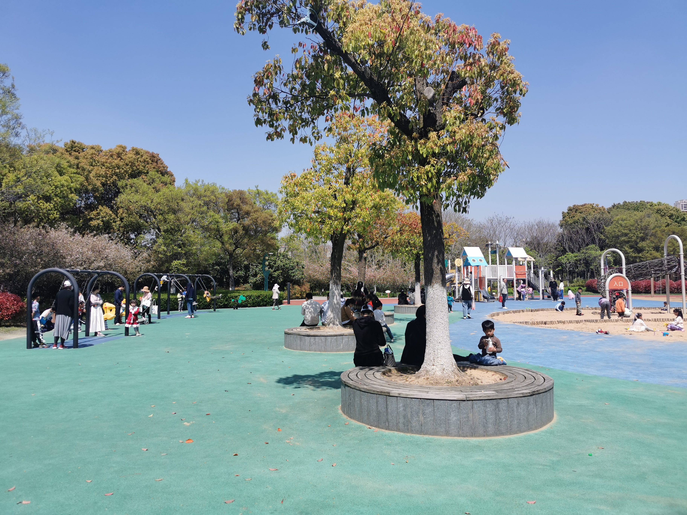

此外，芦荡湖边还有放养的黑天鹅，可以和小朋友们近距离接触。

## 14. 胜地生态公园

- 车程 50分钟
- 乐趣⭐️⭐️⭐️⭐️
- 风景⭐️⭐️⭐️⭐️
- 人气⭐️⭐️
- 性价比⭐️⭐️⭐️⭐️

胜地生态公园在芦荡湖湿地公园的南面三公里远的地方，更接近吴江区的城郊，是一块更大、更原生态的湿地公园。

这个公园的儿童游乐设施比较丰富，有电动游乐场和无动力游乐场两块区域。电动游乐场设施比较新，但是仍然只有那些比较老套的项目。

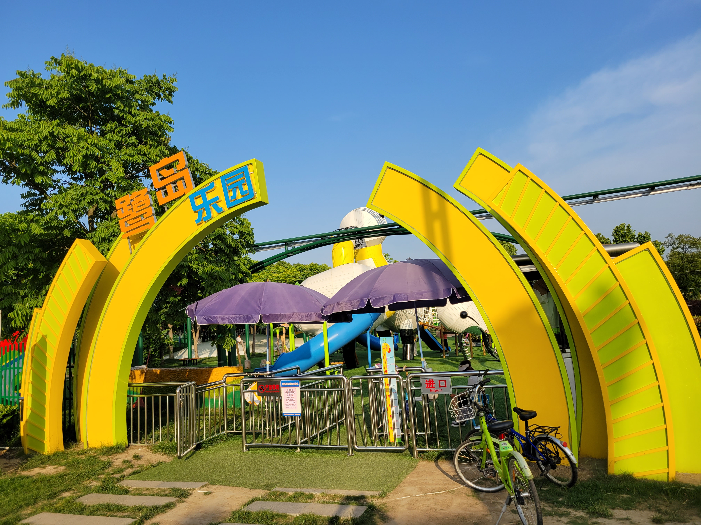

无动力儿童乐园部分叫做**鹭岛乐园**，非常值得推荐。虽然它需要门票，但性价比仍然很高，是我在苏州市内见到过的规模最大的无动力游乐场。

我们去的那次没有多少小朋友在里面玩，可能是因为太靠近郊区了的缘故吧。如果小朋友多肯定会更加值得去。

## 15. 潜龙渠公园

- 车程 1小时
- 乐趣⭐️⭐️⭐️
- 风景⭐️⭐️⭐️⭐️
- 人气⭐️⭐️⭐️
- 性价比⭐️⭐️⭐️⭐️

潜龙渠公园位于吴江区盛泽镇，是一片湖泊旁边的市民公园。镇上的居民一到周末会来这里遛娃散步，所以人气还可以。

公园内游乐设施面积较大，有免费的攀爬设施，也有一些低价的常见付费项目。如果你恰好需要去吴江以南的那个方向，那么顺便去这个公园逛逛会是个不错的选择。

## 16. 同里国家湿地公园

- 车程 40分钟
- 乐趣⭐️⭐️⭐️⭐️⭐️
- 风景⭐️⭐️⭐️⭐️
- 人气⭐️⭐️⭐️⭐️
- 性价比⭐️⭐️⭐️⭐️⭐️

同里国家湿地公园在同里镇和周庄镇中间的位置。它的面积非常大，可以逛一整天。

公园内其实并没有大面积的湿地景观，反而更像一个植物园——它有各种各样的人工针叶林、竹林、花丛等。到了春天的周末，有各种各样的“研学团队”拉着小朋友来挖竹笋。它的北面靠近澄湖的地方也许是真正的湿地，设置有“观鸟屋”。

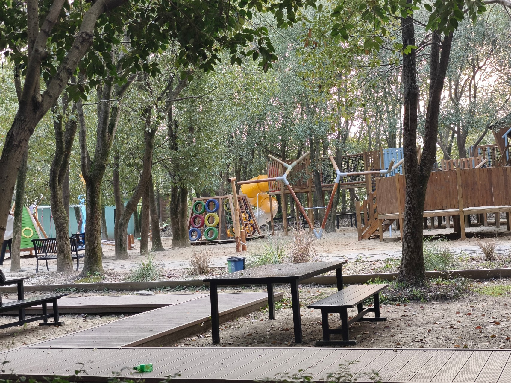

当然，它还有至少两处儿童游乐设施，以及一个挺有意思的湿地科普馆。科普馆里展示的东西并不惊艳，但也值得小朋友在里头逛一个小时。

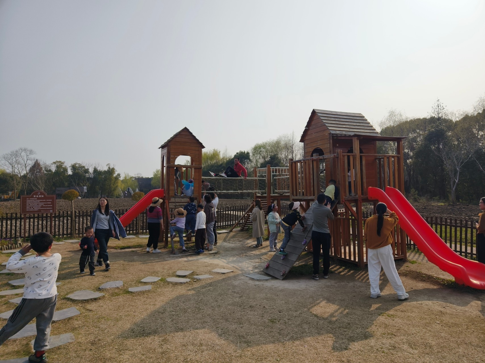

它人气很旺，但是因为面积太大了，又不显得拥挤。总之，作为一个完全免费的公园，它非常值得推荐。

## 其他

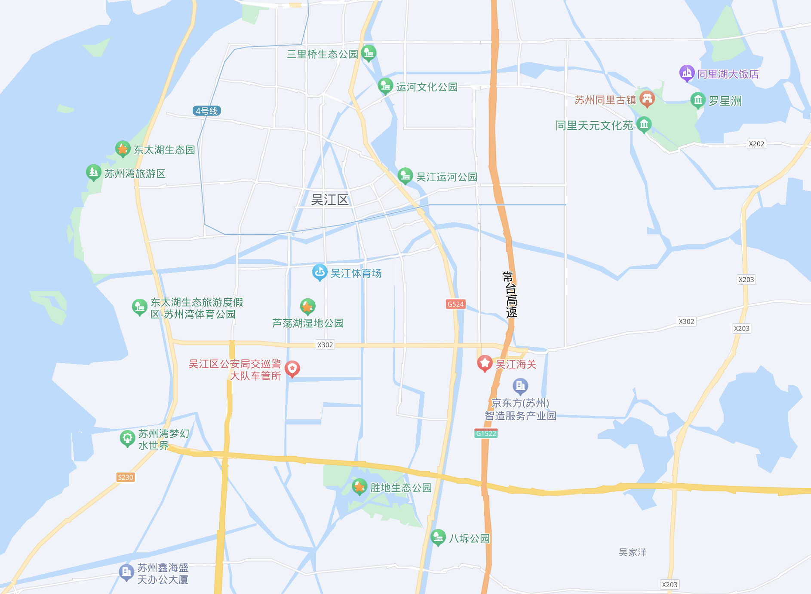

吴江区很大，适合小朋友玩的公共游乐场所很多。但不仅如此，吴江还是江南水乡的腹地。

它的南面分布有盛泽、汾湖、黎里、震泽、平望等古镇。这些镇上几乎都有免费或门票低廉的古镇游览区——虽然很少有专供小朋友玩的游乐设施，但是因为人气旺，稀奇古怪的东西多，所以我们家小朋友每次都逛得挺开心的。

而吴江东面的同里古镇作为5A级景区，风景优美，离苏州工业园区距离也近，也值得带小朋友去逛一逛。

# 昆山

昆山紧邻苏州工业园区，开车过去一般在四十分钟左右。

## 17. 昆山城市森林公园

- 车程 50分钟
- 乐趣⭐️⭐️⭐️
- 风景⭐️⭐️⭐️⭐️
- 人气⭐️⭐️⭐️⭐️⭐️
- 性价比⭐️⭐️⭐️⭐️

昆山城市森林公园是昆山市内最大的公园，风景不错，一到周末人气极旺。公园里可以搭帐篷，但是不可以骑车、放风筝什么的。

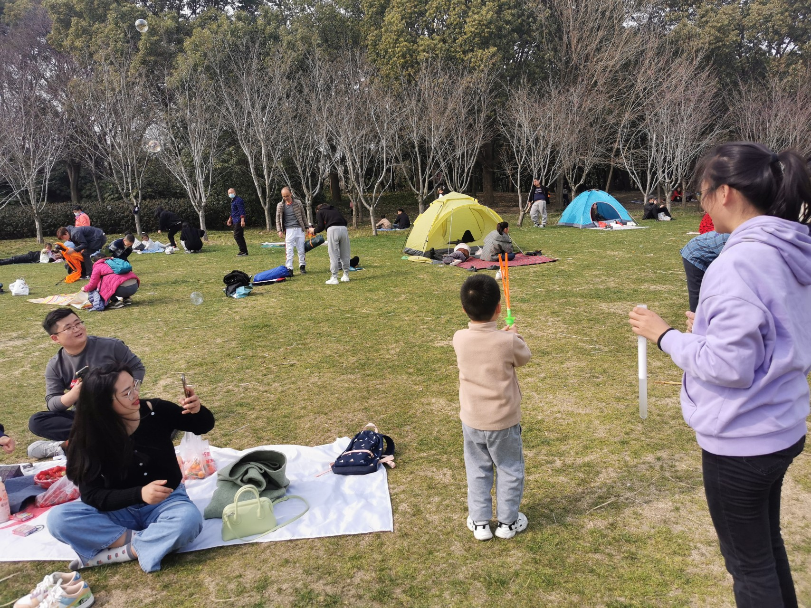

这个公园面积非常大，适合逛一整天。里头有个小型动物园叫做“萌宠乐园”，值得买票进去。

如果你开车去，可以把车停在南门一条马路之隔的体育场。

## 其他

昆山市区的**儿童公园**、**黄浦公园**、**古木河亲子乐园**都有儿童游乐设施，都可以去逛逛。

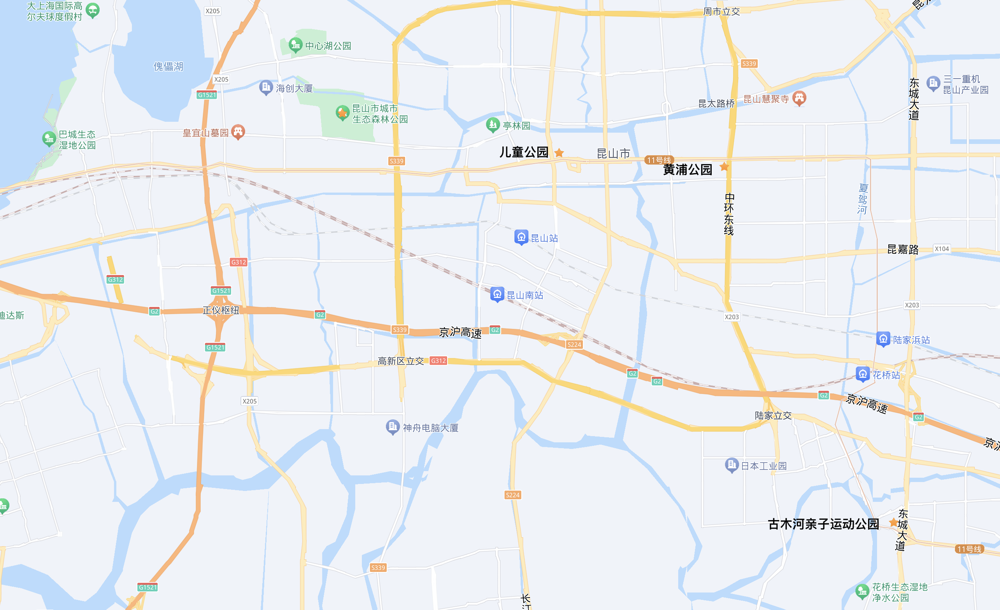

# 常熟

常熟位于苏州市区的正北端，有快速路和高速公路相连。从苏州工业园区开车过去大约需要一小时整。

## 18. 尚湖-尚湖飞熊乐园

- 车程 1小时
- 乐趣⭐️⭐️⭐️⭐️⭐️
- 风景⭐️⭐️⭐️⭐️⭐️
- 人气⭐️⭐️⭐️⭐️
- 性价比⭐️⭐️⭐️

尚湖位于常熟市郊，离苏州市区大约一小时车程。尚湖和虞山连在一起，成为苏州地区为数不多的山水一体的景点。去过常熟很多次的我也认为尚湖是苏州最漂亮的水景。

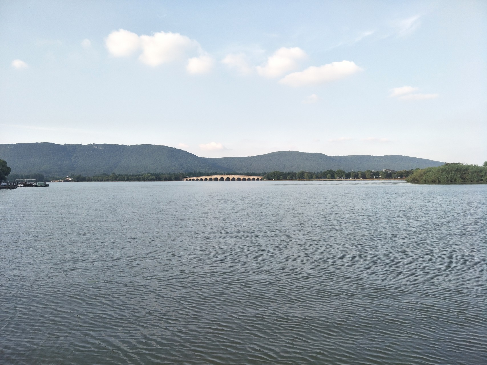

尚湖景区里面有一个园林，叫做拂水山庄。此园林不同于绝大多数苏州园林的地方在于它临水而建，视野开阔。它是明末“水太凉”先生*钱谦益*和名妓*柳如是*的故宅，值得一探。此外，尚湖景区面积较大，里面也有多处儿童游乐设施分布，可以逛半天。

尚湖的门票较贵，建议持休闲年卡前往。

最近，在尚湖的旁边新开了一家飞熊乐园（最开始叫做角乐士乐园）。这家儿童乐园以无动力设施为主，以玩水为特色，非常适合夏季带着泳具拖鞋前往。

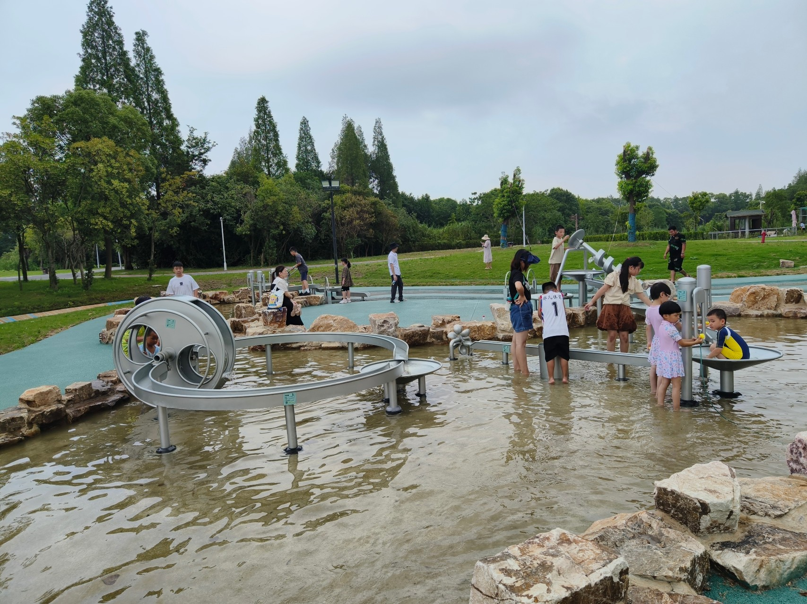

飞熊乐园的门票现在常年打折，大约40元一人，考虑到它面积比较大、设施比较多，其实并不算贵。

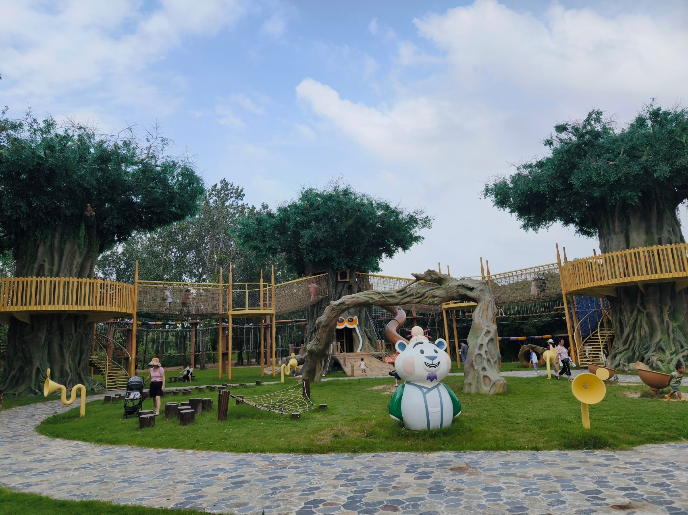

飞熊乐园和尚湖也是挨着的，门口风景也很漂亮，建议在一天时间内上午逛尚湖景区，下午逛飞熊乐园。

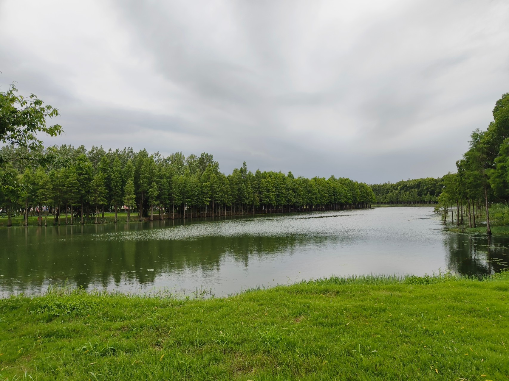

## 19. 虞山

- 车程 1小时10分钟
- 乐趣⭐️⭐️⭐️⭐️⭐️
- 风景⭐️⭐️⭐️⭐️⭐️
- 人气⭐️⭐️⭐️⭐️
- 性价比⭐️⭐️⭐️

在苏州的诸多县级市里，常熟毫无疑问是最具文化底蕴和地方特色的一个。从文字学角度来看，“虞”和“吴”是同源字。常熟是春秋时期吴国最早的发源地，常熟虞山上至今存有*仲雍*墓；*仲雍*乃是吴国的始祖、*周文王*的伯父。虞山上还有*言子*（孔子唯一南方弟子*言偃*）墓等**一大堆名人古迹**。

虞山东西长6公里，东西南北四周都遍布公园，都可以持休闲年卡免费进入。

这其中有的公园比较有特色，比如在靠近虞山东面的城墙景区就是一段可以爬的长城——这个体验在长三角也许是独一份了。如果秋天去，山上景色最美。

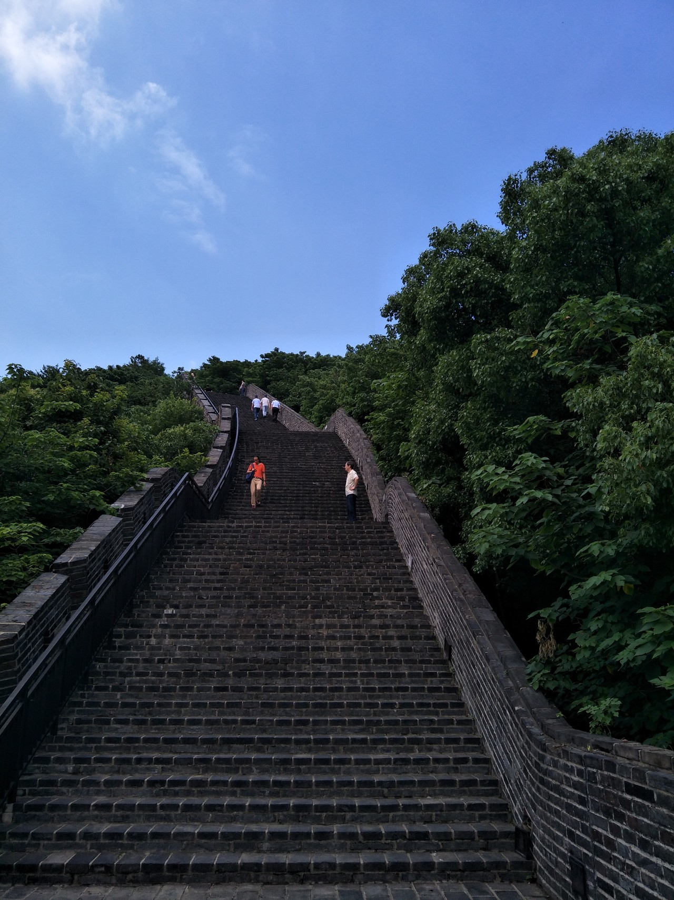

在虞山南面的宝岩景区，里面有一个退役的蒸汽机车头，小朋友会比较感兴趣，可能会在里头爬来爬去很久。

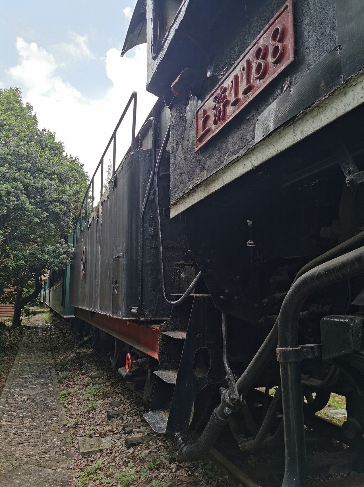

总之，虞山其实是一座可以慢慢品尝的宝库。而且以后等小朋友上中学了，仍然可以带他们来参访古迹，或者爬山徒步。

## 其他

除虞山尚湖景区之外，常熟还有沙家浜比较出名。

沙家浜景区门票也比较贵，以湿地湖泊景观为主。

总体上，沙家浜景区不如尚湖景区漂亮。景区内有一处兵器陈列区，摆放了一些退役的飞机大炮什么的。但由于这块地方基本处于荒废的状态，所以我不做推荐。此外，景区内还有树上扎的网子一类的儿童游乐设施，可供小朋友在上面跳来跳去。如果实在没地方去，这沙家浜也不是不能去——尤其考虑到它离高速公路出入口特别近，交通方便。

常熟的面条比较有特色，一般是现炒浇头，又香又实惠。建议去了常熟一定要体验一下，它比苏式汤面更容易为外地人所接受。

# 张家港

张家港位于苏州的最北端，开车从苏州工业园区过去一般不超过一个半小时。

## 20. 暨阳湖-暨阳湖欢乐世界

- 车程 1小时20分钟
- 乐趣⭐️⭐️⭐️⭐️⭐️
- 风景⭐️⭐️⭐️⭐️⭐️
- 人气⭐️⭐️⭐️⭐️⭐️
- 性价比⭐️⭐️⭐️⭐️

暨阳湖位于张家港城区靠南的位置，是一个不小的湖。它的西南面有一块湿地，里面长满了杉树。因为来的人少，阳光充足的时候这块湿地非常漂亮。

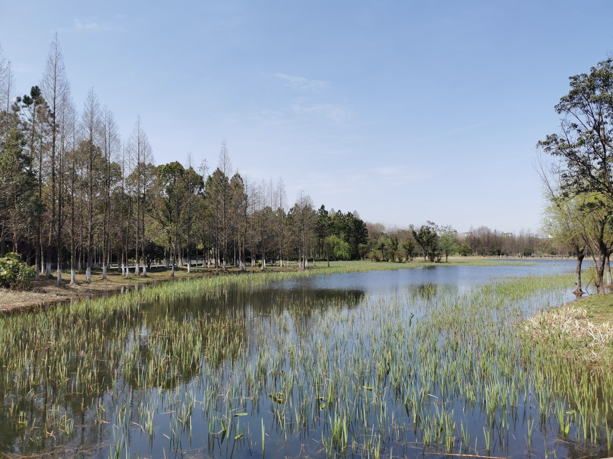

整个暨阳湖环湖一圈都是公园，景色很不错。它的正西面是一块临湖玩沙子的地方；正南面是临湖步道和花园；东南面则是暨阳湖欢乐世界。

暨阳湖欢乐世界是一个室外游乐场，面积不大不小，网上评分很一般。然而，我认为它性价比极高，非常推荐。

它的门票只要40块钱，但是却能无限次体验很多大型游乐设施——不是哄小孩的那种，所以性价爆表！这里面包括大型漂流、大型过山车、大型激流勇进、大型海盗船，以及一些其他小型游乐设施。建议自备一次性雨衣前往。

把暨阳湖和暨阳湖欢乐世界算成一个整体，就成了我的推荐列表里最高分的遛娃地之一。一家人在这里玩上两天都不成问题。

## 21. 梁丰生态园

- 车程 1小时20分钟
- 乐趣⭐️⭐️⭐️⭐️
- 风景⭐️⭐️⭐️⭐️
- 人气⭐️⭐️⭐️⭐️⭐️
- 性价比⭐️⭐️⭐️⭐️⭐️

梁丰生态园是张家港市内第二大的公园。“梁丰”一词在张家港市很常见，比如其最好的中学就叫梁丰高级中学。梁丰高级中学又传承自100多年前的梁丰书院。至于“梁丰”一词到底是个啥意思我到现在也没搞懂。

园内有多处儿童游乐场地，以及一条很长的临水沙滩。小朋友玩沙子可以玩得很开心。

# 太仓

太仓位于昆山以东，上海西北面。从苏州工业园区开车到达太仓市大约需要一小时出头。

## 22. 市民公园

- 车程 1小时10分钟
- 乐趣⭐️⭐️⭐️
- 风景⭐️⭐️⭐️
- 人气⭐️⭐️⭐️⭐️⭐️
- 性价比⭐️⭐️⭐️⭐️⭐️

太仓市民公园位于太仓市中心位置，是一处典型的市民公园。它设有一处较大的儿童活动场地，人气很旺。它的地下停车场很大，停车很方便，西面一条马路之隔有太仓美术馆，北面一条马路之隔则有太仓博物馆，可以一起逛逛。

## 其他

太仓科技馆也离市民公园不远。这里虽然不大，但是设施较新，小朋友会很感兴趣。虽然是室内场馆，我也推荐大家同市民公园一起去逛。

说到这里，不得不提到苏州作为经济非常发达的城市，科教场馆（包括科技馆、天文馆、地质博物馆、海洋馆、动物园等等）却是极端简陋的！甚至不如一个县来得丰富。但最近也有好消息，位于苏州高新区的**苏州科技馆**已经在建设当中了。

此外，太仓南站附近新开了一家叫做**阿尔卑斯雪世界**的室内大型滑雪场，里面可以滑雪、玩雪。这里票价比较高（玩雪门票3小时最低约150元/人），我还没有去过。如果很想带小朋友玩雪的话可以考虑顺便去逛逛。

# 上海

## 23. 上海动物园

- 车程 1小时20分钟
- 乐趣⭐️⭐️⭐️⭐️⭐️
- 风景⭐️⭐️⭐️⭐️⭐️
- 人气⭐️⭐️⭐️⭐️⭐️
- 性价比⭐️⭐️⭐️⭐️

上海动物园是居住在苏州的小朋友最值得去的动物园。

它的票价只需要40元，面积不大不小刚好够逛一整天，里头啥动物都有，包括大熊猫。

它位于上海的西郊宾馆、虹桥机场附近。

因为周末人太多，所以如果你开车前往，也许要运气好才能在旁边的停车场停上车。但是，你完全可以乘坐动车到达虹桥火车站后，转乘地铁10号线经两站路程从上海动物园站下车抵达。

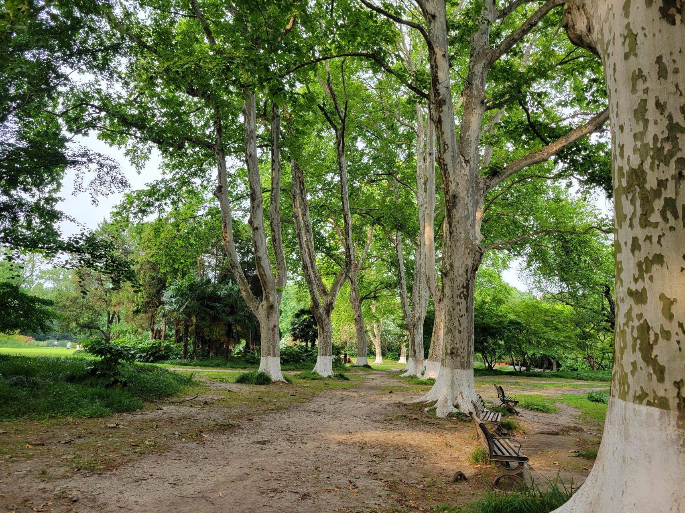

在动物园内不止是看动物。它还有一条小河从西往东穿过，河两旁大树参天，风景优美。

但需要注意的是，上海动物园进大门之后有招揽购买电瓶车票的摊点，你完全没有必要买它，一定要避坑。这个电瓶车票的作用只是把你从大门口拉到熊猫馆，但其实这段距离并不长，而且你也不可能忽略这一路上的各种动物，最终还是要走路转一圈。

总结一下，因为苏州的上方山动物园（门票60元）档次太低，动物门类太少，敛财套路还多，所以我才说上海动物园是苏州小朋友看动物的最佳选择。另外，许多重点城市的国营动物园动物门类齐全，票价低廉，非常值得逛——例如北京动物园（门票15元）、上海动物园（门票40元）、杭州动物园（门票20元）、南京市红山森林动物园（门票40元）等等。这些动物园比后来新开的许多“野生动物园”（门票100元-200元）反而更值得去。

## 24. 东方绿舟

- 车程 1小时5分钟
- 乐趣⭐️⭐️⭐️⭐️⭐️
- 风景⭐️⭐️⭐️⭐️⭐️
- 人气⭐️⭐️⭐️⭐️
- 性价比⭐️⭐️⭐️⭐️

东方绿舟是位于上海最西面的一个收费公园，从苏州开车过去很方便。它的票价大约在50元以内，包含了园内电瓶车车票。因为公园面积非常大，所以电瓶车是必选项。

这个公园里能让小朋友玩的东西很庞杂，但是却趣味性十足。

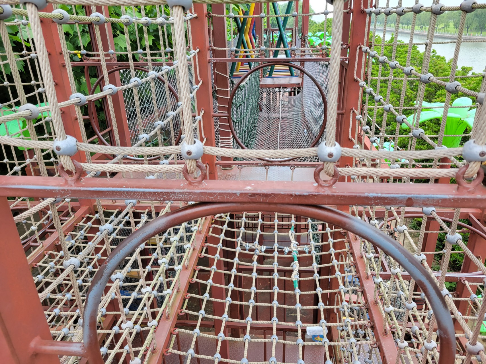

首先，在北面刚入园的地方有两百米长的闯关式攀爬设施，非常值得体验。这些攀爬设施结构复杂，一关接着一关不重样。而且因为临河，小朋友爬到高处还可以欣赏河边的风景。

其次，它在公园的东南角上建有**中国兵器博览馆**。这个馆名头很足，它其实是一个室内外结合的兵器博物馆：外形是一艘巨大的航母，里头却是古今中外各式各样的兵器陈列。参观者还可以上到甲板上观看各色舰载机，小朋友很难不感兴趣。如果要单独评价这个博览馆的话，我会觉得对于小朋友而言它并不输给位于北京的**中国人民革命军事博物馆**。

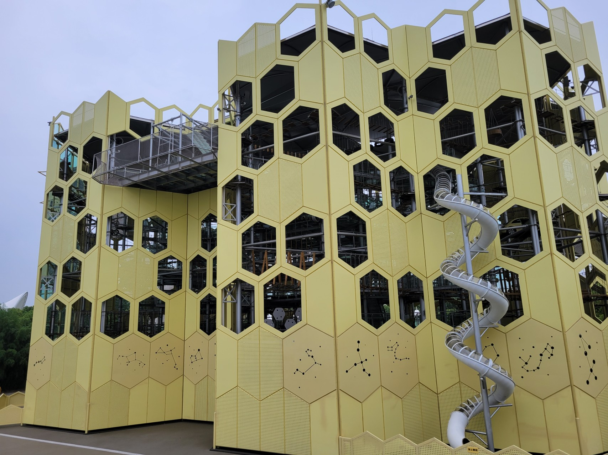

此外，我们去的时候只逛了一下午，还有一些项目并没有体验到，比如巨大的攀爬馆等等。但已经体验的内容已经足以让我极力推荐它了。

## 25. 上海欢乐谷

- 车程 1小时10分钟
- 乐趣⭐️⭐️⭐️⭐️⭐️
- 风景⭐️⭐️⭐️⭐️
- 人气⭐️⭐️⭐️⭐️⭐️ （对于大型游乐场人越少人气评分越高）
- 性价比⭐️⭐️⭐️

如果小朋友想要体验比较刺激的大型游乐项目，带他去上海欢乐谷会是个很不错的选择。

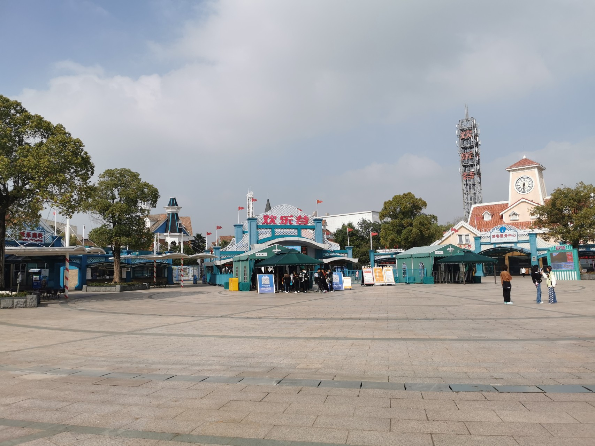

上海欢乐谷位于上海西郊的佘山，从苏州开车过去很方便。这里的游乐项目对低龄儿童很友好，只要身高>1.2米就能玩几乎所有的项目了。而且它有好几处适合小朋友的、不那么刺激的过山车，适合胆小又爱玩的小朋友。

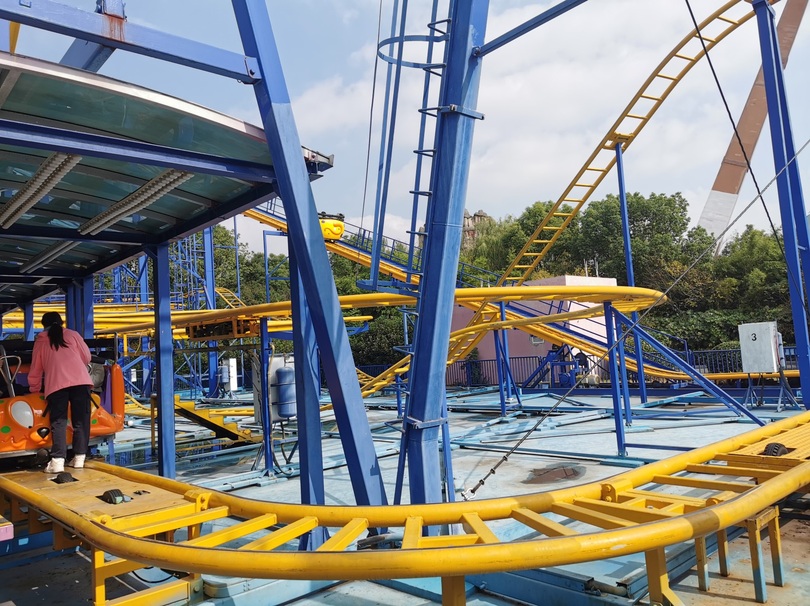

也许是因为同在上海的迪士尼过于风光了，上海欢乐谷的人气并不旺。但是对于大型游乐场来说，人气不旺才反而更值得去！其实，它的飞行球幕电影项目效果并不输给迪士尼的飞越地平线。而且人气旺如迪士尼，你和小朋友去了之后只能没完没了地排队，真正能玩的项目又有几个呢？

当然，上海欢乐谷票价260，也不便宜，建议有活动价的时候去。

## 26. 顾村公园

- 车程 1小时10分钟
- 乐趣⭐️⭐️⭐️
- 风景⭐️⭐️⭐️⭐️⭐️
- 人气⭐️⭐️⭐️⭐️⭐️
- 性价比⭐️⭐️

顾村公园是上海宝山区的一个巨型公园，它东西长4公里。虽然离苏州较远，但因为它就在快速路旁边，所以我们从苏州过去花费的时间并不算长。

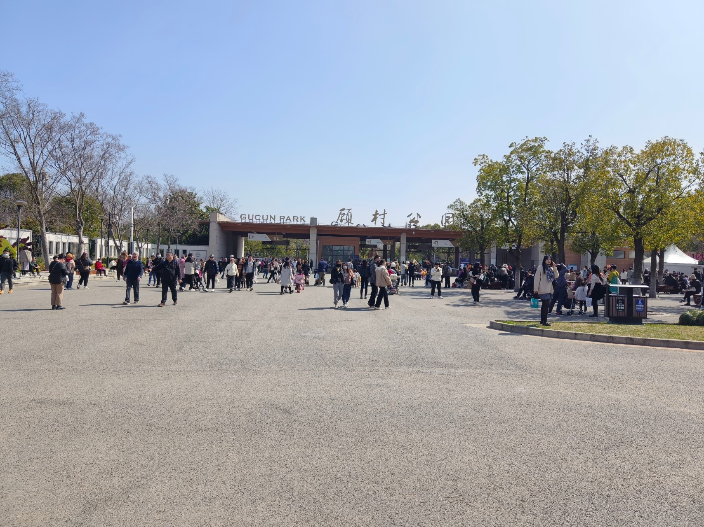

这个公园里嵌套有**自然谷恐龙园**、**东方鸟世界**等适合小朋友逛的园内园。另外，它里面还散落有各种各样的收费游乐项目。

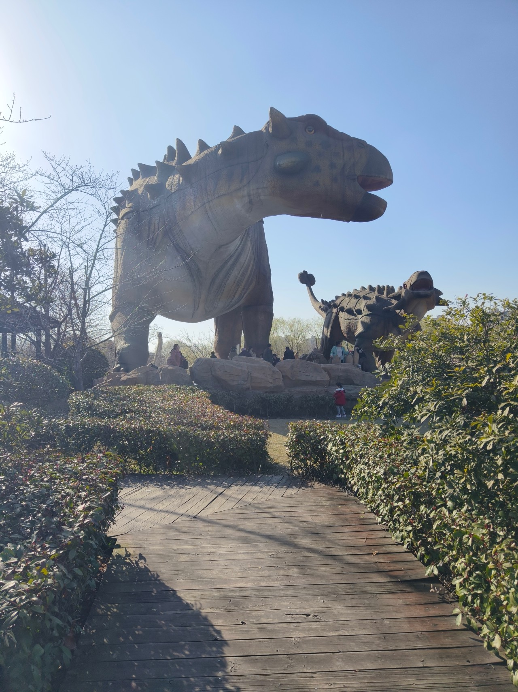

这里是上海春季的赏樱胜地，一到周末人满为患。因为园内园比较多，所以逛起来需要走很多冤枉路，比较费腿。建议如果带小朋友去的话最好带着小推车。

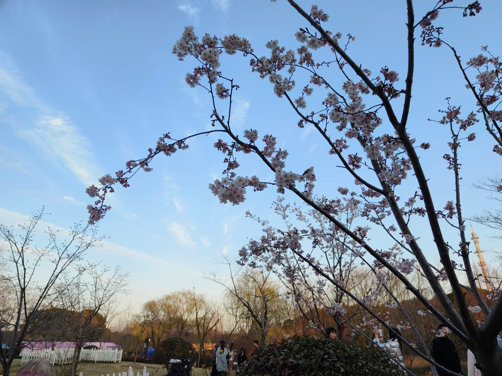

因为门票要收好几道，所以它性价比一般。但它仍然值得你带着对恐龙感兴趣的小朋友去逛逛。

## 其他

上海作为中国最大的城市，适合遛娃的地方毫无疑问地要多于苏州。但是由于它的市民公园有点少，而许多所谓的郊野公园从卫星地图上看又并没有什么游乐设施，所以这里适合室外遛娃的地方并不见得有很多。

我也一直在仔细考察上海靠西边有哪些值得去的遛娃地，这里推荐的几个算是有代表性的。

至于上海东边的**迪士尼**、**海昌海洋世界**、**上海野生动物园**等等大型公园，因为门票价格昂贵，而且从苏州自驾过去需要两小时，所以性价比并不高，没有被加入我的推荐列表。

# 无锡

## 27. 金匮公园

## 28. 鼋头渚

## 其他

# 江阴

## 29. 要塞旅游风景区

附带：芙蓉湖/黄山湖风景区

## 30. 鹅鼻嘴公园-船厂公园

# 宜兴

## 31. 宜兴竹海景区

## 32. 陶祖圣境-竹尖长廊

## 33. 张公洞

## 34. 龙背山森林公园

## 35. 青龙山公园

## 其他

# 常州

## 36. 淹城野生动物世界

## 其他

# 南通

## 37. 南通森林野生动物园

## 38. 狼山

## 39. 滨江公园

## 其他

# 嘉兴

TODO

# 嘉善

## 嘉善越里

## 柳洲公园

# 海盐

## 梦湖公园

## 其他

杭州湾融创水世界

# 桐乡

# 湖州

# 杭州

# 慈溪

## 40. 宁波方特

# 结束语

这40个遛娃目的地，你带着小朋友每周末去一到两个，可以半年不重样。

我家的小朋友还没有长大，我还在广泛搜集苏州周边适合小朋友的室外活动场所，也许以后会再写一个续集。