我将推荐40个户外活动场所，适合3岁以上、12岁以下的小朋友们。

现在的小朋友学习任务重，又有电视、平板电脑等各种诱惑，容易长时间处于用眼疲劳状态。所以，周末的最佳亲子活动，就是带着小朋友去公园里玩。

这么做对小朋友们有很多好处：其一，可以充分地活动身体；其二，能增加户外用眼时长，预防和改善近视眼；其三，能增加小朋友的社交渠道，让他们有机会认识新的朋友。

要在周末一两天内能够成行，路上花的时间就不能太长。所以，以苏州工业园区为起点，这40个目的地在地图APP上查询到的车程都在**2小时以内**。而像南京这种很适合遛娃的城市，就因为距离苏州太远所以被排除出推荐列表。

我按照以下3条原则筛选了这40个公共活动场所：

1. 必须是室外场所。
2. 优先推荐无动力的游乐场。因为无动力的游乐场更容易让小朋友活动起来，也往往更耐玩。但是我仍然推荐了一些适合小朋友的动力型游乐场，因为小朋友和大人一样也喜欢刺激感。
3. 有一定性价比。如果是免费最佳；太贵的场所——例如上海迪士尼——则不推荐。

另外，我还从以下4个方面给这40个目的地打分：（满分5分⭐️⭐️⭐️⭐️⭐️）

1. **乐趣**。包含耐玩程度、寓教于乐程度、独特性等方面的考量。
2. **风景**。优美的风景能让大朋友们也得到充分的放松。
3. **人气**。小朋友们一起玩才更好玩。
4. **性价比**。免费公园打5分；收费公园按性价比得1至4分。

最后，这里推荐的地点都是我和我儿子已经去过的，因此以下评价都基于我们的亲身体验。

# 太长不看

我先把这40个遛娃地总结在下面的表格里。推荐分值范围为0分到5分。那些达不到及格线3分的公园已经被我排除在这个列表之外了。

此外，正文中我点评了许多没有加入推荐列表但也许仍值得你考虑的地点——**所有提到的地点超过了100个**。

| 市/县/区 | 遛娃地 | 推荐值   5分制 | 车程 |
| ------- | --- | --- | --- |
| [苏州工业园区](#苏州工业园区) | [苏州奥体中心](#1-苏州奥体中心)   [兆佳巷邻里中心](#2-兆佳巷邻里中心)   [方洲公园](#3-方洲公园) | 4.5   3.8   3.8 | <30分钟   <30分钟   <30分钟 |
| [姑苏区](#姑苏区) | [运河体育公园](#4-运河体育公园)   [苏州公园](#5-苏州公园)   [东园-相门城楼](#6-东园-相门城楼) | 4.0   3.3   4.5 | <30分钟   <30分钟   <30分钟 |
| [苏州高新区](#苏州高新区) | [白马涧](#7-白马涧)   [大阳山植物园](#8-大阳山植物园)   [苏州博物馆西馆](#9-苏州博物馆西馆) | 3.5   4.0   3.5 | 40分钟   40分钟   30分钟 |
| [吴中区](#吴中区) | [西山岛开心农场](#10-西山岛开心农场)   [宝带桥澹台湖景区](#11-宝带桥澹台湖景区) | 3.5   4.5 | 1小时30分钟   30分钟 |
| [吴江区](#吴江区) | [东太湖生态园](#12-东太湖生态园)   [芦荡湖湿地公园](#13-芦荡湖湿地公园)   [胜地生态公园](#14-胜地生态公园)   [潜龙渠公园](#15-潜龙渠公园)   [同里国家湿地公园](#16-同里国家湿地公园) | 3.5   4.3   3.5   3.5   4.5 | 40分钟   50分钟   50分钟   1小时   40分钟 |
| [昆山](#昆山) | [昆山城市森林公园](#17-昆山城市森林公园)   [巴解园](#18-巴解园) | 4.0   4.5 | 50分钟   50分钟 |
| [常熟](#常熟) | [尚湖-尚湖飞熊乐园](#19-尚湖-尚湖飞熊乐园)   [虞山](#20-虞山) | 4.3   4.3 | 1小时   1小时10分钟 |
| [张家港](#张家港) | [暨阳湖-暨阳湖欢乐世界](#21-暨阳湖-暨阳湖欢乐世界)   [梁丰生态园](#22-梁丰生态园) | 4.8   4.5 | 1小时20分钟   1小时20分钟 |
| [太仓](#太仓) | [市民公园](#23-市民公园) | 4.0 | 1小时10分钟 |
| [上海](#上海) | [上海动物园](#24-上海动物园)   [东方绿舟](#25-东方绿舟)   [上海欢乐谷](#26-上海欢乐谷)   [顾村公园](#27-顾村公园) | 4.8   4.8   4.0   3.8 | 1小时20分钟   1小时5分钟   1小时10分钟   1小时10分钟 |
| [无锡](#无锡) | [金匮公园](#28-金匮公园)   [鼋头渚](#29-鼋头渚) | 4.0   4.0 | 1小时10分钟   1小时20分钟 |
| [江阴](#江阴) | [鹅鼻嘴公园-船厂公园](#30-鹅鼻嘴公园-船厂公园)   [要塞旅游风景区-黄山湖公园](#31-要塞旅游风景区-黄山湖公园) | 4.5   4.5 | 1小时40分钟   1小时40分钟 |
| [宜兴](#宜兴) | [张公洞](#32-张公洞)   [龙背山森林公园](#33-龙背山森林公园)   [青龙山公园](#34-青龙山公园) |  3.8   4.3   4.0 | 2小时   1小时50分钟   2小时 |
| [常州](#常州) | [淹城野生动物世界](#35-淹城野生动物世界) | 4.0 | 1小时50分 |
| [南通](#南通) | [南通森林野生动物园](#36-南通森林野生动物园)   [狼山](#37-狼山)   [滨江公园](#38-滨江公园) | 4.5   4.0   4.3 | 1小时40分钟   1小时40分   1小时40分 |
| [嘉兴](#嘉兴) | 暂无 | N/A | N/A |
| [湖州](#湖州) | [双林儿童博物馆岛](#39-双林儿童博物馆岛) | 3.5 | 1小时30分 |
| [慈溪](#慈溪) | [宁波方特](#40-宁波方特) | 4.8 | 1小时40分 |

# 苏州工业园区

我家住在苏州工业园区，所以我们从这里开始每周末的遛娃之旅。

## 1. 苏州奥体中心

- 车程 <30分钟
- 乐趣⭐️⭐️⭐️⭐️
- 风景⭐️⭐️⭐️⭐️
- 人气⭐️⭐️⭐️⭐️⭐️
- 性价比⭐️⭐️⭐️⭐️⭐️

苏州奥体中心由四栋主体建筑构成，这四栋建筑的中间有两片儿童游乐场地，包含了常见的攀爬设施。

因为周边小区众多，所以人气很旺。有时候圆盘形的秋千上甚至人满为患。

这里比较耐玩，小朋友如果是第一次来估计能玩2小时，值得推荐。

这里还有各种其他室内外运动场地，以及商场、电影院等，停车也很方便。

最后，它南临斜塘河。河边的景色也不错，一家人来了可以顺便去河边散散步。

## 2. 兆佳巷邻里中心

- 车程 <30分钟
- 乐趣⭐️⭐️⭐️⭐️
- 风景⭐️
- 人气⭐️⭐️⭐️⭐️⭐️
- 性价比⭐️⭐️⭐️⭐️⭐️

兆佳巷邻里中心离苏州奥体中心不远，是一片室内外兼有的商场。在两排商场的中间，隐藏着一片项目众多的儿童活动场地。因为周边小区众多，所以人气也很旺。小朋友如果第一次来估计能玩1.5小时，同样值得推荐。

## 3. 方洲公园

- 车程 <30分钟
- 乐趣⭐️⭐️⭐️
- 风景⭐️⭐️
- 人气⭐️⭐️⭐️⭐️⭐️
- 性价比⭐️⭐️⭐️⭐️⭐️

方洲公园位于苏州奥体中心北面两公里左右，是一个标准的市民公园。这里儿童游乐设施较多，人气很旺，也值得推荐。

其中，有两个游乐设施比较高，因此家长们需要关注小朋友的安全。

如果第一次来这里，估计能玩1个小时。

## 其他

苏州工业园区其实很大，但是这里仅仅只推荐了三个场地。还有一些其他的地方也有免费的儿童攀爬设施：

- 西湖湾生态体育公园
- 白塘公园
- 东沙湖生态公园
- 圆融时代广场
- 石蒜园
- 中央公园
- 东华林街以西湖边公园

因为这些地方耐玩度不够高，所以未被加入推荐列表。如果离得近的话可以带小朋友去转转。

总体而言，苏州工业园区的公共儿童活动场地还是偏少的。

这里公园并不少，而且其中有许多公园风景很美，可是带小朋友过去却往往发现没什么东西可玩——比如独墅湖边的**白鹭园**。

幸好，最近一年来许多路边公园（现在都叫某某口袋公园）正在改造或者已经改造完成，增加了一些儿童游乐设施。

此外，就动力型游乐场而言，位于阳澄湖边的**华谊兄弟电影乐园**票价较贵，而且并不适合小朋友。

位于金鸡湖边的**摩天轮乐园**本来还不错，但是它已经关门6年了，不知道何时才能重新开业，且重新开业之后不知道它还适不适合小朋友玩了。

# 姑苏区

姑苏区园林众多，是外地游客来苏州旅游的热门目的地。这里无论周末与否路上都很堵，所以我建议大家乘坐公共交通前往。

## 4. 运河体育公园

- 车程 <30分钟
- 乐趣⭐️⭐️⭐️⭐️
- 风景⭐️⭐️
- 人气⭐️⭐️⭐️⭐️⭐️
- 性价比⭐️⭐️⭐️⭐️⭐️

运河体育公园位于姑苏区和高新区交界的地方，在大运河的东面，寒山寺的南面，苏州体育中心的北面。

我们去的那次大运河边还在施工，工地围挡把公园和大运河隔开了，所以公园里的景色也打了折扣。

这里人气非常旺，很多大朋友在公园里运动或散步，而小朋友都集中在这里的一块游乐场地内。

如果小朋友第一次来，估计能玩1.5小时，值得推荐。而且相信随着周围施工结束，环境会更加友好，景色会更加漂亮。

## 5. 苏州公园

- 车程 <30分钟
- 乐趣⭐️⭐️⭐️⭐️
- 风景⭐️⭐️
- 人气⭐️⭐️⭐️⭐️⭐️
- 性价比⭐️⭐️

苏州公园是一个老派的市民公园，位于姑苏城内中心位置。很多老年人在里头晨练、散步、下棋。

苏州公园里面还有一个儿童游乐场，包含自控飞机、mini漂流、mini海盗船等将近10种单独收费的电动游乐项目，很适合低龄小朋友。这些游乐项目平均价格大约单次15元。在我看来这些项目性价比不算高，你很容易就会花出去100多元。然而，在苏州市区范围内，这已经算是最适合小朋友的动力型游乐场了。

苏州公园不大，中间有个池塘，可以租钓竿玩一玩钓鱼。

需要注意的是，大约两年前这里的儿童游乐场施工停业，不知道现在（2024年6月）重新开放了没有。所以大家去之前最好是打公园的电话问一下。

## 6. 东园-相门城楼

- 乐趣⭐️⭐️⭐️⭐️
- 风景⭐️⭐️⭐️⭐️⭐️
- 人气⭐️⭐️⭐️⭐️⭐️
- 性价比⭐️⭐️⭐️⭐️

东园位于姑苏区娄门附近。这里离苏州博物馆、拙政园等旅游景点很近，所以附近很难停车。

东园里有小游船、小火车等收费项目。

小火车性价比很低，不建议乘坐。但是小游船还不错，因为这里不仅风景漂亮，湖面上还有很多动物。我每次带小朋友去这里坐船都感觉很惬意。

东园也有攀爬设施，但不多也不耐玩。此外，这里还有喷泉等吸引小朋友的景观。

最后，必须说明的是，东园和南面的护城河步道、相门城楼是连在一起的。这一带连片的公园有着非常丰富的景观，适合带小朋友去逛+玩，半天下来全家都会活动得比较充实。

## 其他

姑苏区有大量的园林，是旅游胜地。苏州园林名声在外，带小朋友去当然也是可以的。我们家没怎么去过，一个是门票比较贵，另外一个是怕节假日人太多体验太差，还有就是怕小朋友觉得无聊。可能等小朋友大一点之后，我会办一张园林卡然后再带他去这些园林。

此外，姑苏区类似苏州公园的电动儿童游乐场还有两家，分别是**桐泾公园**和**桂花公园**。我觉得这两家公园性价比都一般，所以不做推荐了。当然，如果你实在是想去个近一点的地方，又没有别的选择的话，那还是可以去的。值得一提的是，这两家公园里的儿童游乐场是同一家公司在运营，他们的储值卡也是通用的。

最后还有姑苏区西北角的**金阊新城体育公园**，据说也值得小朋友去玩一玩。我还没有去过，暂不评论。

# 苏州高新区

苏州本是河湖密布的地方，很少有山。苏州高新区和吴中区是苏州市区里仅有的两个靠山的市辖区。恰好，在高新区内我推荐的遛娃地都在山脚下。

## 7. 白马涧

- 车程 40分钟
- 乐趣⭐️⭐️⭐️⭐️
- 风景⭐️⭐️⭐️⭐️
- 人气⭐️⭐️⭐️
- 性价比⭐️⭐️⭐️

白马涧生态园位于天平山-天池山这一脉的北面山脚下，是著名山野徒步穿越路线“灵白线”的终点。白马涧由一系列小的河流湖泊串联而成。

这个公园有一大特色，就是沿着公园的主干道两侧设置了大量的儿童游乐设施。有形态各异的滑梯，也有一些常见的收费游乐项目。各类不收费的设施足够小朋友们玩很久了。

白马涧公园的门票不贵，但是还是建议持**苏州市民休闲年卡**前往。

此外，如果没有体验过**苏州有轨电车**的，可以带着小朋友去白马涧公园北面的华山路上，乘坐一下有轨电车1号线。这可比坐一些公园里的小火车有意思多了，也便宜多了。

## 8. 大阳山植物园

- 车程 40分钟
- 乐趣⭐️⭐️⭐️⭐️
- 风景⭐️⭐️⭐️⭐️
- 人气⭐️⭐️⭐️⭐️⭐️
- 性价比⭐️⭐️⭐️

大阳山植物园位于大阳山南面。植物园的中心有若干电动儿童游乐设施，价钱还算公道，人气很旺。

植物园的特色当然是看植物，尤其是里头有热带植物馆，很值得带小朋友一看。但是不知为何，我最近一次去的时候这个热带植物馆关闭了，大门票却按原价照收，让人有点不爽。

植物园比较大，有各种吸引小朋友的东西，比如一些圈养的常见动物、小松鼠隧道、大蝗虫的雕塑等等。这里大得足够带小朋友逛一下午。

仍建议大家持苏州市民休闲年卡前往。

## 9. 苏州博物馆西馆

- 车程 30分钟
- 乐趣⭐️⭐️⭐️
- 风景⭐️
- 人气⭐️⭐️⭐️⭐️⭐️
- 性价比⭐️⭐️⭐️⭐️⭐️

苏州博物馆西馆本身不收费，需要预约，也比较难预约。

但是你以为我推荐的是这座博物馆吗？当然不是！我说了我只推荐室外遛娃地。在博物馆西馆的外头有两处室外儿童游乐场所，比较有特色。这两处场地中间由许多个隧道联通，小朋友们特别喜欢在这几个隧道间来回穿梭。

如果你能预约上西馆的门票更好了，可以室内室外一整套玩个半天。

说到这座博物馆，让我想起来已经拆掉的老苏州乐园。老苏州乐园的这块地，就是今天苏州博物馆西馆的这块地。

我很怀念**老苏州乐园**，它在我眼里很耐玩，风景也比新苏州乐园更漂亮。我在刚来苏州的时候，有一天不是周末，我一个人来到老苏州乐园坐“火箭发射”连续坐了四次。后来又过了一年，我父亲来苏州探望我，我就带着他去老苏州乐园玩，他坐过山车坐得很开心。

## 其他

苏州高新区有许多市民公园我都还没有去过，尤其是离我家比较远的科技城那一块。而在狮山街道内，我只发现苏州博物馆西馆这一块场地值得推荐。例如**新区公园**等其他的场地，游乐设施的可玩度太弱，故不作推荐。

此外，高新区还有两大公园集中区域：大阳山和上方山。

大阳山区域有**苏州乐园森林世界**（也就是前面提到的新苏州乐园）、**苏州乐园森林水世界**，这俩都是比较大的游乐园，门票比较贵，可供低龄小朋友玩的项目少，**游乐设施劣质**，性价比极低——不管是大人还是小孩，有想去的朋友**千万要避坑**。

上方山区域则有**上方山动物园**。这个动物园去个一次还可以，属于能凑合着逛逛的那种。苏州这么大一个城市，只有这么一个性价比较低的动物园，着实令人失望。动物园的中间区域有一块动力型儿童游乐场，收费很高，建议避开。

# 吴中区

吴中区也有许多山，并且坐拥最长的太湖水岸线，按理说会是苏州市旅游资源最丰富的一个区。然而，这里真正值得推荐的儿童游乐场地却也不多。

## 10. 西山岛开心农场

- 车程 1小时30分钟
- 乐趣⭐️⭐️⭐️⭐️
- 风景⭐️⭐️⭐️
- 人气⭐️⭐️⭐️⭐️
- 性价比⭐️⭐️⭐️

从市区过来，下了西山大桥不远就到了西山岛开心农场。门票收费大约40几元。它包括瓜果长廊、四季温室、百鸟园、粉色沙滩、无动力游乐区、萌宠动物园等。虽然收费，但是因为能吸引小朋友注意力的各种各样的东西多，所也比较耐玩。

如果是从苏州工业园区开车过来，车程大约需要1个半小时。虽然这个地方还在苏州市区，但是车程竟然都快到两小时了！

## 11. 宝带桥澹台湖景区

- 车程 30分钟
- 乐趣⭐️⭐️⭐️⭐️
- 风景⭐️⭐️⭐️⭐️
- 人气⭐️⭐️⭐️⭐️⭐️
- 性价比⭐️⭐️⭐️⭐️⭐️

关于宝带桥，以下摘自百度百科：

> 宝带桥（Baodai Bridge），别名长桥，是中国江苏省苏州市境内的一座桥梁，南北横卧于大运河和澹台湖之间的玳玳河口，与古运河平行，是中国古代十大名桥之一，也是中国现存的古代桥梁中，最长的一座多孔石桥，是中国现存最长、保存最完整的一座大型古代连拱石桥。
> 宝带桥始建唐元和十一年（816年）；唐元和十四年（819年），宝带桥竣工投入使用；明正统十一年（1446年），宝带桥重新建设，形制与规模多基本沿袭至今；清同治二年（公元1863年），英军戈登驾舰攻打苏州，宝带桥连续倒塌；1956年，宝带桥修葺恢复旧观。

澹（tán）台湖中的澹字本来读dàn（水何澹澹山岛竦峙），但澹台是一个复姓，澹台湖和这个姓的先祖有关，故澹字读tán。

宝带桥澹台湖景区是吴中城区大运河边的一块湿地公园，也是一座直到2023年才修整好的市民公园。它有大面积的湿地湖泊景观，有千年古桥，还有丰富的儿童游乐设施。周末这里小朋友很多，可以足足玩两个小时。另外这里靠近水边，风很大，适合放风筝。

它唯一的缺点是离高架快速路比较近，车流噪音有点大。

## 其他

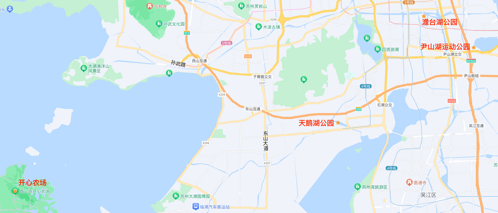

吴中区有许多山可以爬，包括穹窿山、东山（莫厘峰）、渔洋山、西山（缥缈峰）、灵岩山等。如果家里的小朋友不讨厌爬山，那么你就可以带他们去爬一爬这些山。穹窿山下还有个**万鸟园**，能玩一个多小时。总之，你如果手持休闲年卡，那么能去的最多的地方就是吴中区的这些公园了。

此外，太湖新城的**天鹅湖公园**也有免费的无动力游乐场。此处周末的时候人气很旺。然而，我觉得它里面的游乐设施有点简陋。我儿子去过一次没玩个啥就走了，故不推荐。

尹山湖西岸有一处**尹山湖运动公园**，里面有一些儿童游乐设施；附近的居民们去遛娃的也不少。

最后，**太湖园博园**本来也很不错。可是从几年前开始这个公园被切成了两半，其中一半被隔离开并且承包给了一个电动游乐场，而另一半慢慢失去了维护，变得破败了，故也不再推荐。

# 吴江区

吴江区很大，适合小朋友玩的公共游乐场所有很多。

不但如此，吴江还是江南水乡的腹地，分布着众多水乡古镇。

目前从苏州工业园区开车过去一般在1个小时左右。等到不久的将来中环东线南延修通后，车程还能缩短至少20分钟。

## 12. 东太湖生态园

- 车程 40分钟
- 乐趣⭐️⭐️⭐️
- 风景⭐️⭐️⭐️⭐️
- 人气⭐️⭐️⭐️⭐️
- 性价比⭐️⭐️⭐️

东太湖生态园在吴江太湖新城，周围居民小区比较多，湖边有很多骑车、跑步的人群。这里适合搭帐篷、野餐、遛娃等等，能活动一整天。

这里有少量的无动力儿童游乐设施；有一个小型的电动游乐场，叫做**虫虫乐园**。总体都一般。

这个公园很大；我只去过一次，没逛完。这个公园和整个太湖东岸是连在一起的，值得再去探索探索。

## 13. 芦荡湖湿地公园

- 车程 50分钟
- 乐趣⭐️⭐️⭐️
- 风景⭐️⭐️⭐️⭐️
- 人气⭐️⭐️⭐️⭐️⭐️
- 性价比⭐️⭐️⭐️⭐️⭐️

芦荡湖湿地公园是一个中等大小的公园。

芦荡湖岸边有天鹅栖息，天鹅不怕人，小朋友可以接近。

公园南门附近有一块无动力儿童游乐设施，周末时人气非常旺。

公园东面有一块大的轮滑场地，人气极旺，我估计整个吴江滑轮滑的小朋友都来过这里。

## 14. 胜地生态公园

- 车程 50分钟
- 乐趣⭐️⭐️⭐️⭐️
- 风景⭐️⭐️⭐️⭐️
- 人气⭐️⭐️
- 性价比⭐️⭐️⭐️⭐️

胜地生态公园在芦荡湖公园的南面约3公里远处，更远离吴江城区，是一块更大、更原生态的湿地公园。

这个公园的儿童游乐设施比较丰富，有电动游乐场和无动力游乐场两块区域。电动游乐场设施比较新，但仍然只有那些比较老套的项目。

而无动力儿童乐园部分叫做**鹭岛乐园**，非常值得推荐。

虽然它需要门票，但性价比仍然很高。这是我在苏州市内见到过的规模最大的无动力游乐场。

我们去的那次没有多少小朋友在里面玩——可能是因为太过郊区的缘故吧。这里如果小朋友多的话，会更加值得去。

## 15. 潜龙渠公园

- 车程 1小时
- 乐趣⭐️⭐️⭐️
- 风景⭐️⭐️⭐️⭐️
- 人气⭐️⭐️⭐️
- 性价比⭐️⭐️⭐️⭐️

潜龙渠公园位于吴江区盛泽镇，也是一片湖泊旁边的市民公园。镇上的居民一到周末会来这里遛娃散步，所以人气还可以。

公园内游乐设施面积较大，有免费的攀爬设施，也有一些低价的常见付费项目。如果你恰好需要去吴江以南的那个方向，那么顺便去这个公园逛逛会是个不错的选择。

## 16. 同里国家湿地公园

- 车程 40分钟
- 乐趣⭐️⭐️⭐️⭐️⭐️
- 风景⭐️⭐️⭐️⭐️
- 人气⭐️⭐️⭐️⭐️
- 性价比⭐️⭐️⭐️⭐️⭐️

同里国家湿地公园在同里镇和周庄镇中间的位置。它的面积非常大，可以逛一整天。

公园内其实并没有大面积的湿地景观，反而更像一个植物园——它有各种各样的人工针叶林、竹林、花丛等。到了春天的周末，有各种各样的“研学团队”拉着小朋友来挖竹笋。它的北面靠近澄湖的地方设置有“观鸟屋”，不知道什么季节能看到成群的鸟类。

当然，它还有至少两处儿童游乐设施，以及一个挺有意思的湿地科普馆。科普馆里展示的东西并不惊艳，但也值得小朋友在里头逛一个小时。

它人气很旺，但是因为面积太大了，又不显得拥挤。总之，作为一个完全免费的公园，它非常值得推荐。

## 其他

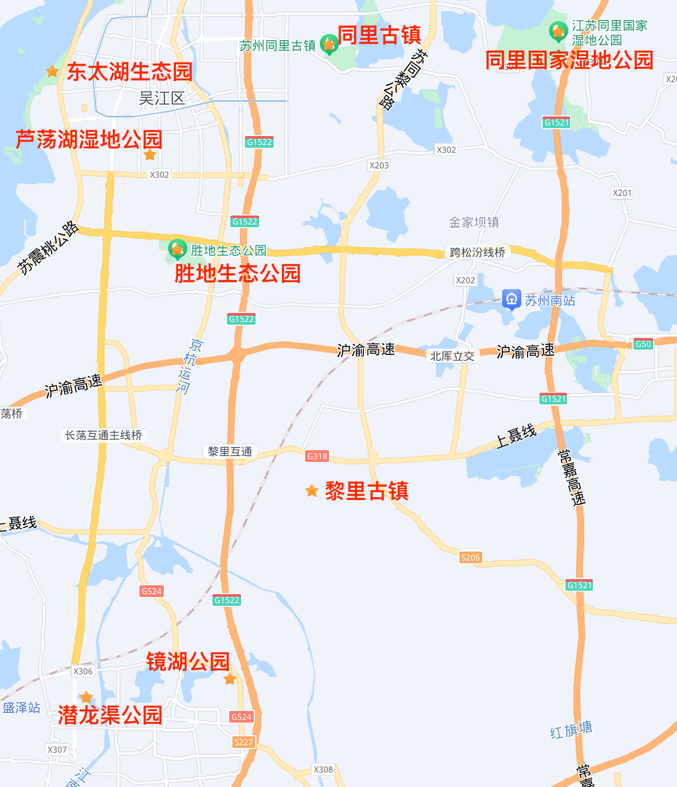

吴江区的南面分布有盛泽、汾湖、黎里、震泽、平望等古镇。这些镇上几乎都有免费或门票低廉的古镇游览区——虽然很少有专供小朋友玩的游乐设施，但是因为人气旺，稀奇古怪的东西多，所以我们家小朋友也都逛得挺开心。

而吴江东面的**同里古镇**作为5A级景区，风景优美，离苏州工业园区距离也近，也值得带小朋友去逛一逛。

# 昆山

昆山紧邻苏州工业园区，开车过去一般在五十分钟左右。

## 17. 昆山城市森林公园

- 车程 50分钟
- 乐趣⭐️⭐️⭐️
- 风景⭐️⭐️⭐️⭐️
- 人气⭐️⭐️⭐️⭐️⭐️
- 性价比⭐️⭐️⭐️⭐️

昆山城市森林公园是昆山市内最大的公园，风景不错，一到周末人气极旺。公园里可以搭帐篷，但是不可以骑车、放风筝什么的。

这个公园面积非常大，适合逛一整天。里头有个小型动物园叫做“萌宠乐园”，值得买票进去。

如果你开车去，可以把车停在南门一条马路之隔的体育场。

## 18. 巴解园

- 车程 50分钟
- 乐趣⭐️⭐️⭐️⭐️⭐️
- 风景⭐️⭐️⭐️⭐️⭐️
- 人气⭐️⭐️⭐️⭐️
- 性价比⭐️⭐️⭐️⭐️

巴解园位于阳澄湖东岸的巴城镇，是一处面积较大的湖滨公园。它最大的特色是包含了至少3个收费的儿童游乐场，几乎拥有每一种常见的游乐设施。

虽然都是收费乐园，但是它们的价格都算是比较公道的。

首先是**欢腾乐园**，它按项目收费。例如，充气城堡只收25元，室外亲子卡丁车跑两圈只收30元，都算是性价比很高的游乐项目。除此之外，它有多达30种小型游乐项目，几乎所有的小型游乐项目都包括在内了——而且这些游乐项目全都是开放的，你不用担心遇到“正在检修暂停开放”的情况。我相信，从这30种项目中要找出10种你家小朋友爱玩的肯定不难，就这都够他们玩一下午了。

其次是2024年清明节刚开业的**蟹将军运动乐园**。巴解园本身是以螃蟹为主题的公园，*巴解*据说是第一个吃螃蟹的人——所以这里的游乐园也要以蟹为名。

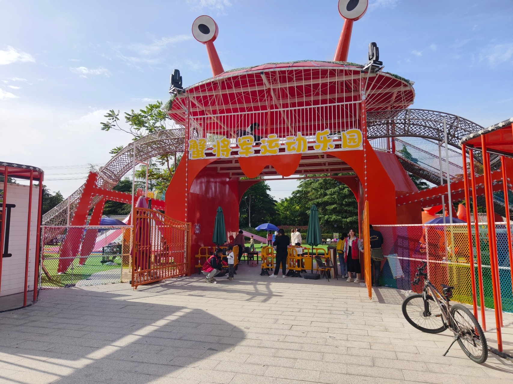

蟹将军运动乐园内有各种无动力设施，虽然不大，但是设施很新很齐全，包括彩虹滑梯这种都是无限次畅玩。目前收费大约40一人，大小同价，性价比很高。

此外，紧挨着它们的还有一个**水上乐园**。它是在一片水杉林里面的攀爬游乐场，看起来也值得一玩。可惜目前它的设施已经破败了，处于闭园翻新状态。不知道它要过多久重新营业。

目前正在营业的两个游乐园都是值得推荐的——再加上巴解园本身风景很漂亮，人气也不差，总体非常值得推荐。

如果是到了盛产阳澄湖大闸蟹的季节，这里大概会很火爆。

此外，如果你开车过来，建议把车停在公园西门附近的停车场，然后从公园内步行到北门附近的欢腾乐园和蟹将军运动乐园。公园北门并不方便停车，只有几处充电桩可以停放新能源车。

## 其他

昆山市区的**儿童公园**、**黄浦公园**、**古木河亲子乐园**都有儿童游乐设施，都可以去逛逛。

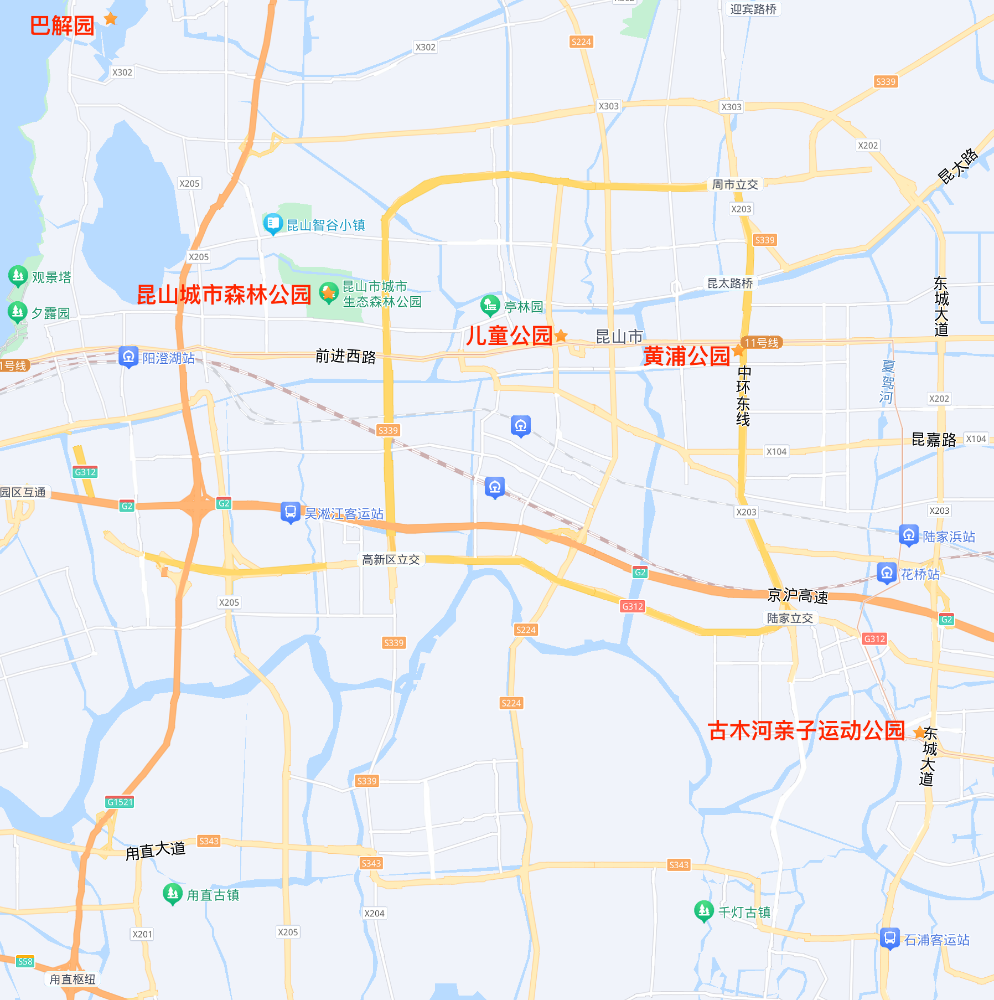

# 常熟

常熟位于苏州市区的正北端，有快速路和高速公路相连。从苏州工业园区开车过去大约需要一小时整。

## 19. 尚湖-尚湖飞熊乐园

- 车程 1小时
- 乐趣⭐️⭐️⭐️⭐️⭐️
- 风景⭐️⭐️⭐️⭐️⭐️
- 人气⭐️⭐️⭐️⭐️
- 性价比⭐️⭐️⭐️

尚湖位于常熟市南郊，离苏州市区大约一小时车程。尚湖和虞山连在一起，成为苏州地区为数不多的山水一体的景点。去过常熟很多次的我认为这里有整个苏州最漂亮的山水景观。

尚湖景区里面有一个园林，叫做**拂水山庄**。此园林不同于绝大多数其他苏州园林——它临湖而建，大气敞亮。它是明末“水太凉”先生*钱谦益*和名妓*柳如是*的故宅，值得一探。此外，尚湖景区面积较大，里面也有多处儿童游乐设施分布，可以逛半天。

尚湖的门票较贵，建议持休闲年卡前往。

最近，在尚湖的旁边新开了一家**飞熊乐园**（最开始叫做角乐士乐园）。这家儿童乐园以无动力设施为主，以玩水为特色，非常适合夏季**带着泳具拖鞋**前往。

飞熊乐园的门票现在常年打折，大约40元一人，考虑到它面积比较大、设施比较多，并不算贵。

飞熊乐园和尚湖也是挨着的，门口的风景也很漂亮，建议在一天时间内上午逛尚湖景区，下午逛飞熊乐园。

## 20. 虞山

- 车程 1小时10分钟
- 乐趣⭐️⭐️⭐️⭐️⭐️
- 风景⭐️⭐️⭐️⭐️⭐️
- 人气⭐️⭐️⭐️⭐️
- 性价比⭐️⭐️⭐️

在苏州诸多的下属县区里，常熟毫无疑问是最具文化底蕴的那一个。从文字学角度来看，“虞”和“吴”是同源字。常熟是春秋时期吴国最早的发源地，常熟虞山上至今存有*仲雍*墓；*仲雍*乃是吴国的始祖、*周文王*的伯父。虞山上还有*言子*（孔子唯一南方弟子*言偃*）墓等**一大堆名人古迹**。

虞山东西长6公里，四周都遍布公园，都可以持休闲年卡免费进入。

这其中有的公园颇具特色，比如东面的城墙景区就是一段可以爬的长城——这个体验在长三角也许是独一份了。

在虞山南面的宝岩景区，里面有一个退役的蒸汽机车头，小朋友会比较感兴趣，可以里面爬来爬去很久。

总之，虞山是一座可以慢慢品尝的宝库。以后等小朋友上中学了，仍然可以带他们来参访古迹，或者爬山徒步。

## 其他

从尚湖景区到虞山会经过**尚湖中间的长堤**，这里风景优美，是自驾去常熟的游客必走的一段路。

除虞山、尚湖景区之外，常熟还有**沙家浜**比较出名。

沙家浜景区门票比较贵，也以湿地湖泊景观为主。它不如尚湖景区漂亮。沙家浜景区内有一处兵器陈列区，摆放了一些退役的飞机大炮什么的。由于这块地方基本处于荒废的状态，所以我不推荐。此外，景区内还有树上扎的网子一类的儿童游乐设施，可供小朋友在上面跳来跳去。如果实在想不到去哪玩，这沙家浜也是可以去的——尤其考虑到它离高速公路出入口特别近，交通方便。

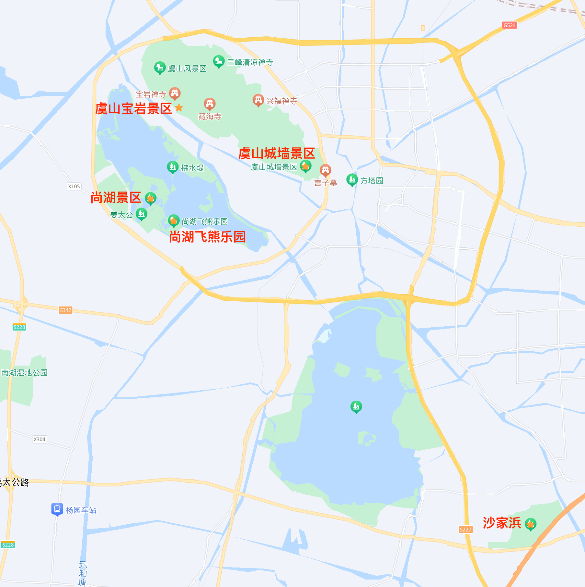

常熟的面条比较有特色，一般是现炒浇头，又香又实惠。它比苏式汤面更容易为外地人所接受，建议你去了常熟一定要尝试。

# 张家港

张家港位于苏州的最北端，从苏州工业园区开车过去一般不超过一个半小时。张家港的两个市内公园都非常值得一逛，算是湿地湖泊景观和遛娃地的完美结合。

## 21. 暨阳湖-暨阳湖欢乐世界

- 车程 1小时20分钟
- 乐趣⭐️⭐️⭐️⭐️⭐️
- 风景⭐️⭐️⭐️⭐️⭐️
- 人气⭐️⭐️⭐️⭐️⭐️
- 性价比⭐️⭐️⭐️⭐️

暨阳湖位于张家港城区靠南的位置，是一个不小的湖。它的西南面有一块湿地，里面长满了杉树。因为来的人少，天晴的时候这里非常漂亮。

整个暨阳湖环湖一圈都是公园，景色很不错。它的正西面是一块临湖玩沙子的地方；正南面是临湖步道和花园；东南面则是暨阳湖欢乐世界。

暨阳湖欢乐世界是一个室外游乐场，面积不大不小，网上评分很一般。然而，我认为它性价比极高，非常值得推荐。

它的门票只要40块钱，但是你却能无限次体验很多大型游乐设施——包括大型漂流、大型过山车、大型激流勇进、大型海盗船，以及一些其他小型游乐设施。建议自备一次性雨衣前往。

如果把暨阳湖和暨阳湖欢乐世界看成一个整体，它们算是我的推荐列表里分数最高的遛娃地之一了。一家人在这里玩上两天都不成问题。

## 22. 梁丰生态园

- 车程 1小时20分钟
- 乐趣⭐️⭐️⭐️⭐️
- 风景⭐️⭐️⭐️⭐️⭐️
- 人气⭐️⭐️⭐️⭐️
- 性价比⭐️⭐️⭐️⭐️⭐️

梁丰生态园是张家港市内第二大的公园。“梁丰”一词在张家港市很常见，比如其最好的中学就叫梁丰高级中学。梁丰高级中学又传承自100多年前的梁丰书院。但是“梁丰”一词到底是个啥意思？我到现在也还没搞懂。

公园内有两处面积较大而相邻的儿童游乐场地，以及一条很长的临水沙滩。

小朋友们玩沙子玩水可以玩得很开心，沙滩边的大型攀爬设施也值得小朋友玩很久。即便是在炎热的夏天，这个公园里也有不少小朋友在一起玩耍。

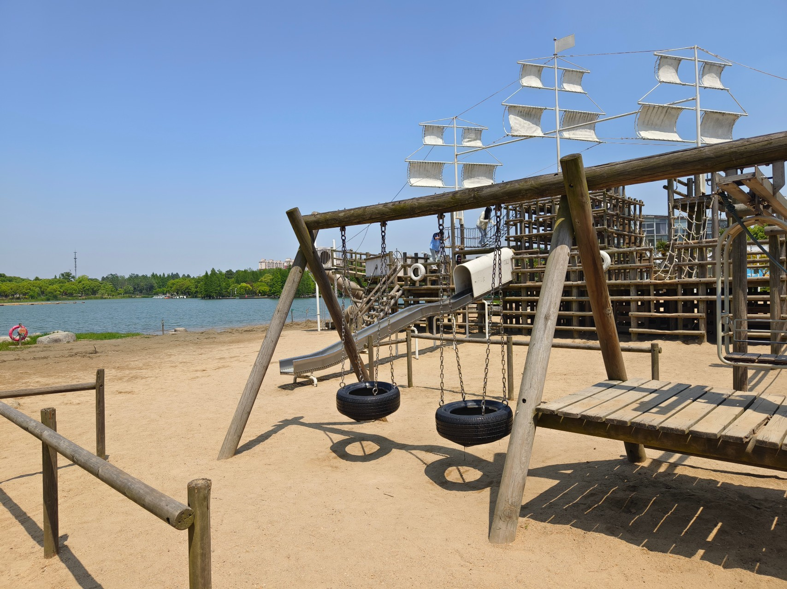

梁丰生态园的湖泊景观很惊艳，湖水在苏州周边算是很清澈的那种。

## 其他

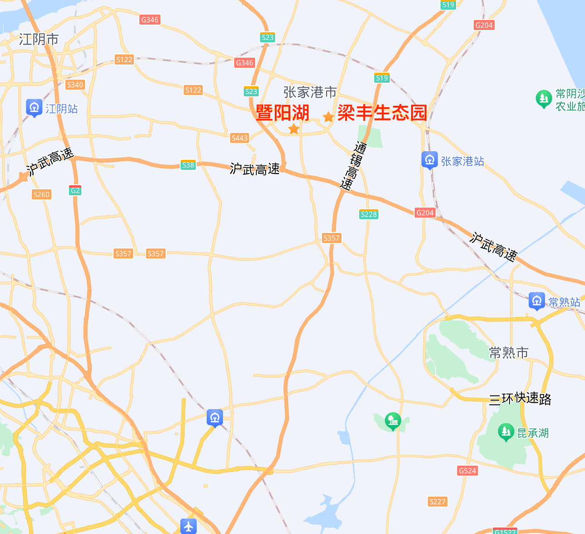

张家港市靠近常熟、江阴、无锡、南通等地。当你们去张家港遛娃的时候，也可以考虑和周围城市搭配游玩。

# 太仓

太仓位于昆山以东，上海的西北面。从苏州工业园区开车到达太仓市大约需要一小时出头。

## 23. 市民公园

- 车程 1小时10分钟
- 乐趣⭐️⭐️⭐️
- 风景⭐️⭐️⭐️
- 人气⭐️⭐️⭐️⭐️⭐️
- 性价比⭐️⭐️⭐️⭐️⭐️

太仓市民公园位于太仓市中心位置。它设有一处较大的儿童活动场地，人气很旺。它的地下停车场很大，停车很方便，西面一条马路之隔有太仓美术馆，北面一条马路之隔则有太仓博物馆，可以一起逛逛。

## 其他

太仓科技馆也离市民公园不远。这里虽然不大，但是设施较新，小朋友会很感兴趣。虽然是室内场馆，我也很推荐你去太仓的时候一起去逛。

说到这里，不得不提到苏州作为经济发达的城市，科教场馆（包括科技馆、天文馆、地质博物馆、海洋馆、动物园等等）却是极端简陋的！甚至不如一个县来得丰富。但最近也有好消息，位于苏州高新区的**苏州科技馆**已经在建设当中了。

此外，太仓南站附近新开了一家叫做**阿尔卑斯雪世界**的室内大型滑雪场，里面可以滑雪、玩雪。这里票价较高（玩雪门票限3小时平时价大约300元/人，搞活动时大约最低150元/人）。我儿子单独去过，他说“一般般好玩”。如果很想带小朋友玩雪的话也可以考虑去逛逛。

# 上海

上海离苏州很近，我们遛娃肯定要去上海这个中国最发达的城市。

## 24. 上海动物园

- 车程 1小时20分钟
- 乐趣⭐️⭐️⭐️⭐️⭐️
- 风景⭐️⭐️⭐️⭐️⭐️
- 人气⭐️⭐️⭐️⭐️⭐️
- 性价比⭐️⭐️⭐️⭐️

上海动物园是居住在苏州的小朋友们**最值得去的动物园**。

它的票价只需要40元，面积不大不小刚好够逛一整天，里头啥动物都有，包括大熊猫。

它位于上海的西郊宾馆、虹桥机场附近。

因为周末人太多，所以如果你开车前往，也许需要一点运气才能在旁边的停车场里停上车。但是，你完全可以乘坐火车到达虹桥火车站后，再转乘地铁10号线经过仅仅两站从*上海动物园站*下车抵达。

在上海动物园内不止是可以看动物。这里还有一条小河从西往东穿过，河两旁大树参天，风景优美。

需要**特别注意**的是，进了上海动物园的大门之后有招揽购买电瓶车票的摊点，你完全没有必要买它，一定要避坑。这个电瓶车票的作用只是把你从大门口拉到熊猫馆——但其实这段距离并不长，而且你也不可能忽略这段路上的各种动物。

总结一下，因为苏州的上方山动物园（门票60元）档次太低，动物门类太少，敛财套路还多，所以我才说上海动物园是苏州小朋友看动物的最佳选择。

另外，许多大城市的国营动物园门类齐全，票价低廉，非常值得逛。例如北京动物园（门票15元）、上海动物园（门票40元）、杭州动物园（门票20元）、南京市红山森林动物园（门票40元）等等。我认为，这些动物园比后来新开的许多“野生动物园”（门票一般要100到200元）反而更值得去。

## 25. 东方绿舟

- 车程 1小时5分钟
- 乐趣⭐️⭐️⭐️⭐️⭐️
- 风景⭐️⭐️⭐️⭐️⭐️
- 人气⭐️⭐️⭐️⭐️
- 性价比⭐️⭐️⭐️⭐️

东方绿舟是位于上海最西面的一个收费公园，从苏州开车过去很方便。它的票价大约在50元以内，门票包含了园内电瓶车车票。因为公园面积非常大，所以电瓶车是必选项。

这个公园里能让小朋友玩的东西很庞杂，但是却趣味性十足。

首先，在北面刚入园的地方有两百米长的闯关式攀爬设施，非常值得体验。这些攀爬设施结构复杂，一关接着一关不重样。而且因为临河，小朋友爬到高处还可以欣赏河边的风景。

其次，它在公园的东南角上建有**中国兵器博览馆**。这个馆名头很足，它其实是一个室内外结合的兵器博物馆：外形是一艘巨大的航母，里头却是古今中外各式各样的兵器陈列。参观者还可以上到甲板上观看各色舰载机，小朋友很难不感兴趣。如果单独评价这个博物馆，我认为它给小朋友的体验并不输给北京的**中国人民革命军事博物馆**。

此外，我们去的时候只逛了一下午，还有一些项目并没有体验到，比如巨大的攀爬馆等等。但以上这些内容已足以让我极力推荐它了。

## 26. 上海欢乐谷

- 车程 1小时10分钟
- 乐趣⭐️⭐️⭐️⭐️⭐️
- 风景⭐️⭐️⭐️⭐️
- 人气⭐️⭐️⭐️⭐️⭐️ （对于大型游乐场人越少人气评分越高）
- 性价比⭐️⭐️

如果小朋友想要体验比较刺激的大型游乐项目，带他去上海欢乐谷会是个不错的选择。

上海欢乐谷位于上海西郊的佘山，从苏州开车过去很方便。这里的游乐项目对低龄儿童很友好，只要身高>1.2米就能玩几乎所有的项目了。而且它有好几处适合小朋友的、不那么刺激的过山车，适合胆小又爱玩的小朋友。

也许是因为同在上海的迪士尼过于风光了，上海欢乐谷的人气并不旺。但是对于大型游乐场来说，人气不旺才反而更值得去！其实，它的飞行球幕电影项目效果并不输给迪士尼的飞越地平线。而人气旺如迪士尼，你和小朋友去了之后只能没完没了地排队，真正能玩的项目又有几个呢？

当然，上海欢乐谷票价260，并不便宜，建议有活动价的时候去。

## 27. 顾村公园

- 车程 1小时10分钟
- 乐趣⭐️⭐️⭐️
- 风景⭐️⭐️⭐️⭐️⭐️
- 人气⭐️⭐️⭐️⭐️⭐️
- 性价比⭐️⭐️

顾村公园是上海宝山区的一个巨型公园，它东西长约4公里。

虽然离苏州较远，但因为它就在快速路出口旁边，所以我们从苏州过去所花费的时间并不长。

这个公园里嵌套有**自然谷恐龙园**、**东方鸟世界**等适合小朋友逛的园中园。另外，它里面还散落有各种各样的收费游乐项目。

这里是上海春季的赏樱胜地，一到周末人满为患。因为园中园比较多，所以逛起来需要走很多冤枉路，比较费腿。带小朋友去的话建议带着小推车或者小自行车。

因为门票要收好几道，所以它性价比一般。但它仍然值得你带着对恐龙感兴趣的小朋友去逛逛。

## 其他

上海作为中国最发达的城市，适合遛娃的地方无疑要多于苏州。但由于它的市民公园有点少，而许多所谓的郊野公园从卫星地图上看又并没有什么游乐设施，所以这里适合室外遛娃的地方并不见得多。

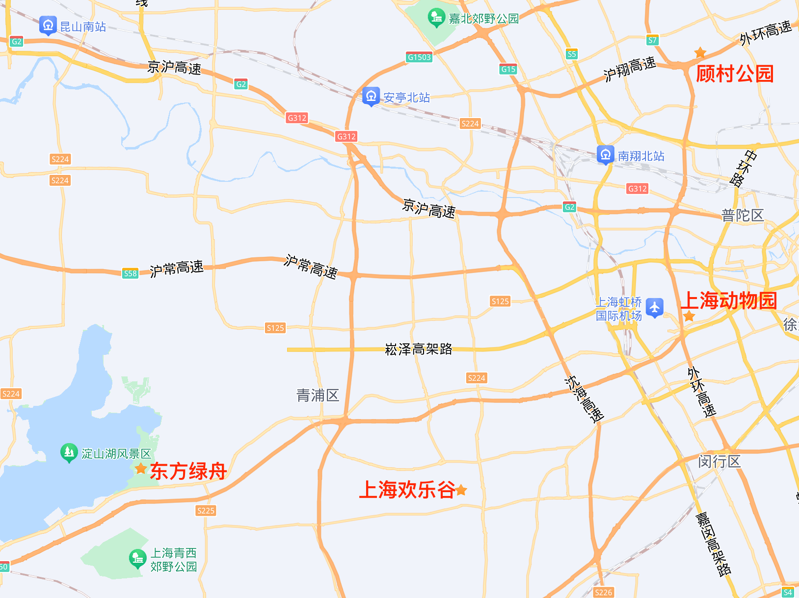

我一直在仔细地考察上海西面有哪些值得去的遛娃地，以上推荐的几个算是有代表性的。

至于上海东边的**迪士尼**、**海昌海洋世界**等等大型公园，因为门票价格较贵、不一定适合10岁以下的小朋友、从苏州自驾过去需要两小时等等原因，所以性价比并不高，我没有把它们加入推荐列表。

**上海野生动物园**据说还不错，但我没有去过，暂不作评价。

# 无锡

无锡市区内值得带小朋友一逛的景点也比较多。

从苏州工业园区开车到无锡市区大约1小时30分以内——这个时间考虑了沪宁高速苏州至无锡段天天堵车的情况。

## 28. 金匮公园

- 车程 1小时10分钟
- 乐趣⭐️⭐️⭐️
- 风景⭐️⭐️⭐️
- 人气⭐️⭐️⭐️⭐️⭐️
- 性价比⭐️⭐️⭐️⭐️⭐️

无锡金匮公园位于无锡市政府北面，是一个典型的市民公园。

这个公园最大的特点是它里头有面积巨大的沙坑。在周末，这个巨大的沙坑竟然真的会被小朋友们填满，可见其人气火爆。

除此之外，它也有一些其他典型的儿童攀爬设施，以及一些音乐主题的游乐设施。

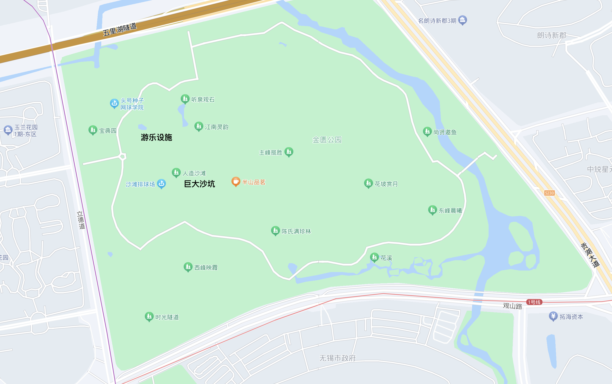

总体而言，这个公园非常适合你去无锡的时候作为大景点的过渡。

## 29. 鼋头渚

- 车程 1小时20分钟
- 乐趣⭐️⭐️⭐️
- 风景⭐️⭐️⭐️⭐️⭐️
- 人气⭐️⭐️⭐️⭐️⭐️
- 性价比⭐️⭐️⭐️

鼋（yuán）头渚是无锡的招牌景点，是公认的赏太湖水景的最佳地点。

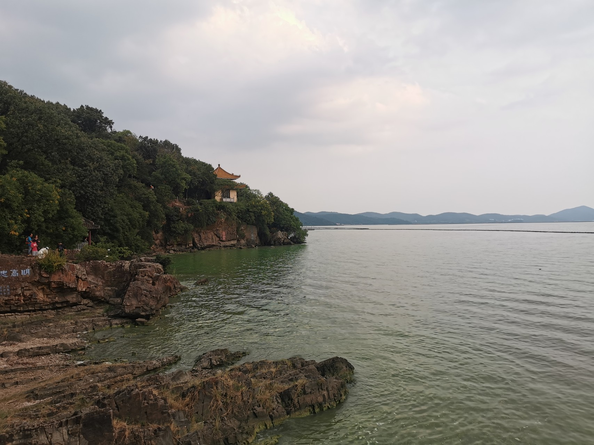

樱花季的鼋头渚自然是漂亮，但是去景区的路上会交通拥堵，人满为患，建议还是避开为妙。

除了樱花季之外，我认为五、六月时候的鼋头渚也非常漂亮。此时的鼋头渚公园内人不算多，但绿意很浓——尤其是**挹秀桥**附近，会让人有一种走进了千与千寻中世界的错觉。此外，当你乘坐景区内太湖游船的时候，会有很多海鸥跟随，也很有趣。

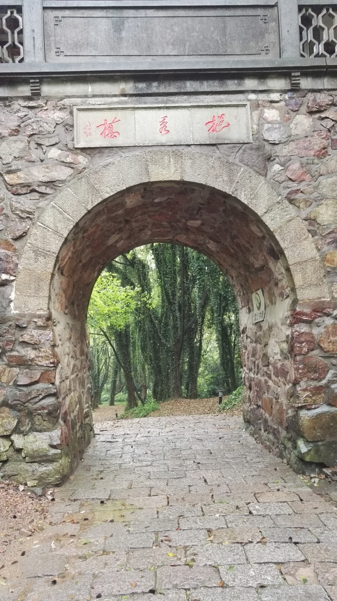

鼋头渚并没有专门为小朋友设置的游乐项目，但因为它植物繁茂，可以观赏的景色多样，所以你仍可以带领小朋友去这里接触和感受自然风光。

让我记忆深刻的是，在这里我儿子第一次见到野生的蛇。

## 其他

虽然以上我只推荐了两个地方，但无锡市区有很多地方可以带娃去玩。

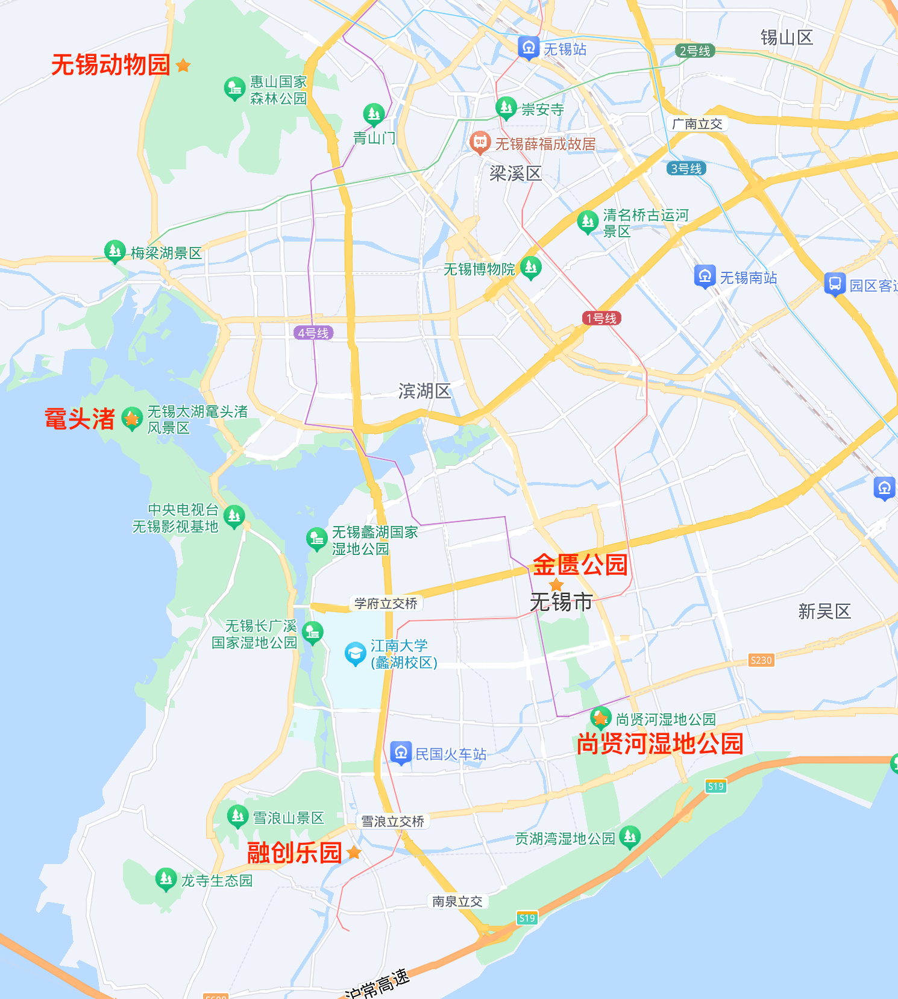

**无锡动物园**据说还不错，我暂时还没去过，所以没做单独推荐。我只去过动物园旁边的**无锡海洋馆**，感觉一般般。

无锡有**水浒城**、**三国城**两个影视主题的公园，感觉对于低龄小朋友来说也一般般。也许它们更适合初、高中生。

无锡的**融创乐园**可以去逛。它没有大门票，里面的各项游乐设施可以买单项票。我去的时候不知道，傻兮兮地提前的买了200多元一张的通票，最后总共也就玩了一两个项目。你可以只带小朋友去玩他们想玩的项目就可以了，包括他们一定会喜欢的萌宠乐园。

融创乐园旁边的融创茂里有个**融创海世界**非常值得一逛，节假日不到100块的夜场票更是性价比爆表。仅仅因为它是室内场馆，所以我没有做单独推荐了。

需要避坑**太湖之星游览园**，这里充斥着票价高昂但又超级无聊的一些游乐项目，玩了之后你只会觉得上当受骗。

最后，2022年的时候无锡市政府在全市范围内新/改建了16个儿童友好公园，分别是**江阴市**锡澄运河公园、绣圃、**宜兴市**齐家广场口袋公园、稚趣口袋公园、**梁溪区**南长街游园、凤锦路运动游园、**锡山区**云朵公园、盛源路街头公园、**惠山区**开发区城市家、展示区公园、天澄公园、**滨湖区**军嶂一支路游园、环山河游园、**新吴区**江溪滨水公园、机场路高浪路桥下空间、**经开区**金匮公园、尚贤河湿地二期。这些公园一定都是有不少儿童游乐设施的，目前我们唯一去过的只有金匮公园。

# 江阴

江阴为无锡代管的县级市，北临长江，扼守着长江自镇江往下的最窄一段江面。

在江阴长江大桥附近，有五个免费的公园集中在方圆3公里以内，非常适合你们全家来一个周末两日游。游览的顺序可以是这样：

- 第1天，上午驾车前往江阴，下午游览鹅鼻嘴公园和船厂公园；
- 第2天，白天游览要塞旅游风景区、黄山湖公园、芙蓉湖公园，晚上驾车回家。

## 30. 鹅鼻嘴公园-船厂公园

- 车程 1小时40分钟
- 乐趣⭐️⭐️⭐️⭐️
- 风景⭐️⭐️⭐️⭐️⭐️
- 人气⭐️⭐️⭐️⭐️
- 性价比⭐️⭐️⭐️⭐️⭐️

鹅鼻嘴公园是紧贴着长江边的一个小山包。这里不仅可以看到裸露的礁石，还可以近距离仰望雄壮的长江大桥。

这个公园最近一年内刚刚从收费变为免费的。更重要的是它不再和西面的船厂公园隔断开来，方便了人们一起游览这两个公园。

顾名思义，船厂公园其实就是江边一片废弃的船坞。

在这里可以看到巨大的金属设备仍然静静矗立，颇具工业废土风。望向江中，还可以看到一艘接一艘的体型巨大的轮船飘过。这些东西对于不住在江边的小朋友来说新鲜感十足。

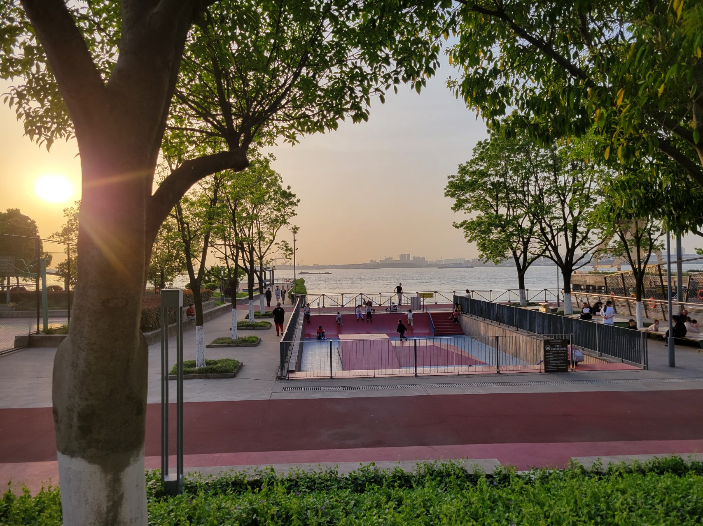

不仅如此，船厂公园还有小朋友们聚集的滑板公园和攀爬项目。

这里也是看日落的绝佳地点。

值得一提的是，远望二号测量船就在这里停着，但是不能进入参观。不知道为什么江阴市政府不把它改造成科普展馆。

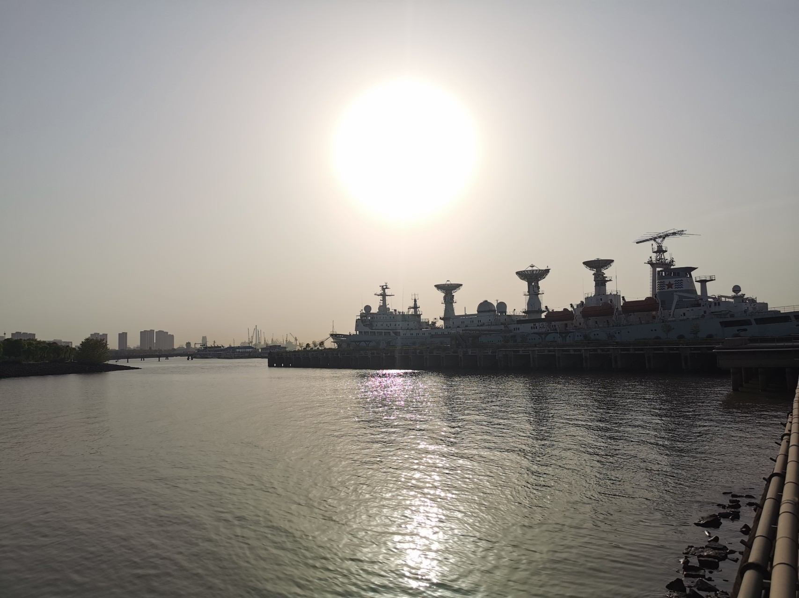

## 31. 要塞旅游风景区-黄山湖公园

- 车程 1小时40分钟
- 乐趣⭐️⭐️⭐️⭐️
- 风景⭐️⭐️⭐️⭐️
- 人气⭐️⭐️⭐️⭐️⭐️
- 性价比⭐️⭐️⭐️⭐️⭐️

要塞旅游风景区是江阴的招牌景区。这块地方是一座山，所以长江流到此处变窄了。到了近代，这里又变成了一个军事要塞。现在，它不再做军事用途了，就变成了风景区。

要塞旅游风景区的山脊上有一条东西向的主干道，旁边有一些已经废弃的军事工事和一些建国后淘汰的大炮。因为这些大炮结构复杂，又有一定的可操作性，所以小朋友们很喜欢爬。

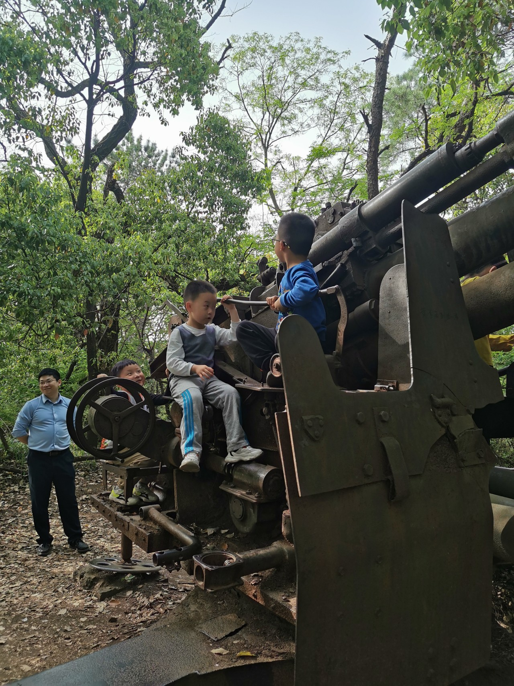

在要塞风景区的高点（即*江阴1937海空大战展示馆*的位置）有一座楼，在下午4点前可以进去登高望远。可惜我们去的时候过了开放时间，也不知道上面能看到怎样的风景。

这个风景区有一个很大的缺点：它的周围被仅为有钱人服务的高尔夫球场给包围了，导致这座不高的山只有三个出入口——这也成了我对江阴这座城市最不满意的地方。

要塞风景区的东南出入口紧挨着芙蓉湖公园，这座公园风景还可以，但就是没什么可以给小朋友玩的。

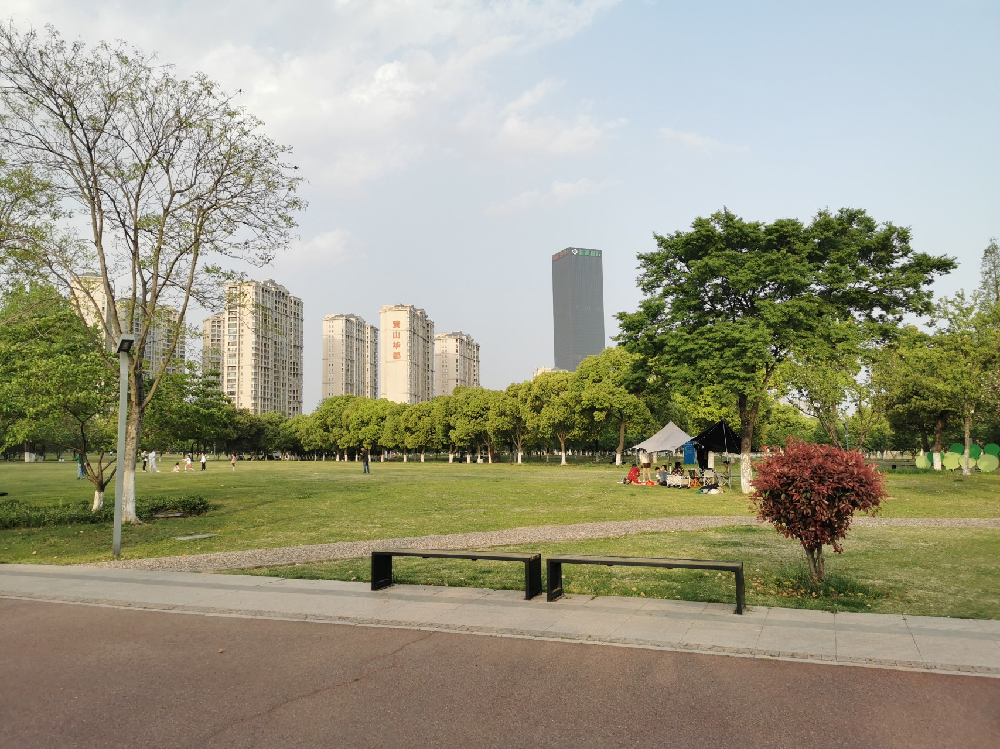

要塞风景区的西南出入口则紧挨着黄山湖公园，黄山湖比芙蓉湖更大，人气也要旺得多，里面有不小的电动儿童游乐场，价钱不贵。此外，这里还有大型湖岸沙滩，周末有很多小朋友在这里玩耍。

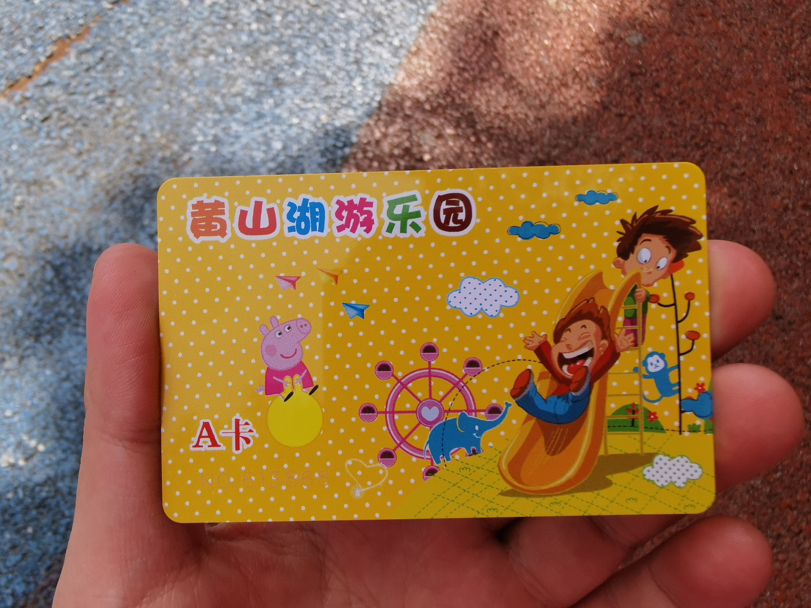

总之，要塞旅游风景区加上黄山湖公园足以消耗你和小朋友一整天的精力了。

# 宜兴

宜兴同为无锡代管的县级市，但远在太湖的西南面。因为太湖隧道的开通，使得苏州到宜兴的车程也能缩短到两小时以内了。

宜兴最大的特点在于它是苏南地区极少数真正有山的城市，**宜兴竹海景区**内有苏南最高峰玉女峰海拔611米，号称江苏第二高峰。

## 32. 张公洞

- 车程 2小时
- 乐趣⭐️⭐️⭐️⭐️
- 风景⭐️⭐️⭐️⭐️
- 人气⭐️⭐️⭐️⭐️
- 性价比⭐️⭐️⭐️

在苏南地区，宜兴几乎是仅有的可以游览洞穴景观的地方。

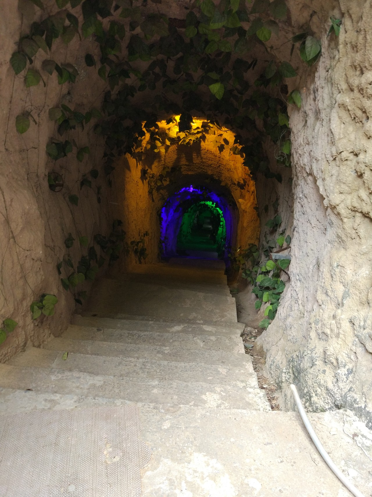

张公洞是宜兴诸多洞穴景点里离市区最近的一个，易于到达。宜兴最为出名的是**善卷洞**。但是因为善卷洞离市区远，从苏州出发两小时以内你是到不了这个景点的，所以被我排除在了推荐名单之外。

张公洞大致的游览线路是从山脚下的洞口进去，然后在山中的洞厅里往上爬，一路爬到洞的出口也就快到山顶了。其中洞厅里的结构复杂，小朋友们会很喜欢在里面探索。

站在山顶可以俯看宜兴市。而下了山之后你还可以玩地下河漂流等项目，性价比一般。

## 33. 龙背山森林公园

- 车程 1小时50分
- 乐趣⭐️⭐️⭐️⭐️
- 风景⭐️⭐️⭐️⭐️⭐️
- 人气⭐️⭐️⭐️
- 性价比⭐️⭐️⭐️⭐️⭐️

龙背山森林公园位于宜兴市区正南面。

这个公园很有特点，它不像其他苏南地区的公园那样往往水域面积占了一多半，而是以两片山丘和他们中间的开阔草地为主体，是苏南地区少有的**超大型**市民公园。

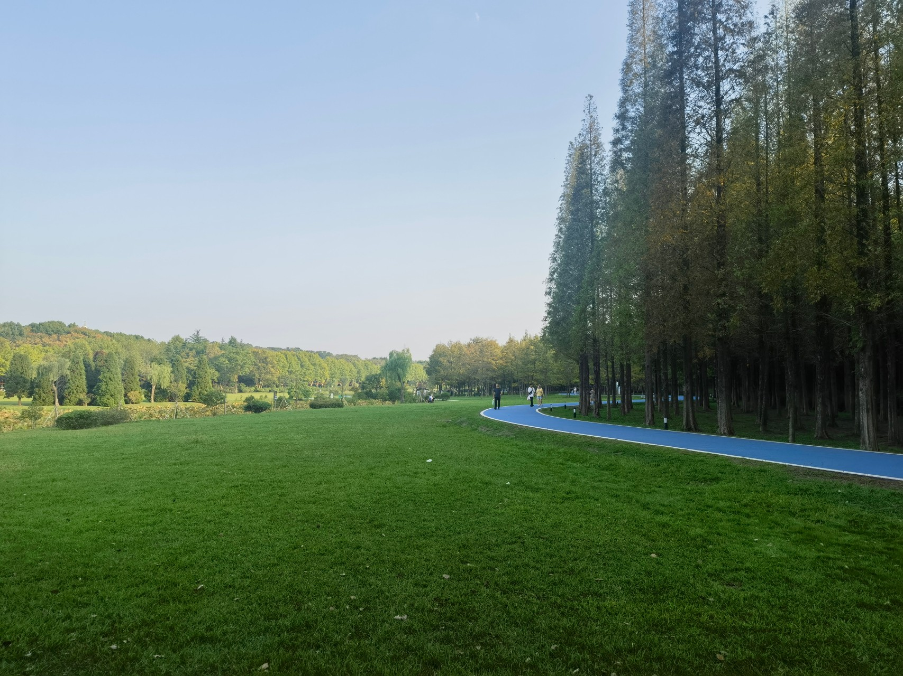

不仅面积超级大，它还有各种植物园——桂花园、梨园、杨梅园、蔷薇园、杜鹃园等等——以至于你任何季节去都可以看到应季的植物。我们去的时候是桂花开的季节，所以在桂花园里看到了各种颜色的桂花。

龙背山公园也有收费的电动游乐场供小朋友娱乐。我们当时并没有去体验，故不作评价。

如果你厌倦了苏南地区湖泊水乡一类的公园景观，那么龙背山森林公园肯定会给你眼前一亮的感觉。

## 34. 青龙山公园

- 车程 2小时
- 乐趣⭐️⭐️⭐️⭐️⭐️
- 风景⭐️⭐️⭐️⭐️
- 人气⭐️⭐️⭐️
- 性价比⭐️⭐️⭐️⭐️

青龙山公园位于宜兴市区南面10公里远的丁蜀镇。也许你没听说过这个镇的名字，但是宜兴紫砂壶你肯定听说过。丁蜀镇就是紫砂壶的故乡。

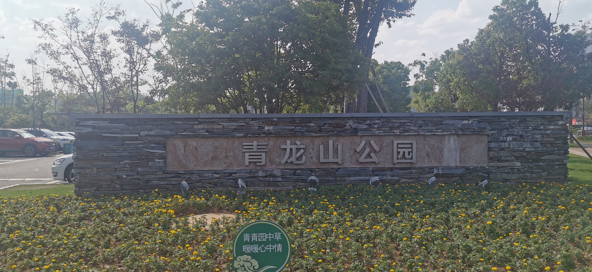

青龙山公园内有一个较新的游乐园，游乐设施不枯燥，按次收票，性价比很不错。例如彩虹滑道大约20元一次，比较耐玩。

青龙山公园据说是由矿山改造而来，里面的景点*老矿坑*还恢复了当初采矿时的场景，但我们去的时候没有去探访。

## 其他

宜兴因为靠山，所以旅游资源丰富，值得推荐的遛娃地也远不止上面这三个。其他比如宜兴竹海景区、**陶祖圣境**、善卷洞、**灵谷洞**、**玉女潭**等等都是可以去游玩的。但因为这些景点都不满足我们从苏州出发2小时以内就能到达的要求，所以被我排除在了推荐列表之外。

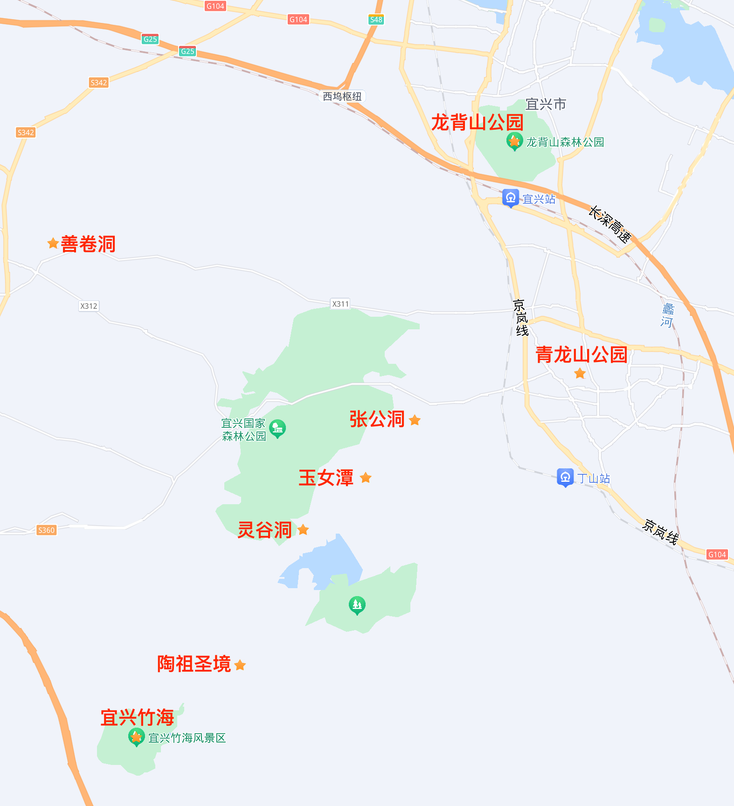

总之，宜兴这座城市值得你用很多个周末的时间带着小朋友去探索和发现。

# 常州

从苏州走高速到达常州市区大约需要1小时40分钟。也因为比较远，所以我去的次数不多，这里仅仅推荐淹城野生动物世界。

## 35. 淹城野生动物世界

- 车程 1小时50分
- 乐趣⭐️⭐️⭐️⭐️⭐️
- 风景⭐️⭐️⭐️
- 人气⭐️⭐️⭐️⭐️⭐️
- 性价比⭐️⭐️⭐️

淹城野生动物世界是典型的野生动物园。你可以先开车进入动物园游览野生动物区，然后再去步行游览区。

淹城野生动物世界有两点让我印象深刻，一是马戏表演比较精彩，二是在红熊猫区可以零距离接触红熊猫。

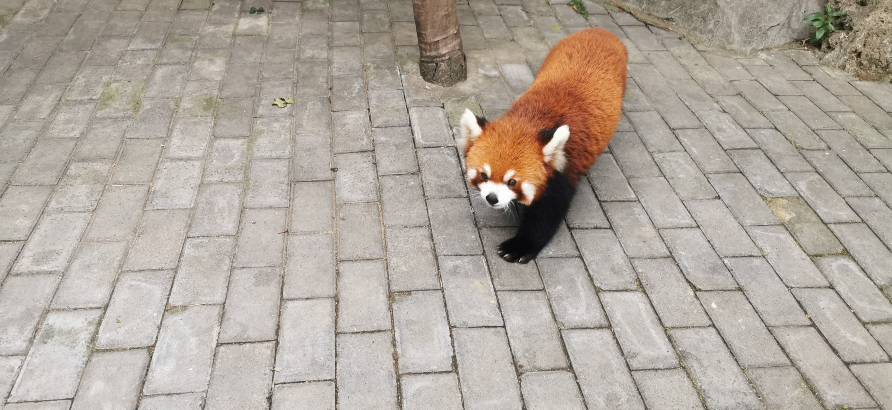

虽然性价比远远比不过一些非野生动物园，但是这里足够你们玩一整天，仍然很值得推荐。

## 其他

常州市最为出名的景点是**中华恐龙园**。因为它网上口碑较差，所以我从来没去过。

此外淹城野生动物世界旁边还有一家**淹城春秋乐园**。这家游乐场给我的印象一般，适合小朋友的游乐项目少，而且略显粗糙。

# 南通

南通位于长江以北，在不堵车的情况下，从苏州工业园区出发大约需要一个半小时到达南通市区。

## 36. 南通森林野生动物园

- 车程 1小时40分
- 乐趣⭐️⭐️⭐️⭐️⭐️
- 风景⭐️⭐️⭐️⭐️
- 人气⭐️⭐️⭐️⭐️⭐️
- 性价比⭐️⭐️⭐️⭐️

这家动物园和常州淹城野生动物世界非常相似，也是有自驾游和大马戏等雷同的内容。

但它的动物种类更多，票价还稍微低一点，性价比更高；而且它还有不少户外儿童活动场地，比常州淹城野生动物世界更耐玩。

让我记忆最深的是，我儿子在这里看到了他一直心心念念的河马放屁。

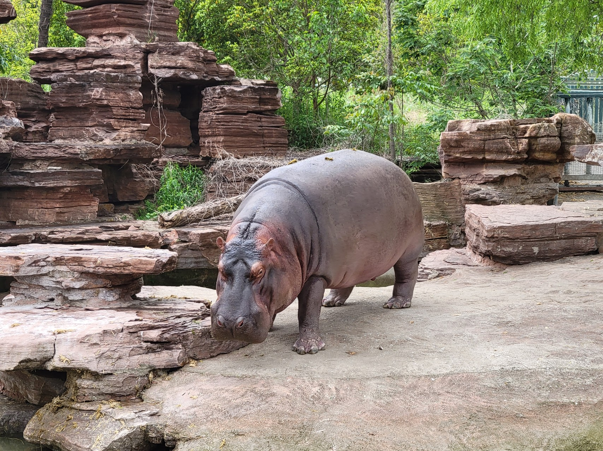

## 37. 狼山

- 车程 1小时40分
- 乐趣⭐️⭐️⭐️
- 风景⭐️⭐️⭐️⭐️⭐️
- 人气⭐️⭐️⭐️⭐️⭐️
- 性价比⭐️⭐️⭐️

狼山是南通市区靠近长江边的一处景点。

狼山脚下古迹较多，如骆宾王墓等。登上狼山可一览宽广如大海的长江。

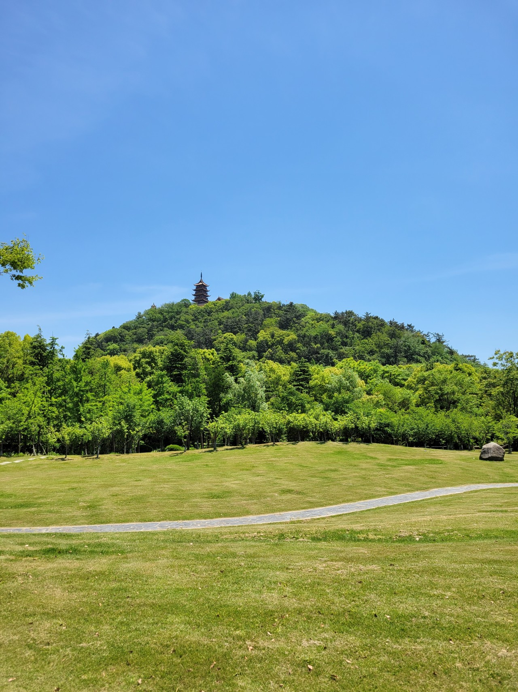

此外，狼山公园内有硅化木园和热带植物园可以一逛。

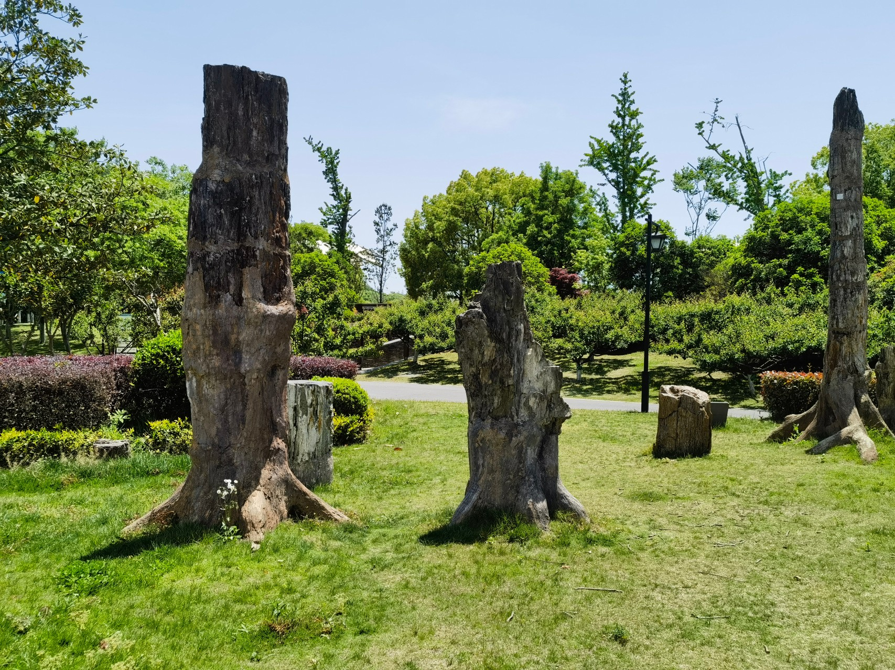

但是对于我儿子来说，在狼山公园里最大的乐趣反而是逛山路上的那些玩具铺子。

## 38. 滨江公园

- 车程 1小时40分
- 乐趣⭐️⭐️⭐️
- 风景⭐️⭐️⭐️⭐️⭐️
- 人气⭐️⭐️⭐️⭐️⭐️
- 性价比⭐️⭐️⭐️⭐️

狼山脚下有南通市的滨江公园，沿着江边长达3公里。这里有山有水，人气很旺。许多市民傍晚会来这里散步。

这里也有充气城堡等儿童游乐设施。

此外，这里也是看长江日落的好地方。

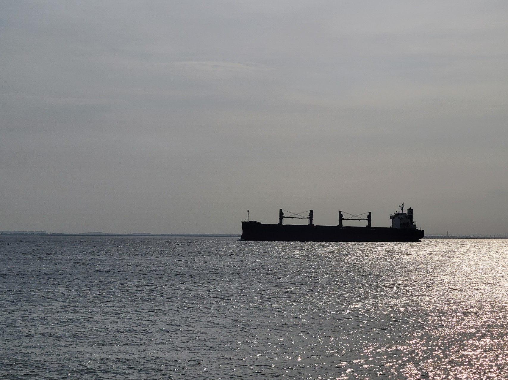

## 其他

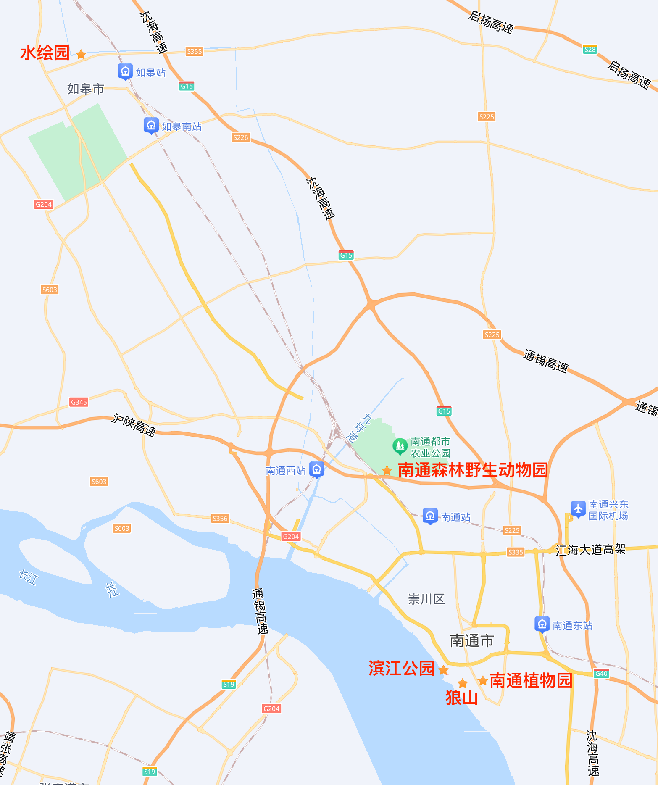

**南通植物园**据说还不错，有小朋友可以户外活动的场地。

南通下辖的如皋市有**水绘园**，风景不错，还包含一座小型动物园。并且它**完全免费**，因此值得推荐。但它路程较远，从苏州工业园区过去需要两小时零几分钟，因此也被我排除出推荐列表。

# 嘉兴

嘉兴虽属浙江，但紧挨苏州。从苏州过去大约一小时出头就能到达市区。

嘉兴市区风景秀丽，例如**南湖景区**是一个很漂亮的湖滨湿地公园。

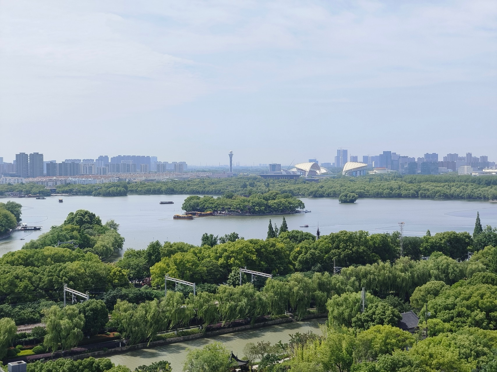

但是，嘉兴市区适合小朋友玩乐的地方却很少。**南湖区市民公园**、**范蠡湖公园**等多处公园都有儿童攀爬设施，但十分简陋，故不推荐。

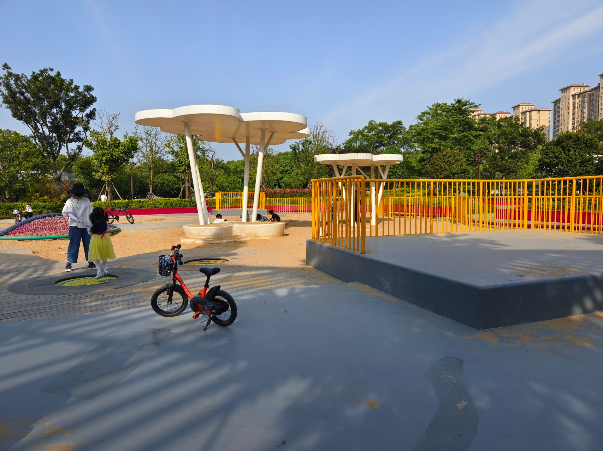

## 嘉善

嘉善县属于嘉兴市代管，从苏州工业园区开车过去仅需一小时。县城内有**柳洲公园**、**嘉善越里**、**白水塘公园**、**泗洲公园**等多处免费的市民公园，它们全都有儿童户外活动场地。

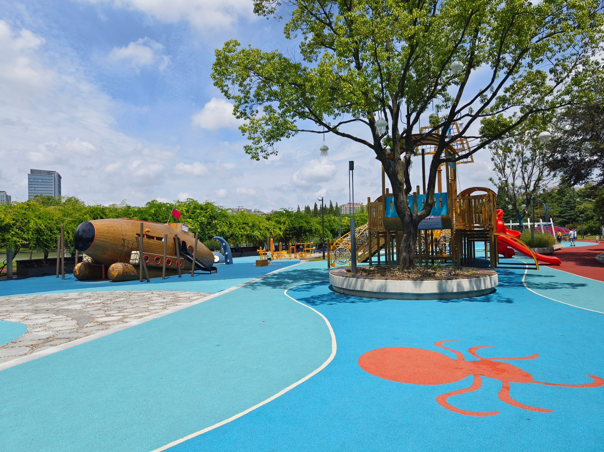

其中，又以白水塘公园儿童游乐设施最多、人气最旺，最值得推荐。因为我们去嘉善玩的时候安排不当，只是路过了白水塘公园，没有时间进去玩，所以暂时没有把它加入我的推荐列表。

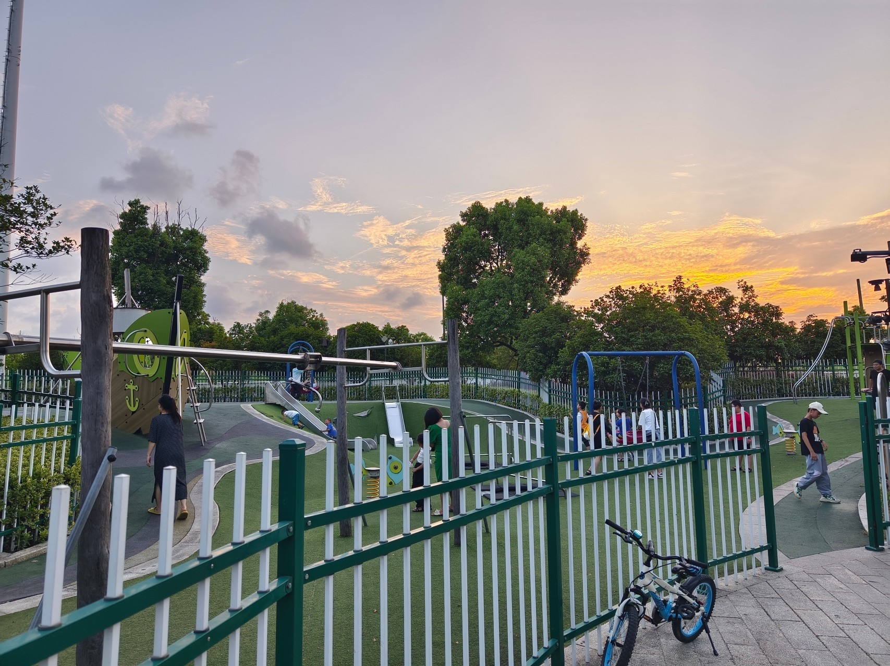

## 海盐

海盐县同属嘉兴市代管，从苏州工业园区开车过去大约需要一个半小时。

海盐县有刚开业不久的**嘉兴融创水上冒险乐园**，它的票价优惠时大约在80多元，看起来性价比不错。我家目前还没有去过。

此外，县城的**梦湖公园**也有儿童活动场地，可以顺便打卡。

# 湖州

湖州位于太湖南岸，从苏州工业园区出发大约一个半小时车程可到达湖州市区。

湖州旅游资源丰富，有**南浔古镇**、德清**莫干山**、安吉**云上草原**等比较热门的景点。

## 39. 双林儿童博物馆岛

- 车程 1小时30分
- 乐趣⭐️⭐️⭐️⭐️⭐️
- 风景⭐️⭐️⭐️
- 人气⭐️⭐️
- 性价比⭐️⭐️⭐️⭐️

这是一个室内为主，室外为辅的儿童乐园。它处于南浔区的双林镇上，离高速出口不远。

双林镇看起来像是一个想搞旅游业但没搞成功的破旧小镇。所以镇上有一个这样的儿童乐园给人一种很违和的感觉。

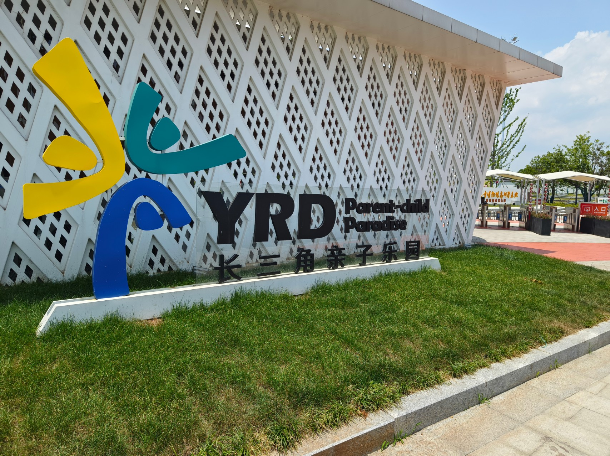

这个游乐园还号称自己是“长三角亲子乐园”，有点大言不惭。

在它的室内场地里，有各种视效游戏设施，以及一些小动物乐园、积木乐园、蹦床乐园之流，总体像一个大杂烩。

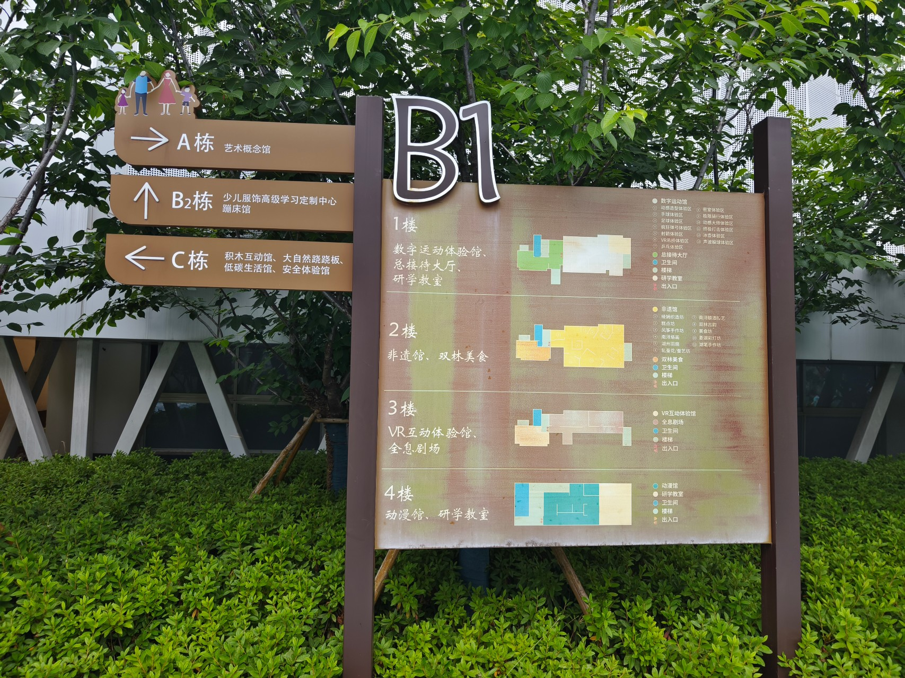

它的门票大约三十多元，大小同价，不算贵。

它的室外场地面积不小，但是因为人气不够，所以最多只能玩一个小时。但室内室外加起来玩一个下午肯定是没问题的，性价比还不错。

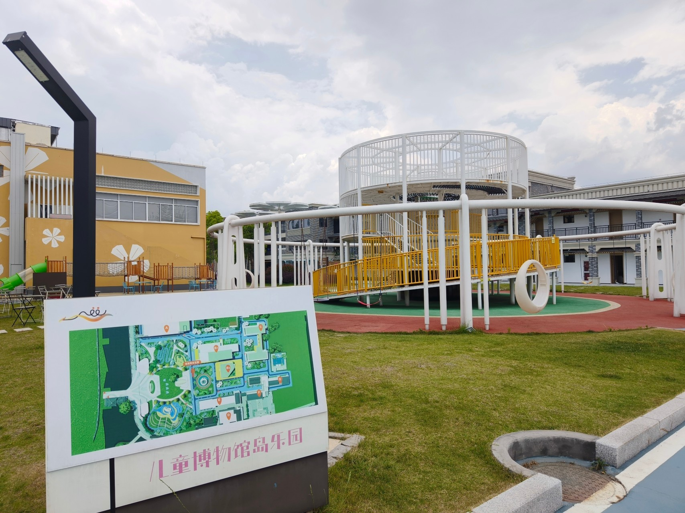

它还有自带的餐厅，只提供素菜，价格实惠。

如果你去南浔古镇玩，或者从苏州去杭州方向，不妨用这个游乐园来凑凑时间。

## 其他

湖州最为出名的儿童乐园是位于德清县的**莫干山开元森泊乐园**，但是这个儿童乐园几乎全都在室内且票价较高，不符合我的推荐要求。更何况我还没去过。

此外，湖州市区的**西山漾湿地景区**和**滨河公园**都有儿童游乐设施，可以去逛逛。

# 杭州

杭州当然有很多适合小朋友玩的地方，例如杭州动物园、**杭州少年儿童公园**、**良渚文化村**、**宝寿山景区**等等。但是它们离苏州工业园区已经超过了两小时车程，所以也不再赘述。

# 慈溪

从苏州开车到达宁波市区至少要两个半小时，但是要到达宁波最北端的慈溪市杭州湾新区却只需要一个半小时左右。这里有好几处可以带小朋友玩的地方。

## 40. 宁波方特

- 车程 1小时40分
- 乐趣⭐️⭐️⭐️⭐️⭐️
- 风景⭐️⭐️⭐️⭐️⭐️
- 人气⭐️⭐️⭐️⭐️⭐️（对于大型游乐场人越少人气评分越高）
- 性价比⭐️⭐️⭐️⭐️

宁波方特就在杭州湾跨海大桥南边出入口旁，如果你开车从苏州去宁波一定会在高速公路的右边看到。

它由**方特东方神画**和**方特东方欲晓**两个主题乐园组成。

方特东方神画以中国古代民间传说为主题，方特东方欲晓则以近代史为主题，都主推虚实结合的视效电影游乐项目。

在我看来，方特制作的此类电影游乐项目其水平已经是国内最高的一档了。

方特东方神画里的**千古蝶恋**和方特东方欲晓里的**致远致远**令我印象最为深刻。

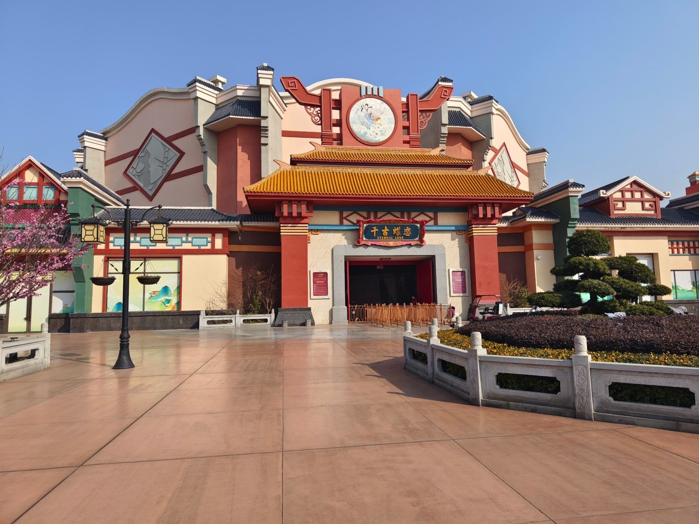

千古蝶恋最后展现的真人和虚拟投影人共舞的画面真是梁祝这个故事的最完美呈现。

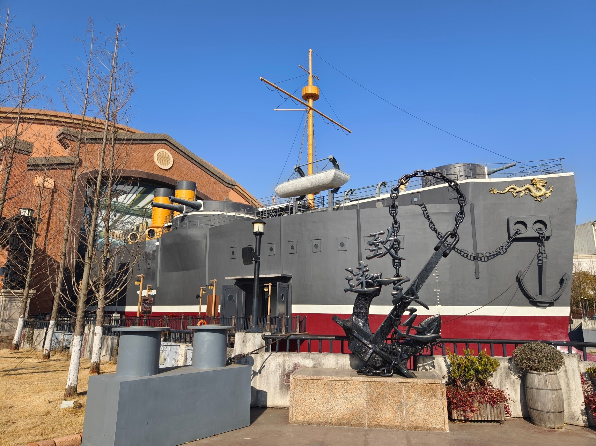

而致远致远这个项目则沉浸度拉满，看到沉船的那一幕时我潸然泪下。

许多人认为国内此类乐园（包括方特）是对迪士尼乐园的拙劣模仿，而我认为宁波方特绝不在此类。固然许多人对方特的批评也不无道理，例如“说教过多”让人尴尬等等。但是瑕不掩瑜，方特已经做到了完全顶级的视觉效果，以及结合中国本土特色的许多创新。

宁波方特里的游乐项目数量很充足，适合年轻人和小朋友的都不少，且鲜有滥竽充数的。（相比起来，苏州乐园森林世界真是纯纯的垃圾。）

最重要的是，逛方特可比逛迪士尼的体验好了不知道多少倍，并且性价比高了太多。它的活动价双乐园门票大约在320元左右——你只需要花320一张的门票就可以在两个乐园里扎扎实实玩两天。

我推荐你在一个淡季（例如冬天）的周六上午八点从苏州出发，开车到达宁波方特之后停好车，恰好十点乐园才开门，进去一直逛到下午五点乐园关门。因为几乎不用排队，你可以确保把一个乐园里的所有项目都玩遍。然后，你可以选择在附近住一晚从而第二天玩另外一个乐园，也可以直接开车回家下次再来。

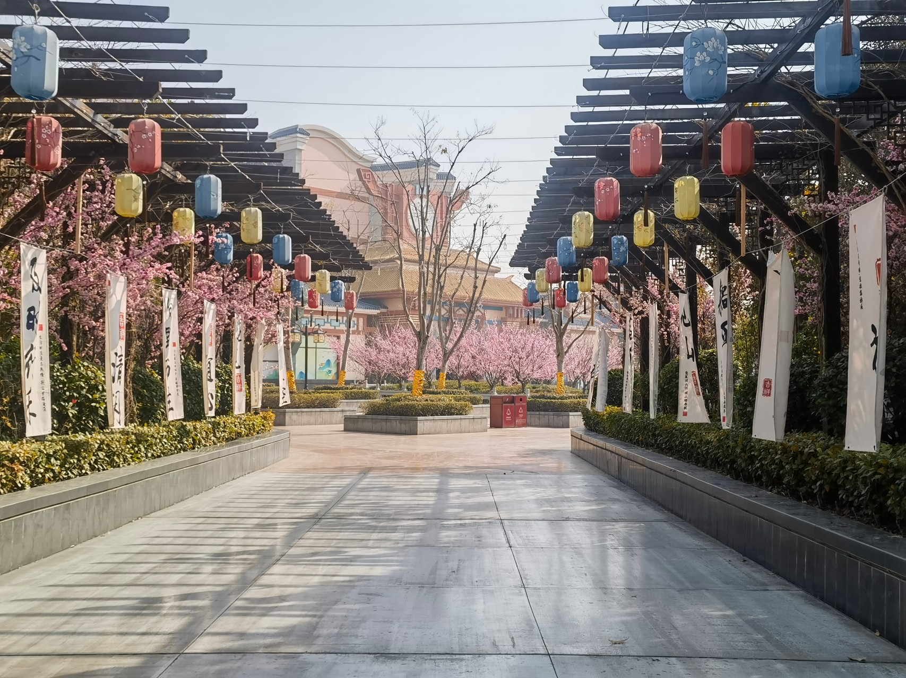

方特的室外布景也很不错，乐园里逛着挺舒服。虽然它最精华的游乐项目几乎都在室内，但是转场和室外项目也足以让你们家小朋友在户外活动两小时以上。

## 其他

慈溪市的杭州湾新区不仅有方特的两个乐园，还有**杭州湾海皮岛景区**可以尝试。杭州湾海皮岛景区和嘉兴融创水上冒险乐园类似，也是室外水上乐园，适合夏天去玩水。

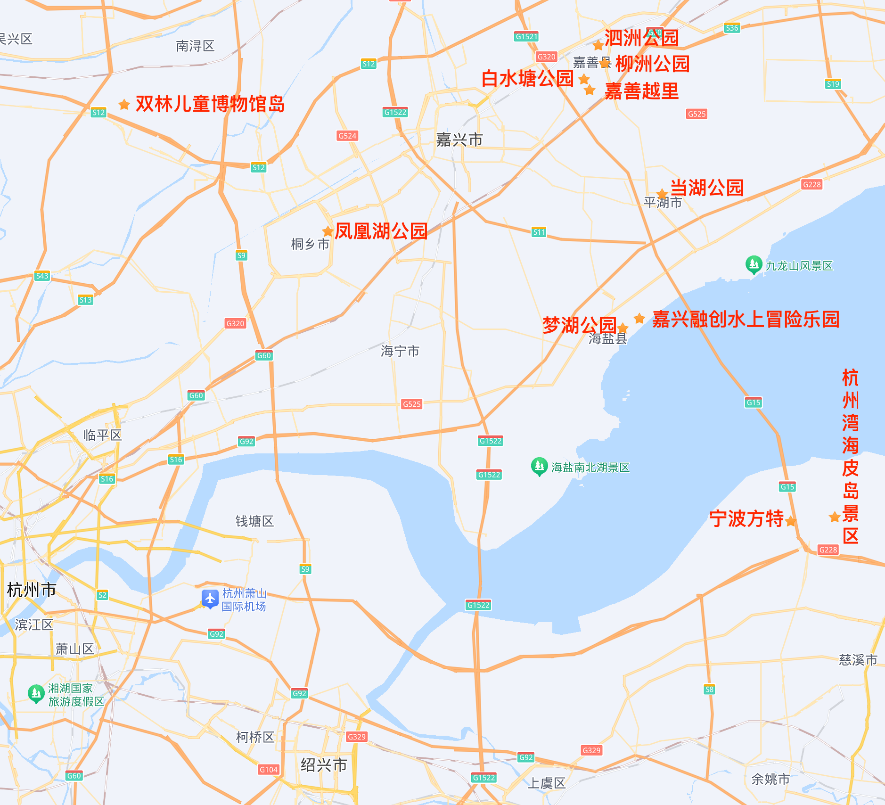

# 结束语

这40个遛娃目的地，你带着小朋友每周末去玩其中一到两个，可以半年不重样。

我家的小朋友还没有长大，我还在广泛搜集苏州周边适合小朋友的室外活动场所，**欢迎读者们补充**。